# TJA Format and on

* First created: 2022-02-01 (UTC+8)
* Last changed: 2025-07-22 (UTC+8)

Main maintainer of this article: [@IepIweidieng](https://github.com/IepIweidieng)

This is an unofficial compilation and commentation of the TJA format & its related formats.

This article aims at providing a comprehensive enough overview & possible etymologies and addressing undocumented corner cases.

This article is still *in construction* and will be updated at times. It's recommended to check [its change history](https://github.com/IepIweidieng/TJAPlayer3/commits/gh-pages/tja.md) regularly.

* Information requiring verification is included and is marked with *(?)*.
* Missing, inaccurate, or even incorrect information is possible, even if such information is not marked with *(?)*, especially about less known software behaviors, due to insufficient or misunderstood references. If it is the case, please do not hesitate to [edit this article](https://github.com/IepIweidieng/TJAPlayer3/edit/gh-pages/tja.md) to fix it.
* The terminologies introduced in this article are not finalized and might be subject to changes.

Also see [TODO](#todo) for known issues and planned changes of this article.

This article also contains unimplemented proposals, including tentative proposals by the main maintainer of this article and known proposals by simulator developers. These proposals are explicitly expressed to be *Proposal*s and may be subject to changes. See [Proposers](#proposers) for the list of proposers for proposals listed in this article.

See [Terminologies](#terminologies) for the explanation and conventions of some terminologies used in this article.

When there exist multiple equivalent usages accepted by the simulators, the conventional ones are represented in **bold**.

## Formats

### Notechart Formats

Known external-use notechart formats used in <ruby>**太**<rt>**T**ai</rt>鼓<rt>ko</rt>の<rt>no</rt>**達**<rt>**T**atsu</rt>**人**<rt>**j**in</rt></ruby> games and simulators:

The dates listed here are mostly in UTC+9.

Extension | Full Name | Content | Supported by | First Release | Specification
--- | --- | --- | --- | --- | ---
`.bin` | **Bin**ary (*<ruby>譜<rt>Fu</rt>面<rt>men</rt></ruby>* Notechart File Format) | Notechart metadata + definition (binary file) | Official games, taiko-web (plugin "Fumen File Format") | 2000 (official local test) <br /> 2001-02-21 (AC1) | Proprietary format, not explained in this article.
`.tjf` | *<ruby>**太**<rt>**T**ai</rt>鼓<rt>ko</rt>の<rt>no</rt>**達**<rt>**T**atsu</rt>**人**<rt>**j**in</rt>**譜**<rt>**f**u</rt>面<rt>men</rt></ruby>* <br /> **T**aiko no **T**atsu**j**in Notechart (?) | Notechart metadata + definition | Taikosan, TaikoJiro 1 | 2004-05-08 (TJF EDIT) <br /> 2006-03-30 (Taikosan nicover) <br /> 2007-07-06 (Taikosan's public release) <br /> 2009-01-16 (Taikosan's public re-release with TJF EDIT's public release) | [Re-released Taikosan's `Readme.txt`](taiko-sim-readmes/utf-8/Readme-taikosan-plusedit.txt)
`data.txt` | owatatsujin Notechart **Data** (?) | Notechart set metadata + definition | owatatsujin | 2007-03-04 (owatatsujin v1.31; first release) | See <https://web.archive.org/web/20150527222157/http://www.geocities.jp/syun_k765/flash/owatatsu/seqhowto.html> <br /> Based on the notechart format of CIRRING-S by D4U: <http://noia.g3.xrea.com/parastoic/crs/maker.html> <br /> and CarmBeat by D4U <http://noia.g3.xrea.com/parastoic/carm/maker.html> <br /> Similar to the Simai notation, which is also based on D4U's format: <https://w.atwiki.jp/simai/pages/1003.html>
`.osu` | **osu**! Beatmap | Notechart metadata + definition | osu!, taiko-web, OutFox (Taiko mode planned) | 2007-07-01 (UTC+?) <br /> 2008-05 (taiko mode) <br /> Non-after 2008-05-23 (first known mentioning) | See <https://osu.ppy.sh/wiki/en/Client/File_formats>. <br/> An `.osu` file with std or Taiko mode can be played as a Taiko chart.
`.sm` | ***S***tep***M***ania Chart (?) | Notechart metadata + definition | StepMania 3.0, OutFox v0.4.9.9 (taiko mode) (?) | 2002-10-23 (StepMania 3.0 release) <br /> 2008-07-20 (unofficial taiko mode by toach, author of TaikoJiro) <br /> 2021-07-31 (taiko mode) (OutFox v0.4.9.9; first taiko mode release) | No known official full specification. <br /> No official documentation for Taiko chart. For general chart, see <https://outfox.wiki/en/dev/mode-support/sm-support> <br /> No known released charts for toach's unofficial taiko mode, but see <https://www.nicovideo.jp/user/460596/mylist/7250555>
`.tja` | *<ruby>**太**<rt>**T**ai</rt>鼓<rt>ko</rt>の<rt>no</rt>**達**<rt>**T**atsu</rt>**人**<rt>**j**in</rt>譜<rt>fu</rt>面<rt>men</rt></ruby> **A**nother* <br /> **A**nother **T**aiko no **T**atsu**j**in Notechart (?) | Notechart metadata + definition | TaikoJiro, Malody, TJAPlayer2 for.PC, taiko-web ver.18.10.11, OutFox v0.4.9.9, TaikoManyGimmicks | 2008-12-08 (TaikoJiro v0.80; first release) | [TaikoJiro's `readme.txt`](taiko-sim-readmes/taikojiro/utf-8/readme-v2.92.txt) <br /> Also see [TaikoJiro 2's `readme.txt`](taiko-sim-readmes/taikojiro2/utf-8/readme-v0.98.txt) <br /> Many extensions exist
`.tjc` | *<ruby>**太**<rt>**T**ai</rt>鼓<rt>ko</rt>の<rt>no</rt>**達**<rt>**T**atsu</rt>**人**<rt>**j**in</rt>譜<rt>fu</rt>面<rt>men</rt></ruby> **C**ourse* <br /> **T**aiko no **T**atsu**j**in **C**ourse (?) | Notechart set metadata | TaikoJiro v2.34, TaikoJiro 2 v0.98 | 2009-12-28 (TaikoJiro v2.34) | [TaikoJiro's `readme.txt`](taiko-sim-readmes/taikojiro/utf-8/readme-v2.92.txt)
`.tps` | **t**aiko**p**sp **S**core (?) | Notechart definition | <ruby>太<rt>Tai</rt>鼓<rt>ko</rt>の<rt>no</rt>玄<rt>Kuro</rt>人<rt>uto</rt></ruby> for PSP (taikopsp) | 2009-06-12 (taikopsp demo version) <br /> 2009-06-18 (taikopsp v0.1.0) <br /> Non-after 2009-08-29 (TPSConverter v0.31 already released) | [taikopsp's `りどみ.html` ("`Readme.html`")](taiko-sim-readmes/utf-8/りどみ-taikopsp-v0.8.4.html)
`ot_data.txt` | **O**ni**T**aiko DS **data** | Notechart definition | <ruby>鬼<rt>Gwai2</rt>太<rt>Taai3</rt>鼓<rt>gu2</rt></ruby>DS (OniTaiko DS) | 2009-07-14 (onitaiko DS v0.8.2 test version) <br /> Non-after 2010-03-05 (known first chart file) | See the 31-7-2010 entry of: <br /> <https://web.archive.org/web/20181012220107/http://www.owataiko.com/~aki/onitaiko_past.html> <br /> (zh_HK in UTF-8; need switching page character encoding to read)
`.mc` | **M**alody **C**hart (?) | Notechart metadata + definition (JSON) | Malody | Non-before 2014 (Malody) <br /> Non-after 2017-06-24 (mc2tja) | No known official documentation. <br /> See the non-official parser <https://github.com/LuiCat/mc2tja>. <br/> An `.mc` file with Taiko mode can be played as a Taiko chart.
`.dtx` | **DTX**Mania Chart (?) | Notechart metadata + definition | TJAPlayer2 for.PC (early versions, deprecated (?)) | Non-before 2000-01-17 (DTXMania v0.01; first release) <br /> Non-after 2006-06-19 (DTXCreator v0.01; first release) <br /> Non-before 2014-12-?? (taiko mode; TJAPlayer2 for.PC development begins) <br /> Non-before 2015-05-15 (taiko mode; <ruby>太<rt>Tai</rt>鼓<rt>ko</rt>さ<rt>sa</rt>ん<rt>n</rt>ア<rt>A</rt>ル<rt>ru</rt>ファ<rt>fa</rt></ruby> (early TJAPlayer2 for.PC) OSDN project registration) | First used in DTXMania, inherited by TJAPlayer2 for.PC. <br/> No official documentation for Taiko chart. For general chart, see (English translation) <https://web.archive.org/web/20240126144946/https://osdn.net/projects/dtxmania/wiki/DTX%20data%20format>, <br/> (Japanese original) <https://web.archive.org/web/20240206040103/https://osdn.net/projects/dtxmania/wiki/DTX%E3%83%87%E3%83%BC%E3%82%BF%E3%81%AE%E3%83%95%E3%82%A9%E3%83%BC%E3%83%9E%E3%83%83%E3%83%88>
`songtitles.txt` | **Song Titles** | Notechart titles | taiko-web | 2019-04-04 (example) <br /> 2019-04-05 (taiko-web commit) | <blockquote>- A translation text file "songtitle.txt" can be imported <br /> &nbsp; - Titles and translated titles are each on their own line, if a line begins with a language code, it will translate the song title that is above<br /> &nbsp; - An example file can be found here: https://gist.github.com/LoveEevee/65fe66f0b54c0536f96fd2f4862984d4</blockquote> Example: <https://web.archive.org/web/20200630184942/https://gist.github.com/LoveEevee/65fe66f0b54c0536f96fd2f4862984d4>
`.tci` | Open **T**aiko **C**hart **I**nformation | Notechart metadata (JSON) | Koioto (plugin "OpenTaikoChart"), TJAPlayer3-f v1.6.0.1 | 2019-08-17 (format rev.1) <br /> 2020-05-07 (plugin "OpenTaikoChart") | See <https://github.com/AioiLight/Open-Taiko-Chart>
`.tcc` | Open **T**aiko **C**hart **C**ourse | Notechart definition (JSON with non-parsed strings) | Koioto (plugin "OpenTaikoChart"), TJAPlayer3-f v1.6.0.1 | 2019-08-17 (format rev.1) <br /> 2020-05-07 (plugin "OpenTaikoChart") | See <https://github.com/AioiLight/Open-Taiko-Chart>
`.tcm` | Open **T**aiko **C**hart **M**edley | Notechart set metadata (JSON) | Koioto (plugin "OpenTaikoChart" v3.0), TJAPlayer3-f v1.6.0.1 | 2019-11-15 (format rev.2) <br /> 2020-05-07 (plugin "OpenTaikoChart") | See <https://github.com/AioiLight/Open-Taiko-Chart>
`.ssc` | StepMania 5 (the ***s***pinal ***s***hark ***c***ollective) Chart (?) | Notechart metadata + definition | sm-ssc (early StepMania 5), OutFox v0.4.9.9 (taiko mode) (?) | 2011-02-11 (format introduction) <br /> 2011-02-10 (sm-ssc v1.2.1) <br /> 2021-07-31 (taiko mode) (OutFox v0.4.9.9; first taiko mode release) | No known official full specification. <br /> No official documentation for Taiko chart. <br /> For general chart, see <https://outfox.wiki/en/dev/mode-support/ssc-support>
`.tmg` | **T**aiko**M**any**G**immicks | Notechart metadata + definition | TaikoManyGimmicks v0.6.1α | 2022 (TaikoManyGimmicks) <br /> 2023-04-13 (v0.6.1α, TMG format support) | [TaikoManyGimmicks' `Readme.txt`](taiko-sim-readmes/TaikoManyGimmicks/utf-8/readme-v0.6.6α-revised.txt). <br/> The plaintext form is similar to `.tja` but has some syntax differences (explained right below).

`.osu` and `.mc` have corresponding compressed formats, which include multiple notecharts for each difficulty and additional resource files:

* `.osu` &mdash; `.osz`: **os**u! Beatmap Archive ("**Z**ipped")
* `.mc` &mdash; `.mcz`: **M**alody **C**hart **Z**ipped (?)

The TMG format (`.tmg`) has plaintext and binary form, where the plaintext form is similar to the TJA format (`.tja`) and has the following features:

* In TaikoManyGimmicks, the TMG and TJA formats share similar set of [headers](#tja-header) & [commands](#tja-command). However, TJA files containing [headers](#tja-header) & [commands](#tja-command) introduced in TaikoManyGimmicks are required to be converted (done automatically by TaikoManyGimmicks) into TMG format since v0.6.1α.
  * TMG headers and commands introduced since v0.6.1α are listed along with TJA headers and commands, but in the TMG syntax.
* Command arguments in the TMG format are comma-separated and requires parentheses `()` around the whole argument list, even if no arguments are specified. TMG commands are written in the format of **`#COMMAND(expressions, ...)`**.
* Math expressions and functions are allowed for each [`number`-typed and `complex-ri-number`&ndash;typed](#value-type) argument for commands.
* Substitution of predefined variables are allowed in each argument of headers & commands and in notechart definitions. For [`str`-typed](#value-type) argument, `#` (preserved after substitution) needed to be prepended for applying substitution (?).

Excluding `.bin` and the compressed formats, all the formats listed above are text-based and can be edited with any text editor.

### Genre Formats

Known external-use genre formats used in <ruby>**太**<rt>**T**ai</rt>鼓<rt>ko</rt>の<rt>no</rt>**達**<rt>**T**atsu</rt>**人**<rt>**j**in</rt></ruby> games and simulators:

The dates listed here are mostly in UTC+9.

Filename/extension | Content | Supported by | First Release | Notes
--- | --- | --- | --- | ---
`genre.ini` | Genre definition for notecharts in the (sub)directory/ies. INI config file. | TaikoJiro, taiko-web, TJAPlayer2 for.PC Ver.2018110400 | 2009-06-17 (TaikoJiro v1.90) |
`musiclist.txt` | List of file paths to notecharts | TJAPlayer (for PSP) | Non-after 2010-02-10 (musiclistGenerator v6) <br /> Non-after 2010-02-24 (TJAPlayer Ver ?×7 already released) | Similar to the later `.t3u8`, but in native encoding (assumedly Shift-JIS) <br /> and with the first occurrence of a line being `#END` (if exist) and all subsequent line ignored.
`song.txt` | Number of notechart directories + List of directory name of notechart directories | <ruby>鬼<rt>Gwai2</rt>太<rt>Taai3</rt>鼓<rt>gu2</rt></ruby>DS (OniTaiko DS) | Non-after 2010-06-27 (OniTaiko DS F C v.1.2.1X fat) | See <https://web.archive.org/web/20100726082352/http://www.owataiko.com/~aki/_onitaikods/readme.txt>
`box.def` | Genre definition for notecharts in the (sub)directory/ies. `.dtx`-syntax headers. | TJAPlayer2 for.PC, taiko-web | Non-before 2000-01-17 (DTXMania v0.01; first release) <br /> Non-before 2015-05-15 (taiko mode; <ruby>太<rt>Tai</rt>鼓<rt>ko</rt>さ<rt>sa</rt>ん<rt>n</rt>ア<rt>A</rt>ル<rt>ru</rt>ファ<rt>fa</rt></ruby> (early TJAPlayer2 for.PC) OSDN project registration) | First used in DTXMania, inherited by TJAPlayer2 for.PC
`folder.json` | Genre definition for notecharts in the (sub)directory/ies. (JSON) | 2021-02-18 (bundled sample) <br /> 2021-03-09 (Koioto Ver.0.39; first release) | Koioto |
`.t3u8` | List of file paths to notecharts | TJAPlayer3 v4.7.0 | 2019-07-18 (TJAPlayer3 [commit 9261ee0271](https://github.com/twopointzero/TJAPlayer3/commit/9261ee0271dd3cabd5e0f4f2222ef28a23555135)) <br /> 2020-02-03 (TJAPlayer3 v4.7.0) | See <https://github.com/twopointzero/TJAPlayer3/blob/develop/docs/song-list-files.md>. <br /> Based on and having identical syntax with `.m3u8`. <br /> `.m3u8` is a UTF-8&ndash;encoded variant of `.m3u` (**M**P**3** **U**RL).

## About TJA

The TJA format (`.tja`, first used in TaikoJiro) was modified and gradually extended from the much simpler TJF format (`.tjf`, first used in Taikosan), both share similarities with the `.bms` (**B**e-**M**usic **S**cript, not **B**eat**M**ania **S**core) format and its derivations. See [Notechart Formats Inspiring TJA](#notechart-formats-inspiring-tja).

### Naming of TJA

The etymology of both `.tjf` & `.tja` were unexplained.

* `tj` originally did ***NOT*** refer to *<ruby>**太**<rt>**T**ai</rt>鼓<rt>ko</rt>さ<rt>sa</rt>ん<rt>n</rt>**次**<rt>**J**i</rt>郎<rt>rou</rt></ruby>* **T**aiko**J**iro since it has already appeared in `.tjf`, which is already used in *<ruby>太<rt>Tai</rt>鼓<rt>ko</rt>さ<rt>sa</rt>ん<rt>n</rt>太<rt>Ta</rt>郎<rt>rou</rt></ruby>* Taikosan.
* Taikosan is not the original name when the extension `.tjf` was determined. Taikosan was named *<ruby>日<rt>Nichi</rt>曜<rt>you</rt>太<rt>Tai</rt>鼓<rt>ko</rt></ruby>* "Sun(day) Taiko" when TJF EDIT was last updated (2004-05-08).
* In TJF EDIT, `.tjf` is referred as "*<ruby>**太**<rt>**T**ai</rt>鼓<rt>ko</rt>**譜**<rt>**F**u</rt>面<rt>men</rt></ruby>*" "Taiko Notechart" in the "*<ruby>開<rt>A</rt>く<rt>ku</rt></ruby>*" "Open" dialog box and as "*<ruby>日<rt>Nichi</rt>曜<rt>you</rt>**太**<rt>**T**ai</rt>鼓<rt>ko</rt>**譜**<rt>**F**u</rt>面<rt>men</rt>ファ<rt>Fa</rt>イ<rt>i</rt>ル<rt>ru</rt></ruby>*" "Sun(day) Taiko Notechart File" in the "*<ruby>保<rt>Ho</rt>存<rt>zon</rt></ruby>*" "Save" dialog box.
* `tj` could refer to *<ruby>**太**<rt>**T**ai</rt>鼓<rt>ko</rt>の<rt>no</rt>**達**<rt>**T**atsu</rt>**人**<rt>**j**in</rt></ruby>*, the official game series. `.ttf` as "*<ruby>**太**<rt>**T**ai</rt>鼓<rt>ko</rt>の<rt>no</rt>**達**<rt>**T**atsu</rt>人<rt>jin</rt>**譜**<rt>**F**u</rt>面<rt>men</rt></ruby>*" might be one of the intended file extension but was not usable because it had already been used for TrueType font files. `.tkf` as "*<ruby>**太**<rt>**T**ai</rt>**鼓**<rt>**k**o</rt>**譜**<rt>**F**u</rt>面<rt>men</rt></ruby>*" might be another possibility but not adapted for unknown reason.
* `a` could just be an alphabetic number, or could mean "**a**dvanced" (refers to *<ruby>次<rt>Ji</rt></ruby>* "next"), "**a**dd" (refers to *<ruby>＋<rt>**a**dd</rt></ruby>* "plus"), *etc*. A possibility referenced later within TaikoJiro is "**A**NOTHER" (also refers to *<ruby>次<rt>Ji</rt></ruby>* "next").
  * TaikoJiro has a hidden gameplay modifier "G.Judge-A" (**G**AMBOL **Judge** **A**NOTHER), which is enabled by holding <kbd>⇧ Shift</kbd> and then pressing <kbd>G</kbd>, <kbd>J</kbd>, & <kbd>A</kbd>. This is a reference to the *ANOTHER* difficulty of the song *GAMBOL* in *beatmania IIDX 11 IIDX RED CS* (released 2006-05-18) and the hidden enabling method for the judgement window modifier replicating this difficulty of the song in *beatmania IIDX 15 DJ TROOPERS CS* (released 2008-12-18, later than the initial release of TaikoJiro), both games developed by Konami. See <https://remywiki.com/GAMBOL>

Thus, `.tja` possibly means "*<ruby>**太**<rt>**T**ai</rt>鼓<rt>ko</rt>の<rt>no</rt>**達**<rt>**T**atsu</rt>**人**<rt>**j**in</rt></ruby> (simulator) <ruby>譜<rt>fu</rt>面<rt>men</rt></ruby> (format) **A**nother*" "**A**nother **T**aiko no **T**atsu**j**in (simulator) Notechart (format)".

### Notechart Formats Inspiring TJA

The honorific title is omitted.

Property formats from the official games are not listed here.

* TJF is likely inspired by the DWI (Dance With Intensity) or the earlier MSD format. Apart from several syntax similarities mentioned in this article, VIL (creator of Taikosan, TJF EDIT, and TJF format) mentioned `GAP` (a chart offset header in the DWI and earlier MSD formats) in [Taikosan's `Readme.txt`](taiko-sim-readmes/utf-8/Readme-taikosan-plusedit.txt):

```txt
    　#GOMUSIC     この命令が指定された地点から、音楽を再生開始する。
            GAPの概念が無いので、ズレはこれとBPM変更で調整してください。
```

<small>

```txt
    　#GOMUSIC     From where this command is specified, the music starts playing.
            There is no concept of GAP, so for offset please adjust this [command] and BPM changes.
```

</small>

* TJA is based on TJF, as stated by toach (creator of TaikoJiro and TJA format) in [TaikoJiro's `readme.txt`](taiko-sim-readmes/taikojiro/utf-8/readme-v2.92.txt):

> ○tjaフォーマット \
> tjfを元にbmsっぽい感じも取り入れてみたフォーマットです。 \
> 拡張子は「.tja」。

<small>

> ○ tja Format \
> A format based on tjf which \[tja] also attempts to incorporate a bms-like feel. \
> The file extension is ".tja".

</small>

* TJA is likely also inspired by the SM format. Apart from several syntax similarities mentioned in this article, toach has released several videos featuring Taiko mode simulated in StepMania by skinning before the initial release of TaikoJiro, see [Notechart Formats](#notechart-formats)

A possible derivation/inspiration route non-after TJA:

* BMS (BM98, 1998, Urao Yane)
* (+ BMS ⇢ MSD (Diet Diet Revolution'99, 1999, Raoul Laurentiis))
  * (→ DWI (Dance With Intensity, 2001, SimWolf) ⇢)
* ⇢ TJF (TJF EDIT, 2004, released 2009, VIL) (*<ruby>太<rt>Tai</rt>鼓<rt>ko</rt>さ<rt>sa</rt>ん<rt>n</rt>太<rt>Ta</rt>郎<rt>rou</rt></ruby>* Taikosan, 2006, released 2007, VIL)
* (+ DWI ⇢ SM (StepMania 3.0, 2003, Chris Danford) ⇢)
* → TJA (*<ruby>太<rt>**T**ai</rt>鼓<rt>ko</rt>さ<rt>sa</rt>ん<rt>n</rt>次<rt>**J**i</rt>郎<rt>rou</rt></ruby>* TaikoJiro, 2008, toach)

Other Dance simulator references:

* Archive of Dance simulators compiled by Jose_Varela: <https://josevarela.net/SMArchive/OtherSims/>
* Specification of BMS format: <https://bm98.yaneu.com/bm98/bmsformat.html>
* Specification of MSD format: <https://web.archive.org/web/20070606025338/http://doremi.kalin.to/ddr/msd_format.html>
* Specification of DWI format: <http://dwi.ddruk.com/readme.php#2>

After the creation of the TJA format, other notechart formats still continue to inspire the TJA format, such as the DTX format due to TJAPlayer2 for.PC. The new inspirations are mainly new headers and commands.

### Standardizations of TJA

The specification and behavior of TJA in TaikoJiro (active in 2008–2013) was often considered the standard for many years.

However, many extensions after are developed and adopted after TaikoJiro, especially since TJAPlayer2 for.PC, and there lacked a cross-simulator standard.

Since around 2022, OpenTaiko (0auBSQ) and Project OutFox have started to collaborate on a new cross-simulator standardization, which is referred to as "OpenTaiko-OutFox standard" in this article.

For OpenTaiko (0auBSQ) and Project OutFox, the per-simulator behaviors are documented, but their behaviors will be unified through their development. Any new-found discrepancies of these simulators from the OpenTaiko-OutFox standard will be soon consolidated and reported to the relevant project.

## TJA File Encoding

The mostly used character encoding for legacy TJA files is **Shift-JIS**.

However, the actual encoding depended on the system setting and can potentially be any non&ndash;UTF-8 encoding, including:

* Big5 (with or without extensions) for some legacy charts created by Traditional Chinese users
  * Most used extensions include Big5-UAO & Big5-HKSCS.
* GB 2312 (with or without extensions) for some legacy charts created by Simplified Chinese users
  * Most used extensions include GBK & GB 18030.

**UTF-8** (**with BOM** or not) is often used for modern TJA files.

#### Compatibility Issues

* Native encoding \
  ***Supported by***: TaikoJiro, TJAPlayer2 for.PC, TJAPlayer3 before v1.5.2
* Shift-JIS \
  ***Supported by***: TJAPlayer3 v1.5.2+, taiko-web
* UTF-8 with BOM \
  ***Supported by***: TJAPlayer3, taiko-web
* Plain UTF-8 \
  ***Supported by***: taiko-web

## TJA Lexical Rules

### Newlines

Lines are *separated* (may be unterminated) by either LF (`\n`) or CR+LF (`\r\n`) (see [Terminologies](#terminologies) for further explanation).

Lines containing only whitespaces or nothing at all are ignored.

### Comment & Whitespaces

Except when preceded by a `rawstr` value, `//` starts a comment which ends at the end of the line and is ignored along with the `//`.

* Comments were never allowed in the original TJF format.
* The comment syntax is (likely) borrowed from the SM format, which is borrowed from the DWI format, which is likely inspired from the C(++) programming language.

Except when preceded by a `rawstr` value, line-final whitespaces (after ignoring comments) are ignored.

* *Unspecified*: Whether line-final whitespaces or optional whitespaces + comment after a `rawstr` value is ignored.
  * In TaikoJiro, they are not ignored and are kept as-is in such a case
  * In TJAPlayer2 for.PC, they are ignored and removed

Line-initial whitespaces are allowed and ignored only within the notechart definition enclosed between `#START` & `#END` (excluding themselves).

* Line-initial whitespaces before headers & commands were never allowed in the original TJF format.

Except when within a `text` value and around a `rawstr` value, consecutive whitespaces within a line is treated as a single space.

* Non-newline whitespaces in non-command lines within the notechart definition were not ignored in the original TJF format but ignored by TaikoJiro.

### Comma

For multiple values separated by comma (`,`), except for `rawstr`-valued fields, optional whitespaces can occur before and/or after the comma.

* A trailing comma may present but is not universally supported.
  * Known to be supported in TaikoJiro 1 and OpenTaiko (0auBSQ).

### Value Type

* `number`: A real number. `number` indicates that it is *unspecified* whether a number with a fraction part is allowed. *Unspecified*: The supported upper limit & lower limit of the numeric range, unless stated otherwise.
  * `int`: An integer number in decimal, *e.g.*, `0` / `+10` / `-012`
  * `float`: A real number in decimal which can either be an integer or have the fraction part, *e.g.*, `0` / `+.3` / `-1.`
    * *Unspecified*: Whether a comma (`,`) can be used as the decimal point instead of a full-stop (`.`).
    * *Unspecified*: The supported precision.
    * *Proposal* (IID): `+inf` for positive infinity (+∞) & `-inf` for negative infinity (−∞).
    * In TaikoJiro 1 and 2, exponential notation is supported, *e.g.*, `1e4`, `-3.14e-6`.
  * `enum-int` (enum-like, int-form): An `int` with specific accepted values.
  * *Unspecified*: Whether the positive sign (`+`) may appear for a non-negative or positive value, except for `unsigned-*`.
  * In TaikoJiro, leading non-newline whitespaces are always ignored.
* `complex-ri-number`: A complex number in the form of a real number, an imaginary number, or both added together. `complex-ri-number` indicates that it is *unspecified* whether a number with a fraction part is allowed for any of the real and imaginary components.
  * `complex-ri-float`: A complex number where each of the real and imaginary components can either be an integer or have the fraction part, *e.g.*, `1` / `i` / `.3+.3i`.
  * The format is one of:
    * `<number-real>` &mdash; a pure real number where the real component is `<number-real>`.
    * `<optional-sign-imaginary><unsigned-number-imaginary-specifier>` &mdash; a pure imaginary number where the imaginary component has the sign of `<optional-sign-imaginary>` (defaults to `+`) and the absolute value specified by `<unsigned-number-imaginary-specifier>`.
    * `<number-real><sign-imaginary><unsigned-number-imaginary-specifier>` &mdash; a general complex number where the real component is `<number-real>` and the imaginary component has the sign of `<sign-imaginary>` and the absolute value specified by `<unsigned-number-imaginary-specifier>`.
      * *Unspecified*: The behavior if `<sign-imaginary>` is `-` and `<unsigned-number-imaginary-specifier>` has the absolute value of 0.
  * `<unsigned-number-imaginary-specifier>` can be one of:
    * `i` &mdash; the imaginary component has the absolute value of 1.
    * `<unsigned-number-imaginary>i` &mdash; the imaginary component has the absolute value of `<unsigned-float-imaginary>`.
    * *Unspecified*: whether `j` can be used in place of `i`.
  * ***Compatibility issues***:
    * In TaikoJiro 2, `+<unsigned-number-real>-<unsigned-number-imaginary>i` (?) where `<unsigned-number-imaginary>` is equivalent to 0 is not fully supported.
    * In TJAP2fPC but not OpenTaiko (0auBSQ) v0.6.0, only the forms `<number-real>` & `<number-real><sign-imaginary><unsigned-number-imaginary>i` are supported; omitting any number parts is not supported.
    * In TaikoManyGimmicks up to 0.6.6α, omitting the real number component when  `<sign-imaginary>` is not `-` is not supported.
* `text`: A string. `text` indicates that it is *unspecified* whether leading or trailing non-newline whitespaces are significant. *Unspecified*: The maximum supported length.
  * `rawstr`: A string. Can contain leading or trailing non-newline whitespaces & comments.
    * *Unspecified*: Whether line-final whitespaces or optional whitespaces + comment after a `rawstr` value is ignored.
      * In TaikoJiro, they are not ignored and are kept as-is in such a case
      * In TJAPlayer2 for.PC, they are ignored and removed
  * `str`: A string. Leading and trailing new-newline whitespaces & comments are ignored.
  * In TJAPlayer3, in comma-separated lists, every comma (`,`) in `text` ***MUST*** be escaped as `\,` (while `\` itself requires no escaping).
  * `enum-str` (enum-like, string-form): A `str` with specific accepted values. Can be spelt in a form of one of `Value` / `VALUE` / `value`. *Unspecified*: Whether other spellings can be used.
    * In TaikoJiro:
      * For some headers as denoted below, only the first 1 letter have effect (*e.g.*, `V` is also accepted).
      * Leading non-newline whitespaces are ignored.
      * All trailing characters are ignored in TaikoJiro. (*e.g.*, `Vsomething` / `valuesomething` are also accepted)

Formatting notations:

* (empty): The value is written as either an empty string (trimmed-empty) or a whitespaces-only string.
* `trimmed-*`: The value is written without leading and trailing new-newline whitespaces & comments.
* `unsigned-*`: The value is written without preceding positive sign (`+`) or negative sign (`-`).
* `<separator>-separated-list-*`: Multiple values are given and are separated by the separator indicated by `<separator>`
  * *E.g.*, exemplar valid values for `comma-separated-list-int`: (empty) / `42` / `8, 7, 6`

## TJA Header

### Header Overview

#### Header Format

TJA header are written in the format of **`HEADER:values`**.

Each header ***MUST*** be placed on its own line.

The `HEADER:` part ***MUST*** be written in an all-upper-case manner and ***MUST NOT*** contain whitespaces in-between. No leading non-newline whitespaces are allowed.

Headers with an unrecognized `HEADER:` name are ignored.

If the `values` part is omitted, the default value is used, which can be used for resetting previously used headers from other difficulties or player sides to their default value.

For non-string values, whitespaces can immediately occur after `:`, *e.g.*, [`LEVEL: 8`](#level).

* Although the forms with whitespaces are seldom seen.

#### Post-[#START](#start--end) Header Position

Most headers are expected to be placed outside the notechart definition enclosed between `#START` & `#END`. However, some commands are allowed to be placed within the notechart definition, or "post-`#START` position".

Headers allowed in post-`#START` position will be explicitly denoted.

#### Header Scope

For headers, the widest possible scope is per-file and the narrowest possible scope is notechart.

> notechart \< difficulty \< file

For headers not in post-`#START` position, within the scope of a header, the effect of the header continues until the next occurrence of the same header within the same scope or the end of the file.

Non&ndash;post-`#START` headers with per-file scope-fineness have file scope and works independent of difficulty.

Non&ndash;post-`#START` headers with finer scope-fineness have difficulty scope and work independently of the headers from other difficulty scopes.

Each difficulty scope starts at [a `COURSE:` header](#course) specifying the target difficulty and ends at another `COURSE:` header specifying any difficulty. The file section before the first `COURSE:` header is in the default difficulty scope.

* *Unspecified*: The behavior when the difficulty scope for the same difficulty is defined at multiple file sections.
  * In TaikoJiro: All such sections are effective and are considered to be a single difficulty scope. The headers with difficulty scope from the earlier defined section are used as the default value for the later defined sections.
  * In TJAPlayer2 for.PC: All headers with difficulty scope and notechart definitions in such sections except for the last defined section are ignored.
* *Unspecified*: The behavior when headers with difficulty scope and notechart definitions are defined within the default difficulty scope.
  * In TaikoJiro: Such headers are used as the default value for each difficulty. Such notecharts have the default difficulty of `COURSE:Oni`.
  * In TJAPlayer2 for.PC: When any `COURSE:` headers are defined, all such headers and notechart definitions are ignore. Otherwise, the default scope is treated as a `COURSE:Oni` scope.
* *Unspecified*: The behavior when a header with possible per-file scope-fineness is defined after the default difficulty scope.
  * In TaikoJiro 1 (?) & TJAPlayer2 for.PC: If the header is implemented with per-file scope-fineness, the last occurence of such header is used.
  * In TaikoJiro 2 (?): If the header is implemented with per-file scope-fineness, the last occurence of such header in the difficulty scope(s) of selected difficulty is used.
  * *Proposal* (IID): The last defined such header in the default difficulty scope (if any) or the first defined such header after the default difficulty scope is used as the default value for all difficulty scopes. If the header is implemented with per-file scope-fineness, all other occurrences of this header are ignored.

Headers in post-`#START` position (*e.g.*, [the EXAM headers](#exam-headers)) are effectively [commands](#tja-command) and have notechart scope.

#### Compatibility Issues

* In TaikoJiro 1 before v1.95 & Malody, only one notechart definition is supported within a single TJA file. The difficulty scope is identical to the file scope in these simulators.

#### Header Scope-Fineness

See [scope-fineness](#scope-fineness).

For headers, the coarsest fineness is per-file. The finest fineness other than sequential is per&ndash;player-side.

> sequential > per&ndash;player-side > per-file

* *Unspecified*: For non-sequential scope-fineness, the behavior when the same header or command occur multiple times within its scope-fineness in its scope.
  * In TaikoJiro 1 and 2: Only the last occuring valid header or command in the scope-fineness takes effect.

#### Compatibility Issues

* In TaikoJiro 1 before v1.95 & Malody, only one notechart definition is supported within a single TJA file. The per&ndash;player-side scope-fineness is identical to the per-file scope-fineness in these simulators.

### TITLE Headers

[***OpenTaiko-OutFox standard version***](#proposal-komi-version): 1.0 (including any `<trimmed-enum-str-lang>` forms) \
***Impact level***: metadata ★・・・・ \
***First seen in***: TaikoJiro v0.80 (initial release) \
***Supported by***: (assumedly universally supported, including TaikoJiro 1 & 2, Malody, TJAPlayer2 for.PC, OutFox v0.4.9.9) \
***Scope-fineness***: per-file \
***Inspired by***: TJF format \
&emsp; (likely) from DWI and earlier MSD format `#TITLE:<text-title>;` \
&emsp; from BMS format `#TITLE <text-title>`

Specify the **title** of the song.

* `TITLE:<text-title>`
  * In Malody, the romanized name should be used.
* `TITLE<trimmed-enum-str-lang>:<text-title-localized>` \
  ***Supported by***: taiko-web ver.19.03.10, OpenTaiko (0auBSQ) v0.5.1
  * Specify the localized title.
  * `<trimmed-enum-str-lang>` is an IETF BCP 47 language or region tag (see <https://en.wikipedia.org/wiki/IETF_language_tag>) and can be one of but not limited to:
    * `EN` &mdash; **En**glish
    * `JA` &mdash; **Ja**panese \
      ***Supported by***: taiko-web, OpenTaiko (0auBSQ) v0.6.0+
    * `JP` &mdash; **J**a**p**anese (region tag) \
      ***Supported by***: OpenTaiko (0auBSQ) before v0.6.0
    * `FR` &mdash; _**Fr**ançais_ **Fr**ench \
      ***Supported by***: OpenTaiko (0auBSQ)
    * `ES` &mdash; _**Es**pañol_ Spanish \
      ***Supported by***: OpenTaiko (0auBSQ) v0.5.1.1
    * `ZH` &mdash; *<ruby>简<rt>Jiǎn</rt>体<rt>tǐ</rt>**中**<rt>**Zh**ōng</rt>文<rt>wén</rt></ruby>* Simplified Chinese \
      ***Supported by***: OpenTaiko (0auBSQ) v0.5.3
    * `CN` &mdash; Simplified **C**hi**n**ese (mainland **C**hi**n**a) (region tag) \
      ***Supported by***: taiko-web
    * *Proposal* (IID): `ZH_TW` &dash; *<ruby>**臺**<rt>**T**ái</rt>**灣**<rt>**w**ān</rt></ruby>/<ruby>**台**<rt>**T**ái</rt>**灣**<rt>**w**ān</rt></ruby><ruby>正<rt>Zhèng</rt>體<rt>tǐ</rt>**中**<rt>**Zh**ōng</rt>文<rt>wén</rt></ruby>* "Taiwanese Orthodox Variant of Chinese" Traditional Chinese
    * `TW` &mdash; Traditional Chinese (<ruby>**臺**<rt>**T**ái</rt>**灣**<rt>**w**ān</rt></ruby>/<ruby>**台**<rt>**T**ái</rt>**灣**<rt>**w**ān</rt></ruby>) (region tag) \
      ***Supported by***: taiko-web
    * `NL` &mdash; _**N**eder**l**ands_ Dutch \
      ***Supported by***: OpenTaiko (0auBSQ) v0.6.0
    * `RU` &mdash; _<ruby>**Ру**сский<rt>**Ru**sskiy</rt></ruby></ruby>_ Russian \
      ***Supported by***: OpenTaiko (0auBSQ) v0.6.0
    * `DE` &mdash; _**De**utsch_ German \
      ***Supported by***: OpenTaiko (0auBSQ) v0.6.0
    * `KO` &mdash; **Ko**rean \
      ***Supported by***: taiko-web, OpenTaiko (0auBSQ) v0.6.0
  * In OpenTaiko (0auBSQ) v0.6.0, any `<trimmed-enum-str-lang>` is recognized and can be used if the corresponding localization for the game interface has been defined.

### SUBTITLE Headers

[***OpenTaiko-OutFox standard version***](#proposal-komi-version): 1.0 (including any `<trimmed-enum-str-lang>` forms) \
***Impact level***: metadata ★・・・・ \
***First seen in***: TaikoJiro v2.64 \
***Supported by***: (assumedly universally supported, including TaikoJiro v0.80, TJAPlayer2 for.PC, OutFox v0.4.9.9) \
***Scope-fineness***: per-file \
***Inspired by***: (likely) SM format `#SUBTITLE:<text-displayed-subtitle>;`

Specify the **subtitle** (not of the meaning of *caption*) of the song (could be artist, game series, *etc.*), or alternatively as the second line ("**sub**") of the **title**.

If the artist of the song should be specified while the subtitle is already used as the second line of the title, [the `ARTIST:` header](#artist) can be used to specifying the artist of the song.

The display details are *unspecified*.

* `SUBTITLE:<text-subtitle>`
  * `<text-subtitle>` can be one of:
    * `--<text-displayed-subtitle>`
      * Only show the subtitle in the song selection screen. Usually used for artist name.
      * The `--` prefix needs to be prepended to the displayed subtitle when the subtitle already begins with `--`.
    * `++<text-displayed-subtitle>` \
      ***Supported by***: TaikoJiro, TJAPlayer2 for.PC, taiko-web ver.19.03.10 \
      / `<text-displayed-subtitle>` \
      ***Supported by***: TaikoJiro, TJAPlayer2 for.PC ver.2021xxxxxx, TJAPlayer3-f v1.7.2.0, OpenTaiko (0auBSQ) v0.6.0, taiko-web
      * Show the subtitle in all screens, including the gameplay screen & the result screen.
      * Such subtitle is considered the second half part of the title, but is moved to the second line in song selection screen & result screen.
      * The `++` prefix needs to be prepended to the displayed subtitle when the subtitle begins with either `++` or `--`.
* `SUBTITLE<trimmed-enum-str-lang>:<text-displayed-subtitle-localized>` \
  ***Supported by***: taiko-web ver.19.03.10, OpenTaiko (0auBSQ) v0.5.1
  * Specify the localized subtitle. The display mode (`++`/`--`) is instead specified by the `SUBTITLE:` header.
  * `<trimmed-enum-str-lang>` can be one of the possible `<trimmed-enum-str-lang>` for [the `TITLE<trimmed-enum-str-lang>:` header](#title-headers).

### ARTIST:

[***OpenTaiko-OutFox standard version***](#proposal-komi-version): (non-mandatory; 1.0-compatible) \
***Impact level***: metadata ★・・・・ \
***First seen in***: Malody \
***Scope-fineness***: per-file \
***Inspired by***: (likely) `.osu` format `Artist:<text-artist>`

Specify the **artist** of the song.

Similar to the `--` prefix usage of [the `SUBTITLE:` header](#subtitle-headers), but excluding extra information such as game series, anime series, *etc.*

The display details are *unspecified*.

* `ARTIST:<text-artist>`
  * In Malody, the romanized name should be used.
* *Proposal* (Komi): `ARTIST:<comma-separated-list-text-artist>`
  * Every comma (`,`) in the artist name specified in `<comma-separated-list-text-artist>` ***MUST*** be escaped as `\,`

### MAKER:

[***OpenTaiko-OutFox standard version***](#proposal-komi-version): (non-mandatory; 1.0-compatible) \
***Impact level***: metadata ★・・・・ \
***First seen in***: taiko-web ver.19.11.25 \
***Supported by***: OpenTaiko (0auBSQ) v0.6.0 \
***Scope-fineness***: per-file

Specify the creator ("**maker**") of the notechart.

The display details are *unspecified*.

* `MAKER:<text-name-notechart-creator>`
  * *Proposal* (Komi): Every comma (`,`) in `<text-name-notechart-creator>` ***MUST*** be escaped as `\,`
* `MAKER:<text-name-notechart-creator> <text-notechart-creator-web-url>`
  * `<text-notechart-creator-web-url>` is immediately enclosed by a pair of angle brackets (`<` & `>`).
* *Proposal* (Komi): `MAKER:<comma-separated-list-text-name-notechart-creator>`
  * Every comma (`,`) in the chart makers specified in `<comma-separated-list-text-name-notechart-creator>` ***MUST*** be escaped as `\,`

### NOTESDESIGNER Headers

[***OpenTaiko-OutFox standard version***](#proposal-komi-version): (non-mandatory; 1.0-compatible) (including both forms of `<trimmed-enum-int-difficulty-course>` being `0`&ndash;`4` and being omitted) \
***Impact level***: metadata ★・・・・ \
***First seen in***: (Better)TaikoCatsCaffe (?) \
***Supported by***: OpenTaiko (0auBSQ) v0.6.0 \
***Scope-fineness***: per&ndash;player-side (?)

Specify the creator ("**designer**") of the notechart ("**notes**").

The display details are *unspecified*.

* `NOTESDESIGNER<trimmed-enum-int-difficulty-course>:<text-name-notechart-creator>` \
  ***Supported by***: (Better)TaikoCatsCaffe (?), OpenTaiko (0auBSQ) v0.6.0
  * `<trimmed-enum-int-difficulty-course>` can one of the integer argument to [the `COURSE:` header](#course).
  * *Unspecified*: The behavior when the difficulty specified by `<enum-int-difficulty-course>` is different from the difficulty specified by `COURSE:` for the notechart definition.
  * *Proposal* (Komi): Every comma (`,`) in `<text-name-notechart-creator>` ***MUST*** be escaped as `\,`
* `NOTESDESIGNER:<text-name-notechart-creator>` \
  ***Supported by***: OpenTaiko (0auBSQ) v0.6.0
  * *Proposal* (Komi): Every comma (`,`) in `<text-name-notechart-creator>` ***MUST*** be escaped as `\,`

### AUTHOR:

[***OpenTaiko-OutFox standard version***](#proposal-komi-version): (non-standard) \
***Impact level***: metadata ★・・・・ \
***First seen in***: Malody \
***Scope-fineness***: per-file (?)

Specify the creator ("**author**") of the notechart.

In Malody, it can be the Malody account name of the creator, but it is not enforced.

The display details are *unspecified*.

* `MAKER:<text-name-notechart-creator>`

### GENRE:

[***OpenTaiko-OutFox standard version***](#proposal-komi-version): 1.0 (including any `<str-genre>` value (?)) \
***Impact level***: metadata ★・・・・ \
***First seen in***: TJAPlayer2 for.PC \
***Supported by***: taiko-web ver.19.01.06 \
***Scope-fineness***: per-file

Specify the **genre** of the song.

The display details are *unspecified*.

* `GENRE:<str-genre>`
  * *Unspecified*: The exact list of all supported `<str-genre>` and their aliases.
  * Usually supported:
    * `J-POP`
    * *`アニメ` (Anime)* "Animation"
    * *`ボーカロイド` (Bookaroido)* / `VOCALOID`
    * *`どうよう` (<ruby>童<rt>Dou</rt>謡<rt>you</rt></ruby>)* "Child's Song"
    * *`バラエティ` (Baraeti)* "Variety"
    * *`クラシック` (Kurashikku)* "Classic"
    * *`ゲームミュージック` (Geemu Myuujikku)* "Game Music"
    * *`ナムコオリジナル` (Namuko Orijinaru)* "Namco Original"
  * In TJAPlayer2 for.PC, any non&ndash;pre-defined `<str-genre>` is recognized and displayed but is treated as uncategorized for genre sort order and decorations. However, in TJAPlayer2 for.PC but not OpenTaiko (0auBSQ), non&ndash;pre-defined `<str-genre>` is not displayed during gameplay.
  * Recommendation for charters: The `GENRE:` header should not be used for non&ndash;pre-defined genres. Instead, for simulators supporting `genre.ini`, specify the `GenreName=` option in `[Genre]` section in `genre.ini`. For simulators supports `box.def`, specify the `#TITLE:` and `#GENRE:` headers in the `box.def`. In OpenTaiko (0auBSQ), decorations for non&ndash;pre-defined genres can be further customized in `box.def`.
* Initial value / `GENRE:`
  * In TJAPlayer2 for.PC, defaults to the value of the `#GENRE:` header of the `box.def` in the song directory or nearest upper song directory (if exist), or (empty).

#### Compatibility Issues

* In TJAPlayer2 for.PC Ver.2018110400, the `GenreName=` option in `[Genre]` section in `genre.ini` in the song directory or nearest upper song directory (if exist) is used if specified, and the `GENRE:` header will be ignored.

### SIDE:

[***OpenTaiko-OutFox standard version***](#proposal-komi-version): (non-mandatory; 1.0-compatible) (per-file usage); \
&emsp; 1.2 (per&ndash;player-side usage for [`COURSE:Tower`](#course)) \
***Impact level***: metadata ★・・・・ \
***First seen in***: TaikoJiro v2.49 \
***Supported by***: TaikoJiro 2, OpenTaiko (0auBSQ) v0.6.0 \
***Scope-fineness***: per-file

Specify whether the corresponding song entry is displayed, regarding the *<ruby>裏<rt>ura</rt>譜<rt>fu</rt>面<rt>men</rt>状<rt>jou</rt>態<rt>tai</rt></ruby>* "inner notechart state/mode" ("*<ruby>裏 <rt>ura</rt></ruby>* inner or *<ruby>表 <rt>omote</rt></ruby>* outer **side**") of the song selection screen.

This allows the chart creators to specify the inner chart of every difficulty together or with different audio as a separate song entry, as in official AC11&ndash;AC14.

For specifying the inner chart of solely the Oni difficulty with the same audio as in official AC15 and later official games (except only *<ruby>ハ<rt>Ha</rt>レ<rt>re</rt>晴<rt>Ha</rt>レ<rt>re</rt>ユ<rt>Yu</rt>カ<rt>ka</rt>イ<rt>i</rt></ruby>* inner Hard in AC15), [`COURSE:Edit`](#course) is commonly used instead.

* Reference: <https://wikiwiki.jp/taiko-fumen/%E5%8F%8E%E9%8C%B2%E6%9B%B2/%E3%82%80%E3%81%9A%E3%81%8B%E3%81%97%E3%81%84/%E3%83%8F%E3%83%AC%E6%99%B4%E3%83%AC%E3%83%A6%E3%82%AB%E3%82%A4#another>

*<ruby>別<rt>betsu</rt>譜<rt>fu</rt>面<rt>men</rt></ruby>* "another notechart(s)" was a tentative name used during the development of AC11. The now-official name *<ruby>裏<rt>ura</rt>譜<rt>fu</rt>面<rt>men</rt></ruby>* "inner notechart" originated from *pop'n music* 11 (2004), developed by Konami.

* Reference: *まだあるの？「太鼓の達人１１」最後のコマンド大公開！* ("There is still more? The last command of Taiko no Tatsujin 11 greatly revealed!"). (2008-05-15). 開発日記（ブログ）｜太鼓の達人開発ブログ ("Development diary (blog) | Taiko no Tatsujin Development Blog"). <https://web.archive.org/web/20160213010255/http://taikoblog.namco-ch.net/blog/2008/05/post_36.html#more>

*Unspecified*: Whether and how inner mode is implemented.

* TaikoJiro 1 and 2 use the official AC11&ndash;AC14 inner-notechart&ndash;unlocking command for toggling inner notechart mode, which is hitting the drum rims on left and right sides alternatively for a total of 20 hits.

*Proposal* (IID): Make the scope per&ndash;player-side.

* **`SIDE:1`** / **`SIDE:Normal`** / `SIDE:NORMAL` / `SIDE:normal`
  * Displayed only outside the inner notechart mode ("**normal**").
* **`SIDE:2`** / **`SIDE:Ex`** / `SIDE:EX` / `SIDE:ex`
  * Displayed only during the inner notechart mode ("**ex**tra").
* **`SIDE:3`** / **`SIDE:Both`** / `SIDE:BOTH` / `SIDE:both` / **`SIDE:`**
  * Always displayed.

#### Compatibility Issues

* In TaikoJiro 1, one-letter form (`SIDE:N` / `SIDE:n`, `SIDE:E` / `SIDE:e`, & `SIDE:B` / `SIDE:b`) are recognized, and `SIDE:Ex`/`SIDE:EX`/`SIDE:ex` is considered a short form of `SIDE:Extra`/`SIDE:EXTRA`/`SIDE:extra`.
* In TaikoJiro, `SIDE:` has per-file scope-fineness and notechart definitions for `SIDE:Normal` & `SIDE:Ex` should be separated into 2 files and for `SIDE:Both` should be duplicated into these 2 files.
  * In OpenTaiko (0auBSQ), `SIDE:` has per&ndash;player-side scope-fineness.
* In OpenTaiko (0auBSQ), `SIDE:` has been re-purposed to be used in conjunction with [`COURSE:Tower`](#course) to specify the actual difficulty in the tower mode and can be one of:
  * `SIDE:Normal` &mdash; the *<ruby>甘<rt>ama</rt>口<rt>kuchi</rt></ruby>* "easy" difficulty.
  * `SIDE:Ex` / `SIDE:` / any other unrecognized argument &mdash; the *<ruby>辛<rt>kara</rt>口<rt>kuchi</rt></ruby>* "hard" difficulty.

### SIDEREV:

[***OpenTaiko-OutFox standard version***](#proposal-komi-version): (non-mandatory; 1.0-compatible) \
***Impact level***: metadata ★・・・・ \
***First seen in***: TaikoJiro 2 v0.70 \
***Scope-fineness***: per-file

Specify the filename of the *<ruby>裏<rt>ura</rt>譜<rt>fu</rt>面<rt>men</rt></ruby>* "inner notechart" or *<ruby>表<rt>omote</rt>譜<rt>fu</rt>面<rt>men</rt></ruby>* "outer notechart" version ("the **rev**erse **side**") of this notechart file.

* `SIDEREV:<text-filename-tja-inner-or-outer>`
  * If `SIDE:Normal` is used, specify the filename of the inner notechart.
  * If `SIDE:Ex` is used, specify the filename of the outer notechart.
  * If `SIDE:Both` is used, the behavior is *unspecified*.

### WAVE:

[***OpenTaiko-OutFox standard version***](#proposal-komi-version): 1.0 \
***Impact level***: timing ★★★★・ \
***First seen in***: TaikoJiro v0.80 (initial release) \
***Supported by***: (assumedly universally supported, including TaikoJiro 1 & 2, TJAPlayer2 for.PC, OutFox v0.4.9.9) \
***Scope-fineness***: per-file \
***Inspired by***: TJF format

Specify the audio file ("**wave**form audio file") of the song.

*Unspecified*: The exact list of supported file extensions.

*Unspecified*: Whether the notechart ends at the end of the audio file playback (if the audio file exist).

* `WAVE:<text-filepath-song-audio-file>`
  * `<text-filepath-song-audio-file>` has a file extension of one of, *e.g.*:
    * `.wav` \
      ***Supported by***: TaikoJiro
    * `.ogg` \
      ***Supported by***: TaikoJiro, TJAPlayer2 for.PC
    * `.mp3` \
      ***Supported by***: TaikoJiro 1 with `lame.exe`
* `WAVE:`
  * No audio will be played.

#### Compatibility Issues

* In TaikoJiro 2, if the WAVE file is not specified or not found, the played chart suddenly skips 2 seconds forward at the time when the audio should have started playing.

### DEMOSTART:

[***OpenTaiko-OutFox standard version***](#proposal-komi-version): 1.0 \
***Impact level***: decorative ・・・・・ \
***First seen in***: TaikoJiro v2.37 \
***Supported by***: (assumedly universally supported, including TaikoJiro v0.80, TJAPlayer2 for.PC, OutFox v0.4.9.9) \
***Scope-fineness***: per-file \
***Inspired by***: (likely) SM format `#SAMPLESTART:<non-negative-float-seconds-preview-audio-offset>;` (?) \
&emsp; from DWI format `#SAMPLESTART:<float-with-decimal-places-seconds-preview-audio-offset>;` (among other forms)

Specify the amount of seconds into the song audio for **start**ing playing the preview ("**demo**nstration") audio in the song selection screen.

*Unspecified*: The behavior when the preview duration would be non-positive because the preview start time of the audio  is non-before the end time of the song audio.

* `DEMOSTART:<non-negative-float-seconds-preview-audio-offset>`
* Initial value / `DEMOSTART:0`

### OFFSET:

[***OpenTaiko-OutFox standard version***](#proposal-komi-version): 1.0 \
***Impact level***: timing ★★★★・ \
***First seen in***: TaikoJiro v0.80 (initial release) \
***Supported by***: (assumedly universally supported, including TaikoJiro 1 & 2, TJAPlayer2 for.PC, OutFox v0.4.9.9) \
***Scope-fineness***: per&ndash;player-side (?) \
***Inspired by***: (likely) SM format `#OFFSET:<float-seconds-music-offset>;` (with same signness) \
&emsp; from DWI format `#GAP:<float-seconds-chart-offset>;` (with opposite signness) \
&emsp; from MSD format `#GAP:<number-1/192nd-chart-offset>;`

Specify the amount of seconds past ("**offset**ted") from the time position of `#START` of the notechart which the song audio should start playing from the beginning.

Replaced the TJF command `#GOMUSIC` (starting ("**go**") playing the song audio ("**music**") from this point).

Equation: `music-offset` = `time-point-of-audio-beginning` − `time-point-of-chart-start` (Unit: Seconds)

* `OFFSET:<float-seconds-music-offset>`
* Initial value / `OFFSET:0`

### SONGVOL:

[***OpenTaiko-OutFox standard version***](#proposal-komi-version): (non-mandatory; 1.0-compatible) \
***Impact level***: decorative ・・・・・ \
***First seen in***: TaikoJiro v1.66 \
***Supported by***: TaikoJiro 2, TJAPlayer3 v1.5.2 \
***Scope-fineness***: per-file \
***Inspired by***: BMS format `#VOLWAV <non-negative-number-percent-amplitude-gain>` (?)

Specify the relative amplitude percentage (%) of the desired **vol**ume gain of the **song** audio.

*Unspecified*: The reference amplitude, especially in simulators which support automatic loudness normalization.

Recommendation for simulator developers: The reference amplitude is the amplitude of the song audio after applying the volume settings of the simulator. If the automatic loudness normalization gain is used, this header is ignored.

* `SONGVOL:<non-negative-number-percent-amplitude-gain>`
* `SONGVOL:`
  * The behavior is *unspecified*.
* Initial value / `SONGVOL:100`

Recommendation for chart creators: `<non-negative-number-percent-amplitude-gain>` should not exceed `100` unless the waveform of the song audio after interpolated by the audio player would not exceed the maximum amplitude after the gain, otherwise the song audio might be distorted on simulators without volume limiters.

#### Compatibility Issues

* In TaikoJiro 1 but not 2, the value is parsed as a non-negative integer number.
* Handled but ignored by TJAPlayer2 for.PC & TJAPlayer3 before v1.5.2
* In TaikoManyGimmicks, as for v0.6.6α, the initial value is `SONGVOL:0` (?)

### SEVOL:

[***OpenTaiko-OutFox standard version***](#proposal-komi-version): (non-mandatory; 1.0-compatible) \
***Impact level***: decorative ・・・・・ \
***First seen in***: TaikoJiro v1.66 \
***Supported by***: TaikoJiro 2 \
***Scope-fineness***: per&ndash;player-side (?) \
***Inspired by***: BMS format `#VOLWAV <non-negative-number-percent-amplitude-gain>` (?)

Specify the relative amplitude percentage (%) of the desired **vol**ume gain of the sound of the instrument which the player chooses ("**s**ound **e**ffect").

Recommendation for chart creators: The `SEVOL:` header should not be used for finished charts. Setting [the `SONGVOL:` header](#songvol) or modifying the instrument sound is preferred.

Recommendation for simulator developers: The reference amplitude is the amplitude of the sound of the instrument which the player chooses after applying the volume settings of the simulator.

*Unspecified*: Whether the volume of system voice is affected.

* `SEVOL:<non-negative-number-percent-amplitude-gain>`
* `SEVOL:`
  * The behavior is *unspecified*.
* Initial value / `SEVOL:100`

#### Compatibility Issues

* In TaikoJiro 1 but not 2, the value is parsed as a non-negative integer number.
* Handled but ignored by TJAPlayer2 for.PC
* In TaikoManyGimmicks, as for v0.6.6α, the initial value is `SEVOL:0` (?)

### BPM:

[***OpenTaiko-OutFox standard version***](#proposal-komi-version): 1.0 (minimum, see each form) \
***Impact level***: timing ★★★★・ \
***FIrst seen in***: TaikoJiro v0.80 (initial release) \
***Supported by***: (assumedly universally supported, including TaikoJiro 1 & 2, TJAPlayer2 for.PC, OutFox v0.4.9.9) \
***Scope-fineness***: per&ndash;player-side \
***Inspired by***: TJF format `BPM:<positive-int-initial-bpm>` \
&emsp; (likely) from DWI format `#BPM:<positive-number-initial-bpm>;` \
&emsp; from MSD format `#BPM:<positive-float-bpm>;`
&emsp; from BMS format `#BPM <positive-int-bpm>`

Specify the initial **BPM** (**b**eat **p**er **m**inute) of the notechart.

* **`BPM:<positive-int-initial-bpm>`** \
  [***OpenTaiko-OutFox standard version***](#proposal-komi-version): 1.0
* **`BPM:<positive-float-initial-bpm>`** \
  [***OpenTaiko-OutFox standard version***](#proposal-komi-version): 1.0 \
  ***First seen in***: TaikoJiro v1.29 \
  ***Supported by***: (assumedly universally supported, including TaikoJiro 1 & 2, TJAPlayer2 for.PC, OutFox v0.4.9.9)
* `BPM:<negative-float-initial-bpm>` \
  [***OpenTaiko-OutFox standard version***](#proposal-komi-version): 1.2 (?; to be discussed)
  * The behavior is *unspecified* (may cause crashes in some existing simulators).
  * In TaikoJiro 1:
    * Before the beginning time of the first note symbol of the chart, the played beat position starts from positive and decreases to 0 beats as if `#MEASURE -4/4` were active.
    * Non-before such time, the gameplay behaviors as if [`#MEASURE 4/4`](#measure) were active unless overridden by any actual `#MEASURE`s before the first note symbol, and the active BPM remains negative and unchanged unless overridden by [any `#BPMCHANGE` commmands](#bpmchange).
  * In TaikoJiro 2, the game freezes when starting playing the notechart in the gameplay screen.
  * Recommendation for simulator developers: The behavior in TaikoJiro 1 is followed.
* `BPM:0` \
  [***OpenTaiko-OutFox standard version***](#proposal-komi-version): 1.2 (requires [`#BPMCHANGE`](#bpmchange) with non-zero value non-after the first note symbol of the notechart definition) (?)
  * The behavior is *unspecified* (may cause crashes in some existing simulators).
  * In TaikoJiro 1 and 2:
    * Before the beginning time of the first note symbol of the chart, the played beat position stay at 0 beats.
    * Non-before such time, the gameplay behaviors as if [`#BPMCHANGE 0`](#bpmchange) were active unless overridden by any actual `#BPMCHANGE`s before the first note symbol.
  * Recommendation for simulator developers: The behavior before the beginning time of the first note symbol in TaikoJiro 1 and 2 is followed.
* `BPM:` / unrecognized value \
  [***OpenTaiko-OutFox standard version***](#proposal-komi-version): (non-standard)
  * The behavior is *unspecified*.
  * In TaikoJiro 1 and 2, the header is ignored and the lastly specified `BPM:` is kept.
* Initial value
  * The behavior is *unspecified*.
  * In TaikoJiro 1, equivalent to `BPM:120`.
  * In TaikoJiro 2, equivalent to `BPM:0`.

#### Compatibility Issues

* In TaikoJiro, because notes' and bar lines' time position has the precision of 0.001 seconds and the drawn position is calculated using the time position, an extremely large BPM specified by a `BPM:` header or [`#BPMCHANGE`](#bpmchange) command may cause the affected notes to be spaced unevenly.

### HEADSCROLL:

[***OpenTaiko-OutFox standard version***](#proposal-komi-version): (non-mandatory; 1.0-compatible) (minimum; unless stated otherwise) \
***Impact level***: gimmicky ★★・・・ \
***First seen in***: TJAPlayer2 for.PC \
***Scope-fineness***: per&ndash;player-side

Specify the initial **scroll**ing velocity (before and non-after the beginning ("**head**") of the notechart), relative to the base scrolling velocity.

Can be reset by [the `#SCROLL` command](#scroll) non-before the beginning of the notechart. If every player-side for every difficulty has `#SCROLL` defined at the beginning of the chart, `HEADSCROLL:` has no effects.

* `HEADSCROLL:<float-normal-scroll-velocity>`
* `HEADSCROLL:0` \
  [***OpenTaiko-OutFox standard version***](#proposal-komi-version): 1.1 (?; to be discussed)
  * The behavior is the same as if [`#SCROLL 0`](#scroll) were applied non-after the beginning of the notechart.
* `HEADSCROLL:` \
  [***OpenTaiko-OutFox standard version***](#proposal-komi-version): (non-standard)
  * The behavior is *unspecified*.

### PREIMAGE:

[***OpenTaiko-OutFox standard version***](#proposal-komi-version): (non-mandatory; 1.0-compatible) \
***Impact level***: decorative ・・・・・ \
***First seen in***: OpenTaiko (0auBSQ) v0.5.4 \
***Scope-fineness***: per&ndash;player-side (?) \
***Inspired by***: DTX format `#PREIMAGE: <text-filepath-preview-image>`

Specify the jacket ("**pre**view") **image** of the song.

* `PREIMAGE:<text-filepath-preview-image>`
* `PREIMAGE:`
  * The default jacket image is used.
    * In OpenTaiko (0auBSQ), defaults to the value of the `#DEFAULTPREIMAGE:` header of the `box.def` in the song directory or nearest upper song directory (if exist), otherwise the default jacket image of the interface skin is used.

### COVER:

[***OpenTaiko-OutFox standard version***](#proposal-komi-version): (non-standard) \
***Impact level***: decorative ・・・・・ \
***First seen in***: Malody \
***Scope-fineness***: per-file

Specify the jacket ("**cover**") image of the song.

* `COVER:<text-filepath-background-image>`
  * `<text-filepath-background-image>` ***MUST*** be in the same directory as the TJA file.
  * In Malody, the preferred format is `.jpg`
* `COVER:`
  * No jacket image will be displayed. (?)

### TAIKOWEBSKIN:

[***OpenTaiko-OutFox standard version***](#proposal-komi-version): (non-standard) \
***Impact level***: decorative ・・・・・ \
***First seen in***: taiko-web ver.19.02.03 \
***Scope-fineness***: per-file

Specify the **skin** in the gameplay screen for **taiko-web**.

*Unspecified*: The available pre-defined values and behavior in other simulators.

* `TAIKOWEBSKIN:<comma-separated-list-text-key-value>`

Each element of `<comma-separated-list-text-key-value>` can be one of:

* `dir <text-dirpath-skin>`
  * `<text-dirpath-skin>` defaults to (trimmed-empty).
* `name <text-skin-variation>`
  * Specify the `<rawstr-suffix-skin-variation>` to be `_<text-skin-variation>` if not empty or to be (trimmed-empty) if empty.
  * `<text-skin-variation>` defaults to (trimmed-empty).
* `<enum-str-element> <enum-str-type>`, at least 1 element is required
  * `<enum-str-element>` can be one of:
    * `song` &mdash; the dancer background ("**song**" background) of the lower playback screen for single player.
    * `stage` &mdash; the horizontally repeating dancer floor ("**stage**") of the lower playback screen for single player.
    * `don` &mdash; the horizontally repeating and scrolling background behind the player character ("<ruby>**ど**<rt>**Do**</rt>**ん**<rt>**n**</rt>ちゃ<rt>cha</rt>ん<rt>n</rt></ruby>").
  * `<enum-str-type>` can be one of:
    * (Empty) &mdash; use the element from the default skin.
    * `none` &mdash; blank
    * `static` &mdash; a still image, requires `bg_<enum-str-element><rawstr-suffix-skin-variation>.<rawstr-file-extension>` to exist
    * `<enum-str-animation-type>` &mdash; animated image with pre-defined animation type, requires both `bg_<enum-str-element><rawstr-suffix-skin-variation>_a.<rawstr-file-extension>` & `bg_<enum-str-element><rawstr-suffix-skin-variation>_b.<rawstr-file-extension>` to exist.
      * Cannot be used when `<enum-str-element>` is `stage`.

### SCENEPRESET:

[***OpenTaiko-OutFox standard version***](#proposal-komi-version): (non-standard) \
***Impact level***: decorative ・・・・・ \
***First seen in***: OpenTaiko (0auBSQ) v0.6.0 \
***Scope-fineness***: per&ndash;player-side (?)

Specify the pre-defined ("**preset**") skin ("**scene**") in the gameplay screen.

*Unspecified*: The available pre-defined values.

* `SCENEPRESET:<text-filepath-scene-preset>`
  * In OpenTaiko (0auBSQ), there are 4 independent sets ("preset sections") of pre-defined `<text-filepath-scene-preset>` values:
    * `Tower` &mdash; for difficulties with [`COURSE:Tower`](#course)
    * `Dan` &mdash; for difficulties with `COURSE:Dan`.
    * `AI` &mdash; for other difficulties ("regular charts") in AI battle mode
    * `Regular` &mdash; for other difficulties ("regular charts") in regular mode
* *Proposal* (IID): `SCENEPRESET:<comma-separated-list-text-filepath-scene-preset>`
  * A random gameplay skin is chosen from the specified list.
* Unavailable value / `SCENEPRESET:`
  * The default gameplay skin is used.
    * In OpenTaiko (0auBSQ), defaults to the value of the `#SCENEPRESET:` header of the `box.def` in the song directory or nearest upper song directory (if exist), otherwise a random gameplay skin is chosen from all pre-defined values in the interface skin.

Available pre-defined values in officially-supported interface skins of OpenTaiko (0auBSQ):

* Open-World Memories:
<https://github.com/OpenTaiko/OpenTaiko-Skins/blob/main/System/Open-World%20Memories/Graphics/5_Game/5_Background/Presets.json>
* SimpleStyle: <https://github.com/OpenTaiko/OpenTaiko-Skins/blob/main/System/SimpleStyle%20(1080p)/Graphics/5_Game/5_Background/Presets.json>

### TOWERTYPE:

[***OpenTaiko-OutFox standard version***](#proposal-komi-version): (non-mandatory; 1.0-compatible) (with `<non-negative-int-tower-skin>` being `0`&ndash;`9` (?) or omitted, as in the *<ruby>わ<rt>Wa</rt>く<rt>ku</rt>わ<rt>wa</rt>く<rt>ku</rt>冒<rt>Bou</rt>険<rt>ken</rt>ラ<rt>Ra</rt>ン<rt>n</rt>ド<rt>do</rt></ruby>* "Wakuwaku (Exciting) Adventure land" mode from the 7th PS2 console game) \
&emsp; (non-standard) (otherwise) \
***Impact level***: decorative ・・・・・ \
***First seen in***: OpenTaiko (0auBSQ) v0.5.0 \
***Scope-fineness***: per&ndash;player-side (?)

Specify the dedicated **tower** skin ("**type**") to use.

Used in conjunction with [`COURSE:Tower`](#course).

* `TOWERTYPE:<non-negative-int-tower-skin>`
* `TOWERTYPE:<text-tower-skin>` \
  ***Supported by***: OpenTaiko (0auBSQ) v0.6.0 \
* Unavailable value / `TOWERTYPE:0` / `TOWERTYPE:`

Available values in officially-supported interface skins of OpenTaiko (0auBSQ):

* Open-World Memories:
  * Gameplay screen: <https://github.com/OpenTaiko/OpenTaiko-Skins/tree/main/System/Open-World%20Memories/Graphics/5_Game/20_Tower/Tower_Floors>
  * Result screen: <https://github.com/OpenTaiko/OpenTaiko-Skins/tree/main/System/Open-World%20Memories/Graphics/8_TowerResult/Tower>
* SimpleStyle:
  * Gameplay screen: <https://github.com/OpenTaiko/OpenTaiko-Skins/tree/main/System/SimpleStyle%20(1080p)/Graphics/5_Game/20_Tower/Tower_Floors>
  * Result screen: <https://github.com/OpenTaiko/OpenTaiko-Skins/tree/main/System/SimpleStyle%20(1080p)/Graphics/8_TowerResult/Tower>

### DANTICK:

[***OpenTaiko-OutFox standard version***](#proposal-komi-version): (non-mandatory; 1.0-compat) (with `<enum-int-dan-tick-skin>` being `0`&ndash;`5` or omitted, as in AC15.8 (*<ruby>レッ<rt>Red</rt>ド<rt>do</rt></ruby>Ver.* "Red Ver.") and onward); \
&emsp; (non-standard) (otherwise) \
***Impact level***: decorative ・・・・・ \
***First seen in***: OpenTaiko (0auBSQ) v0.5.1 \
***Scope-fineness***: per-file

Specify the dedicated *<ruby>**段**<rt>**Dan**'</rt>位<rt>i</rt>認<rt>nin</rt>定<rt>tei</rt>モー<rt>Moo</rt>ド<rt>do</rt></ruby>* "Rank Certification Mode" skin (*<ruby>コ<rt>ko</rt>ス<rt>su</rt>メ<rt>me</rt>**チッ**<rt>**chik**</rt>**ク**<rt>**ku**</rt></ruby>* "cosme**tic**" (?)) to use in the certification challenge selection screen.

*<ruby>段<rt>Dan'</rt>位<rt>i</rt>認<rt>nin</rt>定<rt>tei</rt>モー<rt>Moo</rt>ド<rt>do</rt></ruby>* "Rank Certification Mode" resembles *<ruby>段<rt>Dan'</rt>位<rt>i</rt>道<rt>Dou</rt>場<rt>jou</rt></ruby>* "Rank Dojo"/Dan-i Dojo in the official games.

Used in conjunction with [`COURSE:Dan`](#course).

* `DANTICK:<enum-int-dan-tick-skin>`
  * *Unspecified*: The support values.
  * In OpenTaiko (0auBSQ):
    * `0`: For ranks below the *<ruby>初<rt>Sho</rt>級<rt>kyuu</rt></ruby>* "first level" rank
    * `1`: Blue ranks
    * `2`: Red ranks
    * `3`: Silver ranks, for <ruby>？<rt></rt>人<rt>jin/uto</rt></ruby> ranks
    * `4`: Gold ranks, also for <ruby>？<rt></rt>人<rt>jin/uto</rt></ruby> ranks
    * `5`: For *<ruby>段<rt>Dan'</rt>位<rt>i</rt>道<rt>Dou</rt>場<rt>jou</rt></ruby> <ruby>外<rt>Gai</rt>伝<rt>den</rt></ruby>* Bonus Dojo ranks
      * Reference: <https://taiko.namco-ch.net/taiko/en/special/dani_dojo_gaiden/about.php>
* `DANTICK:0` / `DANTICK:`

In OpenTaiko (0auBSQ), no effects for the custom single dan-i plate (`Dan_Plate.png`) provided in the song folder.

### DANTICKCOLOR:

[***OpenTaiko-OutFox standard version***](#proposal-komi-version): (non-standard) \
***Impact level***: decorative ・・・・・ \
***First seen in***: OpenTaiko (0auBSQ) v0.5.1 \
***Scope-fineness***: per-file

Specify the **color** filter to apply to the *<ruby>**段**<rt>**Dan**'</rt>位<rt>i</rt>認<rt>nin</rt>定<rt>tei</rt>モー<rt>Moo</rt>ド<rt>do</rt></ruby>* "Rank Certification Mode" skin (*<ruby>コ<rt>ko</rt>ス<rt>su</rt>メ<rt>me</rt>**チッ**<rt>**chik**</rt>**ク**<rt>**ku**</rt></ruby>* "cosme**tic**" (?)) objects in the certification challenge selection screen.

*<ruby>段<rt>Dan'</rt>位<rt>i</rt>認<rt>nin</rt>定<rt>tei</rt>モー<rt>Moo</rt>ド<rt>do</rt></ruby>* "Rank Certification Mode" resembles *<ruby>段<rt>Dan'</rt>位<rt>i</rt>道<rt>Dou</rt>場<rt>jou</rt></ruby>* "Rank Dojo"/Dan-i Dojo in the official games.

Used in conjunction with [`COURSE:Dan`](#course).

* `DANTICKCOLOR:<str-color-filter>`
  * `<str-color-filter>` can be one of:
    * `#<trimmed-rawstr-6-digit-24bit-rgb>`
    * `#<trimmed-rawstr-3-digit-12bit-rgb>`
    * `<enum-str-html-color-name>`
* `DANTICKCOLOR:#FFFFFF` / `DANTICKCOLOR:`
  * In OpenTaiko (0auBSQ), in dan-i selection screen, defaults to the value of the `#BOXCOLOR:` header of the `box.def` in the song directory or nearest upper song directory (if exist), otherwise defaults to original color (`#FFFFFF`).

In OpenTaiko (0auBSQ), no effects for the custom single dan-i plate (`Dan_Plate.png`) and exam panel in dan-i selection screen (`Bar_Center.png`) provided in the song folder.

### SELECTBG:

[***OpenTaiko-OutFox standard version***](#proposal-komi-version): (non-standard) \
***Impact level***: decorative ・・・・・ \
***First seen in***: OpenTaiko (0auBSQ) v0.6.0 \
***Scope-fineness***: per&ndash;player-side (?)

Specify the **b**ack**g**round image of the song **select**ion screen. Override the skin settings.

* `SELECTBG:<text-filepath-selection-background-image>`
* `SELECTBG:`
  * The default song selection background for the containing song folder is used.
    * In OpenTaiko (0auBSQ), defaults to the value of the `#SELECTBG:` header of the `box.def` in the song directory or nearest upper song directory (if exist), otherwise the default song selection background of the interface skin is used.

### BGIMAGE:

[***OpenTaiko-OutFox standard version***](#proposal-komi-version): (non-mandatory; 1.0-compatible) \
***Impact level***: decorative ・・・・・ \
***First seen in***: TJAPlayer2 for.PC ver.2016021300 \
***Scope-fineness***: per&ndash;player-side (?) \
***Inspired by***: DTX format `#BACKGROUND <text-filepath-background-image>`

Specify the **b**ack**g**round **image** of the gameplay screen. Override the skin settings.

*Unspecified*: Whether the image is scaled or stretched to fill the gameplay screen.

* `BGIMAGE:<text-filepath-background-image>`
* `BGIMAGE:`
  * No background images will be displayed.

### BGOFFSET:

[***OpenTaiko-OutFox standard version***](#proposal-komi-version): (non-mandatory; 1.0-compatible) \
***Impact level***: decorative ・・・・・ \
***First seen in***: ? \
***Reference***: TJA Format Support (vscode extension) \
***Scope-fineness***: per&ndash;player-side (?)

Specify the amount of seconds past ("**offset**ted") from the time position specified by [the `OFFSET:` header](#offset) which the background image ("**image**") should start displaying.

Equation: `bgoffset` = `time-point-of-image-displaying` − `time-point-of-audio-beginning` (Unit: Seconds)

* `BGOFFSET:<float-seconds-offset>`
* `BGOFFSET:0` / `BGOFFSET:`

### BGMOVIE:

[***OpenTaiko-OutFox standard version***](#proposal-komi-version): (non-mandatory; 1.0-compatible) \
***Impact level***: decorative ・・・・・ \
***First seen in***: TJAPlayer2 for.PC ver.2016021300 \
***Scope-fineness***: per&ndash;player-side (?)

Specify the **b**ack**g**round video ("**movie**") of the gameplay screen. Override the skin settings.

*Unspecified*: Whether the video is scaled or stretched to fill the gameplay screen.

* `BGMOVIE:<text-filepath-background-video>`
* `BGMOVIE:`
  * No background videos will be displayed.

### MOVIEOFFSET:

[***OpenTaiko-OutFox standard version***](#proposal-komi-version): (non-mandatory; 1.0-compatible) \
***Impact level***: decorative ・・・・・ \
***First seen in***: TJAPlayer2 for.PC ver.2015081100 \
***Scope-fineness***: per&ndash;player-side (?)

Specify the amount of seconds past ("**offset**ted") from the time position specified by [the `OFFSET:` header](#offset) which the background video ("**movie**") should start playing from the beginning.

Equation: `movieoffset` = `time-point-of-video-beginning` − `time-point-of-audio-beginning` (Unit: Seconds)

* `MOVIEOFFSET:<float-seconds-offset>`
* `MOVIEOFFSET:0` / `MOVIEOFFSET:`

#### Compatibility Issues

* In TJAPlayer3-f, the definition is changed to be relative to the time position of `#START` of the notechart.
  * Equation: `movieoffset_f` = `time-point-of-video-beginning` − `time-point-of-chart-start` (Unit: Seconds)

### BGA:

[***OpenTaiko-OutFox standard version***](#proposal-komi-version): (non-mandatory; 1.0-compatible) \
***Impact level***: decorative ・・・・・ \
***First seen in***: C-Taiko \
***Supported by***: OpenTaiko (0auBSQ) v0.6.0 \
***Scope-fineness***: per&ndash;player-side (?)

Specify a **b**ack**g**round video ("**a**nimation") to be used in the gameplay screen by [the `#BGAON` and `#BGAOFF` commands](#bgaon--bgaoff).

*Unspecified*: Whether the video is scaled or stretched to fill the gameplay screen.

Not reset by `BGA:` itself.

* `BGA:<text-filepath-background-video>`
* `BGA:`
  * The behavior is *unspecified*.

#### Compatibility Issues

* In OpenTaiko (0auBSQ) v0.6.0:
  * `<text-filepath-background-animation>` must start with `<unsigned-int-video-index>`, which must be exactly 2 decimal digits (with `0` prefixed if necessary) and is used to specify the background animation by [the `#BGAON` and `#BGAOFF` commands](#bgaon--bgaoff).

### LYRICS: / LYRICFILE:

[***OpenTaiko-OutFox standard version***](#proposal-komi-version): 1.2 \
***Impact level***: decorative ・・・・・ \
***First seen in***: taiko-web ver.20.03.31, TJAPlayer3-Develop-ReWrite (parse-only) \
***Supported by***: TJAPlayer3-f v1.6.0.0, OpenTaiko (0auBSQ) v0.6.0 \
***Scope-fineness***: per-file

Specify the lyric file(s) for the song to display **lyrics** in the playback screen.

*Unspecified*: The effective lyric file(s) when both the `LYRICS:` & `LYRICFILE:` headers are used.

*Unspecified*: Whether [`#LYRIC`](#lyric) commands are ignored if the lyric file is used.

* `LYRICS:<text-filepath-lyric-file>` \
  ***Supported by***: taiko-web, OpenTaiko (0auBSQ) v0.6.0 \
  / `LYRICFILE:<text-filepath-lyric-file>` \
  ***Supported by***: TJAPlayer3-Develop-ReWrite, TJAPlayer3-f v1.6.0.0
  * `<text-filepath-lyric-file>` has a file extension of one of, *e.g.*:
    * `.vtt` &mdash; WebVTT, see <https://en.wikipedia.org/wiki/WebVTT> \
      ***Supported by***: taiko-web, OpenTaiko (0auBSQ) v0.6.0 (only for the `LYRICS:` header)
    * `.lrc` &mdash; LRC, see <https://en.wikipedia.org/wiki/LRC_(file_format)> \
      ***Supported by***: TJAPlayer3-Develop-ReWrite, TJAPlayer3-f v1.6.0.0
  * In TJAPlayer3-f & OpenTaiko (0auBSQ) v0.6.0, every comma (`,`) in `<text-filepath-lyric-file>` ***MUST*** be escaped as `\,`
* `LYRICS:<comma-separated-list-text-filepath-lyric-file>` \
  ***Supported by***: OpenTaiko (0auBSQ) v0.6.0 \
  / `LYRICFILE:<comma-separated-list-text-filepath-lyric-file>` \
  ***Supported by***: TJAPlayer3-f v1.6.0.0, OpenTaiko (0auBSQ) v0.6.0
  * Specify the lyric file used for each song specified by [the `#NEXTSONG` command](#nextsong).
  * Used in conjunction with `COURSE:Dan`.
  * In TJAPlayer3-f & OpenTaiko (0auBSQ) v0.6.0, every comma (`,`) in the filepath specified in `<comma-separated-list-text-filepath-lyric-file>` ***MUST*** be escaped as `\,`
* `LYRICS:` / `LYRICFILE:`
  * Use only the lyric specified by [`#LYRIC`](#lyric) commands (if any).

#### Compatibility Issues

* In taiko-web, if the lyric file is used, all [`#LYRIC`](#lyric) commands are ignored.

### EXPLICIT:

[***OpenTaiko-OutFox standard version***](#proposal-komi-version): (non-mandatory; 1.0-compatible) \
***Impact level***: metadata ★・・・・ \
***First seen in***: OpenTaiko (0auBSQ) v0.6.0 \
***Scope-fineness***: per-file

If enabled, specify that the song has **explicit** (of the meaning of *not safe for work (NSFW)*) lyrics.

The display details are *unspecified*.

* `EXPLICIT:1`
  * The song has explicit lyrics.
* `EXPLICIT:0` / `EXPLICIT:`
  * The song has no explicit lyrics.

### GAME:

[***OpenTaiko-OutFox standard version***](#proposal-komi-version): 1.2 ([Taiko](#note-symbols-in-taiko-mode) and [Konga](#note-symbols-in-konga-mode) modes) \
***Impact level***: note ★★★★★ \
***First seen in***: TaikoJiro v2.13 \
***Supported by***: taiko-web (plugin "Donkey Konga Mode") \
***Scope-fineness***: per&ndash;player-side (?)

Specify the **game** mode. The meaning of the symbols used in the notechart definition is changed accordingly; see [TJA Notechart Definition](#tja-notechart-definition).

*Unspecified*: The implemented game modes other than Taiko mode.

See [the `#GAMETYPE` command](#gametype) for specifying the game mode for specific notechart sections.

* **`GAME:Taiko`** / `GAME:TAIKO` / `GAME:taiko` / `GAME:`
  * A game mode similar to *<ruby>太<rt>Tai</rt>鼓<rt>ko</rt>の<rt>no</rt>達<rt>Tatsu</rt>人<rt>jin</rt></ruby>*, developed by Namco (now Bandai Namco)
  * See [Note Symbols in Taiko Mode](#note-symbols-in-taiko-mode)
* **`GAME:Jube`** / `GAME:JUBE` / `GAME:jube` \
  ***Supported by***: TaikoJiro 1
  * A game mode similar to *Jubeat*, developed by Konami
  * See [Note Symbols in Jube Mode](#note-symbols-in-jube-mode)
* `GAME:Bm` / `GAME:BM` / `GAME:bm` \
  ***First seen in***: TaikoJiro 1
  * A game mode similar to *beatmania IIDX*, developed by Konami
  * Never documented nor mentioned by toach, author of TaikoJiro
  * See [Note Symbols in Bm Mode](#note-symbols-in-bm-mode)
* `GAME:Konga` / `GAME:Bongo` \
  ***Supported by***: taiko-web (plugin "Donkey Konga Mode")
  * A game mode similar to *Donkey Konga*, developed by Namco
  * See [Note Symbols in Konga Mode](#note-symbols-in-konga-mode)

#### Compatibility Issues

* In TaikoJiro 1, the gameplay of `GAME:Jube` & `GAME:Bm` was unimplemented and was autoplay-only.

### COURSE:

[***OpenTaiko-OutFox standard version***](#proposal-komi-version): 1.0 (minimum, unless stated otherwise) \
***Impact level***: note ★★★★★ \
***First seen in***: TaikoJiro v1.76 \
***Supported by***: (assumedly universally supported, including TaikoJiro 1 & 2, Malody, TJAPlayer2 for.PC, OutFox v0.4.9.9) \
***Scope-fineness***: per&ndash;player-side

Specify the *<ruby>コー<rt>koo</rt>ス<rt>su</rt></ruby> "course"/<ruby>む<rt>mu</rt>ず<rt>zu</rt>か<rt>ka</rt>し<rt>shi</rt>い<rt>i</rt></ruby> "difficulty"/<ruby>難<rt>nan'</rt>易<rt>i</rt>度<rt>do</rt></ruby> "difficulty (or easiness) level"* difficulty/difficulty level ("**course**").

Not to be confused with the difficulty star specified by [the `LEVEL:` header](#level).

"Course" in other rhythm games usually refers to playing multiple songs in a row. In early arcade console versions of the official game series, the player could only play a fixed difficulty during the *<ruby>ク<rt>ku</rt>レ<rt>re</rt></ruby>(<ruby>ジッ<rt>jet</rt>ト<rt>to</rt></ruby>)* "credit"/game session. "`<difficulty>`<ruby>コー<rt>koo</rt>ス<rt>su</rt></ruby>" ("`<difficulty>` course") was displayed in those official games.

Depending on the simulator, the `COURSE:` header may affect the judgment window, default scoring, the default increasing rate of the *<ruby>魂<rt>tamashii</rt>ゲー<rt>gee</rt>ジ<rt>ji</rt></ruby>* spirit gauge/soul gauge, *etc.*

* **`COURSE:0`** / **`COURSE:Easy`** / `COURSE:EASY` / `COURSE:easy`
  * The *<ruby>簡<rt>Kan</rt>単<rt>tan</rt></ruby>/<ruby>か<rt>Ka</rt>ん<rt>n</rt>た<rt>ta</rt>ん<rt>n</rt></ruby>* Easy difficulty.
* **`COURSE:1`** / **`COURSE:Normal`** / `COURSE:NORMAL` / `COURSE:normal`
  * The *<ruby>普<rt>Fu</rt>通<rt>tsuu</rt></ruby>/<ruby>ふ<rt>Fu</rt>つ<rt>tsu</rt>う<rt>u</rt></ruby>* Normal difficulty.
* **`COURSE:2`** / **`COURSE:Hard`** / `COURSE:HARD` / `COURSE:hard`
  * The *<ruby>難<rt>Muzuka</rt>し<rt>shi</rt>い<rt>i</rt></ruby>/<ruby>む<rt>Mu</rt>ず<rt>zu</rt>か<rt>ka</rt>し<rt>shi</rt>い<rt>i</rt></ruby>* Hard difficulty.
* **`COURSE:3`** / **`COURSE:Oni`** / `COURSE:ONI` / `COURSE:oni`
  * The *<ruby>鬼<rt>Oni</rt></ruby>/<ruby>お<rt>O</rt>に<rt>ni</rt></ruby>* Oni/Extreme difficulty.
  * The official English localization of this difficulty was "Oni" in PS2 TDM, "Mania" in the development version of certain PC-generation games (?), and is "Extreme" in the released PC-generation games.
  * The "Extreme" as the name of the 4th difficulty is identical to *<ruby>初<rt>Hatsu</rt>音<rt>ne</rt>ミ<rt>Mi</rt>ク<rt>ku</rt></ruby> -Project DIVA- 2nd* "Hatsune Miku: Project DIVA 2nd" (2010), developed by Sega, Crypton Future Media, and Dingo. The game features "Easy", "Normal", "Hard", & "Extreme" difficulties, with the 5th difficulty "Extra Extreme" added in newer games in the Project DIVA series.
  * In the official game series, before AC7 (specifically AC2&ndash;AC6), this difficulty was named *<ruby>ド<rt>Do</rt>ン<rt>n</rt>ダ<rt>da</rt>フ<rt>fu</rt>ル<rt>ru</rt></ruby>！<ruby>コー<rt>Koo</rt>ス<rt>su</rt></ruby>* "Donderful! Course" and had a different scoring rule from the other difficulties (see [`SCOREMODE:0`](#scoremode)). This difficulty was always named *<ruby>鬼<rt>Oni</rt></ruby>/<ruby>お<rt>O</rt>に<rt>ni</rt></ruby>* Oni in the PS2 console games and is later synchronized into AC7 and on, but the same scoring rule still applied to CS1&ndash;CS5 and AC7.
* **`COURSE:4`** / **`COURSE:Edit`** / `COURSE:EDIT` / `COURSE:edit`
  * Now commonly used as the *<ruby>お<rt>O</rt>に<rt>ni</rt></ruby> (<ruby>裏 <rt>Ura</rt></ruby>)* Oni/Extreme (Inner) difficulty.
  * This difficulty was meant for chart creators to freely specifying the scoring rules in earlier versions of TaikoJiro 1. However, the restriction of the scoring rules for other difficulties were lifted in v1.95, which made this difficulty unnecessary for such a purpose.
  * As a result, after the official AC15 was released, this difficulty has been re-purposed as the *<ruby>お<rt>O</rt>に<rt>ni</rt></ruby> (<ruby>裏 <rt>Ura</rt></ruby>)* Oni/Extreme (Inner) difficulty.
  * For specifying the inner chart of every difficulty together or with different audio as a separate song entry, as in official AC11&ndash;AC14, [`SIDE:Ex`](#side) and [the `SIDEREV:` head](#siderev) should be used.
* `COURSE:Ura` / `COURSE:ura` \
  [***OpenTaiko-OutFox standard version***](#proposal-komi-version): (non-standard) \
  ***Supported by***: taiko-web
  * Equivalent to `COURSE:Edit`
  * The *<ruby>お<rt>O</rt>に<rt>ni</rt></ruby> (<ruby>裏 <rt>Ura</rt></ruby>)* Oni/Extreme (Inner) difficulty.
* **`COURSE:5`** / **`COURSE:Tower`** / `COURSE:TOWER` / `COURSE:tower` \
  ***Supported by***: TaikoJiro v1.79
  * This difficulty refers to the *<ruby>太<rt>Tai</rt>鼓<rt>ko</rt>タ<rt>Ta</rt>ワー<rt>waa</rt></ruby>* "Taiko Tower" notechart series in the *<ruby>わ<rt>Wa</rt>く<rt>ku</rt>わ<rt>wa</rt>く<rt>ku</rt>冒<rt>Bou</rt>険<rt>ken</rt>ラ<rt>Ra</rt>ン<rt>n</rt>ド<rt>do</rt></ruby>* "Wakuwaku (Exciting) Adventure land" mode from the 7th PS2 console game. To further simulate the mode, [the `LIFE:` header](#life) can be used in conjunction.
  * The actual behavior may differ from simulator to simulator.
  * In TaikoJiro, this cause the bar drumroll notes to be drawn above of all <ruby>ド<rt>Do</rt>ン<rt>n</rt></ruby> & <ruby>カ<rt>Ka</rt>ツ<rt>tsu</rt></ruby> notes. However, it was stated that *this behavior might be changed later.* (Original quote: "*この仕様は後に変更されるかもしれません。*")
  * This draw order behavior is in reference to *<ruby>太<rt>Tai</rt>鼓<rt>ko</rt>タ<rt>Ta</rt>ワー<rt>waa</rt>6<rt>Roku</rt></ruby>（<ruby>辛<rt>kara</rt>口<rt>kuchi</rt></ruby>）* ("Taiko Tower 6 (hard)") ([fumen-wiki](https://wikiwiki.jp/taiko-fumen/収録曲/その他/太鼓タワー3%28辛口%29)), where the faster notes are drawn beneath the slower note (mainly the big bar drumroll notes) and thus make the notechart hard to read.
    * Exemplar Gameplay: <https://youtu.be/nDsFM6XQwO4?t=23> <br />
      <iframe width="560" height="315" src="https://www.youtube-nocookie.com/embed/nDsFM6XQwO4?start=23" title="YouTube video player, playing &quot;太鼓の達人CS7　太鼓タワーその6(辛口) 月下美人　全良&quot;, uploaded by Guest Don" frameborder="0" allow="accelerometer; autoplay; clipboard-write; encrypted-media; gyroscope; picture-in-picture; web-share" referrerpolicy="strict-origin-when-cross-origin" allowfullscreen></iframe>
    * However, this also occur in normal gameplay in some pre-AC15 games. An earlier example is *<ruby>ハ<rt>Ha</rt>ン<rt>n</rt>ガ<rt>ga</rt>リー<rt>rii</rt>舞<rt>Bu</rt>曲<rt>kyoku</rt>第<rt>Dai</rt>５<rt>go</rt>番<rt>ban</rt></ruby>* (Hungarian Dances No.5) ([fumen-wiki](https://wikiwiki.jp/taiko-fumen/収録曲/おに/ハンガリー舞曲第５番)) before Wii1, in all difficulties.
      * Exemplar Gameplay: <https://www.youtube.com/watch?v=kSQe9xRlWtg> <br />
        <iframe width="560" height="315" src="https://www.youtube-nocookie.com/embed/kSQe9xRlWtg" title="YouTube video player, playing &quot;【太鼓の達人7】ハンガリー舞曲第5番【全良】&quot;, uploaded by みっちー" frameborder="0" allow="accelerometer; autoplay; clipboard-write; encrypted-media; gyroscope; picture-in-picture; web-share" referrerpolicy="strict-origin-when-cross-origin" allowfullscreen></iframe>
    * The draw order in these game is probably determined by the timepoint of each note passing the [`#SCROLL 1`](#scroll)-equivalent note spawning position right beyond the right edge of the screen. However, in later games such as AC15 and AC16, the draw order is determined instead by notes' definition order in the notechart file.
    * In TJAPlayer2 for.PC, the relative draw order of bar drumroll notes is determined by the relative scrolling velocity regardless of the value of the `COURSE:` header.
* **`COURSE:6`** / **`COURSE:Dan`** / `COURSE:dan` \
  ***Supported by***: TJAPlayer3 v1.5.0
  * The special difficulty used for *<ruby>段<rt>Dan'</rt>位<rt>i</rt>認<rt>nin</rt>定<rt>tei</rt>モー<rt>Moo</rt>ド<rt>do</rt></ruby>* "Rank Certification Mode", which resembles *<ruby>段<rt>Dan'</rt>位<rt>i</rt>道<rt>Dou</rt>場<rt>jou</rt></ruby>* "Rank Dojo"/Dan-i Dojo in the official games.
* `COURSE:<text-difficulty-name>` \
  [***OpenTaiko-OutFox standard version***](#proposal-komi-version): (non-standard) \
  ***Supported by***: Malody
  * The difficulty name, commonly one of:
    * `Easy` / `Kantan` &mdash; Equivalent to `COURSE:Easy` in other simulators.
    * `Normal` / `Futsuu` &mdash; Equivalent to `COURSE:Normal` in other simulators.
    * `Hard` / `Muzukashii` &mdash; Equivalent to `COURSE:Hard` in other simulators.
    * `Extreme` / `Oni` &mdash; Equivalent to `COURSE:Oni` in other simulators.
    * `Extra` / `Ura Oni` &mdash; Equivalent to `COURSE:Edit` in other simulators.
  * This is the only form expected by Malody
* `COURSE:` / Unrecognized value \
  [***OpenTaiko-OutFox standard version***](#proposal-komi-version): (non-standard)
  * The behavior is *unspecified*.
  * In TaikoJiro 1 and 2, treated as an unaccessible difficulty. Causes a crash in TaikoJiro 2 when entering the gameplay screen at any difficulty.
* Initial value
  * An *unspecified* default difficulty is chosen by the simulator.
  * Usually equivalent to `COURSE:Oni`

#### Compatibility Issues

* In TJAPlayer2 for.PC but not TJAPlayer3, `COURSE:Tower` and its equivalent commands cause unintended behaviors. (?; deduced from source code)
  * <https://github.com/kairera0467/TJAP2fPC/blob/17e5c3bea5ccd5eaae5367128ec209384e12e954/DTXManiaプロジェクト/コード/スコア、曲/CDTX.cs#L4892>
  * <https://github.com/kairera0467/TJAP2fPC/blob/17e5c3bea5ccd5eaae5367128ec209384e12e954/DTXManiaプロジェクト/コード/スコア、曲/CDTX.cs#L2991>

### LEVEL:

[***OpenTaiko-OutFox standard version***](#proposal-komi-version): 1.0 (minimum, see each form) \
***Impact level***: scoring ★★★・・ \
***First seen in***: TaikoJiro v0.80 (initial release) \
***Supported by***: (assumedly universally supported, including TaikoJiro 1 & 2, Malody, TJAPlayer2 for.PC, OutFox v0.4.9.9) \
***Scope-fineness***: per&ndash;player-side \
***Inspired by***: TJF format `LEVEL:<positive-int-difficulty-star>`

Specify the *<ruby>難<rt>nan'</rt>易<rt>i</rt>**度**<rt>do</rt></ruby>* "difficulty (or easiness) **level**"/difficulty star/? ("**level**").

Since the Japanese terminology is easily confused with the fore-mentioned "difficulty" specified by [the `COURSE:` header](#course), the difficulty star is often referred as *<ruby>星<rt>hoshi</rt>の<rt>no</rt>数<rt>kazu</rt></ruby>/<ruby>★<rt>hoshi</rt>の<rt>no</rt>数<rt>kazu</rt></ruby>* "amount of stars" and is displayed as "<ruby>★<rt>hoshi</rt></ruby>×*n*" in the official PC-generation arcade games.

Depending on the simulator and/or user settings, the `LEVEL:` header may affect the default scoring, the default increasing rate of the *<ruby>魂<rt>tamashii</rt>ゲー<rt>gee</rt>ジ<rt>ji</rt></ruby>* spirit gauge/soul gauge, *etc.*

* `LEVEL:<positive-int-difficulty-star>` \
  [***OpenTaiko-OutFox standard version***](#proposal-komi-version): 1.0 \
  ***Supported by***: (assumedly universally supported, including TaikoJiro 1 & 2, TJAPlayer2 for.PC, OutFox v0.4.9.9)
  * *Unspecified*: The upper limit.
  * Universally supported range (as in the latest official games):
    * Easy: 1&ndash;5 (up to 6 only for *<ruby>ケ<rt>Ke</rt>チャ<rt>cha</rt>ド<rt>Do</rt>ン<rt>n</rt>2000<rt>Nisen</rt></ruby>*/*Kecha-Don 2000* in CS4 and *<ruby>恋文<rt>Koibumi</rt>2000<rt>Nisen</rt></ruby>*/*KOIBUMI 2000* in CS5)
    * Normal: 1&ndash;7
    * Hard: 1&ndash;8
    * Oni/Extreme and beyond: 1&ndash;10
  * OpenTaiko scale:
    * Easy: 0&ndash;8
    * Normal: 0&ndash;8
    * Hard: 0&ndash;10
    * Oni/Extreme and beyond: 0&ndash;13
  * Malody scale:
    * Easy: 1 &ndash; 4
    * Normal: 2 &ndash; 9+
    * Hard: 6 &ndash; 17+
    * Oni/Extreme and beyond: 11- &ndash; 40+
* `LEVEL:<positive-int-difficulty-star>+` \
  & `LEVEL:<positive-int-difficulty-star>-` \
  [***OpenTaiko-OutFox standard version***](#proposal-komi-version): (non-standard) \
  ***First seen in***: Malody (?)
* `LEVEL:0` \
  [***OpenTaiko-OutFox standard version***](#proposal-komi-version): 1.2
  * If supported, the difficulty star is displayed as 0 stars in the song selection screen. The other behaviors are *unspecified*.
  * In TaikoJiro 1, appears as 0 stars in song selection but 1 star in gameplay.
* `LEVEL:<non-negative-float-difficulty-star>` \
  [***OpenTaiko-OutFox standard version***](#proposal-komi-version): 1.2 \
  ***Supported by***: TaikoJiro v2.78
  * The fraction part is considered for sorting by difficulty star but is not displayed.
* `LEVEL:` / Unrecognized value \
  [***OpenTaiko-OutFox standard version***](#proposal-komi-version): (non-standard)
  * An *unspecified* difficulty star is chosen by the simulator.
  * In TaikoJiro 1, appears as 0 stars in song selection but 255 stars in gameplay.
  * In TaikoJiro 2, the command is ignored and the lastly specified difficulty star is kept.
* Initial value
  * An *unspecified* default difficulty star is chosen by the simulator.
  * In TaikoJiro 1, equivalent to `LEVEL:0`.
  * In TaikoJiro 2, treated as 5 stars.

#### Compatibility Issues

* In TaikoJiro 1 and 2, the difficulty star is parsed an unsigned integer, but affects song's sorting order in TaikoJiro 1. In TaikoJiro 1, the maximum possible value displayed is 65535 (2¹⁶ − 1) In TaikoJiro 2, the maximum possible value parsed is 65535 (2¹⁶ − 1)
* In TaikoJiro & TJAPlayer2 for.PC, the `LEVEL:` header is treated as having per-difficulty scope-fineness for the difficulty star displayed in the song selection screen. In TJAPlayer2 for.PC, the `LEVEL:` header also has per-difficulty scope-fineness for the actual difficulty star in the gameplay screen.
  * In TaikoJiro, a "deceptive difficulty star" (a displayed difficulty star in the song selection screen which is different from the actual difficulty star in the gameplay screen) can be defined by placing the `LEVEL:` for the deceptive difficulty star after all notechart definitions in the difficulty scope.

### STYLE:

[***OpenTaiko-OutFox standard version***](#proposal-komi-version): 1.0 (up to 2 player-sides); \
&emsp; 1.2 (up to 5 player-sides) (?) \
***Impact level***: note ★★★★★ \
***First seen in***: TaikoJiro v1.99 \
***Supported by***: TaikoJiro 2, TJAPlayer2 for.PC \
***Scope-fineness***: per&ndash;player-side \
***Inspired by***: (likely) DWI and earlier MSD format `#<enum-str-style>:<enum-str-difficulty-type>:<positive-int-difficulty-stars>:<colon-separated-list-str-notechart-definitions>;` where `<enum-str-style>` is one of `SINGLE`, `DOUBLE`, `COUPLE`, & (DWI) `SOLO`.

Specify the total amount of player-**side**s of the notechart(s).

The multiple-player-side notecharts of the difficulty is chosen if enough amount of players have chosen the same difficulty.

In the official games, some difficulties may have only 2-player-side notecharts but are still playable in single player mode, where the notechart for one of the player-side is chosen (always the 1st player-side in PC-generation games).

*Unspecified*: Whether such notecharts are chosen when some players have chosen different difficulties.

* In TaikoJiro 1, such notecharts are chosen as if all other players had chosen the same difficulty for each player.

If the specified amount of player-sides is not 1, [`#START <enum-str-player-side>`](#start--end) should be used for specifying the player-side of the notechart.

* `STYLE:1` / `STYLE:Single` / `STYLE:SINGLE` / `STYLE:single` / `STYLE:`
* `STYLE:2` / `STYLE:Double` / `STYLE:DOUBLE` / `STYLE:double` / `STYLE:Couple` / `STYLE:couple`
* *Proposal* (IID): `STYLE:<positive-int-amount-of-player-sides>`

Reference: *ダブルプレイ* ("Double Play"; "Two-player Charts"). 太鼓の達人 譜面とか Wiki\* ("Taiko no Tatsujin - Wiki\* about Notecharts and so on"). <https://wikiwiki.jp/taiko-fumen/収録曲/ダブルプレイ>

### BALLOON Headers

[***OpenTaiko-OutFox standard version***](#proposal-komi-version): 1.0 (minimum, see each form) \
***Impact level***: note ★★★★★ \
***First seen in***: TaikoJiro \
***Supported by***: (assumedly universally supported, including TaikoJiro 1 & 2, TJAPlayer2 for.PC, OutFox v0.4.9.9) \
***Scope-fineness***: per&ndash;player-side

Specify the required amount of hits of *<ruby>激<rt>geki</rt>連<rt>ren</rt>打<rt>da</rt></ruby>/<ruby>ゲ<rt>ge</rt>キ<rt>ki</rt>連<rt>ren</rt>打<rt>da</rt></ruby>* "fierce drumroll" burst note / *<ruby>風<rt>fuu</rt>船<rt>sen</rt></ruby>/<ruby>ふ <rt>fu</rt>う<rt>u</rt>せ<rt>se</rt>ん<rt>n</rt></ruby>* **balloon**&ndash;type notes (denoted by `7`, `9`, or `D` in the notechart definition), in the order of their definition, ***NOT*** the hit order during playing.

Each balloon-type note with unassigned hit amount requires an *unspecified* default amount of hits.

* In TaikoJiro, the default amount of hits is `5`.
* In TJAPlayer2 for.PC, if the balloon header for the corresponding branch is specified, the default amount of hits in the branch is `0`. Otherwise, the default amount of hits in the branch is `5`.

*Proposal* (IID): The [`#BALLOON`](#proposal-iid-balloon-command) command can be used in the notechart definition for the same purpose instead.

* `BALLOON:<comma-separated-list-non-negative-int-amount-of-hits>` \
  [***OpenTaiko-OutFox standard version***](#proposal-komi-version): 1.0
  * The list of amount is iterated over all sections of all *<ruby>譜<rt>fu</rt>面<rt>men</rt>分<rt>bun</rt>岐<rt>ki</rt></ruby>* "notechart branches"/forked paths.
* `BALLOONNOR:<comma-separated-list-non-negative-int-amount-of-hits>` \
  [***OpenTaiko-OutFox standard version***](#proposal-komi-version): 1.1 \
  ***Supported by***: TJAPlayer2 for.PC
  * The list of amount is iterated over only sections of common & ***<ruby>普<rt>Fu</rt>通<rt>tsuu</rt></ruby>*** **Nor**mal "branches"/paths.
* `BALLOONEXP:<comma-separated-list-non-negative-int-amount-of-hits>` \
  [***OpenTaiko-OutFox standard version***](#proposal-komi-version): 1.1 \
  ***Supported by***: TJAPlayer2 for.PC
  * The list of amount is iterated over only sections of ***<ruby>玄<rt>Kuro</rt>人<rt>uto</rt></ruby>*** "Professional"/Advanced ("**Exp**ert") "branches"/paths.
* `BALLOONMAS:<comma-separated-list-non-negative-int-amount-of-hits>` \
  [***OpenTaiko-OutFox standard version***](#proposal-komi-version): 1.1 \
  ***Supported by***: TJAPlayer2 for.PC
  * The list of amount is iterated over only sections of ***<ruby>達<rt>Tatsu</rt>人<rt>jin</rt></ruby>*** **Mas**ter "branches"/paths.

For each element of `<comma-separated-list-non-negative-int-amount-of-hits>`, if the amount of hits is `0`, the per-note behavior is *unspecified*.

#### Compatibility Issues

* Recommendation for charters: If the correctness of balloon count is significant, for branched charts, the branch-less `BALLOON:` should be always specified and should be specified after `BALLOONNOR:`, `BALLOONEXP:`, & `BALLOONMAS:`. [The `TJACOMPAT:` header](#proposal-iid-tjacompat) can be specified if necessary.
* TJAPlayer2 for.PC & TJAPlayer3:
  * Unlike in TaikoJiro, the scope-fineness of the BALLOON headers is per-difficulty instead of per&ndash;player-side (see [the `LEVEL:` header](#level)). Specifically, if a BALLOON header is specified multiple times in its scope, the specified hit amount values is appended to the existent values, instead of replacing all the existent values.
  * The `BALLOON:` header is *erroneously* treated as the `BALLOONNOR:` header.
* TJAPlayer3 but not TJAPlayer3-Develop: If a balloon-type note is defined in sections after [`#BRANCHEND`](#branchstart--branchend) and before another [`#BRANCHSTART`](#branchstart--branchend), it *erroneously* uses 3 values from the iteration of the `BALLOONNOR:` / `BALLOONEXP:` / `BALLOONMAS:` list according to the last defined "branch"/path before the `#BRANCHEND`. (?; deduced from source code)
  * <https://github.com/AioiLight/TJAPlayer3/blob/59835a522887c67b8db0e60d89a1e61ed3220742/TJAPlayer3/Songs/CDTX.cs#L3719>, <https://github.com/AioiLight/TJAPlayer3/blob/59835a522887c67b8db0e60d89a1e61ed3220742/TJAPlayer3/Songs/CDTX.cs#L4020-L4055>
  * *C.f.*, <https://github.com/kairera0467/TJAP2fPC/blob/17e5c3bea5ccd5eaae5367128ec209384e12e954/DTXManiaプロジェクト/コード/スコア、曲/CDTX.cs#L3872-L3877>, <https://github.com/kairera0467/TJAP2fPC/blob/17e5c3bea5ccd5eaae5367128ec209384e12e954/DTXManiaプロジェクト/コード/スコア、曲/CDTX.cs#L4118-L4149>
* TJAPlayer3-Develop & TJAPlayer3-Develop-ReWrite: If a balloon-type note is defined in sections after [`#BRANCHEND`](#branchstart--branchend) and before another [`#BRANCHSTART`](#branchstart--branchend), it use 1 value from each iteration of `BALLOONNOR:`, `BALLOONEXP:`, & `BALLOONMAS:` instead of only `BALLOONNOR:`.
  * <https://github.com/TJAPlayer3-Develop/TJAPlayer3-Develop/blame/b6ab37cbdc25a4257c7d685de48b6997ae81fe95/TJAPlayer3/Songs/CDTX.cs#L4173-L4217>
  * <https://github.com/touhourenren/TJAPlayer3-Develop-ReWrite/blame/9cce1fac9c4a8988b950e1c646a749832c85cfd8/TJAPlayer3/Songs/CDTX.cs#L4315-L4358>
  * See commits: <https://github.com/TJAPlayer3-Develop/TJAPlayer3-Develop/commit/abffd3204c437abaaf49fbd2ae890729a5485682> and <https://github.com/touhourenren/TJAPlayer3-Develop-ReWrite/commit/e1440cc349143fe2c820c8759e7e8512dba073e0>

### LIFE:

[***OpenTaiko-OutFox standard version***](#proposal-komi-version): 1.2 (for [`COURSE:Tower`](#course), except the 0 form) \
***Impact level***: scoring ★★★・・ \
***First seen in***: TaikoJiro v2.19 \
***Supported by***: OpenTaiko (0auBSQ) v0.4.3 \
***Scope-fineness***: per&ndash;player-side \
***Inspired by***: StepMania and earlier Dance With Intensity CRS format `#LIVES:<positive-int-life-count>;` (?)

Specify the initial **life** count of the life count gauge (if used).

A *<ruby>不<rt>Fu</rt>可<rt>ka</rt></ruby>* BAD judgment decreases the life count by 1 (missing). When the life count decreased to 0, the player is immediately judged to be failed and the notechart ends.

*Unspecified*: Whether there is invincible time after missing and how long is its time duration.

* In TaikoJiro, invincible time was not implemented.
* In OpenTaiko (0auBSQ), the invincible time is 2 seconds.

*Unspecified*: The behavior when a non-zero value is used not in conjunction with [`COURSE:Tower`](#course).

* `LIFE:<positive-int-life-count>`
  * Use the life count gauge rules.
* `LIFE:0`
  * Use the normal *<ruby>魂<rt>tamashii</rt>ゲー<rt>gee</rt>ジ<rt>ji</rt></ruby>* spirit gauge/soul gauge rules unless there are other overriding user settings.
* `LIFE:`
  * The behavior is *unspecified*.
  * In TaikoJiro, equivalent to `LIFE:0`.
  * In OpenTaiko (0auBSQ), equivalent to `LIFE:5` when used in conjunction with `COURSE:Tower`.

#### Compatibility issues

In TaikoJiro 1 (the header is not supported in TaikoJiro 2), the maximum possible value is 65535 (2¹⁶ − 1).

### TOTAL:

[***OpenTaiko-OutFox standard version***](#proposal-komi-version): 1.0 (despite ignored in TJAPlayer3) \
***Impact level***: scoring ★★★・・ \
***First seen in***: TaikoJiro v2.92 & TaikoJiro 2 v0.93 \
***Scope-fineness***: per&ndash;player-side \
***Inspired by***: BMS format `#TOTAL <non-negative-number-total-gauge-increment>`

Specify the **total** *<ruby>魂<rt>tamashii</rt>ゲー<rt>gee</rt>ジ<rt>ji</rt></ruby>* spirit gauge/soul gauge increment of the notechart when all hit-type notes are hit with *<ruby>良<rt>Ryou</rt></ruby>* GREAT/GOOD judgment, *i.e.*, *<ruby>ド<rt>Do</rt>ン<rt>n</rt>ダ<rt>da</rt>フ<rt>fu</rt>ル<rt>ru</rt>コ<rt>ko</rt>ン<rt>n</rt>ボ<rt>bo</rt></ruby>* Donderful Combo.

* `TOTAL:<non-negative-number-total-gauge-increment>`
  * The increasing rate of spirit gauge/soul gauge is calculated from the given total spirit gauge/soul gauge increment.
  * *Unspecified*: Whether the total gauge increment is calculated using defined branch of notes or by considering specific possible branching route of notes.
* *Proposal* (IID): `TOTAL:<non-negative-number-total-gauge-increment-normal>, <non-negative-number-total-gauge-increment-expert>, <non-negative-number-total-gauge-increment-master>`
  * > Formula: *gauge_increment_great_unrounded_branch* = *total_gauge_increment_branch* / **n**(*defined_notes_in_branch*)
  * The increasing rate of spirit gauge/soul gauge for each branch is calculated from the given total spirit gauge/soul gauge increment.
  * If the simulator chooses to ignore branch-less total gauge increment, the total gauge increment for an *unspecified* branch is calculated, and then the relative increments between branches are used for the gauge increment in other branches.
* `TOTAL:`
  * The increasing rate of spirit gauge/soul gauge is determined by the simulator. *Unspecified*: The details for determining it; usually one of the official games is followed.

### GAUGEINCR:

[***OpenTaiko-OutFox standard version***](#proposal-komi-version): 1.0 \
***Impact level***: scoring ★★★・・ \
***First seen in***: TJAPlayer3 v1.5.4 \
***Scope-fineness***: per&ndash;player-side

Specify the rounding mode of the **incr**ement of the *<ruby>魂<rt>tamashii</rt>**ゲー**<rt>**gee**</rt>**ジ**<rt>**ji**</rt></ruby>* spirit **gauge**/soul **gauge**.

* `GAUGEINCR:<enum-str-gauge-increment-rounding-mode>`
  * `<enum-str-gauge-increment-rounding-mode>` can be one of:
    * (Empty) / `Normal`
    * `Floor`
    * `Round` &mdash; round to the nearest.
    * `Notfix` &mdash; no rounding is performed.
    * `Ceiling`

### EXAM Headers

[***OpenTaiko-OutFox standard version***](#proposal-komi-version): 1.0 (minimum, unless stated otherwise) \
***Impact level***: scoring ★★★・・ \
***First seen in***: TJAPlayer3 v1.5.0 \
***Post-[#START](#start--end) position***: forbidden; \
&emsp; allowed (***Supported by***: TJAPlayer3-Develop-ReWrite) \
***Scope-fineness***: per&ndash;player-side (?) (or per-song (begins with a [`#NEXTSONG` command](#nextsong) and ends with another [`#NEXTSONG` command](#nextsong)))

Specify a requirement for passing the notechart in *<ruby>段<rt>Dan'</rt>位<rt>i</rt>認<rt>nin</rt>定<rt>tei</rt>モー<rt>Moo</rt>ド<rt>do</rt></ruby>* "Rank Certification Mode" ("**exam**ination").

*<ruby>段<rt>Dan'</rt>位<rt>i</rt>認<rt>nin</rt>定<rt>tei</rt>モー<rt>Moo</rt>ド<rt>do</rt></ruby>* "Rank Certification Mode" resembles *<ruby>段<rt>Dan'</rt>位<rt>i</rt>道<rt>Dou</rt>場<rt>jou</rt></ruby>* "Rank Dojo"/Dan-i Dojo in the official games.

Used in conjunction with [`COURSE:Dan`](#course).

* `EXAM<trimmed-exam-requirement-index-specifier>:<enum-str-requirement>, <number-pass-requirement>, <number-gold-requirement>, <enum-str-range>`
  * `<trimmed-exam-requirement-index-specifier>` specifies the displayed order of this requirement. The display details are *unspecified*. Its value range is:
    * `1`&ndash;`3`
    * `1`&ndash;`4` \
      [***OpenTaiko-OutFox standard version***](#proposal-komi-version): 1.2 \
      ***Supported by***: TJAPlayer3-Develop-ReWrite
      * For `1`, `<enum-str-requirement>` is expected to be `g`.
    * `1`&ndash;`7` \
      [***OpenTaiko-OutFox standard version***](#proposal-komi-version): 1.2 \
      ***Supported by***: OpenTaiko (0auBSQ)
      * For `1`, `<enum-str-requirement>` is expected to be `g`.
  * `<enum-str-requirement>` can be one of:
    * `g` &mdash; final percentage (%) of *<ruby>魂<rt>tamashii</rt>**ゲー**<rt>**g**ee</rt>ジ<rt>ji</rt></ruby>* spirit **g**auge/soul **g**auge.
    * `jp` &mdash; amount of *<ruby>良<rt>Ryou</rt></ruby>* GREAT/GOOD ("**p**erfect") **j**udgment.
    * `jg` &mdash; amount of *<ruby>可<rt>Ka</rt></ruby>* **G**OOD/OK **j**udgment.
    * `jb` &mdash; amount of *<ruby>不<rt>Fu</rt>可<rt>ka</rt></ruby>* **B**AD **j**udgment.
    * `jm` &mdash; amount of caught bomb/**m**ine notes. \
      ***Supported by***: OpenTaiko (0auBSQ)
    * `ja` &mdash; amount of caught _**A**d libitum_ (**A**D-LIB) notes. \
      ***Supported by***: OpenTaiko (0auBSQ)
    * `s` &mdash; final **s**core.
    * `r` &mdash; amount of hits on *all* drum**r**oll-type notes.
      * Not to be confused with the `r` (includes bar drum**r**oll notes, *unspecified* whether balloon-type notes are included) used for the condition of [the `#BRANCHSTART` command](#branchstart--branchend).
    * `h` &mdash; amount of non-*<ruby>不<rt>Fu</rt>可<rt>ka</rt></ruby>* BAD, non-blank hits.
      * > Formula: `h` = `jp` + `jg` + `r`
    * `c` &mdash; maximum/longest **c**ombo.
    * `a` &mdash; final percentage (%) of **a**ccuracy. \
      [***OpenTaiko-OutFox standard version***](#proposal-komi-version): 1.2 \
      ***Supported by***: OpenTaiko (0auBSQ)
      * > Formula: (*<ruby>良<rt>Ryou</rt></ruby>* GREAT/GOOD + 0.5 × *<ruby>可<rt>Ka</rt></ruby>* GOOD/OK) / **max**{*<ruby>良<rt>Ryou</rt></ruby>* GREAT/GOOD + *<ruby>可<rt>Ka</rt></ruby>* GOOD/OK + *<ruby>不<rt>Fu</rt>可<rt>ka</rt></ruby>* BAD, 1} × 100(%) (Unit of variables: Amount of judgment results)
  * `<enum-str-range>` can be one of:
    * `m` &mdash; **m**ore than or equal to ("≥") the given requirement
    * `l` &mdash; **l**ess than ("\<") the given requirement
* `EXAM<trimmed-exam-requirement-index-specifier>:<enum-str-requirement>, <comma-separated-list-number-pass-and-gold-requirements>, <enum-str-range>` \
  [***OpenTaiko-OutFox standard version***](#proposal-komi-version): (non-standard) \
  ***Supported by***: TJAPlayer3-f
  * The elements of `<comma-separated-list-number-pass-and-gold-requirements>` are pairs of `<number-pass-requirement>, <number-gold-requirement>` for each song specified by [the `#NEXTSONG` command](#nextsong).
  * Corresponding to the per-song&ndash;scoped usage in TJAPlayer3-Develop-ReWrite & OpenTaiko (0auBSQ).
* `EXAMGAUGE:<number-pass-requirement>, <number-gold-requirement>, <enum-str-range>` \
  [***OpenTaiko-OutFox standard version***](#proposal-komi-version): 1.2 (?; to be discussed) \
  ***Supported by***: TJAPlayer3-f
  * The `<enum-str-requirement>` is implicitly fixed to `g`.
  * Corresponding to the `EXAM1:` header in TJAPlayer3-Develop-ReWrite & OpenTaiko (0auBSQ).

### SCOREMODE:

[***OpenTaiko-OutFox standard version***](#proposal-komi-version): 1.0 \
***Impact level***: scoring ★★★・・ \
***First seen in***: TaikoJiro v2.85 \
***Supported by***: TaikoJiro 2 v0.72, TJAPlayer2 for.PC \
***Scope-fineness***: per&ndash;player-side

Specify the **scoring mode**.

Recommendation for charters: The `SCOREMODE:`, [`SCOREINIT:`](#scoreinit), & [`SCOREDIFF:`](#scorediff) headers should not be manually specified for custom charts, unless the precise control of total score is significant, *e.g.*, [any `#BRANCHSTART` commands](#branchstart--branchend) with `s` (score) condition appear for the player-side, complex forced branch route, special number of maximum possible score for charts without rolls.

Affects combo bonus, combo milestone bonus, *<ruby>ゴー<rt>Goo</rt>ゴー<rt>Goo</rt>タ<rt>Ta</rt>イ<rt>i</rt>ム<rt>mu</rt></ruby>* Go-Go Time bonus, & big note bonus.

The main scoring formula has two `int` variables: `init` & `diff`.

The "basic score" below refers to the score awarded per *<ruby>良<rt>Ryou</rt></ruby>* GREAT/GOOD judgment on non-big notes outside Go-Go Time sections.

When either the *<ruby>真<rt>Shin'</rt>打<rt>uchi</rt></ruby>* "true percussion (performance)"/"true performance" option is enabled or `SCOREMODE:3` is used, the basic score is fixed to `init` points and [the `SCOREDIFF:` header](#scorediff) is ignored.

* In TaikoJiro, the option with *<ruby>真<rt>Shin'</rt>打<rt>uchi</rt></ruby>* "true performance" enabled is referred as "Stable", while the disable of this option is referred as "StepWise".

*Unspecified*: Scoring details other than the basic score in each mode; usually one of the official games is followed.

* `SCOREMODE:0`
  * Follow the special scoring rule of *<ruby>ド<rt>Do</rt>ン<rt>n</rt>ダ<rt>da</rt>フ<rt>fu</rt>ル<rt>ru</rt></ruby>！<ruby>コー<rt>Koo</rt>ス<rt>su</rt></ruby>* "Donderful! Course" from AC2&ndash;AC7 (see [`COURSE:3`](#course) for explanation).
  * `init` & `diff` are both fixed to 1000 points and the [`SCOREINIT:`](#scoreinit) and [`SCOREDIFF:`](#scorediff) headers are both ignored.
  * Combo | 1&ndash;199 | 200&ndash;
    --- | --- | ---
    Basic score (points) | 1000 | 2000
  * *Unspecified*: The behavior when the *<ruby>真<rt>Shin'</rt>打<rt>uchi</rt></ruby>* "true performance" option is enabled.
* `SCOREMODE:1`
  * Follow the normal scoring rule of the official PS1- and PS2-generation games (*<ruby>旧<rt>kyuu</rt>筐<rt>kyou</rt>体<rt>tai</rt></ruby>* "old (arcade) cabinet"; AC1&ndash;AC14).
  * Combo | 1&ndash;9 | 10&ndash;19 | 20&ndash;29 | 30&ndash;39 | 40&ndash;49 | 50&ndash;59 | 60&ndash;69 | 70&ndash;79 | 80&ndash;89 | 90&ndash;99 | 100&ndash;
    --- | --- | --- | --- | --- | --- | --- | --- | --- | --- | --- | ---
    *n* | 0 | 1 | 2 | 3 | 4 | 5 | 6 | 7 | 8 | 9 | 10
  * Only the first 9 notes of a combo reward exactly `init` points per note.
  * The basic score is **floor**((`init` + *n* × `diff`) / 10) × 10 points.
  * > An equivalent formula: Basic score = **floor**((`init` + **min**{**floor**(`combo` / 10), 10} × `diff`) / 10) × 10 (points).
  * `init` is usualy set to between 3&ndash;5 × `diff` in official charts.
  * In TaikoJiro, if the *<ruby>真<rt>Shin'</rt>打<rt>uchi</rt></ruby>* "true performance" option is enabled, the scoring rules of the *<ruby>真<rt>Shin'</rt>打<rt>uchi</rt></ruby>* "true performance" mode from the 14th arcade console version of the official game is followed.
  * The *<ruby>基<rt>Ki</rt>本<rt>hon</rt>天<rt>Ten</rt>井<rt>joo</rt></ruby>* "basic ceiling" score varies according to the difficulty and difficulty star.
* `SCOREMODE:2`
  * Follow the scoring rule of the official PS3-generation games (AC15).
  * Combo | 1&ndash;9 | 10&ndash;29 | 30&ndash;49 | 50&ndash;99 | 100&ndash;
    --- | --- | --- | --- | --- | ---
    *n* | 0 | 1 | 2 | 4 | 8
  * The basic score is **floor**((`init` + *n* × `diff`) / 10) × 10 points.
  * Combo milestone bonus: 10000 points are rewarded when every 100 combo is reached.
  * `init` is usualy set to between 3&ndash;5 × `diff` in official charts.
  * The *<ruby>基<rt>Ki</rt>本<rt>hon</rt>天<rt>Ten</rt>井<rt>joo</rt></ruby>* "basic ceiling" score varies according to the difficulty and difficulty star.
* `SCOREMODE:3` \
  ***Supported by***: TJAPlayer2 for.PC but not TJAPlayer3 v1.4.0+, TJAPlayer3-f
  * Follow the *<ruby>真<rt>Shin'</rt>打<rt>uchi</rt></ruby>* "true percussion (performance)"/"true performance" scoring rules of the official PS3-generation games (AC15).
  * All types of score bonus are cancelled.
  * Combo | 1&ndash;
    --- | ---
    Basic score (points) | **floor**(`init` / 10) × 10
  * The scoring rules are the same regardless of the *<ruby>真<rt>Shin'</rt>打<rt>uchi</rt></ruby>* "true performance" option.
  * The *<ruby>基<rt>Ki</rt>本<rt>hon</rt>天<rt>Ten</rt>井<rt>joo</rt></ruby>* "basic ceiling" score is close to 1000000 points.
* Initial value / `SCOREMODE:`
  * The actual scoring mode used is *unspecified*.
  * In TaikoJiro: `SCOREMODE:1`
  * In TJAPlayer3: Depending on the user settings

During gameplay, the last digit of the total score during is kept as an *unspecified* digit after the first score-rewarding hit-type note is hit.

* In the official game, the digit is 0.
* In TaikoJiro 1, a score penalty of at most 10 points is subtracted from the total score at the first score-rewarding hit according to the judge window setting.

Reference: *配点* ("Scoring"). 太鼓の達人 譜面とか Wiki\* ("Taiko no Tatsujin - Wiki\* about Notecharts and so on"). <https://wikiwiki.jp/taiko-fumen/システム/配点>

#### Compatibility Issues

* In TJAPlayer3 v1.4.0+ but not TJAPlayer3-f, `SCOREMODE:3` is treated the same as `SCOREMODE:2`, where the behavior of the former `SCOREMODE:3` can be enabled by enabling the *<ruby>真<rt>Shin'</rt>打<rt>uchi</rt></ruby>* "true performance" option.
* In TJAPlayer3-Develop & TJAPlayer3-Develop-ReWrite (?), the former `SCOREMODE:3` behavior cannot be enabled because the scoring rules when enabling the *<ruby>真<rt>Shin'</rt>打<rt>uchi</rt></ruby>* "true performance" option follows the scoring rule of the official PC-generation games (<ruby>虹<rt>Niji</rt>色<rt>iro</rt></ruby>/<ruby>ニ<rt>Ni</rt>ジ<rt>ji</rt>イ<rt>i</rt>ロ<rt>ro</rt></ruby> version(s); AC16). 

### SCOREINIT:

[***OpenTaiko-OutFox standard version***](#proposal-komi-version): 1.0 \
***Impact level***: scoring ★★★・・ \
***First seen in***: TaikoJiro v1.67 \
***Supported by***: (assumedly universally supported, including TaikoJiro 1 & 2, TJAPlayer2 for.PC) \
***Scope-fineness***: per&ndash;player-side

Specify the *<ruby>**初**<rt>sho</rt>項<rt>kou</rt></ruby>* **init**ial term (refers to an arithmetic progression) (`init`) used for calculate the basic **score**. See the explanation for [the `SCOREMODE:` header](#scoremode).

Recommendation for charters: The `SCOREMODE:`, `SCOREINIT:`, & [`SCOREDIFF:`](#scorediff) headers should not be manually specified for custom charts, unless the precise control of total score is significant, *e.g.*, [any `#BRANCHSTART` commands](#branchstart--branchend) with `s` (score) condition appear for the player-side, complex forced branch route, special number of maximum possible score for charts without rolls.

*Unspecified*: Whether the specified `init` is ignored when the simulator chooses a set of scoring rules different from the scoring rules specified by the `SCOREMODE:` header.

* `SCOREINIT:<non-negative-int-score-init>`
* `SCOREINIT:<non-negative-int-score-init>, <non-negative-int-score-init-shin'uchi>` \
  ***Supported by***: TaikoJiro v2.70, TJAPlayer2 for.PC
  * If supported, `<non-negative-int-score-init-shin'uchi>` is used for `init` when the *<ruby>真<rt>Shin'</rt>打<rt>uchi</rt></ruby>* "true percussion (performance)" option ("stable") is enabled
* `SCOREINIT:0`
  * The behavior is *unspecified*.
* Initial value / `SCOREINIT:`
  * `init` is determined by the simulator. *Unspecified*: The details for determining it; usually one of the official games is followed.

### SCOREDIFF:

[***OpenTaiko-OutFox standard version***](#proposal-komi-version): 1.0 \
***Impact level***: scoring ★★★・・ \
***First seen in***: TaikoJiro v1.67 \
***Supported by***: (assumedly universally supported, including TaikoJiro 1 & 2, TJAPlayer2 for.PC) \
***Scope-fineness***: per&ndash;player-side

Specify the *<ruby>公<rt>kou</rt>**差**<rt>sa</rt></ruby>* common **diff**erence (refers to an arithmetic progression) (`diff`) used for calculate the basic **score**. See the explanation for [the `SCOREMODE:` header](#scoremode).

Recommendation for charters: The `SCOREMODE:`, [`SCOREINIT:`](#scoreinit), & `SCOREDIFF:` headers should not be manually specified for custom charts, unless the precise control of total score is significant, *e.g.*, [any `#BRANCHSTART` commands](#branchstart--branchend) with `s` (score) condition appear for the player-side, complex forced branch route, special number of maximum possible score for charts without rolls.

In the official game, `diff` is not required to be a multiple of 10. Instead, the basic score is rounded to the nearest 10 toward 0.

*Unspecified*: Whether the specified `diff` is ignored when the simulator chooses a set of scoring rules different from the scoring rules specified by the `SCOREMODE:` header.

* `SCOREDIFF:<non-negative-int-score-diff>`
* `SCOREDIFF:<non-negative-int-score-diff>d` \
  ***Supported by***: TaikoJiro v2.49
  * If supported, a scoring rule similar to *<ruby>ド<rt>Do</rt>ン<rt>n</rt>ダ<rt>da</rt>フ<rt>fu</rt>ル<rt>ru</rt></ruby>！<ruby>コー<rt>Koo</rt>ス<rt>su</rt></ruby>* "Donderful! Course" is used as if `SCOREMODE:0` were used, except that the `SCOREINIT:` & `SCOREDIFF:` are not ignored.
  * Combo | 1&ndash;199 | 200&ndash;
    --- | --- | ---
    Basic score | **floor**(`init` / 10) × 10 | **floor**(`init` + `diff` / 10) × 10
* `SCOREDIFF:0`
  * `diff` is `0`.
  * Recommendation for charters: To specify the basic score when the *<ruby>真<rt>Shin'</rt>打<rt>uchi</rt></ruby>* "true percussion (performance)" option ("stable") is enabled, the non–*<ruby>真<rt>Shin'</rt>打<rt>uchi</rt></ruby>* "true percussion (performance)" score should also be specified, and [`SCOREINIT:<non-negative-int-score-init>, <non-negative-int-score-init-shin'uchi>`](#scoreinit) should be used and `SCOREDIFF:0` should not be used.
* Initial value / `SCOREDIFF:`
  * `diff` is determined by the simulator. *Unspecified*: The details for determining it; usually one of the official games is followed.

### HIDDENBRANCH:

[***OpenTaiko-OutFox standard version***](#proposal-komi-version): 1.0 (except 0 or omitted forms) \
***Impact level***: metadata ★・・・・ \
***First seen in***: TJAPlayer2 for.PC \
***Scope-fineness***: per&ndash;player-side

If enabled, make the *<ruby>譜<rt>fu</rt>面<rt>men</rt>分<rt>bun</rt>岐<rt>ki</rt></ruby>* "notechart **branch**"/forked path indicator **hidden** in the song selection screen; hide the "branch"/path mark on the note field from the beginning of the notechart until time point when the "branch"/path&ndash;switching effects should play for the first "branch"/path section in the gameplay screen.

* `HIDDENBRANCH:1`
  * Hiding the "branch"/path indicator and note field mark.
* `HIDDENBRANCH:0`
  * The behavior is *unspecified*.
  * In TJAPlayer2 for.PC: Equivalent to `HIDDENBRANCH:1`
* `HIDDENBRANCH:`
  * The behavior is *unspecified*.
  * In TJAPlayer2 for.PC: Ignored

### *Proposal* (IID) TJACOMPAT:

[***OpenTaiko-OutFox standard version***](#proposal-komi-version): 1.3 \
***Impact level***: note ★★★★★ (maximum, depends on the compatibility flags) \
***Scope-fineness***: per&ndash;player-side

Specify the intended compatibility mode of the chart.

The supported set of headers & commands and allowed argument forms is not affected. However, the arguments might be interpreted differently dependent on the compatibility mode and flags.

* `TJACOMPAT:<comma-separated-list-enum-str-compat-option>`
  * The first element of `<comma-separated-list-enum-str-compat-option>` is one of `<enum-str-compat-mode>` & `<enum-str-compat-flag>`, and subsequent elements are `<enum-str-compat-flag>`.
  * Unrecognized or unsupported elements are warned (if possible) and then skipped. If the first element is unrecognized or unsupported, all elements are treated as `<enum-str-compat-flag>`.
* Initial value: An *unspecified* compatibility mode is chosen by the simulator.
  * In OpenTaiko (0auBSQ), defaults to `oos`, unless specified in the TJA file or the `box.def` in the directory containing the TJA file.
  * Recommendation for simulator developers: Defaults to `oos` unless the simulator is used as a drop-in replacement of a certain existing simulator.

`<enum-str-compat-mode>` can be one of:

* `jiro1` &mdash; Reference: TaikoJiro 1 v2.92
* `jiro2` &mdash; Reference: TaikoJiro 2 v0.98
* `tmg` &mdash; Reference: TaikoManyGimmicks v0.6.6α. Proposed here as a more idealized form of `jiro1`.
* `tjap3` &mdash; Reference: TJAPlayer3 v5.2.10
* `oos` &mdash; OpenTaiko-OutFox standard. Reference: OpenTaiko (0auBSQ). Proposed here as a more idealized form of `tjap3`

`<enum-str-compat-flag>` is in the format of `<enum-str-compat-item>=<enum-str-compat-option>`.

#### Preset Compatibility Flags

These compatibility flags are in the form of `<enum-str-compat-item>=<enum-str-compat-mode>`. Charters should only use these flags if necessary.

See [Comparison of Compatibility Modes](#comparison-of-compatibility-modes) for the value of internal flags for each compatibility mode.

* `balloon` &ndash; Balloon parsing behaviors: `balloon-popcount` & `balloonnem-popcount-nonbranch`
* `end-at` &ndash; Chart ending behaviors: `end-at`
* `timing` &ndash; Timing behaviors: `timing-precision` & `timing-effect-order`
* `hbscroll` &ndash; HBScroll behaviors: `hbscroll-past` & `hbscroll-delay`
* `scroll` &ndash; Note object scrolling behaviors: `roll-pos`, `roll-nodes`, `scroll-i`, `jposscroll-i`, `jposscroll-interrupt`, `sudden-directions`, & `sudden-precision`
* `draw` &ndash; Note object drawing behaviors: `stack-order`, `angle-barline`, `angle-note`, & `angle-roll-bar`

#### Internal Compatiblity Flags

These compatibility flags are considered for internal uses by the simulator and may be unimplemented. Charters should never specify these flags.

* `balloon-popcount=common`, `balloon-popcount=n`
  * ***Impact level***: note ★★★★★
  * Specify how the required amounts of hits to finish balloon-type notes defined by [the non-branching `BALLOON:` header](#balloon-headers) is assigned in a branched chart.
  * `common` &mdash; for each balloon-type note head symbol, a value is assigned and consumed if the note symbol is a non-repeated roll head in any branch, in their lexical definition order. The `BALLOONNOR:`, `BALLOONEXP:`, and `BALLOONMAS:` headers are ignored if the `BALLOON:` header is specified.
  * `n` &mdash; the `BALLOON:` header is treated the same as the `BALLOONNOR:` header.
* `balloonnem-popcount-nonbranch=1n`, `balloonnem-popcount-nonbranch=1nem`, `balloonnem-popcount-nonbranch=1n-or-end-3last`, `balloonnem-popcount-nonbranch=1n-or-end-1nem`
  * ***Impact level***: note ★★★★★
  * Specify how the required amounts of hits to finish balloon-type notes defined by [the BALLOON headers](#balloon-headers) is assigned within non-branched sections.
  * `1n` &mdash; for each balloon-type note head symbol, a value from `BALLOONNOR:` is assigned and consumed if the note symbol is a non-repeated roll head in any branch.
  * `1nem` &mdash; for each balloon-type note head symbol, a value (up to 3 total) from the respect branched BALLOON header is assigned and consumed if the note symbol is a non-repeated roll head in a branch, in the order of Normal, Expert, and Master branches.
  * `1n-or-end-3last` &mdash; before the first [`#BRANCHEND`](#branchstart--branchend), behaviors as `1n`; after the first `#BRANCHEND`, for each balloon-type note head symbol, a value (up to 3 total) from the branched BALLOON header for the last branch specified by [`#N`, `#E`, or `#M`](#n--e--m) is assigned and consumed if the note symbol is a non-repeated roll head in a branch, in the order of Normal, Expert, and Master branches.
  * `1n-or-end-1nem` &mdash; before the first [`#BRANCHEND`](#branchstart--branchend), behaviors as `1n`; after the first `#BRANCHEND`, behaviors as `1nem`
* `end-at=end`, `end-at=music`, `end-at=music-and-end`
  * ***Impact level***: note ★★★★★
  * Specify the ending point, where the gameplay should end at *unspecified* finite duration non-before these ending point.
  * `end` &mdash; the ending point is the (possibly implicit) [`#END`](#start--end).
  * `music` &mdash; the default ending point is the end of music. If [the `WAVE:` header](#wave) is not specified or the specified file is missing or unsupported, the ending point is the (possibly implicit) [`#END`](#start--end).
  * For option `music-and-end`, the ending point is the earliest one specified by `end-at=music` & `end-at=end`.
* `timing-precision=any`, `timing-precision=ms`, `timing-precision=ms-bpm`
  * ***Impact level***: timing ★★★★・
  * Specify the time precision of [measure divisions](#the-measure-delimiter-symbol-and-timing), [`#DELAY`](#delay), and commands.
  * `any` &mdash; the precision is only limited by the implementation.
  * `ms` &mdash; the definition cursor has the same precision as `any`, but the resulting time for each measure division has the precision is 0.001 seconds, rounded toward 0.
  * `ms-bpm` &mdash; the definition cursor has the same precision as `any`, but the elapsed time between elapse points is rounded to 0.001 second (toward 0). The elapsed point is one of chart start, the `#BPMCHANGE` command, and the end of a measure with `#BPMCHANGE` defined. The resulting time for each measure division and the time duration of `#DELAY` has the precision of 0.001 seconds, rounded toward 0. Notes' beat position is also aligned to pixels when a `#BPMCHANGE` comment is encountered (?).
    * Reference: K. *太鼓さん次郎 Ver.2.92 の内部仕様雑記*. ("Miscellaneous notes on the internal behaviors of TaikoJiro Ver.2.92"). <https://note.com/lime_5137/n/n672c0a41495d>
* `timing-effect-order=def`, `timing-effect-order=flat-time-or-def`, `timing-effect-order=time-or-def`, `timing-effect-order=time`
  * ***Impact level***: gimmicky ★★・・・
  * Specify the applying order of the per-note static-time effects of `#BPMCHANGE` & `#SCROLL` and the command-time effects of `#BPMCHANGE` & positive `#DELAY`.
  * `def` &mdash; by the definition order in a branch.
  * `flat-time-or-def` &mdash; by time order (if differs) or by the definition order in a branch.
  * `time-or-def` &mdash; by time order (if differs), with later defined commands overrides earlier defined commands, or by the definition order in a branch.
  * `time` &mdash; by time range, with later defined commands overrides earlier defined commands, rounded according to `timing-precision`.
* `hbscroll-past=hbscroll`, `hbscroll-past=nmscroll`
  * ***Impact level***: gimmicky ★★・・・
  * Specify the past-judgement scroll behavior for notechart objects with [HBScroll or BMScroll mode](#bmscroll--hbscroll--nmscroll).
  * `hbscroll` &mdash; no scroll behavior changes.
  * `nmscroll` &mdash; when a such object reaches the judgement timing, these objects and earlier defined such objects in the same branch are positioned as if their scroll mode had been changed to Normal Taiko scroll for the remaining gameplay. (and with [`#SCROLL 1`](#scroll) enforced for BMScroll mode objects)
* `hbscroll-delay=offset`, `hbscroll-delay=pause`, `hbscroll-delay=freeze`
  * ***Impact level***: gimmicky ★★・・・
  * Specify how each positive [`#DELAY`](#delay) pauses the scroll in HBScroll and BMScroll during its effective duration. A negative `#DELAY` always offsets both the time and the beat of the definition cursor regardless of this flag.
  * `offset` &mdash; does not pause; offsets both the time and the beat of the definition cursor.
  * `pause` &mdash; pauses while no beat progress happens; offsets only the time of the definition cursor.
  * `freeze` &mdash; if the `#DELAY` is defined at the maximum time ever reached by the definition cursor in the current branch, pauses until the specified duration after the `#DELAY`; offsets only the time of the definition cursor.
* `roll-pos=complex`, `roll-pos=real`
  * ***Impact level***: gimmicky ★★・・・
  * Specify which components of the scrolling velocity is used to position all drumroll-type notes.
  * `complex` &mdash; both of the horizontal and vertical components are considered.
  * `real` &mdash; only the horizontal component is considered; the vertical compoment is treated as 0.
* `roll-nodes=head`, `roll-nodes=tips`, `roll-nodes=all`
  * ***Impact level***: gimmicky ★★・・・
  * Specify which of the end and the (*Proposal* (IID)) [middle points](#duration-of-drumroll-type-notes) of the body of roll-type notes are used as roll nodes. Roll nodes can be positioned and move independently of the roll head, while non-nodes have their position fixed relative to last roll node in the definition order.
  * `head` &mdash; The roll head is used as the only roll node.
  * `tips` &mdash; The roll head and end are used as roll nodes.
  * `all` &mdash; The roll head, middle points, and end are used as roll nodes.
* `scroll-i=down`, `scroll-i=up`
  * ***Impact level***: gimmicky ★★・・・
  * Specify the vertical scroll direction specified by the imaginary component of `<complex-ri-float-xy>` in [`#SCROLL <complex-ri-float-xy>`](#scroll).
  * `down` &mdash; from the top to the bottom of the screen (↓).
  * `up` &mdash; from the bottom to the top of the screen (↑).
* `jposscroll-i=down`, `jposscroll-i=up`
  * ***Impact level***: gimmicky ★★・・・
  * Specify the vertical scroll direction specified by the imaginary component of `<complex-ri-float-xy>` in [`#JPOSSCROLL <approach-duration-specifier> <complex-ri-float-xy> 0`](#jposscroll).
  * `down` &mdash; from the top to the bottom of the screen (↓).
  * `up` &mdash; from the bottom to the top of the screen (↑).
* `jposscroll-interrupt=trunc`, `jposscroll-interrupt=jump`, `jposscroll-interrupt=add`
  * ***Impact level***: gimmicky ★★・・・
  * Specify the behavior when [a `#JPOSSCROLL` command](#jposscroll) takes effect while a still-in-action `#JPOSSCROLL`.
  * `trunc` &mdash; The still-in-action `#JPOSSCROLL` is terminated, the judgement mark is kept at the expected current position, and then the next `#JPOSSCROLL` takes effect.
  * `jump` &mdash; The still-in-action `#JPOSSCROLL` is terminated, the judgement mark is suddenly moved to the destination position, and then the next `#JPOSSCROLL` takes effect.
  * `add` &mdash; The still-in-action `#JPOSSCROLL` has it movement done independently of the next `#JPOSSCROLL`. The total movement is the sum of all ongoing movements.
* `sudden-directions=all`, `sudden-directions=x`
  * ***Impact level***: gimmicky ★★・・・
  * Specify which directions of notechart object scrolling are affected by [the `#SUDDEN` command](#sudden--hidden-commands).
  * `all` &mdash; all directions are affected.
  * `x` &mdash; only the horizontal direction is affected.
* `sudden-precision=any`, `sudden-precision=ms`
  * ***Impact level***: gimmicky ★★・・・
  * Specify the precision of `<float-seconds-*-duration>` for [the `#SUDDEN` command](#sudden--hidden-commands).
  * `any` &mdash; The precision is only limited by the implementation. The interpreted duration is positive infinity only when the duration is given without any non-`0` digits in non-exponential part.
  * `ms` &mdash; The precision is 0.001 (1 ms), rounded toward 0, and any value < 0.001 is treated as 0, which has the interpreted duration of positive infinity.
* `stack-order=def`, `stack-order=time`, `stack-order=appear-time`
  * ***Impact level***: gimmicky ★★・・・
  * Specify the stack order of notes.
  * `def` &mdash; earlier defined notes are stacked over later defined notes.
  * `time` &mdash; notes with earlier judgement time are stacked over notes with later judgement time.
  * `appear-time` &mdash; notes with earlier "appear-on-lane" time are stacked over notes with later "appear-on-lane" time.
    * > Formula (approximant, in normal Taiko scroll): *appear_time* = *judgement_time* (in seconds) − 4 (beats/scroll_range) × 60 (s/min) ÷ (**abs**(*scroll*) × *BPM_at_note*)
* `angle-barline=none`, `angle-barline=angle-mirror`, `angle-barline=im`
  * ***Impact level***: gimmicky ★★・・・
* `angle-note=none`, `angle-note=angle-mirror`
  * ***Impact level***: decorative ・・・・・
* `angle-roll-bar=angle`, `angle-roll-bar=angle-mirror`
  * ***Impact level***: decorative ・・・・・
  * Specify how bar lines, the face of note heads, or the bar body of roll notes are rotated and/or or left-right mirroed, around their center, before applying [the `#ANGLE` command](#note--barline-commands).
  * `none` &mdash; neither rorated nor mirrored.
  * `angle` &mdash; rotated by the angle of the scroll velocity.
  * `angle-mirrors` &mdash; rotated by the angle of the scroll velocity; mirroed when the real component of scroll velocity is negative.
  * `im` &mdash; rotated by the imaginary component of the scroll velocity specified by the effective [`#SCROLL` command](#scroll) (if any) or the [the `HEADSCROLL:` header](#headscroll), where the unit is 90 degrees (°) clockwise (↻).

#### Comparison of Compatibility Modes

Each proposed compatibility-mode behavior is enclosed in parentheses (`()`) for:

* Non-exist behaviors in the reference simulator
* Potential changes to `oos` behaviors.

Flag \\ Mode | (Official game) | `jiro1` | `jiro2` | `tmg` | `tjap3` | `oos`
--- | --- | --- | --- | --- | --- | ---
`balloon-popcount` | N/A | `common` | `common` | `common` | `n` | `n` <br /> (`common`)
`balloonnem-popcount-nonbranch` | N/A | N/A <br /> (`1n-or-end-1nem`) | N/A <br /> (`1n-or-end-1nem`) | N/A <br /> (`1n-or-end-1nem`) | `1n-or-end-3last` | `1nem`
`end-at` | `music` | `music` | `music` | `music` (?) | `end` | `end` <br /> (`music-and-end`)
`timing-precision` | ? | `ms-bpm` | `ms` (?) | `any` (?) | `ms` | `ms`
`timing-effect-order` | `def` | `time` | `time` | `time` (?) | `flat-time-or-def` | `flat-time-or-def`
`hbscroll-past` | N/A | `nmscroll` | `hbscroll` | `nmscroll` | `hbscroll` | `hbscroll`
`hbscroll-delay` | N/A | `freeze` | `freeze` | `freeze` (?) | `offset` | `offset`
`roll-pos` | N/A | N/A <br /> (`complex`) | `complex` | `complex` | `real` | `complex`
`roll-nodes` | `head` | `tips` | `tips` | `tips` | `head` | `head`
`scroll-i` | N/A | N/A <br /> (`down`) | `down` | `down` | `up` | `up`
`jposscroll-i` | N/A | N/A <br /> (`up`) | N/A <br /> (`up`) | `up` | `up` | `up`
`jposscroll-interrupt` | N/A | N/A <br /> (`trunc`) | N/A <br /> (`trunc`) | `trunc` | `trunc` | `trunc`
`sudden-directions` | N/A | N/A <br /> (`all`) | N/A <br /> (`all`) | `all` | `x` | N/A <br /> (`x`)
`sudden-precision` | N/A | N/A <br /> (`ms`) | N/A <br /> (`ms`) | `any` (?) | `ms` | `ms`
`stack-order` | `appear-time` (PS1/2-gen) <br /> `def` (PS3/PC-gen) | `def` | `def` | `time` (?) | `time` | `def`
`angle-barline` | N/A | `angle-mirror` (?) | `angle-mirror` (?) | `angle-mirror` (?) | `im` | `none` <br /> (`angle-mirror`)
`angle-note` | N/A | `angle-mirror` | `angle-mirror` | `angle-mirror` | `none` | `none` <br /> (`angle-mirror`)
`angle-roll-bar` | N/A | `angle-mirror` | `angle-mirror` | `angle-mirror` | N/A <br /> (`angle-mirror`) | `angle` <br /> (`angle-mirror`)

### *Proposal* (Komi) VERSION:

[***OpenTaiko-OutFox standard version***](#proposal-komi-version): (non-mandatory; 1.0-compatible) \
Impact level: note ★★★★★ (restrictive usage) / metadata ★・・・・ (non-mandatory usage) \
Scope-fineness: per-file

Specification by Komi: <https://docs.google.com/document/d/17GKK9U5S_eT97oTwgB6tMMNQsQm2uhp-OIhBMv2Mgso>

Specify the version-numbered set of the OpenTaiko-OutFox standard TJA features required by the TJA file.

Simulators may choose to keep the enabled set of TJA features unchanged. If the specified feature set isn't supported by the simulator, a warning should be emitted, and the simulator may choose the accept or reject such TJA files.

If the TJA file uses any features outside the specified feature set, a warning should be emitted, and the simulator may choose to accept the usage, ignored the usage (treated as a comment for headers and commands, treated as blank `0` for uppercase notechart symbols), or reject such TJA files.

* `VERSION:<enum-str-version>`
  * `<enum-str-version>` can be one of:
    * `1.0` &ndash; The feature set common in PC-gen official AC games and TJAPlayer3, including Dan-i certification mode.
    * `1.1` &ndash; The feature set of TJAPlayer3 v1.6.x, including enhancements originate from TaikoJiro 1 and 2.
    * `1.2` &ndash; The current stable feature set of the OpenTaiko-OutFox standard, based on the gameplay-focused enhancements of OpenTaiko (0auBSQ) v0.6.0, including a more complete feature of Tower mode and the Konga game mode.
    * `1.3` &ndash; A developing feature set including enhanced branch conditions, TJA state, and compatibility support.
    * `2.0` &ndash; A developing feature set including the Beatz game mode and a standardized version of TJAPlayer3-Extended features.

## TJC Header

[***OpenTaiko-OutFox standard version***](#proposal-komi-version): (non-standard)

### TJC Header Overview

The descriptions of [Header Overview](#header-overview) for TJA mostly applies.

Some TJA headers can be used as TJC headers and have similar or even identical effects. *Unspecified*: Which TJA headers can be used as TJC header aside from [`TITLE:`](#title-headers), [`COURSE:`](#course), & [`TOTAL:`](#total). Only non-TJA headers are listed in this section.

See [the `#NEXTSONG` command](#nextsong) for the TJA command version of TJC headers.

### SONG:

[***OpenTaiko-OutFox standard version***](#proposal-komi-version): (non-standard) \
***Impact level***: note ★★★★★ \
***First seen in***: TaikoJiro v2.34 \
***Supported by***: (assumedly universally supported, including TaikoJiro 1 & 2, TJAPlayer2 for.PC, OutFox v0.4.9.9) \
***Scope-fineness***: sequential \
***Inspired by***: StepMania and earlier Dance With Intensity CRS format `#SONG:<text-no-extension-filepath-notechart-file-from-root-song-directory>:<optional-enum-str-difficulty-type>;` (among other forms)

Specify a notechart ("**song**") of the notechart set.

* `SONG:<text-filepath-tja-from-game-root-directory>`

## TJA Command

### Command Overview

#### Command Format

TJA commands are written in the format of **`#COMMAND values`**.

Each commands ***MUST*** be placed on its own line.

No leading non-newline whitespaces are allowed for the `#START` and `#END` commands & other commands placed outside of the notechart definition enclosed between `#START` & `#END`.

However, leading non-newline whitespaces are allowed and ignored in the notechart definition enclosed between `#START` & `#END`.

The `#COMMAND` part ***MUST*** be written in an all-upper-case manner and ***MUST NOT*** contain whitespaces in-between.

Commands with an unrecognized `#COMMAND` name are ignored.

*Unspecified*: The behavior when the whitespaces before the `values` part is omitted for all-letter commands with numeric values (occurs in some legacy charts).

* In TaikoJiro, such a case is parsed as if there were whitespaces before the `values` part.

The arguments for commands introduced in TaikoJiro are comma-separated. However, the arguments for commands introduced in TJAPlayer2 for.PC are instead whitespace-separated as in the `.bms` format (which is modified and extended into the `.dtx` format for DTXMania).

*Unspecified*: The behavior when a comma (`,`) is used as the decimal point (normally a full-stop (`.`)).

#### Pre-[#START](#start--end) Command Position

Most commands are expected to be placed within the notechart definition enclosed between `#START` & `#END`. However, some commands are expected to be placed before the notechart definition, or "pre-`#START` position".

Commands allowed in pre-#START position will be explicitly denoted.

*Proposal* (IID): If a command with [command-time effects](#command-effect-time) is placed in the pre-#START position, its command-time effects apply as if these effects were [static effects](#command-effect-time).

*Unspecified*: The behavior when any commands are placed before any headers outside the notechart definition.

#### Command Scope

Commands with per&ndash;player-side scope-fineness are similar to [headers](#tja-header) but the effects of these commands reset at the end of their scope.

Except for one-shot commands, the effect of each command continues until the next occurrence of any command from the same command group or [`#END`](#start--end).

#### Command Scope-Fineness

See [scope-fineness](#scope-fineness).

For commands, the coarsest fineness is per&ndash;player-side. The finest fineness other than sequential is non-before

> sequential > non-before > measure & (other) > per&ndash;player-side

* For commands with per&ndash;player-side or measure scope-fineness, the behavior is *unspecified* when (the same or different) commands in the same command group occur together within its scope-fineness.
  * Specifically, for commands with measure scope-fineness, the behavior is *unspecified* when any note symbols occur after the measure-delimiter `,` at the end of the previous measure (if any) and before such a command in the notechart definition.

Some branch-scoped commands have non-before scope-fineness, *i.e.*, they can be arranged freely within the same beat position without causing any behavior changes, as long as both their relative order to the sequential commands and the relative order among commands which override each other are not changed.

All commands with other type of scope implicitly have sequential scope-fineness.

#### Command Effect Time

A command may have each part of its effects applied at different time position.

Each part of the effects can be classified into the following effect time types according to the effect-applying time position (listed in the order of descending static-ness):

Effect time | Applying time
--- | ---
static | Theoretically negative infinity (−∞) measures (presumely −∞ seconds) before the first measure, practically before the notechart is started.
command-time | A specific time position relative to the time position of the command.
object-time | A specific time position relative to the time position of notechart objects (including notes and bar lines).

An object-time effect can be enabled or disabled at either static time or command-time. Static-enabled object-time effects are a sub-type of static effects. Command-time&ndash;enabled object-time effects are a sub-type of command-time effects.

If an effect can be interpreted as different effect time types, the effect is classified as the most static-ness type interpreted.

As a special case, for an effect affecting the scrolling path of notechart objects, the effect is classified as object-time only if the path is a direct or indirect function of the time position of notechart objects.

#### Non-static Effect Scope

The non-static effect scope is defined by the targeted game objects which are affected by the non-static effects.

*Proposal* (IID): Allow the scope of non-static effects to be overridden for branch-scoped commands targeting notes & bar lines, see [*Proposal* (IID): Command Modifier](#proposal-iid-command-modifier).

#### Command Effect Target

Commands only affect their targeting game objects. The target of each command can be any (including none) of:

* Notes, including fake/dummy notes.
* Bar lines, including fake/dummy bar lines.
* Judgment mark(s). There may be multiple judgment marks for a single player when, *e.g.*, [the `#SPLITLANE` command](#splitlane--mergelane) is used or (*Proposed* (IID)) [the `#JPOSSCROLL` command](#jposscroll) is used inconsistently in any groups defined by [the `#GROUP` command](#proposal-barrier-group).
* Note field(s): Any effects affecting the default scrolling path of notes and bar lines. There may be multiple note fields for a single player when there are multiple judgment marks.
* Gameplay screen: Any other visible effects not directly targeting the above objects.

#### Command Effect Branches

If commands are defined in branched section, some commands affect all branches, while some commands only affects the branch where it is defined.

Due to the incoherent behaviors, many commands introduced in TJAPlayer2 for.PC and descendants have *Unspecified* effect branches.

### `#BMSCROLL` / `#HBSCROLL` / `#NMSCROLL`

[***OpenTaiko-OutFox standard version***](#proposal-komi-version): 1.1 (except `#NMSCROLL`; pre-[#START](#start--end) position); \
&emsp; 1.2 (post-`#START` position) \
***Impact level***: gimmicky ★★・・・ \
***First seen in***: TaikoJiro v1.91 \
***Supported by***: TaikoJiro 2, TJAPlayer2 for.PC \
***Pre-[#START](#start--end) position***: required; \
&emsp; allowed (***Supported by***: OpenTaiko (0auBSQ) v0.6.0) \
***Scope***: per&ndash;player-side (or branch) \
***Scope-fineness***: per&ndash;player-side (or non-before) \
***Effect time***: static \
***Effect target***: notes, bar lines \
***Effect branches***: *Unspecified*

Use a **scroll**ing mode similar to the scrolling method used in either **B**E**M**ANI-series or the official Taiko ("**n**or**m**al") game series for the non-before notes and bar lines, unless overridden by user settings.

* `#BMSCROLL` \
  ***Supported by***: TaikoJiro v1.91
  * The [`#SCROLL`](#scroll) command is ignored.
  * Replicate the scrolling behavior of Taikosan.
* `#HBSCROLL` \
  ***Supported by***: TaikoJiro v2.31
  * Likes `#BMSCROLL` ("**B**E**M**ANI-like"), but [the `#SCROLL` command](#scroll) ("(per-note) **H**iSpeed") is not ignored and is effective.
* `#NMSCROLL` \
  [***OpenTaiko-OutFox standard version***](#proposal-komi-version): 1.2 \
  ***Supported by***: OpenTaiko (0auBSQ) v0.6.0 \
  / initial value
  * Use the default ("**n**or**m**al") Taiko-like scrolling behavior

Scrolling mode comparison: Consider BPM changes occur during notes and bar lines traveling through the whole note field (including the part past the judgment mark).

* `scroll` is the scrolling rate multiplier specified by the in-effect [`#SCROLL` command](#scroll) (if any) or [`HEADSCROLL:` header](#headscroll).
  * Fixed to `1` when either BMScroll or REGUL-SPEED (TaikoJiro) is used.
* `modifier` is the scrolling rate multiplier specified by the speed modifier options.
* `bpm_displayed` is the effective BPM used by IGS-like scroll modes.
  * In REGUL-SPEED, it is the BPM specified by REGUL-SPEED settings ("BPM HiSpeed")
  * In the <ruby>打<rt>Dǎ</rt>擊<rt>jí</rt></ruby>/"percussion"<sub>zh_TW</sub> / <ruby>太<rt>Tài</rt>鼓<rt>gǔ</rt></ruby>/"Taiko"<sub>zh_CN</sub> mode of *<ruby>唯<rt>Wéi</rt>舞<rt>wǔ</rt>獨<rt>dú</rt>尊<rt>zūn</rt></ruby>Online* (We Dancing Online), developed by <ruby>鈊<rt>Xīn</rt>象<rt>xiàng</rt>電<rt>Diàn</rt>子<rt>zǐ</rt></ruby> (International Games System; IGS), it is the interpolated BPM, which is the current BPM when no BPM changes occur but approaches to the next BPM on BPM changes.

Scrolling mode | Taiko-like | BEMANI-like <br> XMod | IGS-like <br /> CMod
--- | --- | --- | ---
Command or TaikoJiro setting | (Default) <br /> `#NMSCROLL` | `#BMSCROLL` <br> `#HBSCROLL` <br> User option | User option: REGUL-SPEED
Position Formula | `px_per_beat` × (`bpm_at_note` ÷ 60 (s/min)) × (`second_time_of_note` − `second_time_played`) × `scroll` × `modifier` | `px_per_beat` × (`visual_beat_of_note` − `visual_beat_played`) × `scroll` × `modifier` | `px_per_beat` × (`bpm_displayed` ÷ 60 (s/min)) × (`second_time_of_note` − `second_time_played`) × `scroll` × `modifier`
Primary Speed Factor | `bpm_at_note` | `bpm_visual` <br /> (0 during effective positive delays) <br /> (Infinity during visual beat jumps) | `bpm_displayed`
Constant Factor on BPM Changes | Notes' and bar lines' individual drawn velocity | Ratios of notes' and bar lines' drawn distance to their beat distance | Ratios of drawn distances between Notes' and bar lines'
Default scrolling changes of [`#BPMCHANGE`](#bpmchange) command | Set the per-note or per–bar-line base BPM of non-preceding notes and bar lines | Suddenly change the apparent base BPM of all notes & all bar lines | (No changes)
Default scrolling changes of [`#DELAY`](#delay) command | (No changes) | Pause the scrolling if positive and effective; <br> (no changes) if negative | (No changes)
Mode-invariant velocity-changing command | [`#SCROLL <value>`](#scroll) | [`#HISPEED(<value>)`](#hispeed) (TMG format) | (*Proposal* (IID)) [`#SPEED <value>; *:*; <changing-duration>`](#proposal-iid-speed)
Analogous Timing Segment in SSC Format | (None) | `#SCROLLS:;` | `#SPEEDS:;`

In OutFox, the Taiko-like scrolling mode can be achieved by using CAMod (AMod/"Average BPM Scroll Mode" with constant per-note or per–bar-line scrolling speed) with the BPM parameter set to 4 × the average BPM of the notechart.

See [Sign of Timing Commands](#sign-of-timing-commands) for the behavior of timing commands with different sign of values.

*Proposal* (IID): See [*Proposal* (IID): Command Modifier](#proposal-iid-command-modifier) for the syntax for mode-invariant commands.

#### Compatibility Issues

* In TaikoJiro 1 (and 2 (?)), only the BMScroll mode entered by pressing <kbd>F3</kbd> fixes `scroll` to 1, but the BMScroll mode entered by specifying the `#BMSCROLL` command behaviors the same as the HBScroll mode.
* In TaikoJiro 1 but not 2, the following notechart objects become in the normal scrolling mode (with `#SCROLL 1` applied if the BMScroll entered by <kbd>F3</kbd> is used). Such objects keep a constant velocity even when `#BPMCHANGE` commands are used in BMS scrolling modes, except that such objects stop moving during an in-effect positive delay.
    * The objects past the judgement timing, or past the time of the start point of an in-effect positive delay on the beat-time diagram.
        * This behavior can be utilized for creating bar drumroll notes which stretch when reaching the judgment timing.
    * The objects defined non-before but having its time before the next [`#BPMCHANGE` command](#bpmchange) during gameplay.
        * This behavior can be utilized for achieving the *<ruby>途<rt>To</rt>中<rt>chuu</rt>出<rt>Shutsu</rt>現<rt>gen</rt></ruby>* "appearing in middle" (including "disappearing in middle") when combined with [forward beat warps](#sign-of-timing-commands).

### `#PAPAMAMA`

[***OpenTaiko-OutFox standard version***](#proposal-komi-version): (non-standard, but seen in official games) \
***Impact level***: note ★★★★★ \
***First seen in***: TJAPlayer3-f v1.7.2.0 \
***Pre-[#START](#start--end) position***: required \
***Scope***: per&ndash;player-side \
***Scope-fineness***: per&ndash;player-side \
***Effect target***: notes \
***Effect branches***: *Unspecified*

Use the *<ruby>**パ**<rt>**Pa**</rt>**パ**<rt>**pa**</rt>**マ**<rt>**Ma**</rt>**マ**<rt>**ma**</rt>サ<rt>Sa</rt>ポー<rt>poo</rt>ト<rt>to</rt></ruby>* "Parent Support Mode"/Helping Hand Mode gameplay rules from the official arcade games for certain song in the *<ruby>簡<rt>Kan</rt>単<rt>tan</rt></ruby>/<ruby>か<rt>Ka</rt>ん<rt>n</rt>た<rt>ta</rt>ん<rt>n</rt></ruby>* Easy difficulty, where the amount of players is fixed to 1 and the inputs from all players are combined to play the song.

Reference: <https://taiko.namco-ch.net/taiko/en/howto/papamama.php#papamama>

*Unspecified*: The behavior when the amount of player-sides specified by [the `STYLE:` header](#style) is not 1.

### #START / `#END`

[***OpenTaiko-OutFox standard version***](#proposal-komi-version): 1.0 (except proposed forms) \
***Impact level***: note ★★★★★ \
***First seen in***: TaikoJiro v0.80 (initial release) \
***Supported by***: (assumedly universally supported, including TaikoJiro 1 & 2, TJAPlayer2 for.PC, OutFox v0.4.9.9) \
***Pre-[#START](#start--end) position***: forbidden (enclosing the notechart definition) \
***Scope***: per&ndash;player-side (or notechart) \
***Scope-fineness***: per&ndash;player-side (or non-before) \
***Effect time***: static <sub>notechart definition</sub> + command-time <sub>show ending animation</sub> (for `#END` in some simulators) \
***Non-static effect scope***: all \
***Effect target***: notes, bar lines, notefield(s), gameplay screen \
***Effect branches***: all \
***Inspired by***: TJF format

Respectively **start** / **end** the region of notechart definition.

* `#START`
  * The notechart definition is for the only player-side if [the `STYLE:` header](#style) is ignored or this header specifies the amount of player-sides to be 1.
* `#START <enum-str-player-side>` \
  ***Supported by***: TaikoJiro v1.99
  * The notechart definition is for the player-side specified by `<enum-str-player-side>`, which can be one of:
    * **`P1`** / `p1` &mdash; for the 1st player-side (1P).
    * **`P2`** / `p2` &mdash; for the 2nd player-side (2P) if the amount of player-sides specified by [the `STYLE:` header](#style) ≥ 2.
  * *Unspecified*: The behavior when other `<enum-str-player-side>` is used.
    * In TaikoJiro, using any other `<enum-str-player-side>` is treated as if the 0-argument `#START` were used.
* *Proposal* (IID): `#START P<trimmed-unsigned-positive-int-player-side>`
  * The notechart definition is for the `<unsigned-positive-int-player-side>`-th player-side if the amount of player-sides specified by [the `STYLE:` header](#style) ≥ `<unsigned-positive-int-player-side>`.
* `#END`

*Unspecified*: The behavior when any of the followings are violated when defining each difficulty:

* The 1-player-side notechart should be defined using the 0-argument `#START`
* Each multiple-player-side notechart should be defined using the 1-argument `#START <enum-str-player-side>` or *proposed* (IID) `P<positive-int-player-side>`.
* At most 1 definition should exist for each player-side of each amount of player-sides
  * In TaikoJiro 1, only the earliest definition is used when multiple such definitions exist.
* Every player-side notechart should be defined if any notecharts for the same amount of player-sides are defined, otherwise the 1-player-side notechart should be the earliest defined notechart.
* The 1-player-side notechart should be defined if any multiple-player-side notecharts are defined
  * *Proposal* (IID): Make the 1-player-side in such case optional when each defined player-side notechart has all other player-side notecharts defined for the same amount of player-sides. The chosen 1-player-side notechart will be the notechart for an *unspecified* player-side.

#### Compatibility Issues

* In TaikoJiro 1, the actual notechart-choosing behavior is one of:
  * | Set of `STYLE:1` definitions | `STYLE:2` `P1` & `P2` defined | Chosen `STYLE:1` 1P | Chosen `STYLE:2` 1P | Chosen `STYLE:2` 2P
    | --- | --- | --- | --- | ---
    | Is `P2`(s) | Yes & Yes | Empty <br /> Or (crash) when quit from the gameplay after switching from `STYLE:2` in the gameplay screen | Earliest defined `STYLE:2` `P1` | Earliest defined `STYLE:2` `P2`
    | Otherwise | Yes & Yes | Earliest defined non-`P2` `STYLE:1` (if any) <br /> Or empty | Earliest defined `STYLE:2` `P1` | Earliest defined `STYLE:2` `P2`
    | Contains `P2`(s) | Yes & No | Earliest defined non-`P2` `STYLE:1` (if any) <br /> Or empty | (Crash) | (Crash)
    | Otherwise | Yes & No | Earliest defined non-`P2` `STYLE:1` (if any) <br /> Or empty | Earliest defined `STYLE:2` `P1` | Any earliest defined
    | Contains `P1`(s) | No & Yes | Earliest defined non-`P2` `STYLE:1` | Empty | Earliest defined `STYLE:2` `P2`
    | Otherwise | No & Yes | Any earliest defined | Any earliest defined | Earliest defined `STYLE:2` `P2`
    | (Empty) | No & No | Empty | (Crash) | (Crash)
    | Contains `P1`(s) & `P2`(s) | No & No | Earliest defined non-`P2` `STYLE:1` | (Crash) | (Crash)
    | Otherwise, contains `P1`(s) | No & No | Earliest defined non-`P2` `STYLE:1` | Empty | Any earliest defined
    | Otherwise, contains `P2`(s) | No & No | Any earliest defined | (Crash) | (Crash)
    | Otherwise (is 0-argument `#START`(s)) | No & No | Any earliest defined | Any earliest defined | Any earliest defined

### #BPMCHANGE

[***OpenTaiko-OutFox standard version***](#proposal-komi-version): 1.0 (positive value) \
&emsp; 1.1 (non-zero real value, and [resulting time of measure division interval is non-negative](#sign-of-timing-commands) or [normal Taiko scrolling mode](#bmscroll--hbscroll--nmscroll) is used) \
&emsp; 2.0 (non-zero real value) (?; to be discussed) \
***Impact level***: timing ★★★★・ \
***First seen in***: TaikoJiro v0.80 (initial release) \
***Supported by***: (assumedly universally supported, including TaikoJiro 1 & 2, TJAPlayer2 for.PC, OutFox v0.4.9.9) \
***Scope***: branch \
***Scope-fineness***: non-before \
***Effect time***: static <sub>objects' distance</sub> + command-time <sub>objects' velocity</sub> \
***Non-static effect scope***: all ([BMS scrolling modes](#bmscroll--hbscroll--nmscroll)); (none) (otherwise) \
***Effect target***: notes, bar lines \
***Effect branches***: all \
***Inspired by***: TJF format `#BPMCHANGE <positive-int-bpm>` \
&emsp; (likely) from DWI format `#CHANGEBPM:<comma-separated-list-bpmchanges>;`, where each element is `<number-beat-position>=<positive-number-bpm>` (?)

**Change** the **BPM**.

* `#BPMCHANGE <non-zero-float-bpm>`
  * A negative value results in "negative BPM" and causes the beat duration and the total note distance to be in the opposite sign. The behavior depend on [the `#MEASURE` command](#measure) used in conjunction.
    * See [Sign of Timing Commands](#sign-of-timing-commands) for the behavior.
* `#BPMCHANGE 0`
  * The behavior is *unspecified* (may cause crashes in some existing simulators).
  * In TaikoJiro 1 and 2, all notechart objects during the `#BPMCHANGE 0` section have the scrolling behavior of 0 BPM but the time distance of positive infinity BPM. In TaikoJiro 1, the affected section also extends to the end of the notechart.
* Initial value: The BPM specified by [the `BPM:` header](#bpm).

#### Compatibility Issues

* In TaikoJiro 1, the last `#BPMCHANGE` placed after the last comma before #END, if placed after a measure contains no [`#BRANCHSTART` commands](#branchstart--branchend), will make the whole chart behaviors as if the REGUL-SPEED scrolling mode is applied, except that [the `#SCROLL` command](#scroll) still take effects and the notes stop scrolling during [effective positive delays](#sign-of-timing-commands) in [HBScroll or BMScroll mode](#bmscroll--hbscroll--nmscroll).
* In TaikoJiro, when multiple `#BPMCHANGE` commands are placed within the same millisecond, only the last defined command has effects even if the `#BPMCHANGE` commands are defined at different beat positions.
* In TaikoJiro, because notes' and bar lines' time position has the precision of 0.001 seconds and the drawn position is calculated using the time position, an extremely large BPM specified by a [`BPM:` header](#bpm) or `#BPMCHANGE` command may cause the affected notes to be spaced unevenly.

### #MEASURE

[***OpenTaiko-OutFox standard version***](#proposal-komi-version): 1.0 (resulting beats of measure is positive); \
&emsp; 1.1 (resulting beats of measure is any non-zero real value, and [resulting time of measure division interval is non-negative](#sign-of-timing-commands) or [normal Taiko scrolling mode](#bmscroll--hbscroll--nmscroll) is used); \
&emsp; 2.0 (resulting beats of measure is any real value except division by 0) (?; to be discussed) \
***Impact level***: timing ★★★★・ \
***First seen in***: TaikoJiro \
***Supported by***: (assumedly universally supported, including TaikoJiro 1 & 2, TJAPlayer2 for.PC, OutFox v0.4.9.9) \
***Scope***: branch \
***Scope-fineness***: measure \
***Effect time***: static \
***Effect target***: notes, bar lines \
***Effect branches***: *Unspecified* (with *Unspecified* behaviors)

Change the time signature / meter signature / **measure** signature.

Replaced the TJF command `#ONESYOSETU` (adjust the duration of this **one *<ruby>小<rt>shou</rt>節<rt>setsu</rt></ruby>*** "measure" to fit all note symbols on the following line if placed after the previous measure (if any) and before the first note symbol (if any) of this measure in the notechart definition).

* `#MEASURE <number-upper-numeral>/<positive-number-lower-numeral>`
  * > Formula: Amount of beats = 4 × `upper` / `lower`
  * The definition of beat is unaffected by the specified lower numeral. *Unspecified*: The decorative visual/audio effects.
  * The measure duration in beats is determined only by the result of dividing the upper numeral by the lower numeral.
  * A negative measure duration in beats causes the note objects to be positioned backward and can even cause them to overlap.
    * See [Sign of Timing Commands](#sign-of-timing-commands) for the behavior.
* `#MEASURE <number-upper-numeral>/<non-positive-lower-numeral>`
  * The behavior is *unspecified* (for `<non-positive-lower-numeral>` being 0, may cause crashes in some existing simulators).
  * In TaikoJiro 1, the lower numeral becomes `<non-positive-lower-numeral>` + 4294967296 (2³²).
* Initial value: `#MEASURE 4/4`

#### Compatibility Issues

* In TaikoJiro 1 and 2, no whitespaces are allowed before the `/`
* In TaikoJiro 1 but not 2, `<number-lower-numeral>` is parsed as an integer, decimal places are thus ignored, and non-positive values are treated as the value plus 4294967296 (2³²).
* In TaikoJiro 1 but not 2, `<number-upper-numeral>` being 0 fails to set measures' timing spacing, but still sets the time duration of measure divisions in each measure to 0. Zero-duration measures can be alternatively constructed using a large `<number-upper-numeral>` value due to the limited timing precision.
* In TaikoJiro, the last defined `#MEASURE` in a measure applies to the whole measure regardless of where it is defined.
* In TaikoJiro 1, `#MEASURE`s defined in [a branch definition](#n--e--m) are partially reverted (only affects measure divisions in the measure) after [a `#BRANCHEND` or another `#BRANCHSTART` command](#branchstart--branchend). Not explicit defining `#MEASURE` after the branch definition section causes unintended behaviors. See [the `#N` / `#E` / `#M` commands](#n--e--m) for details.

### #DELAY

[***OpenTaiko-OutFox standard version***](#proposal-komi-version): 1.0 \
***Impact level***: timing ★★★★・ \
***First seen in***: TaikoJiro v1.60 \
***Supported by***: (assumedly universally supported, including TaikoJiro 1 & 2, TJAPlayer2 for.PC) \
***Scope***: branch \
***Scope-fineness***: sequential \
***Effect time***: static <sub>objects' timing</sub> + command-time <sub>freeze scrolling</sub> \
***Non-static effect scope***: all ([BMS scrolling modes](#bmscroll--hbscroll--nmscroll), positive value); (none) (otherwise) \
***Effect target***: notes, bar lines \
***Effect branches***: *Unspecified* (with *Unspecified* behaviors)

Adjust (**delay**) the time position of all notechart object (including commands) non-preceding the `#DELAY` command by the specified time duration.

The decorative visual/audio effects are *unspecified*.

For the timing of notechart object, multiple `#DELAY` commands placed at the same beat position act as a single `#DELAY` with the value of the sum of their duration, even when negative delay durations are used.

*Unspecified*: The visual note positioning behavior in [BMS scrolling modes](#bmscroll--hbscroll--nmscroll) when note objects are placed into the time interval of positive delays.

* `#DELAY <non-zero-float-seconds-delay-duration>`
  * In TaikoJiro, in HBScroll or BMScroll mode, a delay with positive duration makes the notechart objects stops moving up to the specified duration.
  * A negative duration results in "negative delay" and can cause note objects to overlap.
    * See [Sign of Timing Commands](#sign-of-timing-commands) for the behavior.
* `#DELAY 0`
  * No effects

#### Compatibility Issues

* In TaikoJiro, the delay duration is rounded toward 0 to the nearest 0.001 seconds.
* In TaikoJiro, the destination beat and time of a delay with negative duration is not considered for calculating the played beat by time, so a positive delay cannot be canceled by negative delays in HBScroll or BMScroll mode, but can be canceled by measures with negative time duration.
* In TJAPlayer2 for PC, a positive delay does not make the notefield stop scrolling even in HBScroll or BMScroll mode.

### `#GOGOSTART` / `#GOGOEND`

[***OpenTaiko-OutFox standard version***](#proposal-komi-version): 1.0 \
***Impact level***: scoring ★★★・・ \
***First seen in***: TaikoJiro \
***Supported by***: (assumedly universally supported, including TaikoJiro 1 & 2, TJAPlayer2 for.PC, OutFox v0.4.9.9) \
***Scope***: branch \
***Scope-fineness***: sequential \
***Effect time***: static <sub>per-note scoring</sub> + command-time <sub>visual</sub> \
***Non-static effect scope***: notes: (none), gameplay screen: all \
***Effect target***: notes, gameplay screen \
***Effect branches***: current

Respectively **start** / **end** a *<ruby>ゴー<rt>Goo</rt>ゴー<rt>Goo</rt>タ<rt>Ta</rt>イ<rt>i</rt>ム<rt>mu</rt></ruby>* **Go-Go** Time section if not already respectively started / ended.

*Unspecified*: The behavior if `#GOGOSTART` occurs when a Go-Go Time section has already started.

For playing the Go-Go Time entering effects during an existing Go-Go Time section, a pair of `#GOGOEND` and `#GOGOSTART` can be placed together.

### `#DUMMYSTART` / `#DUMMYEND`

[***OpenTaiko-OutFox standard version***](#proposal-komi-version): (non-standard) \
***Impact level***: note ★★★★★ \
***First seen in***: TaikoManyGimmicks \
***Scope***: branch \
***Scope-fineness***: sequential \
***Effect time***: static \
***Effect target***: notes  \
***Effect branches***: current

Respectively **start** / **end** a fake/dummy section if not already respectively started / ended.

### #SCROLL

[***OpenTaiko-OutFox standard version***](#proposal-komi-version): 1.0 (minimum, except TMG forms, see each form) \
***Impact level***: gimmicky ★★・・・ \
***First seen in***: TaikoJiro \
***Supported by***: (assumedly universally supported, including TaikoJiro 1 & 2, TJAPlayer2 for.PC, OutFox v0.4.9.9) \
***Scope***: branch \
***Scope-fineness***: non-before \
***Effect time***: static \
***Effect target***: notes, bar lines \
***Effect branches***: current

Change the **scroll**ing speed of notes & bar lines, relative to the normal scrolling velocity and direction.

*Unspecified*: Whether the notes & the bar lines are rotated around their center accordingly when a complex number value is used.

For specifying the same initial scrolling speed for multiple player-sides or difficulties, [the `HEADSCROLL:` header](#headscroll) can be used instead.

Reset by [`#RESETCOMMAND`](#note--barline-commands).

* `#SCROLL <positive-float-scroll-speed-x>` \
  [***OpenTaiko-OutFox standard version***](#proposal-komi-version): 1.0
* `#SCROLL <negative-float-scroll-speed-x>` \
  [***OpenTaiko-OutFox standard version***](#proposal-komi-version): 1.1
* `#SCROLL <non-zero-complex-ri-float-scroll-speed-xy>` \
  [***OpenTaiko-OutFox standard version***](#proposal-komi-version): 1.1 \
  ***Supported by***: TaikoJiro 2 v0.97, TJAPlayer2 for.PC, TaikoManyGimmicks (TJA)
  * Complex-number&ndash;valued, modeled after the rectangular form of complex number: *x* ± *yi*
  * Notecharts with this type of command are usually referred as *<ruby>複<rt>Fuku</rt>素<rt>so</rt>数<rt>suu</rt>譜<rt>fu</rt>面<rt>men</rt></ruby>* "Complex number notechart".
  * The imaginary component of `<complex-ri-float-scroll-speed-xy>` specifies the vertical scrolling speed from the top to the bottom of the screen (↓). The unit is the same as `<float-scroll-speed-x>`.
* `#SCROLL(<float-scroll-speed-x>, <float-scroll-speed-y>)` \
  ***Supported by***: TaikoManyGimmicks v0.6.1α
  * `<float-scroll-speed-y>` specifies the vertical scrolling speed from the top to the bottom of the screen (↓). The unit is the same as `<float-scroll-speed-x>`.
* `#SCROLL 0` \
  [***OpenTaiko-OutFox standard version***](#proposal-komi-version): 1.1 (?; to be discussed)
  * The behavior is *unspecified*. (?)
    * In TaikoJiro 1 and 2, the notes and bar lines will stay on the judgement mark expectedly.
    * In TJAPlayer2 for.PC, the notes and bar lines are drawn expectedly, but the "note-end" judgement of drumroll-type notes isn't handled correctly.
* `#SCROLL <float-scroll-speed>, <number-rotation-lower>, <number-rotation-upper>` \
  [***OpenTaiko-OutFox standard version***](#proposal-komi-version): (non-standard) \
  ***Supported by***: TaikoManyGimmicks
  * Complex-number&ndash;valued, modeled after the polar form of complex number: *r*∠*φ*
  * Set the scrolling speed vector to `<float-scroll-speed>` rotated `<number-degrees-upper>/<number-degrees-lower>` turns counterclockwise (↺).
    * In other words, the unit of `<number-rotation-upper>` depends on the `<number-rotation-lower>`, *e.g.*:
      * Turn (tr/pla), when `<number-rotation-lower>` is 1.
      * Degree (deg), when `<number-rotation-lower>` is 360.
      * Gradian (grad), when `<number-rotation-lower>` is 400.
  * > Formula: `scroll_speed_x` = `scroll_speed` × **cos**(2*π* × `rotation_upper` ÷ `rotation_lower`)
  * > Formula: `scroll_speed_y` = `scroll_speed` × **sin**(2*π* × `rotation_upper` ÷ `rotation_lower`)
* Initial value: `#SCROLL 1` / `#SCROLL 1+0i` / (TaikoManyGimmicks) `#SCROLL 1, 180, 0`
  * The normal scrolling speed vectors. The notes & the bar lines travel through the whole note field in 4 beats when no BPM changes occur.

#### Compatibility Issues

* In TaikoJiro, when multiple `#SCROLL` commands are placed within the same millisecond, only the last defined command has effects even if the `#SCROLL` commands are defined at different beat positions.
* In TaikoJiro 1 but not TaikoJiro 2, if the notechart definition contains any `#BRANCHSTART` commands, `#SCROLL` will have measure-based&ndash;scope (specifically, the last defined `#SCROLL` in a measure applies at the definition position of the first defined `#SCROLL` in the measure and onward), so splitting the measures using [`#MEASURE`](#measure) & [`#BARLINEOFF`](#barlineoff--barlineon) is needed to make multiple `#SCROLL`s visually work in the same measure for branched charts.
* In TJAPlayer2 for.PC and TJAPlayer3, the imaginary component of `<complex-ri-float-scroll-speed-xy>` specifies the vertical scrolling speed from the bottom to the top of the screen (↑) instead.
* In TJAPlayer2 for.PC and TJAPlayer3, the imaginary component of `<complex-ri-float-scroll-speed-xy>` makes bar lines rotate around their center. However, it is misinterpreted as the amount of rotation and the unit is 90 degrees (°) clockwise (↻), see:
  * <https://github.com/kairera0467/TJAP2fPC/blob/17e5c3bea5ccd5eaae5367128ec209384e12e954/DTXManiaプロジェクト/コード/ステージ/07.演奏/ドラム画面/CStage演奏ドラム画面.cs#L2026>
  * <https://github.com/AioiLight/TJAPlayer3/blob/59835a522887c67b8db0e60d89a1e61ed3220742/TJAPlayer3/Stages/07.Game/Taiko/CStage演奏ドラム画面.cs#L2034>
  * This behavior is utilized in some existing notecharts to achieve bar line rotation. Exemplar notechart: <https://www.youtube.com/watch?v=SR94XPuGoyQ> <br />
    <iframe width="560" height="315" src="https://www.youtube-nocookie.com/embed/SR94XPuGoyQ" title="YouTube video player, playing &quot;【TJAPlayer3】Sense【創作譜面】[BilliumMoto × Silentroom] 《ギミック譜面》&quot;, uploaded by かれーどらい{きつね}" frameborder="0" allow="accelerometer; autoplay; clipboard-write; encrypted-media; gyroscope; picture-in-picture; web-share" referrerpolicy="strict-origin-when-cross-origin" allowfullscreen></iframe>
  * The [`#ANGLE`](#note--barline-commands) command introduced in TaikoManyGimmicks can achieve such effects without depending on the *unspecified* behavior.
* TJAPlayer2 for.PC and TaikoManyGimmicks do not support all existent forms of `<complex-ri-float-scroll-speed-xy>`, see the explanation of compatibility issues in [Value Type](#value-type).

### `#BARLINESCROLL`

[***OpenTaiko-OutFox standard version***](#proposal-komi-version): (non-standard) \
***Impact level***: gimmicky ★★・・・ \
***First seen in***: taiko-web (plugin "Custom Barlines") \
***Scope***: branch \
***Scope-fineness***: non-before \
***Effect time***: static \
***Effect target***: bar lines \
***Effect branches***: current (?)

Change the **scroll**ing speed of only **bar** **line**s, relative to the normal scrolling velocity and direction and prevent this speed from being overridden by further [`#SCROLL`](#scroll).

* `#BARLINESCROLL <non-negative-float-scroll-speed-x>`
* **`#BARLINESCROLL Off`** / `#BARLINESCROLL off` / `#BARLINESCROLL`
  * Reset the scrolling speed of bar lines to the scrolling speed of notes and allow this speed to be overridden by further [`#SCROLL`](#scroll).

### #HISPEED

[***OpenTaiko-OutFox standard version***](#proposal-komi-version): (non-standard) \
***Impact level***: gimmicky ★★・・・ \
***First seen in***: TaikoManyGimmicks v0.6.1α \
***Scope***: branch \
***Scope-fineness***: non-before \
***Effect time***: static <sub>objects' distance</sub> + command-time <sub>objects' velocity</sub> \
***Non-static effect scope***: all ([BMS scrolling modes](#bmscroll--hbscroll--nmscroll)); (none) (otherwise) \
***Effect target***: notes, bar lines \
***Effect branches***: all (?)

Suddenly change the scrolling speed (**HiSpeed** / **hi**gh-**speed**) of notes & bar lines in BMS scrolling modes, as if the BPM were changed accordingly.

Reset by [`#RESETCOMMAND`](#note--barline-commands).

* `#HISPEED(<float-scroll-speed-x>)`
  * Suddenly change the scrolling speed as if the BPM were changed into `<float-scroll-speed-x>` × BPM.

### *Proposal* (IID): #SPEED

[***OpenTaiko-OutFox standard version***](#proposal-komi-version): (non-standard) \
***Impact level***: gimmicky ★★・・・ \
***Scope***: branch \
***Scope-fineness***: non-before \
***Effect time***: command-time \
***Non-static effect scope***: all \
***Effect target***: notes, bar lines \
***Effect branches***: current \
***Inspired by***: SSC format `#SPEEDS:<comma-separated-list-speed-changes>;`, where each element is `<float-beat-position>=<float-base-speed>=<float-beat-or-second-approach-length>=<enum-int-bool-use-second-length>`

Suddenly change the base scrolling **speed** of notes & bar lines. In other words, suddenly change the normal scrolling velocity and direction.

Targeted notes & bar lines have their distance and/or direction to the visual judgment position scaled and/or rotated. The `<approach-specifier>` from [the *proposal* (IID) Command Modifier](#proposal-iid-command-modifier) is intended to be used in conjunction.

If the notes & the bar lines are rotated around their center accordingly when a [`#SCROLL`](#scroll) command with complex number value is used, they are also rotated accordingly when a `#SPEED` command with complex number value is used.

* `#SPEED <float-base-speed-x>`
* `#SPEED <complex-ri-float-base-speed-xy>`
  * The imaginary component of `<complex-ri-float-base-speed-xy>` specifies the vertical normal scrolling speed from the top to the bottom of the screen (↓). The unit is the same as `<float-base-speed-x>`.
* `#SPEED <float-base-speed>, <number-pixel-rotation-center-x>, <float-degrees-angle>`
  * Set the normal scrolling velocity to `<float-base-speed>` and the normal scrolling direction to `<float-degrees-angle>` degrees (°) counterclockwise (↺) centered around the position `<number-pixel-rotation-center-x>` from the visual judgment position.
* Initial value: `#SPEED 1` / `#SPEED 1+0i` / `#SPEED 1, 0, 0`

### #DIRECTION

[***OpenTaiko-OutFox standard version***](#proposal-komi-version): 1.1 (except proposed forms) \
***Impact level***: gimmicky ★★・・・ \
***First seen in***: TJAPlayer2 for.PC \
***Scope***: branch \
***Scope-fineness***: non-before \
***Effect time***: static \
***Effect target***: notes, bar lines \
***Effect branches***: *Unspecified*

Change the scrolling **direction** of notes & bar lines.

Recommendation for charters: [The `#SCROLL` command](#scroll) should be used instead. If the vertical scroll direction is significant, [the `TJACOMPAT:` header](#proposal-iid-tjacompat) should be specified.

*Unspecified*: Whether the notes & the bar lines are rotated around their center accordingly.

*Unspecified*: The behavior when a [`#SCROLL` command](#scroll) with complex value is active.

* In TJAPlayer2 for.PC until OpenTaiko (0auBSQ) v0.6.0.56, if the active [`#SCROLL` command](#scroll) has non-0 vertical scroll velocity, the resulting vertical position is not affected by `#DIRECTION`.
* In OpenTaiko (0auBSQ) since v0.6.0.56, the vertical scroll velocity of the active [`#SCROLL` command](#scroll) is ignored except when `<enum-int-direction>` is 0 (←) and 5 (→).

Only the horizontal scroll velocity of the active [`#SCROLL` command](#scroll) is used to calculate the resulting scroll velocity.

* `#DIRECTION <enum-int-direction>`
  * `<enum-int-direction>` specifies the scrolling direction and can be one of:
    * | | Direction under `#SCROLL 1` | Equivalent `#SCROLL` command if `i` = ↑ | if `i` = ↓ for `#SCROLL x` | Speed relative to `#SCROLL x`
      | --- | --- | --- | --- | ---
      | `0` | ← | `#SCROLL x` | `#SCROLL x` | 1
      | `1` | ↓ | `#SCROLL -xi` | `#SCROLL xi` | 1
      | `2` | ↑ | `#SCROLL xi` | `#SCROLL -xi` | 1
      | `3` | ↙ | `#SCROLL x-xi` | `#SCROLL x+xi` | √(2)
      | `4` | ↖ | `#SCROLL x+xi` | `#SCROLL x-xi` | √(2)
      | `5` | → | `#SCROLL -x` | `#SCROLL -x` | 1
      | `6` | ↘ | `#SCROLL -x-xi` | `#SCROLL -x+xi` | √(2)
      | `7` | ↗ | `#SCROLL -x+xi` | `#SCROLL -x-xi` | √(2)

Notice that the scrolling speed of diagonal directions is √(2) times of the scrolling speed of non-diagonal directions.

#### Compatibility Issues

* In TJAPlayer2 for.PC and TJAPlayer3, due to the positive vertical scroll direction being inverted as from the bottom to the top of the screen (↑), the equivalent [`#SCROLL` command](#scroll) for each `<enum-int-direction>` except for 0 (←) and 5 (→) differ from other simulators including TaikoJiro 2 and TaikoManyGimmicks.

### `#BARLINEOFF` / `#BARLINEON`

[***OpenTaiko-OutFox standard version***](#proposal-komi-version): 1.0 \
***Impact level***: gimmicky ★★・・・ \
***First seen in***: TaikoJiro v2.69 \
***Supported by***: (assumedly universally supported, including TaikoJiro 1 & 2, TJAPlayer2 for.PC) \
***Scope***: branch \
***Scope-fineness***: non-before \
***Effect time***: static \
***Effect target***: bar lines \
***Effect branches***: *Unspecified* (?)

Respectively disable ("turn **off**") / enable ("turn **on**") the display of all **bar** **line**s (including the special yellow bar lines indicating the beginning of a *<ruby>譜<rt>fu</rt>面<rt>men</rt>分<rt>bun</rt>岐<rt>ki</rt></ruby>* "notechart **branch**"/forked path section) from the definition position and on.

#### Compatibility Issues

* In TaikoJiro 1, only up to 8 bar lines are displayed. A bar line "expires" 1 second past its judgement timing. In each frame, when at least 2 bar lines (including bar lines with disabled display) are allowed to be displayed and there are more bar lines which have not been allowed to be displayed, the first expired bar line is no longer allowed to be displayed. If less than 8 bar lines are left, the first not-yet-allowed bar line in the definition order is then allowed to be displayed.
* In TaikoJiro 1, only the first bar line which is after the played time and is allowed to be displayed can be displayed as a special yellow bar line indicating the start of a branch section.

### `#BARLINE`

[***OpenTaiko-OutFox standard version***](#proposal-komi-version): 1.2 \
***Impact level***: gimmicky ★★・・・ \
***First seen in***: taiko-web (plugin "Custom Barlines") \
***Supported by***: OpenTaiko (0auBSQ) v0.6.0 \
***Scope***: branch, instant one-shot \
***Scope-fineness***: sequential \
***Effect time***: static \
***Effect target***: bar lines \
***Effect branches***: current

Insert a fake/dummy normal **bar** **line** displayed at the head of the current beat position.

### #JPOSSCROLL

[***OpenTaiko-OutFox standard version***](#proposal-komi-version): 1.1 (except TMG forms) \
***Impact level***: gimmicky ★★・・・ \
***First seen in***: TJAPlayer2 for.PC \
***Supported by***: TaikoManyGimmicks v0.6α \
***Scope***: branch \
***Scope-fineness***: sequential \
***Effect time***: command-time \
***Non-static effect scope***: all \
***Effect target***: notes, bar lines, judgment mark, note field \
***Effect branches***: *Unspecified*

Move ("**scroll**") the **pos**ition of the **j**udgment circle from the current position.

*Unspecified*: The behavior when another `#JPOSSCROLL` command is placed within the moving duration interval of the current `#JPOSSCROLL` command.

Reset by [`#RESETCOMMAND`](#note--barline-commands).

The arguments are whitespace-separated.

* `#JPOSSCROLL <approach-duration-specifier> <distance-specifier> <direction-specifier>`\
  / `#JPOSSCROLL(<approach-duration-specifier>, <number-pixel-distance-x>)` \
  ***Supported by***: TaikoManyGimmicks v0.6.1α\
  / `#JPOSSCROLL(<approach-duration-specifier>, <number-pixel-distance-x>, <number-pixel-distance-y>)` \
  ***Supported by***: TaikoManyGimmicks v0.6.6α
  * `<approach-duration-specifier>` can be one of:
    * `<positive-float-seconds-approach-duration>`
  * `<distance-specifier>` can be one of:
    * `<number-pixel-distance-x>`
    * `<complex-ri-number-pixel-distance-xy>` \
      ***Supported by***: TJAPlayer3 v1.6.x, OpenTaiko (0auBSQ) v0.6.0
      * The imaginary component of `<complex-ri-number-pixel-distance-xy>` specifies the vertical movement toward the bottom of the screen (↓).
        * In TaikoJiro 2 and TaikoManyGimmicks, this vertical movement direction is in the opposite direction of the direction of the [`#SCROLL` command] in these simulators.
    * `<number-distance-x-upper>/<number-distance-x-lower>` \
      ***Supported by***: TaikoManyGimmicks
      * Specify the horizontal movement to be `<number-distance-x-upper>/<number-distance-x-lower>` of the default note field width.
    * `default` \
      ***Supported by***: TaikoManyGimmicks
      * Move the judgment mark to the default position, regardless of `<direction-specifier>`.
  * `<direction-specifier>` can be one of:
    * (Empty) / `0`
      * Specify the moving direction as toward from where the notes and bar lines would scroll if `<pixel-distance-specifier>` were the argument of [the `#SCROLL` command](#scroll) when the BPM is positive.
    * `1`
      * The moving direction is reversed (rotated 180 degrees (°) (counter)clockwise (↺/↻)) compared to when `<direction-specifier>` is `0`.

#### Compatibility Issues

* Recommendation for charters: If the vertical scroll direction is significant, [the `TJACOMPAT:` header](#proposal-iid-tjacompat) should be specified.
* In TJAPlayer3, where the imaginary component of `<complex-ri-number-pixel-distance-xy>` is introduced, due to the positive vertical scroll direction being inverted as from the bottom to the top of the screen (↑), the vertical movement direction is in the same direction as the direction of the [`#SCROLL` command](#scroll), but is in the opposite direction of the `#SCROLL` command in other simulators including TaikoJiro 2 and TaikoManyGimmicks.
* TJAPlayer2 for.PC and TaikoManyGimmicks do not support all existent forms of `<complex-ri-float-scroll-speed-xy>`, see the explanation of compatibility issues in [Value Type](#value-type).

### #JUDGEDELAY

[***OpenTaiko-OutFox standard version***](#proposal-komi-version): (non-standard) \
***Impact level***: gimmicky ★★・・・ \
***First seen in***: TaikoManyGimmicks \
***Scope***: branch \
***Scope-fineness***: non-before \
***Effect time***: static \
***Effect target***: notes, bar lines \
***Effect branches***: *Unspecified* (?)

Specify the per&ndash;note/bar line visual **judgment** point to be offset ("**delay**") from the judgment mark.

Reset by [`#RESETCOMMAND`](#note--barline-commands).

The arguments are whitespace-separated.

* `#JUDGEDELAY 0`
  * **0**-parameter form.
  * Reset the effects.
* `#JUDGEDELAY 1 <float-seconds-duration>` / `#JUDGEDELAY(Sec, <float-seconds-duration>)`
  * **1**-parameter form.
  * Specify the visual judgment point to be visually `<float-seconds-duration>` before the judgment mark.
* `#JUDGEDELAY 2 <float-pixel-position-x> <float-pixel-position-y>` / `#JUDGEDELAY(Pos, <float-pixel-position-x>, <float-pixel-position-y>)`
  * **2**-parameter form.
  * Specify the visual judgment point to be the given position relative to the judgment mark.
* `#JUDGEDELAY 3 <float-seconds-duration> <float-pixel-position-x> <float-pixel-position-y>` / `#JUDGEDELAY(Sec_Pos, <float-seconds-duration, <float-pixel-position-x>, <float-pixel-position-y>)`
  * **3**-parameter form.
  * Specify the visual judgment point to be visually `<float-seconds-duration>` before the given position relative to the judgment mark.

### SUDDEN / HIDDEN Commands

[***OpenTaiko-OutFox standard version***](#proposal-komi-version): 1.1 (except proposed forms) \
***Impact level***: gimmicky ★★・・・ \
***First seen in***: TJAPlayer2 for.PC \
***Supported by***: TaikoManyGimmicks v0.6α \
***Scope***: branch \
***Scope-fineness***: non-before \
***Effect time***: static-enabled object-time \
***Non-static effect scope***: non-before \
***Effect target***: notes \
***Effect branches***: *Unspecified*

Specify non-preceding notes and their *<ruby>口<rt>Kuchi</rt>唱<rt>Shou</rt>歌<rt>ga</rt></ruby>* "Note phoneticization" to respectively appear and move **sudden**ly / disappear ("**hidden**") and stop moving suddenly for once as they move through the notefield.

Reset by [`#RESETCOMMAND`](#note--barline-commands).

*Unspecified* (?): The behavior when both [`#NOTESPAWN` command(s)](#notespawn) and the `#SUDDEN` and/or (*proposal* (IID)) `#HIDDEN` command(s) are in effect.

* *Proposal* (IID): The effects of [`#NOTESPAWN` command(s)](#notespawn) are applied first, and the disappear effect and moving-stop effect of `#SUDDEN` and (*proposal* (IID)) `#HIDDEN` command(s) are then applied.

The arguments are whitespace-separated.

* `#SUDDEN <float-seconds-appear-duration> <float-seconds-moving-duration>`
  * Set the appear time point *appear_duration* and the moving-start time point *moving_duration*.
  * An implicit disappear point and an implicit stop point at positive infinity seconds before the time point of each affected notechart object is reached are also set.
  * If *appear_duration* > *moving_duration*, a note will stop for the length of *appear_duration* − *moving_duration* after it appears.
  * The "note phoneticization" is displayed/hidden along the note.
* *Proposal* (IID): `#SUDDEN <float-seconds-appear-duration> <float-seconds-moving-duration> <enum-str-affected-type>`
  * See below.
* *Proposal* (IID): `#HIDDEN <float-seconds-disappear-duration> <float-seconds-stopping-duration>`
  * Set the disappear time point *disappear_duration* and the moving-end time point *stopping_duration*.
  * If *stopping_duration* > *disappear_duration*, a note will stop for the length of *stopping_duration* − *disappear_duration* before it disappears.
  * If *disappear_duration* ≥ *appear_duration* of the in-effect `#SUDDEN` command, a note never appears.
  * If *stopping_duration* ≥ *moving_duration* of the in-effect `#SUDDEN`, a note never moves.
  * The "note phoneticization" is displayed/hidden along the note.
* *Proposal* (IID): `#HIDDEN <float-seconds-disappear-duration> <float-seconds-stopping-duration> <enum-str-affected-type>`
  * See below.
* Initial value: `#SUDDEN 0 0` & (*Proposal* (IID)) `#HIDDEN 0 0`

`<float-seconds-*-duration>` specifies the time durations before the time point of judgment of each note is reached; if its absolute value equals to `0`, the time duration is positive infinity (+∞) for the `#SUDDEN` command and is negative infinity (−∞) for the `#HIDDEN` command.

*Proposal* (IID): `<enum-str-afftect-type>` can be one of:

* `n` / `Doron` &mdash; Affect only the **n**otes, as in the ***<ruby>ド<rt>Do</rt>ロ<rt>ro</rt>ン<rt>n</rt></ruby>*** "**n**ote-wise stealth" game modifier.
* `t` &mdash; Affect only the "note phoneticization" ("the **t**exts on the lower note field").
* (empty) / `nt` / `Stealth` &ndash; Affect both the **n**ote & the "note phoneticization" ("**t**ext") ("(true) **stealth**").
* `b` &mdash; Affect only the **b**ar lines.
* `nb` &mdash; Affect both the **n**ote & the **b**ar lines.
* `ntb` / `All` &mdash; Affect all notechart objects.

#### Compatibility Issues

* In TJAPlayer2 for.PC:
  * `<float-seconds-*-duration>` has the precision of `0.001` (1 ms), and any value < `0.001` is treated as `0` (positive infinity for `#SUDDEN`).
  * The per-note effect is only applied non-before the time position of [the `#START` command](#start--end). (?)
  * The vertical scrolling velocity of a note is not affected during the stopping phase of the note.
* In OpenTaiko (0auBSQ) (?, as for v0.6.0 b3):
  * The scrolling velocity of a note is completely not affected during the stopping phase of the note.

### #NOTESPAWN

[***OpenTaiko-OutFox standard version***](#proposal-komi-version): (non-standard) \
***Impact level***: gimmicky ★★・・・ \
***First seen in***: TaikoManyGimmicks \
***Scope***: branch \
***Scope-fineness***: non-before \
***Effect time***: command-time \
***Non-static effect scope***: non-before \
***Effect target***: notes \
***Effect branches***: current (?)

Specify non-preceding notes and their *<ruby>口<rt>Kuchi</rt>唱<rt>Shou</rt>歌<rt>ga</rt></ruby>* "Note phoneticization" to respectively appear / disappear ("**hidden**") suddenly when the specified time point before the command is reached.

If multiple `#NOTESPAWN` commands are placed at the same measure position, the first `#NOTESPAWN` resets the previous `#NOTESPAWN` effects to the default, and then all the appear and disappear points specified by the `#NOTESPAWN`s at the same measure position are set simultaneously for non-preceding notes.

Reset by [`#RESETCOMMAND`](#note--barline-commands).

*Unspecified* (?): The behavior when both `#NOTESPAWN` command(s) and [`#SUDDEN` and/or (*proposal* (IID)) `#HIDDEN` command(s)](#sudden--hidden-commands) are in effect.

* *Proposal* (IID): The effects of `#NOTESPAWN` command(s) are applied first, and the disappear effect and moving-stop effect of [`#SUDDEN` and (*proposal* (IID)) `#HIDDEN` commands](#sudden--hidden-commands) are then applied.

The arguments are whitespace-separated.

* `#NOTESPAWN 0`
  * Set nothing, used to reset to the default.
  * In TaikoManyGimmicks, the fallback behavior of a `#NOTESPANW` with an invalid first argument.
* `#NOTESPAWN 1 <float-seconds-appear-duration>` / `#NOTESPAWN(Spawn, <float-seconds-appear-duration>)`
  * Set an appear ("**spawn**") point.
  * If it resets the previous `#NOTESPAWN`, an implicit disappear point at positive infinity seconds before the command is reached is also set.
* `#NOTESPAWN 2 <float-seconds-disappear-duration>` / `#NOTESPAWN(Vanish, <float-seconds-disappear-duration>)`
  * Set a disappear ("**vanish**") point.

`<float-seconds-*-duration>` specifies the time durations before the time point of the command is reached.

### `#ENABLEDORON` / `#DISABLEDORON`

[***OpenTaiko-OutFox standard version***](#proposal-komi-version): 2.0 \
***Impact level***: gimmicky ★★・・・ \
***First seen in***: TJAPlayer3-Extended \
***Supported by***: OpenTaiko (0auBSQ) v0.6.0 \
***Scope***: branch \
***Scope-fineness***: non-before \
***Effect time***: command-time \
***Non-static effect scope***: all \
***Effect target***: notes \
***Effect branches***: *Unspecified*

Respectively **enable** / **disable** the ***<ruby>ド<rt>Do</rt>ロ<rt>ro</rt>ン<rt>n</rt></ruby>*** "note-wise stealth" game modifier. The *<ruby>口<rt>Kuchi</rt>唱<rt>Shou</rt>歌<rt>ga</rt></ruby>* "Note phoneticization" is not hidden by this game modifier.

### #LYRIC

[***OpenTaiko-OutFox standard version***](#proposal-komi-version): 1.0 \
***Impact level***: decorative ・・・・・ \
***First seen in***: TJAPlayer2 for.PC \
***Supported by***: taiko-web ver.20.03.31, TaikoManyGimmicks v0.6α \
***Scope***: branch \
***Scope-fineness***: non-before \
***Effect time***: command-time \
***Non-static effect scope***: all \
***Effect target***: gameplay screen \
***Effect branches***: *Unspecified*

Display the specified **lyric**.

*Unspecified*: Whether `#LYRIC` commands are ignored if the lyric file specified by [the `LYRICS:` or `LYRICFILE:` header](#lyrics--lyricfile) is used.

* `#LYRIC <str-lyric>`
  * In taiko-web, a `\n` in `<str-lyric>` is displayed as a newline.

*Unspecified*: The behavior when `#LYRIC` commands are not consistent among any of the following:

* For each branches, if in a branched section
  * In TJAPlayer2 for.PC and taiko-web, a `#LYRIC` command from any branch takes effects regardless of the current branch.
* For each player sides of a difficulty
* For each difficulties
  * In taiko-web ver.22.07.16, for a difficulty with no `#LYRIC` commands, a difficulty (?) with `#LYRIC` commands (if exist) is taken for the lyrics.

#### Compatibility Issues

* In TJAPlayer2 for.PC but not TJAPlayer3, the first whitespace in the middle of `<str-lyric>` terminators the loaded lyric.

### #SENOTECHANGE

[***OpenTaiko-OutFox standard version***](#proposal-komi-version): (non-mandatory; 1.0-compatible) \
***Impact level***: gimmicky ★★・・・ \
***First seen in***: TJAPlayer3 v1.4.0 \
***Scope***: branch, note one-shot \
***Scope-fineness***: non-before \
***Effect time***: static \
***Effect target***: notes \
***Effect branches***: *Unspecified*

Override ("**change**") the automatically assigned *<ruby>口<rt>Kuchi</rt>唱<rt>Shou</rt>歌<rt>ga</rt></ruby>* "**Note** phoneticization" ("**s**ound **e**ffect of a **note**" or "*<ruby>発<rt>Hatsu</rt>**声**<rt>**se**i</rt></ruby>* vocalization of a **note**" (?)) of the nearest note(s) placed non-before the command.

Similar to [the `#NOTESCHANGE` command](#noteschange), but with a different range of argument.

* `#SENOTECHANGE <enum-int-note-phoneticization>`
  * In `GAME:Taiko`, `<enum-int-note-phoneticization>` can be one of:
    * | | Note phoneticization | Designed for what note symbol
      | --- | --- | ---
      | `1` | *<ruby>ド<rt>Do</rt>ン<rt>n</rt></ruby>* Don | `1`
      | `2` | *<ruby>ド<rt>Do</rt></ruby>* Do | `1`
      | `3` | *<ruby>コ<rt>Ko</rt></ruby>* (Do) | `1`
      | `4` | *<ruby>カッ<rt>Ka'</rt></ruby>* Ka | `2`
      | `5` | *<ruby>カ<rt>Ka</rt></ruby>* (Ka) | `2`
      | `6` | *<ruby>ド<rt>Do</rt>ン<rt>n</rt></ruby>（<ruby>大<rt>Ookii</rt></ruby>）* DON | `3`
      | `7` | *<ruby>カッ<rt>Ka'</rt></ruby>（<ruby>大<rt>Ookii</rt></ruby>）* KA | `4`
      | `8` | *<ruby>連<rt>Ren</rt>打<rt>da</rt></ruby>* Roll | note head of `5`
      | `9` | *ー* &ndash; | bar body of `5` & `6`
      | `10` | *ーっ!!* &ndash;!! | note end of `5` & `6`
      | `11` | *<ruby>連<rt>Ren</rt>打<rt>da</rt></ruby>（<ruby>大<rt>Ookii</rt></ruby>）* ROLL | note head of `6`
      | `12` | *<ruby>ふ <rt>Fu</rt>う<rt>u</rt>せ<rt>se</rt>ん<rt>n</rt></ruby>* Balloon | `7`
  * *Unspecified*: The behavior when an `<enum-int-note-phoneticization>` not designed for the applied note is used.
  * *Proposal* (IID): The `<enum-int-note-phoneticization>` `1` to `5` can be used on and is consumed by any other non-blank note symbol, including `8`.
    * | Note Symbol \\ phone. | `1` (long) | `2` / `5` (short) | `3` (alternate) | `4` (final)
      | --- | --- | --- | --- | ---
      | Taiko `1` | *<ruby>ド<rt>Do</rt>ン<rt>n</rt></ruby>* Don | *<ruby>ド<rt>Do</rt></ruby>* Do | *<ruby>コ<rt>Ko</rt></ruby>* (Do) | *<ruby>ド<rt>Do</rt>ン<rt>n</rt></ruby>* Don
      | Taiko `2` | *<ruby>カッ<rt>Ka'</rt></ruby>* Ka | *<ruby>カ<rt>Ka</rt></ruby>* (Ka) | *<ruby>カ<rt>Ka</rt></ruby>* (Ka) | *<ruby>カッ<rt>Ka'</rt></ruby>* Ka
      | Konga `1` | <ruby>パン<rt>Pan</rt></ruby> | <ruby>パ<rt>Pa</rt></ruby> | <ruby>パ<rt>Pa</rt></ruby> | <ruby>パッ<rt>Pa'</rt></ruby>
      | Konga `2` | <ruby>ポン<rt>Pon</rt></ruby> | <ruby>ポ<rt>Po</rt></ruby> | <ruby>ポ<rt>Po</rt></ruby> | <ruby>ポッ<rt>Po'</rt></ruby>
      | Konga `4` | <ruby>チャン<rt>Chan</rt></ruby> | <ruby>チャ<rt>Cha</rt></ruby> | <ruby>チャ<rt>Cha</rt></ruby> | <ruby>チャッ<rt>Cha'</rt></ruby>
      | End of bar | *ーっ!!* &ndash;!! | (none) | (none) | *ーっ!!* &ndash;!!
      * End of bar: End of roll-type notes with bar (after Taiko & Konga `5`, `6`, `D`, `H`, & `I`)
    * For roll-type notes, If the roll end is an `8`, the nearest non-yet-consumed `#SENOTECHANGE` command non-after the `8` takes effect, otherwise the nearest non-yet-consumed `#SENOTECHANGE` command non-after the non-repeated roll head takes effect.
    * No effects on other note symbols but consumed.
  * *Proposal* (IID): If the `<enum-int-note-phoneticization>` is `0` or `-1`, the automatically assigned note phoneticization is used.
* *Proposal* (IID): `#SENOTECHANGE <comma-separated-list-enum-int-note-phoneticization>`
  * All elements of `<comma-separated-list-enum-int-note-phoneticization>` are valid `<enum-int-note-phoneticization>` and are iterated and applied to multiple notes in their definition order.

#### Usual Patterns of Note Phoneticization in the Offical Games

In the official games, the note phoneticization is assigned per-note and does not follow a definite pattern, especially in earlier games.

The general pattern in recent Taiko games seems to be:

* The time duration between `x` & `y` is denoted as `td_<x>_to_<y>` below. The visual beat duration between `x` & `y` (`vd_<x>_to_<y>` below) is defined as `scroll` × `beat_duration_<x>_to_<y>`. Both the time duration and the visual beat duration are used for determining the note phoneticization.
* Both the head and end of drumroll-type notes are treated as ordinary notes for determining the note phoneticization.
* A note is "chain-final" when any of the followings are met (the "? / 3" factors are tentatively determined tolerance values):
  * `td_this_to_next_note` ≥ 4.0 / 3 × `td_this_to_previous_note`, the end of a chain before a short pause or a sparser chain.
  * `td_next_to_2nd_next_note` ≤ 2.0 / 3 × `td_this_to_next_note`, the end of a chain before a denser chain.
* The long form is avoided for notes in any of the following conditions ("non-long conditions"), to ensure the readability of note phoneticization:
  * `vd_this_to_previous_note` \< 1/16th, to avoid the texts from overlapping.
  * `vd_this_to_next_note` \< 1/8th, with `scroll` upper-limited to 1.0 for calculation, to avoid the text for a note from being extended below the next note.
* The alternate form is used for every even notes in an "alternative chain", where all the followings are met:
  * Each of the previous chain & the next chain is either sparser than this chain or separated from this chain by a pause.
  * The chain contains only odd amount of notes of the same type (*i.e.*, using the same note symbol) and the same drumroll duration (if applicable).
  * The notes are spaced evenly in time duration.
  * The "chain-final" note of this chain does not meet any of the "non-long conditions".
  * The time duration between the first note & the last note ≤ 0.5 seconds. (This has known exceptions in few charts)
  * Exceptions: In some older official charts, "alternative chains" can begin within a regular chain and even contain even amount of notes.
* The long form is used for a hit-type note when:
  * The note is "chain-final" and do not meet any of the "non-long conditions".
  * The note is not in an "alternative chain" and `vd_this_to_next_note` > 1/8th. ("pre-pause")
* There is only one form for drumroll-type notes and applause notes in the official games: The short form had been used in earlier games until the long form was introduced in PS3-generation and has been used onward.
* The short form is used for all other notes and is preferred in other obscure cases.
* For notes near a non-forced branch point, the results of branching from and into each different branch are considered. The long or alternate form is used only if the same form would be used in all branch results, while the short form is used otherwise.

However, in the official Konga games, the general pattern is less consistent and "chain-final" is defined less strictly:

* Both the long and final forms can be used for "chain-final" and "pre-pause" notes which do not meet any of the "non-long conditions".
* There is only one form for drumroll-type notes and applause notes in the official games: Only the short form has been used because all the Konga games were released before the PS3-generation of Taiko games.
* The short form is used otherwise.

### #NOTESCHANGE

[***OpenTaiko-OutFox standard version***](#proposal-komi-version): (non-standard) \
***Impact level***: gimmicky ★★・・・ \
***First seen in***: C-Taiko \
***Scope***: branch, note one-shot (?) \
***Scope-fineness***: non-before \
***Effect time***: static \
***Effect target***: notes \
***Effect branches***: current (?)

Override ("**change**") the automatically assigned *<ruby>口<rt>Kuchi</rt>唱<rt>Shou</rt>歌<rt>ga</rt></ruby>* "**Note** phoneticization" ("**s**ound effect of a **note**" or "*<ruby>発<rt>Hatsu</rt>**声**<rt>**se**i</rt></ruby>* vocalization of a **note**" (?)) of the nearest note(s) (?) placed non-before the command.

Similar to [the `#SENOTECHANGE` command](#senotechange), but with a different range of argument.

* `#NOTESCHANGE <enum-int-note-phoneticization>`
  * In `GAME:Taiko`, `<enum-int-note-phoneticization>` can be one of:
    * | | Note phoneticization | Designed for what note symbol
      | --- | --- | ---
      | `0` | *<ruby>ド<rt>Do</rt>ン<rt>n</rt></ruby>* Don | `1`
      | `1` | *<ruby>ド<rt>Do</rt></ruby>* Do | `1`
      | `2` | *<ruby>コ<rt>Ko</rt></ruby>* (Do) | `1`
      | `3` | *<ruby>カッ<rt>Ka'</rt></ruby>* Ka | `2`
      | `4` | *<ruby>カ<rt>Ka</rt></ruby>* (Ka) | `2`
  * *Unspecified*: The behavior when an `<enum-int-note-phoneticization>` not designed for the applied note is used.
* Initial value / `#NOTESCHANGE -1`
  * Use the automatically assigned note phoneticization.

### *Proposal* (IID): #BALLOON (Command)

[***OpenTaiko-OutFox standard version***](#proposal-komi-version): (non-standard) \
***Impact level***: note ★★★★★ \
***Scope***: branch, note one-shot \
***Scope-fineness***: non-before \
***Effect time***: static \
***Effect target***: balloon-type notes \
***Effect branches***: current

Basically the same as the **[`BALLOON:`](#balloon-headers)** header, except that the `#BALLOON` command only applies to non-preceding notes in the note definition.

Override the assigned hit amount specified by the one of the BALLOON headers if applies to an already assigned balloon-type note.

* `#BALLOON <comma-separated-list-non-negative-int-amount-of-hits>`

The semantics are otherwise the same as the [BALLOON](#balloon-headers) headers.

### *Proposal* (Komi): `#PARTNERNOTE`

[***OpenTaiko-OutFox standard version***](#proposal-komi-version): 1.3 \
***Impact level***: note ★★★★★ \
***Scope***: branch, note one-shot \
***Scope-fineness***: non-before \
***Effect time***: static \
***Effect target***: notes \
***Effect branches***: current

Specify the next **note** to be hand-holding ("**partner**"), like [note symbols `A` and `B`](#note-symbols-in-taiko-mode).

*proposal* (IID): A hand-holding bomb/mine gives extra gauge penalty if all players hit the hand-held notes within a certain time duration.

*Unspecified*: Whether an originally non&ndash;hand-holding note with `#PARTNERNOTE` applied awards extra score bonus (except in PC-generation scoring) on successful hand-holding judgement.

If the next note is already a hand-holding note or (*proposal* (IID)) is not a hit-type note, the command has no effects.

*Proposal* (IID): If the hand-holding note has no hand-holding notes to hand-hold at any of the other player-sides, it becomes a non&ndash;hand-holding note, regardless of whether it is specified to be hand-holding by the note symbol or the `#PARTNERNOTE` command.

*Unspecified*: In [Taiko mode](#note-symbols-in-taiko-mode), whether big notes `3` and `4` with `#PARTNERNOTE` applied are equivalent to the hand-holding notes `A` & `B`.

Can be conditionally enabled or disabled by [the (*proposal* (Komi)) `#COMMANDIF` or (*proposal* (IID)) `#COMMANDIFF` command](#proposal-komi-commandif-commands).

### *Proposal* (Komi): #GIANTNOTE

[***OpenTaiko-OutFox standard version***](#proposal-komi-version): 1.3 \
***Impact level***: note ★★★★★ \
***Scope***: branch, note one-shot \
***Scope-fineness***: non-before \
***Effect time***: static \
***Effect target***: notes \
***Effect branches***: current

Specify the next **note** to be **giant**, as in the official Wii games. A giant notes receive input and reward points the same as a regular note, but sets certain specified [(*proposal* (Komi)) triggers](#proposal-komi-counter--trigger-commands) to true based on its received judgement.

*Proposal* (IID): If the next note is already a giant note or is not a hit-type note, the command has no effects. If the next note is a big note, it is converted to a regular note and then becomes a giant note.

Can be conditionally enabled or disabled by [the (*proposal* (Komi)) `#COMMANDIF` or (*proposal* (IID)) `#COMMANDIFF` command](#proposal-komi-commandif-commands).

* `#GIANTNOTE <str-local-value-trigger-written-on-ok>, <str-local-value-trigger-written-on-great>, <enum-str-bool-great-activates-ok>`
  * `<str-local-value-trigger-written-on-ok>` specifies the local trigger to set to true when the giant note receives *<ruby>可<rt>Ka</rt></ruby>* **G**OOD/OK judgement.
  * `<str-local-value-trigger-written-on-great>` specifies the local trigger to set to true when the giant note receives *<ruby>良<rt>Ryou</rt></ruby>* GREAT/GOOD judgement.
  * `<enum-str-bool-great-activates-ok>` defaults to `False` and specifies whether the trigger specified by `<str-local-value-trigger-written-on-ok>` is also set to true when the giant note receives *<ruby>良<rt>Ryou</rt></ruby>* GREAT/GOOD judgement. If given, it can be one of:
    * `False` &mdash; the default; `<str-local-value-trigger-written-on-ok>` will be untouched on *<ruby>良<rt>Ryou</rt></ruby>* GREAT/GOOD judgement.
    * `True` &mdash; `<str-local-value-trigger-written-on-ok>` will be set to true on *<ruby>良<rt>Ryou</rt></ruby>* GREAT/GOOD judgement.

### *Proposal* (Komi): NOTEIF Commands

[***OpenTaiko-OutFox standard version***](#proposal-komi-version): 1.3 \
***Impact level***: note ★★★★★ \
***Scope***: branch, note one-shot \
***Scope-fineness***: non-before \
***Effect time***: static \
***Effect target***: notes \
***Effect branches***: current

Conditionally ("**if**") enable the next **note**.

*Proposal* (IID): If the next note is not a hit-type note, the command has no effects.

* `#NOTEIF <str-local-trigger-read-enable>, <enum-str-bool-glow-effect>`
* *Proposal* (IID): `#NOTEIFF <str-local-formula-trigger-read-enable>, <enum-str-bool-glow-effect>`
  * If the bool value of the [(value or (*proposal* (IID)) formula) trigger](#proposal-komi-counter--trigger-commands) specified by `<str-local-*-trigger-read-enable>` is true, the note is enabled, *i.e.*, displays and receives input. \
    Otherwise the note is disabled, *i.e.*, hides and does not receive input, like [note symbol `0`](#note-symbols-in-taiko-mode).
  * `<enum-str-bool-glow-effect>` defaults to `False` and specifies whether the note has the glow effect like the notes added after hitting giant notes in the official Wii games. \
    If given, it can be one of:
    * `False` &mdash; the default; the note appears as if the `#NOTEIF` or (*proposal* (IID)) `#NOTEIFF` command were not applied if the note is enabled.
    * `True` &mdash; the note has the glow effect if enabled. Intended to be used in conjunction with [the (*proposal* (Komi)) `#GIANTNOTE` command](#proposal-komi-giantnote).
  * *Unspecified*: The display details of the glow effect.

### *Proposal* (Komi): COMMANDIF Commands

[***OpenTaiko-OutFox standard version***](#proposal-komi-version): 1.3 \
***Impact level***: note ★★★★★ (maximum, depends on the usage) \
***Scope***: branch, command one-shot \
***Scope-fineness***: sequential \
***Effect time***: static \
***Effect target***: notes \
***Effect branches***: current

Conditionally ("**if**") enable the next **command**.

*Proposal* (IID): If the next command is a `#COMMANDIF` or `#COMMANDIFF` command, is not a supported command, or is placed after any note symbols, the current `#COMMANDIF` or `#COMMANDIFF` command has no effects.

* `#COMMANDIF <str-local-value-trigger-read-enable>`
* *Proposal* (IID): `#COMMANDIFF <str-local-formula-trigger-read-enable>`
  * If the bool value of the [(3*proposal* (IID)) formula) trigger](#proposal-komi-counter--trigger-commands) specified `<str-local-*-trigger-read-enable>` is true, the next command is enabled, *i.e.*, has its static-time effects (re-)applied immediately, and has its command-time effects fired when its command time is reached. \
    Otherwise the next command is disabled, *i.e.*, has its static-time effects reverted immediately as if it were not present, and has its command-time effects not fired when its command time is reached.
  * *Proposal* (IID): If the command-time of the next command have already passed, the command-time effects (if exist) of the next command are neither reapplied nor canceled.

Commands supporting the `#COMMANDIF` and (*proposal* (IID)) `#COMMANDIFF` command:

* [The (*proposal* (Komi)) `#PARTNERNOTE` command](#proposal-komi-partnernote)
* [The (*proposal* (Komi)) `#GIANTNOTE` command](#proposal-komi-giantnote)
* [The (*Proposal* (Komi)) `#SONGJUMP` command](#proposal-komi-songjump)
* [(*Proposal* (Komi)) COUNTER / TRIGGER Commands](#proposal-komi-counter--trigger-commands)

### `#SECTION`

[***OpenTaiko-OutFox standard version***](#proposal-komi-version): 1.0 (except proposed forms) \
***Impact level***: note ★★★★★ \
***First seen in***: TaikoJiro v1.63 \
***Supported by***: (assumedly universally supported, including TaikoJiro 1 & 2, TJAPlayer2 for.PC) \
***Scope***: branch, instant one-shot \
***Scope-fineness***: non-before \
***Effect time***: static <sub>determine in-section objects</sub> + command-time <sub>switch sections</sub> \
***Non-static effect scope***: last and current section (across branches) \
***Effect target***: (none) \
***Effect branches***: all

Start a *<ruby>譜<rt>fu</rt>面<rt>men</rt>分<rt>bun</rt>岐<rt>ki</rt></ruby>* "notechart branch"/forked path&ndash;determining **section** by resetting the value of the conditions for determining the next not-yet-determined "branch(es)"/path(s) at the beginning of the section. See the explanation for [the `#BRANCHSTART` command](#branchstart--branchend).

When the `#SECTION` command & a "branch"/path&ndash;determining point occur at the same beat position, the effect of the `#SECTION` command should take place after the "notechart branch"/forked path is determined.

The effects of `#SECTION` applie regardless the current branch and on which branch the command is defined.

An implicit `#SECTION` is placed at the beginning of every notechart definition.

The value of the condition for determining the "branch"/path by score (the `s` condition) is not reset.

#### Compatibility Issues

* In TaikoJiro, the firing order between the `#SECTION` command and a "branch"/path&ndash;determining point is indeterminate when they occur at the same beat position.

### `#LEVELHOLD`

[***OpenTaiko-OutFox standard version***](#proposal-komi-version): 1.0 \
***Impact level***: note ★★★★★ \
***First seen in***: TaikoJiro v1.63 \
***Supported by***: TaikoJiro 2, TJAPlayer2 for.PC \
***Scope***: branch \
***Scope-fineness***: measure \
***Effect time***: static \
***Effect target***: (none) \
***Effect branches***: current (only the routes reaching the command)

Override the result of all *<ruby>譜<rt>fu</rt>面<rt>men</rt>分<rt>bun</rt>岐<rt>ki</rt></ruby>* "notechart **branch**"/forked path ("**level**") determination from the definition of this measure and on with the current branch/path ("**hold**").

*Proposal* (IID): Its effects end at either the next another `#LEVELHOLD` or a [#LEVELREDIR](#proposal-iid-levelredir) command.

* `#LEVELHOLD`
  * Override the determining result as the current "branch"/path.
  * *Proposal* (IID): Equivalent to `#LEVELREDIR <enum-str-branch-current>, <enum-str-branch-current>, <enum-str-branch-current>`, where `<enum-str-branch-current>` represents the current "branch"/path.

#### Compatibility Issues

* In TJAPlayer2 for.PC, `#LEVELHOLD` affects all branches and all routes.

### *Proposal* (IID): #LEVELREDIR

[***OpenTaiko-OutFox standard version***](#proposal-komi-version): 1.3 \
***Impact level***: note ★★★★★ \
***Scope***: branch \
***Scope-fineness***: measure \
***Effect time***: static \
***Effect target***: (none) \
***Effect branches***: current (only the routes reaching the command)

Override the result of all *<ruby>譜<rt>fu</rt>面<rt>men</rt>分<rt>bun</rt>岐<rt>ki</rt></ruby>* "notechart **branch**"/forked path ("**level**") determination from the definition of this measure and on with specified branches/paths (**redir**ect).

Its effects end at either the next [`#LEVELHOLD`](#levelhold) or another  `#LEVELREDIR` command.

* *Proposal* (IID): `#LEVELREDIR <enum-str-branch-from-normal>, <enum-str-branch-from-expert>, <enum-str-branch-from-master>`
  * Override the determining result as respectively `<enum-str-branch-from-normal>` / `<enum-str-branch-from-expert>` / `<enum-str-branch-from-master>` when the default "branch"/path is determined to be respectively the ***<ruby>普<rt>Fu</rt>通<rt>tsuu</rt></ruby>*** **N**ormal / ***<ruby>玄<rt>Kuro</rt>人<rt>uto</rt></ruby>*** "Professional"/Advanced ("**E**xpert") / ***<ruby>達<rt>Tatsu</rt>人<rt>jin</rt></ruby>*** **M**aster "branch"/path. See the explanation of [the `#BRANCHSTART` command](#branchstart--branchend).
* *Proposal* (IID): Initial value: `#LEVELREDIR N, E, M`

#### Examples

The "branch"/path behavior of the *<ruby>お<rt>O</rt>に<rt>ni</rt></ruby>* Oni/Extreme difficulty of "<ruby>聖<rt>Shou</rt>徳<rt>doku</rt>た<rt>Ta</rt>い<rt>i</rt>こ<rt>ko</rt>の<rt>no</rt>「<rt></rt>日<rt>Hi</rt>い<rt>I</rt>ず<rt>zu</rt>る<rt>ru</rt>ま<rt>ma</rt>で<rt>de</rt>飛鳥<rt>Asuka</rt>」</ruby>" can be achieved as:

```txt
// Measure 15 - 16

#BRANCHSTART r, 5, 6
#N
    #LEVELHOLD
#M
    #LEVELREDIR N, N, M
#BRANCHEND
#SECTION
// Measure 17 - 18

#BRANCHSTART r, 7, 8
#N
    #LEVELHOLD
#M
    #LEVELREDIR N, N, M
#BRANCHEND
#SECTION
// Measure 19 - 20

#BRANCHSTART r, 4, 5
#N
  // Measure 21 - 25
#E
  // Measure 21 - 25
#M
  // Measure 21 - 25

#BRANCHSTART p, 101, 101
#BRANCHEND
// Measure 26 -
```

* Reference: <https://wikiwiki.jp/taiko-fumen/収録曲/おに/聖徳たいこの%E3%80%8C日いずるまで飛鳥%E3%80%8D>

### #BRANCHSTART / `#BRANCHEND`

[***OpenTaiko-OutFox standard version***](#proposal-komi-version): 1.0 (except proposed forms; except `d` condition) \
***Impact level***: note ★★★★★ \
***First seen in***: TaikoJiro v1.63 \
***Supported by***: (assumedly universally supported, including TaikoJiro 1 & 2, TJAPlayer2 for.PC) \
***Scope***: notechart \
***Scope-fineness***: measure \
***Effect time***: static <sub>objects' measure position</sub> + command-time <sub>objects' enabling status & visual</sub> \
***Non-static effect scope***: notes, bar lines, & judgment mark(s): non-before, note field(s): non-before the previous measure (`#BRANCHSTART`) or (none) (`#BRANCHEND`) \
***Effect target***: notes, bar lines, judgment mark(s), note field(s) \
***Effect branches***: all

Respectively **start** / **end** the definition of a *<ruby>譜<rt>fu</rt>面<rt>men</rt>分<rt>bun</rt>岐<rt>ki</rt></ruby>* "notechart **branch**"/forked path section.

The determining point of this "branch"/path section is defaulted to be placed at the beginning of the previous measure from the `#BRANCHSTART` command.

* In the official games, the determining point is fixed to 4 beats (the length of 4 1/4th notes) before the branch point, calculated using the defined BPM of the branch point. So the determining point can occur more or less than 1 measure before the branch point.
  * In "*<ruby>夏<rt>Natsu</rt>祭<rt>Matsu</rt>り<rt>ri</rt></ruby> / <ruby>ジッ<rt>Jit</rt>タ<rt>ta</rt>リ<rt>ri</rt>ン<rt>n</rt></ruby>・<ruby>ジ<rt>Ji</rt>ン<rt>n</rt></ruby>*" (JITTERIN'JINN version), Easy, Normal, Hard, and Oni difficulties, the branch determining point is in the middle of measure 46, and the notes in measure 47 can be seen to suddenly change from the Normal branch pattern to Master branch pattern. <https://wikiwiki.jp/taiko-fumen/%E5%8F%8E%E9%8C%B2%E6%9B%B2/%E3%81%8A%E3%81%AB/%E5%A4%8F%E7%A5%AD%E3%82%8A%20%EF%BC%8F%20%E3%82%B8%E3%83%83%E3%82%BF%E3%83%AA%E3%83%B3%E3%83%BB%E3%82%B8%E3%83%B3>

At the determining point, the "branch"/path&ndash;switching effects are played and the targeted branch is updated, but only the notes and bar lines whose definition position is non-before the actual beginning of the "branch"/path section have their pattern changed.

* `#BRANCHSTART <enum-str-condition>, <number-expert-branch-requirement>, <number-master-branch-requirement>`
* *Proposal* (Komi): `#BRANCHSTART lc:<str-local-value-counter-read-value>, <number-expert-branch-requirement>, <number-master-branch-requirement>` \
  [***OpenTaiko-OutFox standard version***](#proposal-komi-version): 1.3
* *Proposal* (IID): `#BRANCHSTART lcf:<str-local-formula-counter-read-value>, <number-expert-branch-requirement>, <number-master-branch-requirement>` \
  [***OpenTaiko-OutFox standard version***](#proposal-komi-version): 1.3
  * The value of the [local (value or formula) counter](#proposal-komi-counter--trigger-commands) specified by `<str-local-*-counter-read-value>` is read at the branch determining point as the condition value.
* *Proposal* (Komi): `#BRANCHSTART lt, <str-local-value-trigger-read-expert-branch-condition>, <str-local-value-trigger-read-master-branch-condition>` \
  [***OpenTaiko-OutFox standard version***](#proposal-komi-version): 1.3
* *Proposal* (IID): `#BRANCHSTART ltf, <str-local-formula-trigger-read-expert-branch-condition>, <str-local-formula-trigger-read-master-branch-condition>` \
  [***OpenTaiko-OutFox standard version***](#proposal-komi-version): 1.3
  * Each bool value of the [local (value or formula) triggers](#proposal-komi-counter--trigger-commands) specified by `<str-local-*-trigger-*-read-*-branch-condition>` is read at the branch determining point as a condition value, with the requirement value being 1 (true).
* *Proposal* (IID): `#BRANCHSTART <comma-separated-list-branchstart-arguments>, <enum-str-range>` \
  [***OpenTaiko-OutFox standard version***](#proposal-komi-version): 1.3
  * `<comma-separated-list-branchstart-arguments>` is any argument form above without trailing commas.
  * `<enum-str-range>` specifies how the requirement is fulfilled, see [Condition Judgement](#condition-judgement). It can be one of:
    * (empty) or `m` &mdash; **m**ore than or equal to ("≥") the given requirement
    * `l` &mdash; **l**ess than ("\<") the given requirement
  * Recommendation for charters: For `lc:<str-local-value-counter-read-value>`, `lcf:<str-local-formula-counter-read-value>`, `lt`, & `ltf` conditions, negating the value is preferred over specifying `l` as `<enum-str-range>`.
* *Proposal* (IID): `#BRANCHSTART` \
  [***OpenTaiko-OutFox standard version***](#proposal-komi-version): 1.3
  * No condition and requirements specified. Intended to be specified later by [the `#FROMNOR`, `#FROMEXP`, & `#FROMMAS`](#proposal-iid-fromnor--fromexp--frommas) commands.
  * If the condition and requirements for a branch is left unspecified, when that branch is currently targeted, the currently targeted branch is taken as the next target branch before the [`#LEVELHOLD`](#levelhold) and the (*Proposal* (IID)) [`#LEVELREDIR`](#proposal-iid-levelredir) commands are applied, see [judging the target branch](#condition-judgement).
* `#BRANCHEND` \
  ***Supported by***: TaikoJiro, TJAPlayer 2 for PC ver.2020031800, TJAPlayer3 v1.5.2, taiko-web

#### Conditions

The possible conditions includes `<enum-str-condition>`, `lc:<str-local-value-counter-read-value>`, `lcf:<str-local-value-counter-read-value>`, `lt`, `ltf`, & (none). Conditions other than `<enum-str-condition>` are explained above.

`<enum-str-condition>` specifies the condition value for determining the "branch"/path can be one of the following:

* `p` &mdash; percentage (%) of *<ruby>精<rt>sei</rt>度<rt>do</rt></ruby>* "**p**recision/**p**erfect rate"/accuracy of all missable notes.
  * *Proposal* (IID): The value is limited between 0(%) and 100(%).
  * > Formula: **min**{100(%), (`<sect:jp>` + 0.5 × `<sect:jg>`) / **max**{`<sect:tn>`, 1} × 100(%)}
* *Proposal* (IID): `P` &mdash; percentage (%) of *<ruby>精<rt>sei</rt>度<rt>do</rt></ruby>* "**p**recision/**p**erfect rate"/accuracy of all missable **big** notes. \
  [***OpenTaiko-OutFox standard version***](#proposal-komi-version): 1.3
  * > Formula: **min**{100(%), (`<sect:jp>` + 0.5 × `<sect:jg>`) / **max**{`<sect:tn>`, 1} × 100(%)}
* `d` &mdash; (*Proposal* (IID)) Percentage (%) of "precision"/accuracy of all missable big (<ruby>**大**<rt>**d**ai</rt></ruby>) notes. (**`d`** can be seen as a rotated `p`) \
  [***OpenTaiko-OutFox standard version***](#proposal-komi-version): (non-standard) \
  ***First seen in***: TJAPlayer2 for.PC
  * Defined but without formula in TJAPlayer2 for.PC, where this condition is described as "*大音符のみの精度分岐*" ("branching by precision of only big notes").
  * In [TJAPlayer3 (Akasoko-Master)](https://github.com/Akasoko-Master/TJAPlayer3), and later ported to TJAPlayer3-f, TJAPlayer3-Develop, & TJAPlayer3-Develop-ReWrite, the formula is defined but not counted in gameplay, so the condition value is always 0.
  * > Formula (TJAPlayer3 (Akasoko-Master), intended): `<sect:JP>`
  * > Formula (*Proposal* (IID)): **min**{100(%), (`<sect:JP>` + 0.5 × `<sect:JG>`) / **max**{`<sect:TN>`, 1} × 100(%)}
* *Proposal* (IID): `pp` &mdash; **p**ercentage (%) of *<ruby>良<rt>Ryou</rt></ruby>* GREAT/GOOD ("**p**erfect") of all missable notes. \
  [***OpenTaiko-OutFox standard version***](#proposal-komi-version): 1.3
  * > Formula: **min**{100(%), `<sect:jp>` / **max**{`<sect:tn>`, 1} × 100(%)}
* *Proposal* (IID): `PP` &mdash; **p**ercentage (%) of *<ruby>良<rt>Ryou</rt></ruby>* GREAT/GOOD ("**p**erfect") of all missable **big** notes. \
  [***OpenTaiko-OutFox standard version***](#proposal-komi-version): 1.3
  * > Formula: **min**{100(%), `<sect:JP>` / **max**{`<sect:TN>`, 1} × 100(%)}
* *Proposal* (IID): `jb` &mdash; amount of *<ruby>不<rt>Fu</rt>可<rt>ka</rt></ruby>* BAD **j**udgements. \
  [***OpenTaiko-OutFox standard version***](#proposal-komi-version): 1.3
  * > Formula: `<sect:jb>`
* *Proposal* (IID): `JB` &mdash; amount of *<ruby>不<rt>Fu</rt>可<rt>ka</rt></ruby>* BAD **j**udgements on **big** notes. \
  [***OpenTaiko-OutFox standard version***](#proposal-komi-version): 1.3
  * > Formula: `<sect:JB>`
* `r` &mdash; amount of hits on bar drum**r**oll notes. *Unspecified*: Whether hits on balloon-type notes are also included.
  * Not to be confused with the `r` (always includes *all* drum**r**oll-type notes) used for the requirement of [the `EXAM` headers](#exam-headers).
  * > Formula (TaikoJiro (1 and 2 (?))): `<sect:rt>` − `<sect:rb>`
  * > Formula (TJAPlayer2 for.PC): `<sect:rt>`
* *Proposal* (IID): `R` &mdash; amount of hits on **big** bar drum**r**oll notes. If `r` includes hits on balloon-type notes, hits on special ("**big**") balloons (note symbol `9`) are also included, otherwise such hits are excluded.
  * > Formula (if `r` = `<sect:rt>` − `<sect:rb>`): `<sect:RT>` − `<sect:RB>`
  * > Formula (if `r` = `<sect:rt>`): `<sect:RT>`
* *Proposal* (IID): `rb` &mdash; amount of hits on **b**alloon-type drum**r**oll-**t**ype notes. \
  [***OpenTaiko-OutFox standard version***](#proposal-komi-version): 1.3
  * > Formula: `<sect:rb>`
* *Proposal* (IID): `RB` &mdash; amount of hits on special ("**b**ig") **b**alloon-type drum**r**oll-**t**ype notes (note symbol `9`). \
  [***OpenTaiko-OutFox standard version***](#proposal-komi-version): 1.3
  * > Formula: `<sect:RB>`
* `s` &mdash; the current **s**core points. \
  ***Supported by***: TaikoJiro v2.66, [TJAPlayer3 (Akasoko-Master)](https://github.com/Akasoko-Master/TJAPlayer3), TJAPlayer3-f, TJAPlayer3-Develop, TJAPlayer3-Develop-ReWrite
  * > Formula: `<s>`
  * *Unspecified*: The behavior when any of the requirement values are greater than 1 and either unsupported scoring mode or the default value is specified to [the `SCOREMODE:` header](#scoremode) or the *<ruby>真<rt>Shin'</rt>打<rt>uchi</rt></ruby>* "true performance" option is enabled.

The variables in the above formulae are [(*proposal* (Komi)) pre-defined store expression variables](#store-expression-variable-access). See there for the explanation about calculating the condition value regarding big notes.

For roll count conditions (`r`, `R`, `rb`, & `RB`), if a counted drumroll note is defined as beginning non-after but ending after the default beat position of the determining point, the actual determining point is postponed until the earlier of the definition positions of the ending of that note and an *unspecified* duration before the `#BRANCHSTART` command:

* TaikoJiro: zero-duration (live-updated after the default determining point).
* TJAPlayer2 for.PC and TJAPlayer3: 1 measure (i.e., not postponed).
* TJAPlayer3-f and OpenTaiko (0auBSQ): zero-duration (updated once at the postponed determining point).

The accumulated roll count calculated during the determining section is used.

If a roll count condition is replaced by a charter-defined variable condition (`lc:<str-local-value-counter-read-value>`, `lcf:<str-local-value-counter-read-value>`, `lt`, `ltf`), the actual determining point is not postponed.

For the score condition (`s`), the final value at the determining point is used.

For other conditions, the percentage or amount calculated during the determining section is used.

*Unspecified*: The following behaviors regarding the actual hit timing:

* Whether the condition value is updated based on the duration (if exists) or critical judgement time (hit-type note) of the note, or the actual finish-hit time for the note, if they do not happen in the counted determining section for the same branch determining point.
* Except for the score condition (`s`), whether only notes whose tail (if exists) or critical judgement time is in the taken route are counted, or all judgements made in the taken route are counted.
* For percentage conditions (`p`, `P`, `d`, `pp`, & `PP`), whether the note count variable is based on notes whose tail (if exists) or critical judgement time is in the taken route (as pre-defined store expression variable `<t*:t>`), or based on the total amount of judgements (as pre-defined store expression variable `<t*:j>`).

#### Condition Judgement

For number conditions (`<enum-str-condition>`, `lc:<str-local-value-counter-read-value>`, & `lcf:<str-local-value-counter-read-value>`), the condition value will be compared with the specified requirement value. \
For Boolean conditions (`lt` & `ltf`), the condition values for Expert condition and Master condition will be compared with 1 (true).

If `<enum-str-range>` is (empty) or `m`, the requirement is fulfilled if the value is more than or equal to ("≥") the given requirement (for a Boolean condition, when the value is 1 (true)). \
If `<enum-str-range>` is `l`, the requirement is fulfilled if the value is less than ("\<") the given requirement (for a Boolean condition, when the value is 0 (false)).

* If no condition and requirements are specified, the currently targeted branch will be taken by default.
* If the Master requirement is fulfilled, the *<ruby>達<rt>Tatsu</rt>人<rt>jin</rt></ruby>* Master "branch"/path will be taken by default.
* Otherwise, if the Expert requirement is fulfilled, the *<ruby>玄<rt>Kuro</rt>人<rt>uto</rt></ruby>* "Professional"/Advanced ("Expert") "branch"/path will be taken by default.
* Otherwise: The *<ruby>普<rt>Fu</rt>通<rt>tsuu</rt></ruby>* Normal "branch"/path is taken by default.
* To force a "branch"/path to be taken by default, for a number condition, the requirement value for the branch can be set out-of-bound; for a Boolean condition, the condition value for the branch can be specified as false or true.
  * For example, with `<enum-str-condition>` being `p`:
    * To prevent the Normal branch from being taken: `#BRANCHSTART p,0,Y`, with `Y` being any number.
    * To prevent the Expert branch from being taken: `#BRANCHSTART p,Y,Y`, with `Y` being any number.
    * To prevent the Master branch from being taken: `#BRANCHSTART p,X,101`, with `X` being any number.
* The [`#LEVELHOLD`](#levelhold) and the (*Proposal* (IID)) [`#LEVELREDIR`](#proposal-iid-levelredir) commands affect the final determining result.

#### Usage

They are conventionally used as follow:

```txt
#BRANCHSTART r,1,2 // Exemplar branch/path condition similar to the opening section of the "画竜点睛 (Garyoutensei)" series
#N
    // 0 hits: "普通 (Futsuu)" Normal branch/path
    // Normal branch/path section

#E
    // 1 hit: "玄人 (Kurouto)"/Advanced branch/path
    // Advanced branch/path section

#M
    // 2+ hits: "達人 (Tatsujin)"/Master branch/path
    // Master branch/path section

#BRANCHEND // Sometimes optional, see below

// Some commands or notechart section

#BRANCHSTART p,0,101 // Exemplar condition which forces the "玄人 (Kurouto)"/Advanced branch/path to be chosen
// ...
```

An implicit `#BRANCHEND` is placed before `#BRANCHSTART` and [`#END`](#start--end) commands. If no commands & [notechart symbols](#notechart-symbols) occur after the explicit defined `#BRANCHEND` and before such commands, the `#BRANCHEND` can be omitted.

*Unspecified*: The behavior when any of the followings are violated:

* No note symbols without ending with `,` should be placed before `#BRANCHSTART` or `#BRANCHEND`. However, commands except [`#DELAY`](#delay) are allowed before them, and multiple `#BRANCHSTART` and `#BRANCHEND` can be placed.
  * In TaikoJiro 1, such note symbols are combined into the first measure of first-occuring branch definition to form a complete measure.
* No more than 1 `#BRANCHSTART` with different branch condition should be placed in a measure.
  * In TaikoJiro 1, only the first branch condition takes effects.
* No drumroll-type notes should be defined as starting before and ending non-before the beginning or the end of the "branch"/path section.
  * In TaikoJiro 1:
    * The position and duration of each drumroll-type note is determined as [Duration of drumroll-type notes](#duration-of-drumroll-type-notes), but is determined independently for each branch. Each note symbol in a non-branching section is treated as a note symbol in every branch.
    * A drumroll-type notes which starts in a non-branching section: Behaves as a single drumroll-type note but changes its length (and swap its bar body, for bar drumroll notes) on branch switching.
    * Drumroll-type note(s) which share the same terminating note symbol: Behaves as a single drumroll-type note but changes its head position, note type, and length on branch switching.
    * For length-changing notes, the amount of hits done for bar drumrolls is counted independently in each branch, but amount of hits done for balloons is shared across branches.
    * For a bar drumroll note, its visual appearance becomes broken when its head in the target branch is no longer drawn when switching the branch.

#### Examples

Following are known special conditions (beyond `r` & `p`) used in official games.

Reference: *譜面分岐条件* ("Notechart branch conditions"). 太鼓の達人 譜面とか Wiki\* ("Taiko no Tatsujin - Wiki\* about Notecharts and so on"). <https://wikiwiki.jp/taiko-fumen/収録曲/分岐譜面/分岐条件>

* The measure number is based on the non-internal measure number listed in the corresponding page for the difficulty of the song.

`s` can be used for simulating older official games (including AC6 and earlier games), but is also useful for simulating the "getting *<ruby>不<rt>Fu</rt>可<rt>ka</rt></ruby>* BAD on anything and hitting no rolls to take certain branch" condition in current official games.

Single condition:

* "KAGEKIYO", Inner oni difficulty
  * Measure 80: `#BRANCHSTART PP,42.8,100` &mdash; 3/7 × 100, 7/7 × 100(%)
* "*<ruby>ハ<rt>Ha</rt>ロー<rt>roo</rt>！</ruby> <ruby>ハ<rt>Ha</rt>ロ<rt>ro</rt>ウィ<rt>wi</rt>ン<rt>n</rt></ruby>*" "Hello! Halloween", Oni difficulty, before AC16: <https://wikiwiki.jp/taiko-fumen/%E5%8F%8E%E9%8C%B2%E6%9B%B2/%E3%81%8A%E3%81%AB/%E3%83%8F%E3%83%AD%E3%83%BC%EF%BC%81%20%E3%83%8F%E3%83%AD%E3%82%A6%E3%82%A3%E3%83%B3>
  * `#SECTION` at measure 59, `#BRANCHSTART lcf:f,50,90` at measure 63, with the store expression of `f` being `100 * (<sect:JP:d> + <sect:JG:d> / 2) / <sect:TN>` &mdash; Strong/double-hit precision (not required after AC16, where `#BRANCHSTART p,50,90` is enough)
* "<ruby>ま<rt>Ma</rt>だ<rt>da</rt>さ<rt>Sa</rt>い<rt>i</rt>た<rt>ta</rt>ま<rt>ma</rt></ruby>2000"
  * `#SECTION` at measure 41, and the following `#BRANCHSTART` command at measure 47:
    * Easy difficulty: `#BRANCHSTART rb,38,38`
    * Normal difficulty: `#BRANCHSTART rb,46,46`
    * Hard difficulty: `#BRANCHSTART rb,60,60`
    * Oni difficulty: `#BRANCHSTART pp,76,76` &mdash; 60 / 78 × 100(%)
* *"<ruby>限<rt>Gen</rt>界<rt>kai</rt>突<rt>Top</rt>破<rt>pa</rt></ruby>×<ruby>サ<rt>Sa</rt>バ<rt>ba</rt>イ<rt>i</rt>バー<rt>baa</rt></ruby>"* "Genkai Toppa x Survivor", Inner oni difficulty
  * Measure 45: `#BRANCHSTART JB,1,1,l`
* "*<ruby>ス<rt>Su</rt>カー<rt>kaa</rt>レッ<rt>ret</rt>ト<rt>to</rt>警<rt>Kei</rt>察<rt>satsu</rt>の<rt>no</rt>ゲッ<rt>Get</rt>トー<rt>too</rt>パ<rt>Pa</rt>ト<rt>to</rt>ロー<rt>roo</rt>ル<rt>ru</rt>24<rt>Nijuuyon</rt>時<rt>ji</rt></ruby>*" "Scarlet Police Getto Patrol 24 hour", Inner oni difficulty
  * Measure 75: `#BRANCHSTART PP,100,100` &mdash; 24 / 24 × 100(%)
* "INTERNET YAMERO", Oni difficulty
  * Measure 116: `#BRANCHSTART PP,100,100` &mdash; 96 / 96 × 100(%)
* *"<ruby>ダー<rt>Daa</rt>ク<rt>ku</rt></ruby>・<ruby>エ<rt>E</rt>ク<rt>ku</rt>ス<rt>su</rt></ruby>・<ruby>マ<rt>Ma</rt>キ<rt>ki</rt>ナ<rt>na</rt></ruby>♡"* "Dark Ex Machina♡", Oni difficulty
  ```txt
  #BPMCHANGE 300
  1001001001001001,
  #MEASURE 3/8
  001001, // Measure 77 (0/8 to 3/8 of 7/8)
  // Branch determining point for Measure 79
  #MEASURE 4/4
  #BARLINEOFF
  00100100 // Measure 77 (3/8 to 7/8 of 7/8)
  #BARLINE
  #SCROLL 9
  60000800, // Measure 78 (2/4) // The roll in the official game is 1/48th shorter than this notation
  #SCROLL 1
  #BARLINEON
  #BRANCHSTART jb,1,1,l
  // ... // Measure 79 and on
  #BRANCHSTART p,101,101 // forced Normal branch
  #BRANCHEND // Empty branch section
  // ... // Measure 122 and on
  ```
  * Measure 79: `#BRANCHSTART jb,1,1,l`
  * Measure 122: `#BRANCHSTART p,101,101`

Compound condition:

* "<ruby>ケ<rt>Ke</rt>チャ<rt>cha</rt>ド<rt>Do</rt>ン<rt>n</rt>2000<rt>Nisen</rt></ruby>", Oni difficulty, in Wii1
  ```txt
  #BARLINEOFF
  // ...
  #MEASURE 2/4
  1068, // Measure 19 (0/4 to 2/4 of 6/4) // The roll in the official game is 1/48th shorter than this notation
  #BPMCHANGE 220
  #MEASURE 4/4
  0333, // Measure 19 (2/4 to 6/4 of 6/4)
  #MEASURE 0/4 // or 1/240000 (less than 1 ms)
  #BRANCHSTART p,0.01,0.01 // Any non-BADs on missable notes to Master
    #N
    #LEVELHOLD
    ,
    #M
    ,
  #BRANCHEND
  #BPMCHANGE 240
  #MEASURE 8/4
  #BARLINEON
  #BRANCHSTART r,1,2
  // ... // Measure 20 and on
  ```
  * Denoted below as: Measure 20: `#BRANCHSTART p,0.01,0.01` with `#LEVELHOLD` in `#N` + `#BRANCHSTART r,1,2`.
  * Alternatively `#BRANCHSTART lcf:f,1,2` at measure 20 with the store expression of `f` being `2 * (<sect:jp> + <sect:jg>) + <sect:rt>`
* "<ruby>十<rt>So</rt>露<rt>ro</rt>盤<rt>ban</rt>2000<rt>Nisen</rt></ruby>", all difficulties, in CS7 and AC10 and later games
  * Until PSPDX and AC16: Measure 47: `#BRANCHSTART r,0,1` with `#LEVELHOLD` in `#M` &mdash; any bar drumrolls to Master \
  \+ `#BRANCHSTART p,0,0.01` with `#LEVELHOLD` in `#E` & `#LEVELREDIR N,E,M` (unhold) in `#M` &mdash; or any non-*<ruby>不<rt>Fu</rt>可<rt>ka</rt></ruby>*/BADs on missable notes to Master
    * Or `#BRANCHSTART lcf:f,0,1` with the store expression of `f` being `<sect:jp> + <sect:jg> + <sect:rt> - <sect:rb>` and with `#LEVELHOLD` in `#E`
  * Since PSPDX and AC16: Measure 47: `#BRANCHSTART s,0,1` with `#LEVELHOLD` in `#E`
* "*<ruby>タ<rt>Ta</rt>イ<rt>i</rt>コ<rt>ko</rt>タ<rt>Ta</rt>イ<rt>i</rt>ム<rt>mu</rt></ruby>*" "Taiko Time", Oni difficulty, except Wii U2, 3DS3, NS2/DF:
  * Measure 17: `#BRANCHSTART ltf,f,f` with the store expression of `f` being `<sect:p> >= 0.98 | (<sect:jg> - <sect:JG:d> == 28)`
* "*<ruby>六<rt>Rop</rt>本<rt>pon</rt>の<rt>no</rt>薔薇<rt>Bara</rt>と<rt>to</rt>采<rt>Sai</rt>の<rt>no</rt>歌<rt>Uta</rt></ruby>*", Inner Oni difficulty
  * Measure 5, 17, 29, 46, 61, 81, 96, 120: `#BRANCHSTART lcf:f,86,94` with the store expression of `f` being `100 * (<sect:jp> + <sect:jg> / 2 + x * <sect:rb>) / (<sect:tn> + x * <sect:trbh>)` (`x` is certain unknown value)
* "<ruby>森<rt>Shin</rt>羅<rt>ra</rt>万<rt>Ban</rt>象<rt>shou</rt></ruby>", Oni difficulty:
  * Measure 118: `#BRANCHSTART lcf:f,x,87.8` (`x` is certain unknown value) with the store expression of `f` being `100 * (<sect:jp> + <sect:jg> / 2 + 0.45 * <sect:rb>) / (<sect:tn> + 0.45 * <sect:rb>)` &mdash; 100% acc on 87 notes + 1+ (of 28) balloon hits, or 86%+ acc on 87 notes + all 28 balloon hits
* "Nesin Amatias", Oni difficulty:
  * Measure 2: `#BRANCHSTART p,0,0` (forced Master branch)
  * Measure 8, 16, 24, 34, 44, 60, 67: A `#BRANCHSTART` command with `p` condition.
  * Measure 83: Unknown condition

Branch-dependent condition:

* "<ruby>聖<rt>Shou</rt>徳<rt>doku</rt>た<rt>Ta</rt>い<rt>i</rt>こ<rt>ko</rt>の<rt>no</rt>「<rt></rt>日<rt>Hi</rt>い<rt>I</rt>ず<rt>zu</rt>る<rt>ru</rt>ま<rt>ma</rt>で<rt>de</rt>飛鳥<rt>Asuka</rt>」</ruby>", Oni difficulty: See [the example of `#LEVELREDIR`](#proposal-iid-levelredir).
* *"<ruby>め<rt>Me</rt>た<rt>ta</rt>め<rt>Me</rt>た<rt>ta</rt></ruby>☆<ruby>ゆ<rt>Yu</rt>に<rt>ni</rt>ば～<rt>baa</rt>すっ<rt>su'</rt></ruby>！"* "METAMETA☆Universe!", Oni difficulty
  * Measure 47: `#BRANCHSTART p,80.837,101` with `#LEVELREDIR N,N,M` on `#E`
  * Measure 60: `#BRANCHSTART r,0,1`
  * Measure 64: `#BRANCHSTART p,101,101`

#### Compatibility Issues

* In TaikoJiro 1 but not 2, no whitespaces are allowed before the `,` separating the requirement values
* In TaikoJiro 1 and 2, the branch condition is case-insensitive, and any unrecognized branch condition is treated as `p`.
* In TaikoJiro 1 (and 2 (?)), for `r` branch condition, if a bar-drumroll&ndash;type note starts or overlaps with the branch determination point in definition, the displayed branch will be updated as the drumroll is hit since the branch determination point and until the actually branch point.
* In TJAPlayer2 for.PC, the Expert branch condition must be fulfilled to take the Master branch.
* Recommendation for charters: To prevent the Expert branch from being taken, for a number condition, the requirement or the condition value for the Expert branch should be the same value as the requirement or condition value for the Master branch.

### *Proposal* (IID) #FROMNOR / #FROMEXP / #FROMMAS

[***OpenTaiko-OutFox standard version***](#proposal-komi-version): 1.3 \
***Impact level***: note ★★★★★ \
***Scope***: notechart \
***Scope-fineness***: measure \
***Effect time***: static \
***Effect target***: The last defined [`#BRANCHSTART` or `#BRANCHEND`](#branchstart--branchend). \
***Effect branches***: all

Specify or override the branch condition and requirements for when the ***<ruby>普<rt>Fu</rt>通<rt>tsuu</rt></ruby>*** **Nor**mal / ***<ruby>玄<rt>Kuro</rt>人<rt>uto</rt></ruby>*** "Professional"/Advanced ("**Exp**ert") / ***<ruby>達<rt>Tatsu</rt>人<rt>jin</rt></ruby>*** **Mas**ter *<ruby>譜<rt>fu</rt>面<rt>men</rt></ruby> (<ruby>分<rt>bun</rt>岐<rt>ki</rt></ruby>)* "notechart branch"/forked path is currently targeted ("**from**").

The branch determining point for different currently targeted branch may vary.

* *Proposal* (IID): `#FROMNOR <comma-separated-list-branchstart-arguments>`
* *Proposal* (IID): `#FROMEXP <comma-separated-list-branchstart-arguments>`
* *Proposal* (IID): `#FROMMAS <comma-separated-list-branchstart-arguments>`
  * `<comma-separated-list-branchstart-arguments>` is any argument form for [the `#BRANCHSTART`](#branchstart--branchend).

#### Examples

[The example of `#LEVELREDIR` for *<ruby>お<rt>O</rt>に<rt>ni</rt></ruby>* Oni/Extreme difficulty of "<ruby>聖<rt>Shou</rt>徳<rt>doku</rt>た<rt>Ta</rt>い<rt>i</rt>こ<rt>ko</rt>の<rt>no</rt>「<rt></rt>日<rt>Hi</rt>い<rt>I</rt>ず<rt>zu</rt>る<rt>ru</rt>ま<rt>ma</rt>で<rt>de</rt>飛鳥<rt>Asuka</rt>」</ruby>"](#proposal-iid-levelredir) can be alternatively achieved as:

```txt
// Measure 15 - 16

#BRANCHSTART r, 5, 6
#BRANCHEND
#SECTION
// Measure 17 - 18

#BRANCHSTART
#FROMEXP r, 7, 8
#FROMMAS r, 8, 8
#BRANCHEND
#SECTION
// Measure 19 - 20

#BRANCHSTART
#FROMEXP r, 4, 5
#FROMMAS r, 5, 5
#N
  // Measure 21 - 25
#E
  // Measure 21 - 25
#M
  // Measure 21 - 25

#BRANCHSTART p, 101, 101
#BRANCHEND
// Measure 26 -
```

* Reference: <https://wikiwiki.jp/taiko-fumen/収録曲/おに/聖徳たいこの%E3%80%8C日いずるまで飛鳥%E3%80%8D>

### `#N` / `#E` / `#M`

[***OpenTaiko-OutFox standard version***](#proposal-komi-version): 1.0 \
***Impact level***: note ★★★★★ \
***First seen in***: TaikoJiro v1.63 \
***Supported by***: (assumedly universally supported, including TaikoJiro 1 & 2, TJAPlayer2 for.PC) \
***Scope***: notechart \
***Scope-fineness***: measure \
***Effect time***: static \
***Effect target***: notes, bar lines, judgment mark(s), note field(s) \
***Effect branches***: all

Start the definition of respectively the ***<ruby>普<rt>Fu</rt>通<rt>tsuu</rt></ruby>*** **N**ormal / ***<ruby>玄<rt>Kuro</rt>人<rt>uto</rt></ruby>*** "Professional"/Advanced ("**E**xpert") / ***<ruby>達<rt>Tatsu</rt>人<rt>jin</rt></ruby>*** **M**aster *<ruby>譜<rt>fu</rt>面<rt>men</rt></ruby> (<ruby>分<rt>bun</rt>岐<rt>ki</rt></ruby>)* "notechart branch"/forked path section.

The definition of unused "branches"/paths due to forced "branch"/path determination can be omitted.

*Unspecified*: The behavior when any of the followings are violated:

* No ordinary notechart sections should be placed after [the `#BRANCHSTART` command](#branchstart--branchend) and before any of the `#N` / `#E` / `#M` commands.
  * In TaikoJiro, commands and [notechart symbols](#notechart-symbols) placed there cause an implicit first-occuring `#N` section to be defined to contain them.
* All note symbols within an explicit or implicit `#N` / `#E` / `#M` sections should be ended with `,`. However, commands are allowed there and apply to next measure.
  * In TaikoJiro 1, notes symbols placed there but not ended with `,` cause unintended time and beat position of non-before notes in the current branch and unintendedly counted for determining the per&ndash;note-symbol beat duration weight of the next completed measure (probably across multiple definition sections) in the notechart definition. \
  If a command are placed after any of such note symbols, it might applies at the wrong time and beat position, but it consistently overrides commands before it and its effects are limited to the current branch.
* All `#N` / `#E` / `#M` commands should be placed within the region enclosed by the `#BRANCHSTART` & (possibly implicit) `#BRANCHEND` commands.
  * In TaikoJiro 1: An `#N` / `#E` / `#M` command always begins a notechart definition section for the last `#BRANCHSTART` command even if the definition section has been ended by a `#BRANCHEND`. If there are no preceeding `#BRANCHSTART` commands, the game crashes.
* Definitions should appear in the `#N` / `#E` / `#M` order if defined.
  * In TaikoJiro: Not required.
* At least one definition should exist for any "branch"/path.
  * In TaikoJiro: Not required; an empty "branch"/path section is allowed.
* At most one definition should exist for a particular "branch"/path.
  * In TaikoJiro: All definition sections for the branch are taken as overlapped sections.
* All timing commands should be consistent among all the defined "branches"/paths.
  * In TaikoJiro 1: Every timing command not defined in the first occurring branch definition is ignored. The beat position and time position of the beginning of each measure is determined by the first occurring branch definition.
* [`#MEASURE` commands](#measure) and mid-measure [`#DELAY` commands](#delay) should not appear within the definition of any "branches"/paths.
  * In TaikoJiro 1: These commands are ignored in non&ndash;first-occurring branches, and these commands from the first-occurring branch doesn't applied to other branches. Notice that a measure-initial [`#DELAY`](#delay) applies to all branches.
  * In TaikoJiro 1: Unintended behaviors occur if the final measure length in the first occurring branch differ from the last [`#MEASURE`](#measure) command defined outside of branch definition sections. After a branch section, the internal measure length for calculating per&ndash;note-symbol beat duration reverts to the value right before the branch section, but the internal measure length for calculating the time position of measures persists.
* The amount of measures should be consistent among all of the defined "branches"/paths.
  * In TaikoJiro 1: The first occurring definition determines the amount of measures and all definitions are blank-filled to that amount of measures; any definition with a larger amount of measures causes unintended behaviors.
* The final effects of non-before&ndash;scoped gimmicky commands should be consistent among all the "branches"/paths, except when the "branch"/path section ends non-before the end of the notechart.
  * In TaikoJiro 1, the effects of gimmicky commands persist into future branching or non-branching sections until overridden. Each non-branching section containing persisted non-consistent gimmicky effects behaves as a branching section where each branch shares the same notes and commands except for the inconsistent gimmicky effects and other inconsistencies.

#### Compatibility Issues

* In TaikoJiro 1, if a bar drumroll note in a branch has no any earlier-defined notes in the branch or any non-branching sections, hit-type notes whose time position is not >85ms (?) before the note head of the problematic drumroll in other branches become impossible to hit. \
  In each affected branch, hit-type notes become possible to hit again at the note end of any drumroll-type note with the time position not >9ms (?) before the note end of the problematic drumroll.

### *Proposal* (barrier): #GROUP

[***OpenTaiko-OutFox standard version***](#proposal-komi-version): (non-standard) \
***Impact level***: gimmicky ★★・・・ \
***Scope***: branch (?) \
***Scope-fineness***: non-before \
***Effect time***: static \
***Effect target***: notes, bar lines, judgment mark(s), note field(s) \
***Effect branches***: current (?)

Start the definition of a timing **group**. (?)

(TMG syntax, but no known argument)

### *Proposal* (barrier): Conditional SPAWN Commands

[***OpenTaiko-OutFox standard version***](#proposal-komi-version): (non-standard) \
***Impact level***: note ★★★★★ \
***Scope***: branch (?) \
***Scope-fineness***: sequential \
***Effect time***: command-time \
***Non-static effect scope***: non-before \
***Effect target***: notes, bar lines, judgment mark(s), note field(s) \
***Effect branches***: current (?)

Define conditionally enabled notechart sections which appear / disappear with the effects of [`#NOTESPAWN`](#notespawn) ("**spawn**"), when the specified time point before the command is reached.

* `#IFSPAWN(<bool-condition-enable>, <enum-str-spawntype>, <float-seconds-duration>)`
  * Starts a conditional spawn definition section, its conditional part, and a conditional notechart definition section.
* `#UNLESSSPAWN(<bool-condition-disable>, <enum-str-spawntype>, <float-seconds-duration>)`
  * Starts a conditional spawn definition section, its conditional part, and a conditional notechart definition section.
  * Equivalent to `#IFSPAWN(<bool-condition-enable>, <enum-str-spawntype>, <float-seconds-duration>)`, where `<bool-condition-enable>` is the boolean invert of `<bool-condition-disable>`. (?)
* `#ELSEIFSPAWN(<bool-condition-enable>, <enum-str-spawntype>, <float-seconds-duration>)`
  * Continues the conditional part of a conditional spawn definition section.
  * Ends the previous conditional notechart definition section and starts a new section.
* `#ELSESPAWN(<enum-str-spawntype>, <float-seconds-duration>)`
  * Ends the conditional part of a conditional spawn definition section.
  * Ends the previous conditional notechart definition section and starts a new section.
* `#IFSPAWNEND()`
  * Ends a conditional spawn definition section and the previous conditional notechart definition section.

All `<bool-condition>` within a conditional spawn definition section are (re-)evaluated at each specified `<float-seconds-duration>` seconds before the `#*SPAWN()` command. (?)

Within a conditional spawn definition section, after each (re-)evaluation, the conditional notechart definition section of the first defined `#*SPAWN()` command with `<bool-condition-enable>` being `true`, `<bool-condition-disable>` being `false`, or without specifiable `<bool-condition-*>` is enabled, while all the other sections are disabled.

`<enum-str-spawntype>` must be one of:

* `Spawn`
  * The section is initially disabled and invisible. (?)
  * If the section is enabled, the chart objects in the section appears `<float-seconds-duration>` seconds before the time point of the `#*SPAWN()` command.
  * Otherwise the section disappears or remains invisible.
* `Vanish`
  * The section is initially enabled and visible. (?)
  * If the section is disabled, the chart objects in the section disappears `<float-seconds-duration>` seconds before the time point of the `#*SPAWN()` command. (?)
  * Otherwise the section appears or remains visible.

Example usages (adapted from barrier15300):

```txt
// Evaluated at 0 seconds before the `#IFSPAWN()`
#IFSPAWN(CD.Good == 100, Spawn, 0)
  // Initially disabled and invisible
  // If enabled, appears 0 seconds before the command
  2010201011102010,
#ELSESPAWN(Vanish, 0)
  // Initially enabled and visible
  // If disabled, disappears 0 seconds before the command
  1011201020101120,
#IFSPAWNEND()
```

```txt
// Evaluated at 0.5, 0, & -1 second before the `#UNLESSSPAWN()`
#UNLESSSPAWN(CD.Good < 100, Spawn, 0)
  // Initially disabled and invisible
  // If enabled, appears 0 seconds before the command
  2222102222102222,
#ELSEIFSPAWN(CD.Bad > 0, Vanish, -1)
  // Initially enabled and visible
  // If disabled, disappears -1 second before (i.e., 1 second after) the command
  1111221110102211,
#ELSESPAWN(Spawn, 0.5)
  // Initially disabled and invisible
  // If enabled, appears 0.5 seconds before the command
  1110111011102220,
#IFSPAWNEND()
```

### #NEXTSONG

[***OpenTaiko-OutFox standard version***](#proposal-komi-version): 1.0 (minimum, unless stated otherwise) \
***Impact level***: timing ★★★★・ \
***First seen in***: TJAPlayer3 v1.5.0 \
***Scope***: notechart \
***Scope-fineness***: non-before \
***Effect time***: command-time \
***Non-static effect scope***: all \
***Effect target***: all \
***Effect branches***: all

Switch to the **next song** in the *<ruby>段<rt>Dan'</rt>位<rt>i</rt>認<rt>nin</rt>定<rt>tei</rt>モー<rt>Moo</rt>ド<rt>do</rt></ruby>* "Rank Certification Mode".

*<ruby>段<rt>Dan'</rt>位<rt>i</rt>認<rt>nin</rt>定<rt>tei</rt>モー<rt>Moo</rt>ド<rt>do</rt></ruby>* "Rank Certification Mode" resembles *<ruby>段<rt>Dan'</rt>位<rt>i</rt>道<rt>Dou</rt>場<rt>jou</rt></ruby>* "Rank Dojo"/Dan-i Dojo in the official games.

Used in conjunction with [`COURSE:Dan`](#course).

See [TJC Header](#tjc-header) for the header version of the `#NEXTSONG` command.

* `#NEXTSONG <text-song-title>,<text-song-subtitle>, <str-genre>,<text-filepath-song-wave>, <non-negative-int-score-init>, <non-negative-int-score-diff>`
  * Basically has the effects of the [`TITLE:`](#title-headers), [`SUBTITLE:`](#subtitle-headers), [`GENRE:`](#genre), [`WAVE:`](#wave), [`SCOREINIT:`](#scoreinit), and [`SCOREDIFF:`](#scorediff) headers combined, except that every comma (`,`) in each `text` values ***MUST*** be escaped as `\,`
* `#NEXTSONG <text-song-title>,<text-song-subtitle>, <str-genre>,<text-filepath-song-wave>, <non-negative-int-score-init>, <non-negative-int-score-diff>,<non-negative-number-level>, <enum-course>, <enum-str-bool-hide-title>` \
  [***OpenTaiko-OutFox standard version***](#proposal-komi-version): 1.2 \
  ***Supported by***: TJAPlayer3-Develop-ReWrite, OpenTaiko (0auBSQ)
  * `<non-negative-number-level>, <enum-course>, <enum-str-bool-hide-title>` are optional parameters where the last one(s) can be omitted:
    * `<enum-str-bool-hide-title>` defaults to `False` and specifies whether the title of the song is obscured ("hidden") in the certification challenge selection screen of the *<ruby>段<rt>Dan'</rt>位<rt>i</rt>認<rt>nin</rt>定<rt>tei</rt>モー<rt>Moo</rt>ド<rt>do</rt></ruby>* "Rank Certification Mode", which resembles *<ruby>段<rt>Dan'</rt>位<rt>i</rt>道<rt>Dou</rt>場<rt>jou</rt></ruby>* "Rank Dojo"/Dan-i Dojo in the official games. If given, it can be one of:
      * `False` &mdash; the default; the title is displayed as-is.
      * `True` &mdash; the title is obscured (*e.g.*, displayed as "`???`").
    * `<enum-course>` has the effects and the default value of [the `COURSE:` header](#course).
    * `<non-negative-number-level>` has the effects and the default value of [the `LEVEL:` header](#level).

### *Proposal* (Komi): #SONGJUMP

[***OpenTaiko-OutFox standard version***](#proposal-komi-version): 1.3 \
***Impact level***: note ★★★★★ \
***Scope***: notechart \
***Scope-fineness***: non-before \
***Effect time***: command-time \
***Non-static effect scope***: all \
***Effect target***: all \
***Effect branches***: current

Immediately **jump** to the loading screen of the specified **song**. The results (including [(*proposal* (Komi)) local counters and local triggers](#proposal-komi-counter--trigger-commands)) of the current gameplay is discarded.

Can be conditionally enabled or disabled by [the (*proposal* (Komi)) `#COMMANDIF` or (*proposal* (IID)) `#COMMANDIFF` command](#proposal-komi-commandif-commands).

* `#SONGJUMP <str-song-unique-id>, <enum-difficulty>`
  * `<str-song-unique-id>` is a unique alphanumeric string representing the specified song.
  * `<enum-difficulty-course>` can one of the argument to [the `COURSE:` header](#course).
    * In OpenTaiko (0auBSQ), it is stored in the `uniqueID.json` file in the same directory as the TJA file for the song. The `uniqueID.json` is automatically generated if not present when the TJA file is being scanned.
  * If either the specified song or (*proposal* (IID)) the specified difficulty does not exist, the song jump is canceled.

### #GAMETYPE

[***OpenTaiko-OutFox standard version***](#proposal-komi-version): 1.2 \
***Impact level***: note ★★★★★ \
***First seen in***: OpenTaiko (0auBSQ) v0.6.0, OutFox v0.4.18 \
***Scope***: branch \
***Scope-fineness***: non-before \
***Effect time***: static \
***Effect target***: notes, bar lines \
***Effect branches***: *Unspecified*

Specify the **game** mode ("**type**") for the notes non-before the current beat position. The meaning of the note symbols non-before the current beat position is changed accordingly; see [TJA Notechart Definition](#tja-notechart-definition).

*Unspecified*: The implemented game modes other than Taiko mode and Konga mode.

See [the `GAME:` header](#game) for specifying the initial game mode for the notechart.

* `#GAMETYPE Taiko`
  * A game mode similar to *<ruby>太<rt>Tai</rt>鼓<rt>ko</rt>の<rt>no</rt>達<rt>Tatsu</rt>人<rt>jin</rt></ruby>*, developed by Namco (now Bandai Namco)
  * See [Note Symbols in Taiko Mode](#note-symbols-in-taiko-mode)
* `#GAMETYPE Konga` / `#GAMETYPE Bongo`
  * A game mode similar to *Donkey Konga*, developed by Namco
  * See [Note Symbols in Konga Mode](#note-symbols-in-konga-mode)
* Initial value: The game mode specified by [the `GAME:` header](#game) (not supported by OpenTaiko (0auBSQ))

#### Compatibility Issues

* In OpenTaiko (0auBSQ) v0.6.0 (as for b3), the effect time is command-time, and the non-static effect scope is all. The static behavior has been proposed and will be in a newer version.

### NOTE / BARLINE Commands

[***OpenTaiko-OutFox standard version***](#proposal-komi-version): (non-standard) \
***Impact level***: gimmicky ★★・・・ \
***First seen in***: TaikoManyGimmicks \
***Scope***: branch \
***Scope-fineness***: non-before \
***Effect time***: static \
***Effect target***: notes, bar lines \
***Effect branches***: branch (?)

Manipulate the display properties of **note**s & **bar** **line**s.

The arguments are whitespace-separated.

Resetters:

* `#RESETCOMMAND`
  * **Reset** the effects of gimmicky commands to their default value, including:
  * [The `#SCROLL` command](#scroll)
  * [The `#SUDDEN` command](#sudden--hidden-commands)
  * [The `#JPOSSCROLL` command](#jposscroll)
  * NOTE / BARLINE commands
  * [The `#JUDGEDELAY` command](#judgedelay)
  * [The `#NOTESPAWN` command](#notespawn)
  * [The `#GRADATION` command](#gradation)
  * [The `#HISPEED` command](#hispeed)

Setters:

* `#SIZE <unsigned-number-scale>` \
  ***Supported by***: TaikoManyGimmicks v0.6α
  * Specify the scaling ("**size**") of notes.
* `#BARLINESIZE <unsigned-number-pixel-thickness> <unsigned-number-pixel-height>`
  * Specify the **size** of **bar** **line**s.
* `#ANGLE <number-degrees-rotation>` \
  ***Supported by***: TaikoManyGimmicks v0.6α
  * Specify the per-object rotation ("**angle**") of notes & bar lines to be `<number-degrees-rotation>` degrees (°) counterclockwise (↺).
* `#COLOR <unsigned-number-9bit-r> <unsigned-number-9bit-g> <unsigned-number-9bit-b> <unsigned-number-8bit-a>` \
  ***Supported by***: TaikoManyGimmicks v0.6α \
  / `#COLOR(<unsigned-number-9bit-r>, <unsigned-number-9bit-g>, <unsigned-number-9bit-b>)` \
  ***Supported by***: TaikoManyGimmicks v0.6.1α
  * Specify the **color** of notes & bar lines.
  * Each color channel (assumed to be in unsigned 8-bit) has its value increased by `<unsigned-number-*bit-*>` − 255.
  * Defaults to `#COLOR 255 255 255 255` or `#COLOR(255, 255, 255)`
* `#ALPHA(<unsigned-number-8bit-a>)` \
  ***Supported by***: TaikoManyGimmicks v0.6.1α
  * Specify the opacity ("**α** channel"/"**alpha** channel") of notes & bar lines.
  * Defaults to `#ALPHA(255)`

### #GRADATION

[***OpenTaiko-OutFox standard version***](#proposal-komi-version): (non-standard) \
***Impact level***: gimmicky ★★・・・ \
***First seen in***: TaikoManyGimmicks v0.6α \
***Scope***: branch \
***Scope-fineness***: gradation group \
***Effect time***: command-time \
***Non-static effect scope***: gradation group \
***Effect target***: notes, bar lines \
***Effect branches***: current (?)

Control the commands apply to the starting/ending of the per&ndash;note/bar line approaching phase ("**gradation**").

Reset by [`#RESETCOMMAND`](#note--barline-commands).

The arguments are whitespace-separated.

* `#GRADATION start <float-seconds-approach-duration> <enum-int-easing-points> <enum-int-easing-function>` \
  ***Supported by***: TaikoManyGimmicks (TJA)
  * Make the following commands apply to the beginning ("**start**") of the approaching phase and specify the time duration and easing property of the approaching phase.
* `#GRADATION(Set, <enum-int-easing-points>, <enum-int-easing-function>, <float-seconds-pre-approach-offset>, <float-seconds-approach-duration>)` \
  ***Supported by***: TaikoManyGimmicks v0.6.1α
  * Start (**set** up) the interpolated command definition section of the approaching phase and specify the time offset and duration and easing property of the approaching phase.
  * For interpolated commands, each value for the interpolation points is separated by a tilde operator (`~`), which has a lower operator precedence than most operators except the comma (`,`).
  * `<float-seconds-pre-approach-offset>` specifies the time point before the time position of this command when the approaching phase should start.
  * `<enum-int-easing-points>` can be one of:
    * `0` &mdash; EaseIn
    * `1` &mdash; EaseOut
    * `2` &mdash; EaseInOut
    * `3` &mdash; EaseOutIn \
      ***Supported by***: TaikoManyGimmicks v0.6.1α+
  * `<enum-int-easing-function>` can be one of:
    * `0` &mdash; Linear
    * `1` &mdash; Sine
    * `2` &mdash; Quadratic
    * `3` &mdash; Cubic
    * `4` &mdash; Quartic
    * `5` &mdash; Quintic
    * `6` &mdash; Exponential
    * `7` &mdash; Circular
    * `8` &mdash; Back
    * `9` &mdash; Elastic
    * `10` &mdash; Bounce
  * See <https://easings.net/> for a visual preview and the actual equation.
* `#GRADATION end` \
  ***Supported by***: TaikoManyGimmicks (TJA)
  * Start a gradation group.
  * Make the following commands apply to the **end**ing of the approaching phase.
  * Each commands appear after `#GRADATION start <float-seconds-approach-duration> <enum-int-easing-points> <enum-int-easing-function>` are specified again with a possibly different value here.
* `#GRADATION(Start)` \
  ***Supported by***: TaikoManyGimmicks v0.6.1α
  * Start a gradation group.
  * End the interpolated command definition section and **start** a section of normal notechart definition.
* `#GRADATION init` \
  ***Supported by***: TaikoManyGimmicks (TJA) \
  / `#GRADATION(End)` \
  ***Supported by***: TaikoManyGimmicks v0.6.1α
  * End a gradation group.
  * Stop ("**end**") applying ("**init**ialize") effects specified by the `#GRADATION` command to non-preceding notes and bar lines.

They are conventionally used as follow:

* TaikoManyGimmicks before v0.6.1α:
  ```tja
  #GRADATION start 1.0 2 0 // Exemplar
  #SIZE 1 // Exemplar command with the value before approaching
  // More commands with the values before approaching
  #GRADATION end
  #SIZE 2 // Exemplar command with the value after approaching
  // More commands with the values after approaching
  // Notechart section
  #GRADATION init // Optional sometimes
  ```
* TaikoManyGimmicks v0.6.1α+:
  ```tmg
  #GRADATION(Set, 2, 0, 0.0, 1.0) // Exemplar
  #SIZE(1~2) // Exemplar command with the value before~after approaching
  // More commands with the values before approaching
  #GRADATION(Start)
  // Notechart section
  #GRADATION(End) // Optional sometimes
  ```

If a static effect of a command is specified to be interpolated, the static effect will be overridden by the command-time version of the same effect with the time position relative to the beginning of the gradation group.

*Unspecified*: Which commands are supported by the `#GRADATION` command.

Commands supporting the `#GRADATION` command in TaikoManyGimmicks:

* [The `#SCROLL` command](#scroll)
* [The `#JUDGEDELAY` command](#judgedelay)
* [The `#SIZE`, `#COLOR`, `#ALPHA`, & `#ANGLE` commands](#note--barline-commands)
* [The `#BARLINESIZE` command](#note--barline-commands) \
  ***Supported by***: TaikoManyGimmicks v0.6.1α

### #INCLUDE

[***OpenTaiko-OutFox standard version***](#proposal-komi-version): (non-standard) \
***Impact level***: note ★★★★★ (depending on included notechart definition content) \
***First seen in***: TaikoManyGimmicks v0.6.1α \
***Scope***: (depending on included notechart definition content) \
***Scope-fineness***: sequential \
***Effect time***: (depending on included notechart definition content) \
***Effect target***: (depending on included notechart definition content) \
***Effect branches***: (depending on included notechart definition content) \
***Inspired by***: C(++) programming language `#include <<filepath-standard-header>>` or `#include "<filepath-custom-header>"`

Append ("**include**") the notechart definition content defined the included file to the current definition. The included file can include any headers and commands in the TMG format.

* `#INCLUDE(<text-filepath-notechart-definition>)`

### `#SPLITLANE` / `#MERGELANE`

[***OpenTaiko-OutFox standard version***](#proposal-komi-version): (non-standard) \
***Impact level***: gimmicky ★★・・・ \
***First seen in***: OpenTaiko (0auBSQ) v0.6.0 \
***Scope***: branch \
***Scope-fineness***: non-before \
***Effect time***: command-time \
***Non-static effect scope***: all \
***Effect target***: notes, bar lines, judgment mark(s), note field(s) \
***Effect branches***: *Unspecified*

**Split**/**merge** the note field ("**lane**") into/from top and bottom note field, with <ruby>ド<rt>Do</rt>ン<rt>n</rt></ruby> notes on the top note field, <ruby>カ<rt>Ka</rt>ツ<rt>tsu</rt></ruby> notes on the bottom note field, and other notes on the middle of these 2 note fields.

* `#SPLITLANE` / (*Proposed* (IID)) `#SPLITLANE 1`
* *Proposal* (IID): `#SPLITLANE <float-split-amount>`
  * Specify the split amount, 1 for `#SPLITLANE` & 0 for `#MERGELANE`. A negative split amount makes <ruby>ド<rt>Do</rt>ン<rt>n</rt></ruby> notes on the bottom note field and <ruby>カ<rt>Ka</rt>ツ<rt>tsu</rt></ruby> notes on the top note field intead.
* Initial value / `#MERGELANE` / (*Proposed* (IID)) `#SPLITLANE 0`

### OBJ / CAM Commands

[***OpenTaiko-OutFox standard version***](#proposal-komi-version): 2.0 \
***Impact level***: gimmicky ★★・・・ \
***First seen in***: TJAPlayer3-Extended \
***Supported by***: OpenTaiko (0auBSQ) v0.6.0 \
***Scope***: branch \
***Scope-fineness***: non-before (some are sequential) \
***Effect time***: command-time \
***Non-static effect scope***: all \
***Effect target***: gameplay screen \
***Effect branches***: *Unspecified*

Manipulate texture **obj**ects & the game screen **cam**ara.

Loader & unloader, reset by each other:

* `#ADDOBJECT <str-name-object>, <number-pixel-x>, <number-pixel-y>,<text-filepath-texture>`
* `#REMOVEOBJECT <str-name-object>`

Display property setters:

* `<number-pixel-x>`
  * `#OBJX <str-name-object>, <number-pixel-x-end>`
  * `#OBJHMOVESTART <str-name-object>, <number-pixel-x-start>, <number-pixel-x-end>, <enum-str-easing-points>, <enum-str-easying-function>`
  * `#OBJHMOVEEND`
* `<number-pixel-y>`
  * `#OBJY <str-name-object>, <number-pixel-y-end>`
  * `#OBJVMOVESTART <str-name-object>, <number-pixel-y-start>, <number-pixel-y-end>, <enum-str-easing-points>, <enum-str-easing-function>`
  * `#OBJVMOVEEND`
* `<float-scale-x>`
  * `#OBJHSCALE <str-name-object>, <float-scale-x-end>`
  * `#OBJHSCALESTART <str-name-object>, <float-scale-x-start>, <float-scale-x-end>, <enum-str-easing-points>, <enum-str-easing-function>`
  * `#OBJHSCALEEND`
* `<float-scale-y>`
  * `#OBJVSCALE <str-name-object>, <float-scale-y-end>`
  * `#OBJVSCALESTART <str-name-object>, <float-scale-y-start>, <float-scale-y-end>, <enum-str-easing-points>, <enum-str-easing-function>`
  * `#OBJVSCALEEND`
* `<number-degrees-rotation>`
  * `#OBJROTATION <str-name-object>, <number-degrees-rotation-end>`
  * `#OBJROTATIONSTART <str-name-object>, <number-degrees-rotation-start>, <number-degrees-rotation-end>, <enum-str-easing-points>, <enum-str-easing-function>`
  * `#OBJROTATIONEND`
* `<unsigned-number-8bit-opacity>`
  * `#OBJOPACITY <str-name-object>, <unsigned-number-8bit-opacity-end>`
  * `#OBJOPACITYSTART <str-name-object>, <unsigned-number-8bit-opacity-start> <unsigned-number-8bit-opacity-end>, <enum-str-easing-points>, <enum-str-easing-function>`
  * `#OBJOPACITYEND`
* `<unsigned-number-8bit-*>`
  * `#OBJCOLOR <str-name-object>, <unsigned-number-8bit-r-end>, <unsigned-number-8bit-g-end>, <unsigned-number-8bit-b-end>`

Frame-based animation:

* Animating status:
  * `#OBJANIMSTART <str-name-object>, <positive-number-milliseconds-frame-duration>`
  * `#OBJANIMSTARTLOOP <str-name-object>, <positive-number-milliseconds-frame-duration>`
  * `#OBJANIMEND <str-name-object>`
* `#OBJFRAME <str-name-object>, <unsigned-int-frame-index>`

CAM commands:

* `#CAMRESET` &mdash; resets the following
* `<number-pixel-x>`
  * `#CAMHOFFSET <number-pixel-x-end>`
  * `#CAMHMOVESTART <number-pixel-x-start>, <number-pixel-x-end>, <enum-str-easing-points>, <enum-str-easing-function>`
  * `#CAMHMOVEEND`
* `<number-pixel-y>`
  * `#CAMVOFFSET <number-pixel-y-end>`
  * `#CAMVMOVESTART <number-pixel-y-start>, <number-pixel-y-end>, <enum-str-easing-points>, <enum-str-easying-function>`
  * `#CAMVMOVEEND`
* `<float-zoom-factor>`
  * `#CAMZOOM <float-zoom-factor-end>`
  * `#CAMZOOMSTART <float-zoom-factor-start>, <float-zoom-factor-end>, <enum-str-easing-points>, <enum-str-easing-function>`
  * `#CAMZOOMEND`
* `<float-scale-x>`
  * `#CAMHSCALE <float-scale-x-end>`
  * `#CAMHSCALESTART <float-scale-x-start>, <float-scale-x-end>, <enum-str-easing-type>, <enum-str-easing-function>`
  * `#CAMHSCALEEND`
* `<float-scale-y>`
  * `#CAMVSCALE <float-scale-y-end>`
  * `#CAMVSCALESTART <float-scale-y-start>, <float-scale-y-end>, <enum-str-easing-points>, <enum-str-easing-function>`
  * `#CAMVSCALEEND`
* `<number-degrees-rotation>`
  * `#CAMROTATION <number-degrees-rotation-end>`
  * `#CAMROTATIONSTART <number-degrees-rotation-start>, <number-degrees-rotation-end>, <enum-str-easing-points>, <enum-str-easing-function>`
  * `#CAMROTATIONEND`

The `#<property>START` and `#<property>END` commands are sequential.

The approach phase of a `#<property>START` command starts at its definition position and is ended by the nearest non-preceding corresponding `#<property>END` in notechart definition. *Unspecified*: The behavior when a `#<property>START` command either has no such corresponding `#<property>END` or has such `#<property>END` with an earlier time position than the `#<property>START` command itself.

`<enum-str-easing-points>` can be one of:

* `IN`
* `OUT`
* `IN_OUT`

`<enum-str-easing-function>` can be one of:

* `CUBIC`
* `QUARTIC`
* `QUINTIC`
* `SINUSOIDAL`
* `EXPONENTIAL`
* `CIRCULAR`
* `LINEAR`

### #BORDERCOLOR

[***OpenTaiko-OutFox standard version***](#proposal-komi-version): 2.0 \
***Impact level***: decorative ・・・・・ \
***First seen in***: TJAPlayer3-Extended \
***Supported by***: OpenTaiko (0auBSQ) v0.6.0 \
***Scope***: branch \
***Scope-fineness***: non-before \
***Effect time***: command-time \
***Non-static effect scope***: all \
***Effect target***: gameplay screen \
***Effect branches***: *Unspecified*

Set the **color** of the displayed region outside the **border** of the gameplay screen (when the gameplay screen camera is manipulated).

* `#BORDERCOLOR <unsigned-number-8bit-r>, <unsigned-number-8bit-g>, <unsigned-number-8bit-b>`

### #CHANGETEXTURE / #RESETTEXTURE

[***OpenTaiko-OutFox standard version***](#proposal-komi-version): 2.0 \
***Impact level***: gimmicky ★★・・・ \
***First seen in***: TJAPlayer3-Extended \
***Supported by***: OpenTaiko (0auBSQ) v0.6.0 \
***Scope***: branch \
***Scope-fineness***: non-before \
***Effect time***: command-time \
***Non-static effect scope***: all \
***Effect target***: gameplay screen \
***Effect branches***: *Unspecified*

Respectively **change** / restore ("**reset**") the texture used in the current skin.

Reset by each other.

* `#CHANGETEXTURE <text-filepath-original>,<text-filepath-replacing>`
* `#RESETTEXTURE <text-filepath-original>`

### #SETCONFIG

[***OpenTaiko-OutFox standard version***](#proposal-komi-version): 2.0 \
***Impact level***: gimmicky ★★・・・ \
***First seen in***: TJAPlayer3-Extended \
***Supported by***: OpenTaiko (0auBSQ) v0.6.0 \
***Scope***: branch \
***Scope-fineness***: non-before \
***Effect time***: command-time \
***Non-static effect scope***: all \
***Effect target***: gameplay screen \
***Effect branches***: *Unspecified*

Override ("**set**") the **config** value read from the `SkinConfig.ini` of the currently used skin.

*Unspecified*: The exact list of valid configs, allowed values, and the behaviors.

* `#SETCONFIG <str-config-key>=<rawstr-config-value>`

### #BGAON / #BGAOFF

[***OpenTaiko-OutFox standard version***](#proposal-komi-version): (non-mandatory; 1.0-compatible) \
***Impact level***: decorative ・・・・・ \
***First seen in***: OpenTaiko (0auBSQ) v0.6.0 \
***Scope***: branch \
***Scope-fineness***: non-before \
***Effect time***: command-time \
***Non-static effect scope***: all \
***Effect target***: gameplay screen \
***Effect branches***: *Unspecified*

Start ("**on**")/stop ("**off**") playing the specified **b**ack**g**round video ("**a**nimation") defined by [the `BGA:` header](#bga) on the gameplay screen.

The arguments are whitespace-separated.

* `#BGAON <unsigned-int-video-index> <float-milliseconds-video-offset>`
  * Start playing the specified background video from `<float-milliseconds-video-offset>` milliseconds into the video. The background video specified by [`BGMOVIE:`](#bgmovie) (if any) is hidden but is still playing.
* `#BGAOFF <unsigned-int-video-index>`
  * Stop the specified backgound video. The background video specified by [`BGMOVIE:`](#bgmovie) (if any) is shown and is still playing.

#### Compatibility Issues

* In OpenTaiko (0auBSQ) v0.6.0:
  * Only the halfwidth space ("` `") is allowed for separating arguments
  * `<unsigned-int-video-index>` must be exactly 2 decimal digits (with `0` prefixed if necessary).

### *Proposal* (Komi): COUNTER / TRIGGER Commands

[***OpenTaiko-OutFox standard version***](#proposal-komi-version): 1.3 \
***Impact level***: note ★★★★★ (depending on usage) \
***Scope***: branch \
***Scope-fineness***: sequential \
***Effect time***: command-time \
***Non-static effect scope***: specified target counter or trigger \
***Effect target***: (none) \
***Effect branches***: current

Specification by Komi: <https://docs.google.com/document/d/1PZXLStZs8RQGbB62jnf7FKxbDEdjuKO482yatI6oXyA/edit?usp=sharing>

Manipulate the value of **counter**s & **trigger**s (collectively called charter-defined variables).

Value types:

* Counter: Such variables have a (direct or cached) value of floating-number type.
* Trigger: Such variables have a (direct or cached) value of Boolean type.

Persistence:

* Local: Such charter-defined variables do not persist after retrying or exiting the song.
* Global: Such charter-defined variables may persist until explicitly overwritten.

The accessible set of global or local charter-defined variables is independent for each song and for each player, regardless of difficulty and player-side.

Evaluation method:

* Value: Such charter-defined variables are directly accessed.
* *Proposal* (IID): Formula: Such charter-defined variables are re-evaluated and have the result cached (see [Store Expression Evaluation](#store-expression-evaluation)), and the cached value is accessed.

*Unspecified*: The behavior when a specified charter-defined variable is defined but has unmatched persistence, value type, or evaluation method to those expected by a command or variable accessing tag.

Local charter-defined variable setters:

* `#STOREC <str-local-value-counter-written>, <text-store-expr-float>`
* *Proposal* (IID): `#STORECF <str-local-formula-counter-written>, <text-store-expr-float>`
  * `<str-local-*-counter-written>` is the key of the stored local (value or formula) counter and must not have the form of a [`float`](#value-type).
* `#STORET <str-local-value-trigger-written>, <text-store-expr-bool>`
* *Proposal* (IID): `#STORETF <str-local-formula-trigger-written>, <text-store-expr-bool>`
  * `<str-local-*-trigger-written>` is the key of the stored local (value or formula) trigger and must not be one of `True`, `False`, and any string different from them only by their letter case.
  * See [Store Expression Syntax](#store-expression-syntax) for the syntax of `<text-store-expr-*>`

Global charter-defined variable setters:

* `#ELEVATEC <str-global-value-counter-written>, <str-local-value-counter-read>`
* *Proposal* (IID): `#ELEVATECF <str-global-value-counter-written>, <str-local-formula-counter-read>`
  * `<str-global-value-counter-written>` is the key of the stored global value counter and must not have the form of a [`float`](#value-type).
* `#ELEVATET <str-global-value-trigger-written>, <str-local-value-trigger-read>`
* *Proposal* (IID): `#ELEVATETF <str-global-value-trigger-written>, <str-local-formula-trigger-read>`
  * `<str-global-value-trigger-written>` is the key of the stored global value trigger and must not be one of `True`, `False`, and any string different from them only by their letter case.

Recommendation for charters: Global charter-defined variable setters should be used only when necessary and are preferredly used as late (by time position) as possible in the notechart, such as before [`#END`](#start--end) or [(*proposal* (Komi)) the `#SONGJUMP` command](#proposal-komi-songjump).

If the global charter-defined variables are disabled by user option or unimplemented by the simulator, the global charter-defined variable setters have no effects.

For each charter-defined variable setter, if `<str-*-*-*-written>` contains one of the `<>,` characters, the command has no effects.

#### Store Expression Syntax

Examplar evaluator implementation in C#: <https://dotnetfiddle.net/LtjtCQ>

Operations (in descending precedence):

Syntax | Functionality | Precedence Level | Example | Meaning
--- | --- | --- | --- | ---
`< <str-tag> : <str-arg0> : <str-arg1> : ... >` | Variable access <br /> (see below) | (preprocess) | &bull; `<jp>` <br /> &bull; `<gc:acc_oni_p1>` | &bull; The current number of *<ruby>良<rt>Ryou</rt></ruby>* GREAT/GOOD judgement. <br /> &bull; The value of the global counter with key `acc_oni_p1`.
`<unsigned-float>` | Unsigned [`float`](#value-type) literal | `primary` | `42` / `.1` / `3.` | `42` / `0.1` / `3.0`
`( <expr-or> )` | Grouping | `primary` | `(2+2)/2` | → `4 / 2` → `2`
*Proposal* (IID): <br /> `<expr-funcioncall-func> ( <expr-or-arg0> : <expr-or-arg1> : ... )` | Function call | `funcioncall` | `<math:min>(<lc:acc>:<a>)` | The minimum of the value of local counter with key `acc` and the current accuracy.
`- <expr-unary>` | Number negation | `unary` | `--42` | → `-(-42)` → `42`
`! <expr-bool-unary>` | Boolean NOT | `unary` | `!!42` | → `!(!42)` → `!(!1)` (emits warning) → `!0` → `1`
`<expr-muldiv> * <expr-unary>` | Multiplication | `muldiv` | `2*2*2` | → `(2 * 2) * 2` → `8`
`<expr-muldiv> / <expr-unary>` | Division | `muldiv` | `9/4/2` | → `(9 / 4) / 2` → `1.125`
`<expr-muldiv> + <expr-unary>` | Addition | `addsub` | `1+2+3` | → `(1 + 2) + 3` → `6`
`<expr-muldiv> - <expr-unary>` | Substraction | `addsub` | `1-2-3` | → `(1 - 2) - 3` → `-4`
`<expr-comparison> > <expr-addsub>` | Greater-than <br /> Results in `0` (false) or `1` (true) | `comparison` | `<foo>><bar>><baz>` | → `(<foo> > <bar>) > <baz>`
`<expr-comparison> >= <expr-addsub>` | Greater-than-or-equal-to | `comparison` | `4>=3>=2` | → `(4 >= 3) >= 2` → `1 >= 2` → `0`
`<expr-comparison> <= <expr-addsub>` | Less-than-or-equal-to | `comparison` | `-4<=-3<=-2` | → `(-4 <= -3) <= -2` → `1<=-2` → `0`
`<expr-comparison> < <expr-addsub>` | Less-than | `comparison` | `<foo><<bar><<baz>` | → `(<foo> < <bar>) < <baz>`
`<expr-equality> == <expr-comparison>` | Equal-to | `equality` | &bull; `0==0==0` <br /> &bull; `<a>>=.5==<lc:acc>>=.5` | &bull; → `(0 == 0) == 0` → `1 == 0` → `0` <br /> &bull; → `(<a> >= 0.5) == (<lc:acc> >= 0.5)`
`<expr-equality> != <expr-comparison>` | Not-equal-to | `equality` | &bull; `1!=1!=1` <br /> &bull; `<foo>!=<foo>` | &bull; → `(1 != 1) != 1` → `0 != 1` → `1` &bull; 1 (true) if `<foo>` is NaN, 0 (false) otherwise
`<expr-bool-and> & <expr-bool-equality>` | Boolean AND | `and` | `0&1&2` | → `(0 & 1) & 2` → `0 & 2` → `0 & 1` (emits warning) → `0`
`<expr-bool-xor> ^ <expr-bool-and>` | Boolean XOR | `xor` | `1^0&1^1` | → `1 ^ (0 & 1) ^ 1` → `1 ^ 0 ^ 1` → `(1 ^ 0) ^ 1` → `1 ^ 1` → `0`
<code>&lt;expr-bool-or> &vert; &lt;expr-bool-xor></code> | Boolean OR | `or` | <code>0&1&vert;1&0^1&vert;1^1</code> | → <code>(0 & 1) &vert; ((1 & 0) ^ 1) &vert; (1 ^ 1)</code> → <code>0 &vert; 1 &vert; 0</code> → <code>(0 &vert; 1) &vert; 0</code> → <code>1 &vert; 0</code> → `1`

For Boolean operators, if the resulting value of `<expr-bool-*>` is equal to neither 0 (false) or 1 (true), it is converted to 1 (true) (*i.e.*, `<expr-bool-*> != 0`) and a warning is emitted.

The result of `comparison` and `equality` operators is 0 (false) or 1 (true).

#### Store Expression Variable Access

The variable access operation `< <str-tag> : <str-arg0> : <str-arg1> : ... >` is replaced with the [`float`](#value-type) literal of the resolved value before the whole expression is parsed.

If the lookup fails, a warning is emitted and the result is `0`.

*Proposal* (IID): If any of the following are violated, the opening `<` is instead parsed as (part of) a comparison operator:

* If `<str-tag>` starts with `=`, it should be separated from the opening `<` by at least one whitespace, otherwise the operator `<=` is formed.
* `<str-tag>` should not start with any of `.()!-` or a digit, *i.e.*, the non-whitespace characters possible after the operator `<`, and their paired character (if exists).
* `<str-tag>` & `<str-arg*>` should not contain any `<` &mdash; Nested variable accesses are not allowed.
* At least one `>` should present after the opening `<`. If present, the first occuring `>` character is parsed as the closing `>`.

Pre-defined variable tags:

The list of (*Proposal* (IID)) pre-defined constants and functions are separately listed below.

Excessive arguments are ignored. Lacking arguments cause the lookup to fail and cause the result to be `0`.

*Proposal* (IID): For calculating the pre-defined variables regarding big note statistics:

* The hand-holding notes [`A` & `B` in Taiko mode](#note-symbols-in-taiko-mode) (*not* including notes with an enabled [(*proposal* (Komi)) `#PARTNERNOTE` command](#proposal-komi-partnernote) applied) are counted as big notes. No pre-defined judgement statistic variables separate these notes from originally non&ndash;hand-holding big notes which are made hand-holding by the (*proposal* (Komi)) `#PARTNERNOTE` command.
* A Swap note in Taiko mode (`G`) is *not* counted as a big note.
* A Giant note (notes with an enabled [(*proposal* (Komi)) `#GIANTNOTE` command](#proposal-komi-giantnote) applied) is *not* counted as a big note.

Tag | Arguments | Value
--- | --- | ---
`cl` | (none) | The [**`LEVEL:`**](#level) value of the **c**urrent player-side.
`cd` | (none) | The [`COURSE:`](#course) ("**d**ifficulty") value (integer form) of the **c**urrent player-side.
`pc` | (none) | Amount ("**c**ount") of **p**layer-sides in this gameplay.
`ss` | (none) | Current value of **s**ong **s**peed multiplier modifier.
`sc` | (none) | **C**urrent value of **s**crolling rate multiplier modifier.
`jp` | &bull; (none) <br /> &bull; `l` | Current amount of *<ruby>良<rt>Ryou</rt></ruby>* GREAT/GOOD ("**p**erfect") **j**udgements. <br /> &bull; `l` &mdash; Only counts successful hand-holding ("**l**"inked) judgements.
`jg` | &bull; (none) <br /> &bull; `l` | Current amount of *<ruby>可<rt>Ka</rt></ruby>* **G**OOD/OK **j**udgements. <br /> &bull; `l` &mdash; Only counts successful hand-holding ("**l**"inked) judgements.
`jb` | &bull; (none) <br /> &bull; `l` | Current amount of *<ruby>不<rt>Fu</rt>可<rt>ka</rt></ruby>* **B**AD **j**udgements on missable **n**otes. <br /> &bull; `l` &mdash; Only counts hand-holding ("**l**"inked) notes.
*Proposal* (IID): `jbt` | (none) | Current amount of combo-break **j**udgements, including ("**t**otal") *<ruby>不<rt>Fu</rt>可<rt>ka</rt></ruby>* **B**AD (both for notes and for empty hits) and **B**OOM.
*Proposal* (IID): <br /> `JP` | &bull; (none) <br /> &bull; `d` <br /> &bull; `l` | Current amount of *<ruby>良<rt>Ryou</rt></ruby>* GREAT/GOOD ("**p**erfect") **j**udgements on **big** notes (not including note symbol `G`). <br /> &bull; `d` &mdash; Only counts *<ruby>特 <rt>Toku</rt></ruby>* "special"/strong/"**d**ouble-hit" judgements and successful hand-holding judgements. <br /> &bull; `l` &mdash; Only counts successful hand-holding ("**l**"inked) judgements.
*Proposal* (IID): <br /> `JG` | &bull; (none) <br /> &bull; `d` <br /> &bull; `l` | Current amount of *<ruby>可<rt>Ka</rt></ruby>* **G**OOD/OK **j**udgements on **big** notes (not including note symbol `G`). <br /> &bull; `d` &mdash; Only counts *<ruby>特 <rt>Toku</rt></ruby>* "special"/strong/"**d**ouble-hit" judgements and successful hand-holding judgements. <br /> &bull; `l` &mdash; Only counts successful hand-holding ("**l**"inked) judgements.
*Proposal* (IID): <br /> `JB` | &bull; (none) or `d` <br /> &bull; `l` | Current amount of *<ruby>不<rt>Fu</rt>可<rt>ka</rt></ruby>* **B**AD **j**udgements on **big** notes. <br /> &bull; `l` &mdash; Only counts hand-holding ("**l**"inked) big notes.
`ja` | &bull; (none) <br /> &bull; `l` | Current amount of caught _**A**d libitum_ (**A**D-LIB) notes. <br /> `l` &mdash; Only counts successful hand-holding ("**l**"inked) judgements.
`jm` | &bull; (none) | Current amount of caught BOOM ("**m**ine caught") **j**udgements.
*Proposal* (IID): <br /> `jmb` | &bull; (none) <br /> &bull; `l` | Current amount of caught **b**omb/**m**ine. <br /> `l` &mdash; Only counts successful hand-holding ("**l**"inked) judgements.
*Proposal* (IID): <br /> `jrb` | (none) | Current amount of popped **b**alloon-type drum**r**oll-**t**ype notes.
*Proposal* (IID): <br /> `JRB` | &bull; (none) <br /> &bull; `d` | Current amount of popped special/"**big**" **b**alloon-type drum**r**oll-**t**ype notes (note symbol `9`). <br /> &bull; `d` &mdash; Only counts pops with full bonus.
`tn` | (in any order) <br /> (&bull; (none) or `j` <br /> &bull; *Proposal* (IID): `t`) : <br /> (&bull; (none) <br /> &bull; *Proposal* (IID): `l`) | **T**otal amount of encountered missable **n**otes (*Proposal* (IID)) (for `j`) **j**udged or (for `t`) whose critical judgement **t**iming has been reached before now. <br /> &bull; `l` &mdash; Only count hand-holding notes.
*Proposal* (IID): `TN` | (in any order) <br /> (&bull; (none) or `j` <br /> &bull; *Proposal* (IID): `t`) : <br /> (&bull; (none) or `d` <br /> &bull; *Proposal* (IID): `l`) | **T**otal amount of encountered missable **big** **n**otes (*Proposal* (IID)) (for `j`) **j**udged or (for `t`) whose critical judgement **t**iming has been reached before now. <br /> &bull; `l` &mdash; Only count hand-holding notes.
`ta` | (same as `tn`) | **T**otal amount of encountered _**A**d libitum_ (**A**D-LIB) notes (*Proposal* (IID)) (for `j`) **j**udged or (for `t`) whose critical judgement **t**iming has been reached before now. <br /> &bull; `l` &mdash; Only count hand-holding notes.
`tm` | &bull; (none) or `j` <br /> &bull; *Proposal* (IID): `t` | **T**otal amount of encountered notes which can give a BOOM ("**m**ine caught") judgement (*Proposal* (IID)) (for `j`) **j**udged (hit, popped, or failed to pop) or (for `t`) whose critical judgement **t**iming or beginning or ending **t**iming has been reached before now.
*Proposal* (IID): <br /> `tmb` | (same as `tn`) | **T**otal amount of encountered **b**omb/**m**ine notes (*Proposal* (IID)) (for `j`) **j**udged or (for `t`) whose critical judgement **t**iming has been reached before now. <br /> &bull; `l` &mdash; Only count hand-holding notes.
*Proposal* (IID): <br /> `trb` | &bull; (none) or `j` <br /> &bull; `t` | **T**otal amount of encountered **b**alloon-type drum**r**oll-**t**ype notes (for `j`) popped or failed to pop or (for `t`) whose beginning or ending **t**iming has been reached before now.
*Proposal* (IID): <br /> `TRB` | &bull; (none) or `j` <br /> &bull; `t` | **T**otal amount of encountered special/"**big**" **b**alloon-type drum**r**oll-**t**ype notes (note symbol `9`) (for `j`) popped or failed to pop or (for `t`) whose beginning or ending **t**iming has been reached before now.
*Proposal* (IID): <br /> `trbh` | &bull; (none) or `j` <br /> &bull; `t` | **T**otal required amount of **h**its of all encountered **b**alloon-type drum**r**oll-**t**ype notes (for `j`) popped or failed to pop or (for `t`) whose beginning or ending **t**iming has been reached before now.
*Proposal* (IID): <br /> `TRBH` | &bull; (none) or `j` <br /> &bull; `t` | **T**otal required amount of **h**its of all encountered special/"**big**" **b**alloon-type drum**r**oll-**t**ype notes (note symbol `9`) (for `j`) popped or failed to pop or (for `t`) whose beginning or ending **t**iming has been reached before now.
*Proposal* (IID): `rt` | (none) | Current amount of hits on all (**t**otal) drum**r**oll-**t**ype notes.
*Proposal* (IID): `RT` | &bull; (none) <br /> &bull; `d` | Current amount of hits on all (**t**otal) **big** (including special balloons (note symbol `9`)) drum**r**oll-**t**ype notes. <br /> &bull; `d` &mdash; Only counts _strong/"**d**ouble-hit"_ hits on big bar drumrolls.
*Proposal* (IID): `rb` | (none) | Current amount of hits on **b**alloon-type drum**r**oll-**t**ype notes.
*Proposal* (IID): `RB` | (none) | Current amount of hits on special/"**big**" **b**alloon-type drum**r**oll-**t**ype notes (note symbol `9`).
*Proposal* (IID): `sect` | (One of above tags from `jp` to `RB`) : <br /> (One of (none), `d`, & `l`) | The current judgement statistic counted since the last [`#SECTION`](#section) (if any) or the start of the chart. <br /> The `d` or `l` option is applied to the tag if applicable.
*Proposal* (IID): `sect` | (One of `p`, `P`, `pp`, `PP`, `r`, `R`) : (One of (none), `d`, & `l`) | The current value calculated using the formula of the corresponding `<enum-str-condition>` of [the `#BRANCHSTART` command](#branchstart--branchend) since the last [`#SECTION`](#section) (if any) or the start of the chart. <br /> The `d` or `l` option is applied to the `<sect:*>` variables in the formula if applicable.
`a` <br /> `p` | &bull; (none) or `j` <br /> &bull; *Proposal* (IID): `t` | Current percentage (%) of *<ruby>精<rt>sei</rt>度<rt>do</rt></ruby>* "**p**recision/**p**erfect rate"/**a**ccuracy of all missable notes, based on (*Proposal* (IID)) (for `j`) amount of actual **j**udgements or (for `t`) amount of notes whose critical judgement **t**iming has been reached before now.
*Proposal* (IID): `s` | (none) | Current **s**core.
`cc` | (none) | **C**urrent **c**ombo earned.
`g` | (none) | Percentage (%) of *<ruby>魂<rt>tamashii</rt>**ゲー**<rt>**g**ee</rt>ジ<rt>ji</rt></ruby>* spirit **g**auge/soul **g**auge. <br /> *Proposal* (IID): For [`LIFE:`](#life) life count, the initial life count is defined as 100%.
*Proposal* (IID): <br /> `cs` | (none) | `0` for failed, `1` for assisted passed, `2` for non-assisted passed, `3` for passed and full combo (`<jb:t> == 0`), `4` for passed and perfect (`<jg> + <jb:t> == 0`).
`mc` <br /> `c` | (none) | **M**aximum/longest **c**ombo ever earned.
`cb` | (none) | **C**urrent displayed target **b**ranch (0 for Normal, 1 for Expert, 2 for Master)
`cg` | (none) | **C**urrent **g**ame mode <br /> Non-negative for 1-digit note symbol game modes: 0 for [Taiko](#note-symbols-in-taiko-mode), 1 for [Konga (Bongo)](#note-symbols-in-konga-mode), 2 for *proposal* (Komi) [Beatz](#proposal-komi-note-symbols-in-beatz-mode). <br /> Negative for multi-digit note symbol modes (reserved, non-standard): -1 for [Jube](#note-symbols-in-jube-mode), -2 for [Bm](#note-symbols-in-bm-mode).
`lc` | `<str-local-value-counter-read>` | Current value of **l**ocal value **c**ounter (`0` if undefined)
`lt` | `<str-local-value-trigger-read>` | Current value of **l**ocal value **t**rigger (false if undefined) (`0` for false, `1` for true)
*Proposal* (IID): <br /> `lcf` | `<str-local-formula-counter-read>` | Current cached value of **l**ocal **c**ounter **f**ormula (`0` if undefined)
*Proposal* (IID): <br /> `ltf` | `<str-local-formula-trigger-read>` | Current cached value of **l**ocal **t**rigger **f**ormula (false if undefined) (`0` for false, `1` for true)
`gc` | `<str-global-value-counter-read>` | Current value of **g**lobal value **c**ounter (`0` if undefined)
`gt` | `<str-global-value-trigger-read>` | Current value of **g**lobal value **t**rigger (false if undefined) (`0` for false, `1` for true)
*Proposal* (IID): <br /> `func` | `<str-function-name>` | Utility functions
*Proposal* (IID): <br /> `math` | `<str-constant-or-function-name>` | Mathematical constants and functions

*Proposal* (IID): Pre-defined constants:

Variable | Value
--- | ---
`<math:e>` | Base of natural logarithm; *e* ≈ 2.718
`<math:nan>` | An *unspecified* fixed NaN value
`<math:inf>` | Positive infinity; +∞

*Proposal* (IID): Pre-defined functions:

A pre-defined function is a pre-defined variable but with a fixed *unspecified* value. Each distinct function is represented by a certain floating-number value.

Recommendation for charters: The function to call should never be specified directly with a [`float`](#value-type) literal. The value of the pre-defined functions should be considered varying each time the store expression is evaluated.

Excessive argument are ignored without warnings. Lacking arguments default to `0` and cause a warning to be emitted.

If a `<bool-*>` argument evaluates to neither 0 (false) or 1 (true), it is converted to 1 (true) (*i.e.*, `<bool-*> != 0`) and a warning is emitted.

Variable | Arguments | Function
--- | --- | ---
`<func:index>` | `<bool-cond0>` : `<bool-cond1>` : ... | Returns the index (counted from 0) of the first condition evaluating to 1 (true) (if exist) or returns `-1`; the least `n` such that `<bool-condn>` = 1, or `-1` if all `<bool-condn>` = 0
`<func:select>` | `<i>` : `<opt0>` : `<opt1>` : ... | Returns the *i*th option (counted from 0) (if exist) or returns `0`; `<optn>` with `n` = ⌊*i*⌋ if 0 ≤ ⌊*i*⌋ \< *Amount of `<opt*>`*, `0` otherwise
`<func:cond>` | `<bool-cond0>` : `<opt0>` : `<bool-cond1>` : `<opt1>` : ... | Returns the first option with the condition evaluating to 1 (true) (if any) or returns `0`; `<optn>` with the least `n` such that `<bool-condn>` = 1, or `0` if all `<bool-condn>` = 0
`<math:rand>` | `<min>` : `<max>` | Random integer between `<min>` & `<max>` with uniform distribution.
`<math:abs>` | `<x>` | Absolute value; &vert;*x*&vert;, `<x>` for NaN
`<math:sign>` | `<x>` | Sign; `-1` for negative, `0` for zero, `1` for positive, `<x>` for NaN
`<math:min>` | `<x>` : `<y>` | The minimum of `<x>` and `<y>`.
`<math:max>` | `<x>` : `<y>` | The maximum of `<x>` and `<y>`.
`<math:exp>` | `<p>` | Exponentiation with the base of natural logarithm; *e*<sup>*p*</sup>
`<math:pow>` | `<b>` : `<p>` | Exponentiation with given base; *b*<sup>*p*</sup>
`<math:log>` | `<x>` | Natural logarithm; **log**<sub>*e*</sub>(*x*), NaN for negative
`<math:log10>` | `<x>` | Common logarithm (with base 10); **log**<sub>10</sub>(*x*), NaN for negative
`<math:sqrt>` | `<x>` | Square root; √(*x*), NaN for negative
`<math:cbrt>` | `<x>` | Cubic root; ∛(*x*)
`<math:ceil>` | `<x>` | Ceiling; ⌈*x*⌉; the least integer ≥ *x*
`<math:round>` | `<x>` | Rounding; **sign**(*x*) × ⌈**abs**(*x*) − 0.5⌉; the nearest integer with magnitute ≥ that of *x*
`<math:trunc>` | `<x>` | Truncate; **trunc**(*x*); **sign**(*x*) × ⌊**abs**(*x*)⌋; the nearest integer with magnitute ≤ that of *x*
`<math:floor>` | `<x>` | Floor; ⌊*x*⌋; the greatest integer ≤ *x*
`<math:fmod>` | `<x>` : `<y>` | Floating-number remainder; *x* − **trunc**(*x* / *y*) × *y*

#### Store Expression Evaluation

Reading point: The value of a charter-defined variable is read when:

* For a charter-defined value variable setter command, (*proposal* (IID)) when its command time is reached.
* For [the `#BRANCHSTART` command with local charter-defined variable condition](#branchstart--branchend), when its branch-determining point (at the previous measure) is reached.
* For the [(*proposal* (Komi)) `#NOTEIF`, (*proposal* (IID)) `#NOTEIFF`](#proposal-komi-noteif-commands), [(*proposal* (Komi)) `#COMMANDIF`, and (*proposal* (IID)) `#COMMANDIFF` commands](#proposal-komi-commandif-commands), whenever the (direct or cached) value of the accessed variable is changed or invalidated.

Writing point of values: The value of a charter-defined value variable is written only when:

* For a charter-defined value variable setter command, (*proposal* (IID)) when its command time is reached.
* For an enabled and effective [(*proposal* (Komi)) `#GIANTNOTE` command](#proposal-komi-giantnote), when the note is judged.

*Proposal* (IID): Writing point of formulae: The cached value of a charter-defined formula variable is invalidated when:

* For a charter-defined formula variable command, (*proposal* (IID)) when its command time is reached, after the store expression is written. The cached value is untouched (if already defined) or set to 0 or false otherwise.
* When the charter-defined formula variable is being read and the (direct or cached) value any of the variables accessed in the store expression and further variables accessed by the accessed charter-defined formula variables and on recursively (including `<t*:t>` as mentioned below) are changed or invalidated. The store expression will be re-evaluated and have the cached value updates to the result value.

When a store expression of a charter-defined formula variable is (re-)evaluated, the cached value of all accessed charter-defined formula variables is always used regardless whether the cached value is invalidated.

*Proposal* (IID): Evaluation stages in each game update frame:

1. Update pre-defined variables: The gameplay state variables except `<t*:t>` (**t**otal amount of encountered certain notes whose critical judgement **t**iming has been reached before now) are updated. \
  [(*Proposal* (Komi)) `#GIANTNOTE` commands](#proposal-komi-giantnote) have the triggers updated in this stage.
2. Update charter-defined variables: After stage 1, the to-be-executed reading or writing of charter-defined variables have their reading and writing executed in their definition order (for [the `#BRANCHSTART` command](#branchstart--branchend), assumed to be right before the first note symbol (if any) at the previous measure). \
  For each reading or writing which requires evaluating any store expressions (including re-evaluating charter-defined formula variables), the `<t*:t>` variables are increased to include uncounted notes whose both definition position and time position is before the reading or writing point, and then the store expressions (if any) are evaluated. \
  For reading a formula variable with invalidated cached value, all invalidated formula variables which is (directly or indirectly) accessed by store expression of the current formula variable are re-evaluated in the definition order of the last `#STORECF` or `#STORETF` command setting them.
3. Update conditional command states: Commands which have read the charter-defined values in stage 2 have their states updated immediately, including the branch determining point for the `#BRANCHSTART` command.
4. (For order reference) After stage 2 and 3, the to-be-executed [`#SECTION` commands](#section) are executed.

Evaluation Behavior Examples:

Notation | Meaning
--- | ---
`x<lcf:foo>` | `<lcf:foo>` has been invalidated
`<lcf:foo>'` | `<lcf:foo>` has been re-evaluated and has updated cached value
`<lcf:foo>x` | `<lcf:foo>` will be invalidated

Self-reference example:

```txt
#STORECF foo, <lcf:foo> + 1
#STORETF odd, <math:fmod>(<lcf:foo> : 2) != 0
0 // ...
// ...
#NOTEIFF odd, True
1,
  ```

Value updating anology in the C programing language:

```c
double foo = 0;
bool odd = false;

void update(void)
{
    foo = foo + 1;
    odd = fmod(foo, 2) != 0;
}
```

<details><summary>Evaluation by frame</summary>

* Frame 0 (counted from the note symbol `0`):
  * `#STORECF` &mdash; `<lcf:foo>x`, `#STORETF` &mdash; `<ltf:odd>x`
  * `#NOTEIFF` &mdash;
    * `x<lcf:foo>'x` = \[`x<lcf:foo>` → 0] + 1 → 1 \[`<ltf:odd>x`]
    * `x<ltf:odd>'x` = `<math:fmod>`(\[`x<lcf:foo>'` → 1] : 2) != 0 → 1 != 0 → 1 (true) → enabled
* Frame 1: `#NOTEIFF` &mdash;
  * `x<lcf:foo>'x` = \[`x<lcf:foo>` → 1] + 1 → 2 \[`<ltf:odd>x`]
  * `x<ltf:odd>'x` = `<math:fmod>`(\[`x<lcf:foo>'` → 2] : 2) != 0 → 0 != 0 → 0 (false) → disabled
* Frame 2: `#NOTEIFF` &mdash;
  * `x<lcf:foo>'x` = \[`x<lcf:foo>` → 2] + 1 → 3 \[`<ltf:odd>x`]
  * `x<ltf:odd>'x` = `<math:fmod>`(\[`x<lcf:foo>'` → 3] : 2) != 0 → 1 != 0 → 1 (true) → enabled
* ...

</details>

<p></p>

`<lcf:foo>` becomes a frame counter. The note symbol `1` will only visible and hittable every odd frame.

Notice that if `#NOTEIFF odd, True` appeared twice in the notechart, `<lcf:foo>` increases by 2 instead.

Circular self-reference example:

```txt
#STORECF foo, <lcf:bar>
#STORECF bar, <lcf:baz>
#STORECF baz, (<lcf:bar> == 0) + <lcf:foo> + <lcf:bar>
#STORETF odd, <math:fmod>(<lcf:bar> : 2) != 0
0 // ...
// ...
#NOTEIFF odd, True
1,
```

Value updating anology in the C programing language:

```c
double foo = 0, bar = 0, baz = 0;
bool odd = false;

void update(void)
{
    foo = bar;
    bar = baz;
    baz = (bar == 0) + foo + bar;
    odd = fmod(bar, 2) != 0;
}
```

<details><summary>Evaluation by frame</summary>

* Frame 0 (counted from the note symbol `0`):
  * `#STORECF` &mdash; `<lcf:foo>x`, `<lcf:bar>x`, `<lcf:baz>x`; `#STORETF` &mdash; `<ltf:odd>x`
  * `#NOTEIFF` &mdash;
    * `x<lcf:foo>'` = \[`x<lcf:bar>` → 0] → 0
    * `x<lcf:bar>'` = \[`x<lcf:baz>` → 0] → 0
    * `x<lcf:baz>'x` = (\[`x<lcf:bar>'` → 0] == 0) + `x<lcf:bar>'` + \[`x<lcf:foo>'` → 0] → 1 \[`<lcf:foo>'`, `<lcf:bar>`, `<ltf:odd>x`]
    * `x<ltf:odd>'` → `<math:fmod>`(\[`x<lcf:bar>'` → 0] : 2) != 0 → 0 (false) → disabled
* Frame 1: `#NOTEIFF` &mdash;
  * `x<lcf:foo>'` = \[`x<lcf:bar>` → 0] → 0
  * `x<lcf:bar>'x` = \[`x<lcf:baz>` → 1] → 1 \[`<lcf:foo>x`, `<lcf:baz>x`, `<ltf:odd>x`]
  * `x<lcf:baz>'` = (\[`x<lcf:bar>'` → 1] == 0) + `x<lcf:bar>'` + \[`x<lcf:foo>'` → 0] → 1
  * `x<ltf:odd>'` → `<math:fmod>`(\[`x<lcf:bar>'` → 1] : 2) != 0 → 1 (true) → enabled
* Frame 2: `#NOTEIFF` &mdash;
  * `x<lcf:foo>'x` = \[`x<lcf:bar>` → 1] → 1 \[`<lcf:bar>x`, `<lcf:baz>x`, `<ltf:odd>x`]
  * `x<lcf:bar>'` = \[`x<lcf:baz>` → 1] → 1
  * `x<lcf:baz>'x` = (\[`x<lcf:bar>'` → 1] == 0) + `x<lcf:bar>'` + \[`x<lcf:foo>'` → 1] → 2 \[`<lcf:foo>x`, `<lcf:bar>`, `<ltf:odd>'`]
  * `x<ltf:odd>'` → `<math:fmod>`(\[`x<lcf:bar>'` → 1] : 2) != 0 → 1 (true) → enabled
* Frame 3: `#NOTEIFF` &mdash;
  * `x<lcf:foo>'` = \[`x<lcf:bar>` → 1] → 1
  * `x<lcf:bar>'x` = \[`x<lcf:baz>` → 2] → 2 \[`<lcf:foo>x`, `<lcf:baz>x`, `<ltf:odd>x`]
  * `x<lcf:baz>'x` = (\[`x<lcf:bar>'` → 2] == 0) + `x<lcf:bar>'` + \[`x<lcf:foo>'` → 1] → 3 \[`<lcf:foo>x`, `<lcf:bar>`, `<ltf:odd>x`]
  * `x<ltf:odd>'` → `<math:fmod>`(\[`x<lcf:bar>'` → 2] : 2) != 0 → 0 (false) → disabled
* Frame 4: `#NOTEIFF` &mdash;
  * `x<lcf:foo>'` = \[`x<lcf:bar>` → 2] → 2 \[`<lcf:bar>x`, `<lcf:baz>x`, `<ltf:odd>x`]
  * `x<lcf:bar>'x` = \[`x<lcf:baz>` → 3] → 3 \[`<lcf:foo>x`, `<lcf:baz>x`, `<ltf:odd>x`]
  * `x<lcf:baz>'x` = (\[`x<lcf:bar>'` → 3] == 0) + `x<lcf:bar>'` + \[`x<lcf:foo>'` → 2] → 5 \[`<lcf:foo>x`, `<lcf:bar>`, `<ltf:odd>x`]
  * `x<ltf:odd>'` → `<math:fmod>`(\[`x<lcf:bar>'` → 3] : 2) != 1 → 1 (true) → enabled
* Frame 5: `#NOTEIFF` &mdash;
  * `x<lcf:foo>'` = \[`x<lcf:bar>` → 3] → 3 \[`<lcf:bar>x`, `<lcf:baz>x`, `<ltf:odd>x`]
  * `x<lcf:bar>'x` = \[`x<lcf:baz>` → 5] → 5 \[`<lcf:foo>x`, `<lcf:baz>x`, `<ltf:odd>x`]
  * `x<lcf:baz>'x` = (\[`x<lcf:bar>'` → 5] == 0) + `x<lcf:bar>'` + \[`x<lcf:foo>'` → 3] → 8 \[`<lcf:foo>x`, `<lcf:bar>`, `<ltf:odd>x`]
  * `x<ltf:odd>'` → `<math:fmod>`(\[`x<lcf:bar>'` → 5] : 2) != 1 → 1 (true) → enabled
* Frame 6: `#NOTEIFF` &mdash;
  * `x<lcf:foo>'` = \[`x<lcf:bar>` → 5] → 5 \[`<lcf:bar>x`, `<lcf:baz>x`, `<ltf:odd>x`]
  * `x<lcf:bar>'x` = \[`x<lcf:baz>` → 8] → 8 \[`<lcf:foo>x`, `<lcf:baz>x`, `<ltf:odd>x`]
  * `x<lcf:baz>'x` = (\[`x<lcf:bar>'` → 8] == 0) + `x<lcf:bar>'` + \[`x<lcf:foo>'` → 5] → 13 \[`<lcf:foo>x`, `<lcf:bar>`, `<ltf:odd>x`]
  * `x<ltf:odd>'` → `<math:fmod>`(\[`x<lcf:bar>'` → 8] : 2) != 0 → 0 (false) → disabled
* ...

</details>

<p></p>

`<lcf:bar>` becomes the *n*th element of the Fibonacci sequence at the *n*th frame since the note symbol `0`. The note symbol `1` will be visible and hittable except every 3 × *n* frame.

### *Proposal* (IID): #LUAMOD

[***OpenTaiko-OutFox standard version***](#proposal-komi-version): (non-standard) \
***Impact level***: note ★★★★★ (intended; depending on usage) \
***Scope***: branch \
***Scope-fineness***: sequential \
***Effect time***: static \
***Effect target***: notes, bar lines (intended; depending on usage) \
***Effect branches***: current \
***Inspired by***: StepMania (Lua interpretation functionality)

Execute the given **Lua** code with predefined variables describing the current beat position, the loaded notechart, *etc.*, after the notechart is loaded.

Intended for **mod**ifying the content of loaded notechart, including adjusting the notechart timing, calculating relative note distance, *etc.*

The exact behavior is *unspecified*.

* `#LUAMOD <str-lua-code>`

### *Proposal* (IID): #LUAFX

[***OpenTaiko-OutFox standard version***](#proposal-komi-version): (non-standard) \
***Impact level***: gimmicky ★★・・・ (intended; depending on usage) \
***Scope***: branch \
***Scope-fineness***: sequential \
***Effect time***: command-time + (optional) command-time&ndash;enabled object-time <sub>note-path effects</sub> \
***Non-static effect scope***: (Depending on usage) \
***Effect target***: notes, bar lines, judgment mark(s), note field(s) (intended; depending on usage) \
***Effect branches***: current \
***Inspired by***: StepMania (Lua interpretation functionality)

Execute the given **Lua** code with predefined variables describing the current beat position, the loaded notechart, *etc.*, when the beginning of the approach phase of the command is reached during gameplay.

Intended for adding decorative visual/audio **effect**s ("**FX**s"), including changing the moving path of notes, (dis)play extra images and sounds, *etc.*

Intended to be used in conjunction with [**Proposed** (IID) command modifiers](#proposal-iid-command-modifier).

The exact behavior is *unspecified*.

* `#LUAFX <str-lua-code>`

### *Proposal* (IID): Command Modifier

[***OpenTaiko-OutFox standard version***](#proposal-komi-version): (non-standard) \
***Impact level***: gimmicky ★★・・・ \
***Scope***: (Part of a command) \
***Scope-fineness***: (Part of a command) \
***Effect time***: command-time + (optional) command-time&ndash;enabled object-time <sub>note-path effects</sub> \
***Non-static effect scope***: (As specified) \
***Effect target***: notes, bar lines, note field(s) \
***Effect branches***: (Part of a command) \
***Inspired by***: StepMania modifier string syntax

A command modifier can be specified to certain branch-scoped commands using the following form:

* `#COMMAND values; <effect-scope-specifier>; <approach-specifier>`
  * The last semicolon-separated element(s) and trailing semicolon(s) (`;`) can be omitted:
    * `<approach-specifier>` defaults to `0:Linear, 0:Linear`
    * `<effect-scope-specifier>` defaults to (empty).

The whitespace rule of the [comma (`,`)](#comma) also applies to the semicolon (`;`).

The characters after the first semicolon (`;`) are ignored in TaikoJiro 1 but cause crashes in TaikoJiro 2 when loaded.

`<effect-scope-specifier>` specifies the non-static effect scope of the command.

* Format: `<command-time-scope-specifier>, <object-time-scope-specifier>`
  * The last comma-separated element(s) can be omitted.
* `<command-time-scope-specifier>` can be one of:
  * (Empty) &mdash; the default.
  * `:` &mdash; (None): Affect no notechart objects.
  * `:<range-command-time-non-before>` &mdash; Non-before: Affect notechart objects non-before the point.
  * `<range-command-time-before>:` \
    / `<range-command-time-before>:0` &mdash; Before: Affect notechart objects before the point.
  * `<range-command-time-before>:<range-command-time-non-before>` &mdash; Both: Affect notechart objects near to the point.
* `<range-command-time-before>` & `<range-command-time-non-before>` can be one of:
  * `*` &mdash; the range is unlimited.
  * `<unsigned-int-amount-note>n` specifies the maximum amount of affected notes.
  * `<range-duration-*>` specifies the time/beat range of affected notechart objects (see below).
* *Proposal* (IID): `<object-time-scope-specifier>`
  * (Empty) &mdash; override the effect of the whole scrolling path of affected notechart objects.
  * `<range-object-time-deactivate>:<range-object-time-activate>` &mdash; Override the effect of the part of scrolling path of affected notechart objects from `<range-object-time-activate>` (inclusive) before the judgment time to `<range-object-time-deactivate>` (inclusive) before the judgment time of each notechart object.
    * `<range-object-time-deactivate>` & `<range-object-time-activate>` can be one of:
      * `*` &mdash; the range is unlimited.
      * `<range-duration-*>` specifies the time/beat duration (inclusive) before the judgment time of each notechart object (see below).

`<approach-specifier>` specifies the time or beat interval and easing method of the approach phase.

* Can be one of:
  * `<approach-before>, <approach-non-before>` &mdash; Start approaching for the specified time duration before the beat position of the command and end approaching at the beat position of the command non-after the specified duration interval.
  * `<approach-both>` &mdash; Both `<approach-before>` & `<approach-non-before>` are `<approach-both>`
  * (Empty) / `0` / `0:Linear` / `0:0` / `0:Linear, 0:Linear`
* `<approach-before>` & `<approach-non-before>` can be one of:
  * `<range-duration-*>` &mdash; (see below).
  * `<range-duration-*>:<enum-str-easing-function>`
    * `<enum-str-easing-function>` specifies the easing functions for the begin or end point of approaching.

`<range-duration-*>` specifies the time/beat duration interval of the approach phase and can be one of:

* `<unsigned-float-seconds-time-duration>` specifies the time duration.

## TJA Notechart Definition

The notechart definition is enclosed between `#START` & `#END`.

Most headers are not allowed in notechart definition.

*Unspecified*: The behavior when a header not allowed in notechart definition is placed in a notechart definition.

* In TaikoJiro, such a header is interpreted as note symbols with unrecognized characters ignored and removed.
* In TJAPlayer2 for.PC, such a header behavior the same as if the header were placed before `#START` and all commands for the current player-side.

A notechart definition line can be one of:

* Command line &mdash; a line starting with an optionally indented command or header.
* Non-command line &mdash; a line not starting with any optionally indented commands or headers.

### Whitespaces in Notechart Definition

In non-command lines, all whitespaces are ignored. (TaikoJiro-only?)

* In TJF format, such whitespaces are not ignored as are treated as unknown characters (handled as `0`).

### Notechart Symbols

Including the measure delimiter symbol (comma; `,`) & note symbols (`<enum-str-note>`).

A measure consists of at least 1 notechart symbol (except for the last measure of the chart) and any number of commands and headers. The measure delimiter symbol `,` must be the last element if present.

*Unspecified*: The behavior if the last measure of the chart is not ended with the measure delimiter symbol `,`.

*Unspecified*: Whether unrecognized note symbols are ignored (removed) or treated as `0` (blank).

* In TaikoJiro, unrecognized note symbols are ignored and removed.

### The Measure Delimiter Symbol and Timing

The definition of each measure is separated with a comma (`,`) in a non-command line. *Unspecified*: The behavior when there are non-whitespaces, non-comment trailing characters after the first comma (`,`) of a non-command line

Within a measure, there can be any amount of note symbols as long as the *unspecified* maximum allowed amount is not exceeded.

* In TaikoJiro, a measure contains > 511 note symbols crashes the program when the chart is being loaded (in the gameplay screen).

Each note symbol has the division weight of 1. The measure delimiter symbol `,` at the end of a measure (if any) has the division weight of 0 if there is at least 1 note symbol in this measure, otherwise this delimiter `,` has the division weight of 1.

The total beat duration of the measure is divided equally by the total division weight of the notechart symbols of this measure (including the note symbols and the measure delimiter symbol `,` at the end of this measure (if any)). Each unit of division weight occupies the same amount of beats &mdash; a closed-head, open-end interval "measure division interval".

The beat and time position of the note, note head, or note end for the notechart symbol (if any) is at the beginning of the first division interval for this notechart symbol. The time duration of every division interval can vary and even become negative.

* In TJF format, `,` did not exist and every note symbol occupies the amount of beats of a 1/16th note.
* The `,` syntax is (likely) inspired by the SM format. However, in the SM format, the minimum of measure division weight is 4, and `,` is placed on its own line and is not used before the end of the notechart definition.

Equation: `beat_duration_of_division` (scope: a measure)

* = `measure_beat_duration` / `measure_total_division_weight`
* = 4 (beats) × `measure_upper_numeral` / `measure_lower_numeral` / `measure_total_division_weight`

Equation: `time_duration_of_division` (unit: seconds)

* = 60 (s) × `beat_duration_of_division` / `defined_bpm_at_division_head`

#### Compatibility issues:

* In TaikoJiro 1, if `#BPMCHANGE` is encountered, the time of the definition cursor is rounded to the nearest 0.001 second toward 0. See the [`timing-precision=ms-bpm`](#proposal-iid-tjacompat) behavior.
* In TaikoJiro 2, notes are placed at the end of division interval if the time duration of the division is negative.
* In TJAP2fPC until ver.2018040600, each measure with no note symbols has 0 beat duration and 0 time duration.
* In TJAP2fPC since ver.2018040600, TJAPlayer3, but not OpenTaiko (0auBSQ) since v0.6.0.12, each `,` has the division weight of 1 at the beginning of unindented non-command line, and has the division weight of 0 (0 beat duration and 0 time duration) at the beginning of indented non-command line, regardless whether there are any note symbols in this measure.

Commands with non-before scope-fineness have their effects fired when all the measure division intervals of the nearest preceding notechart symbol ends. If the measure delimiter symbol `,` has the division weight of 0, placing such commands before or after this `,` symbol has the same effects.

### Sign of Timing Commands

The time duration of different measure division intervals are possible to overlap by using [`#BPMCHANGE`](#bpmchange), [`#MEASURE`](#measure), or [`#DELAY`](#delay) commands with non-positive value.

*Unspecified*: The input judgment behavior when the time duration intervals of any non-blank note symbols overlap.

* In TaikoJiro, regardless of whether any multiple notechart sections overlap in time, the later defined notes do not accept any inputs until all the earlier defined notes in currently determined branch(es) (?) are judged. This is different from the official games, where a later <ruby>ド<rt>Do</rt>ン<rt>n</rt></ruby> (or <ruby>カ<rt>Ka</rt>ツ<rt>tsu</rt></ruby>) hit-type note may be hit before an earlier <ruby>カ<rt>Ka</rt>ツ<rt>tsu</rt></ruby> (or <ruby>ド<rt>Do</rt>ン<rt>n</rt></ruby>) hit-type note is judged.

Each sign combination of BPM & beat duration is as follow:

Sign of BPM | Sign of Beat Duration | Notes on Behavior | Beat-time Diagram
--- | --- | --- | ---
Positive | Positive | | 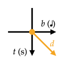
Positive | Negative | The time position of notes are *unspecified* if notes are defined within. | 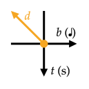
Zero | Any | In TaikoJiro 1 and 2, the time duration is 0 instead of infinity. | 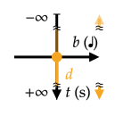 <br /> 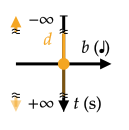
Negative | Positive | The time position of notes are *unspecified* if notes are defined within. | 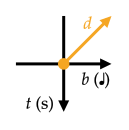
Negative | Negative | | 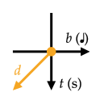

* The definition vector (*d*) on the beat-time (*b*-*t*) diagram has the following properties:
  * The direction in *b*-axis is related to the sign of beat duration.
  * The direction in *t*-axis is related to the sign of beat duration ÷ BPM.
  * The slope is proportional to 1 ÷ BPM.
* Zero beat duration with non-zero BPM can be used for defining individual overlapping notes and is a point (zero vector) on the beat-time diagram.
* Zero BPM with non-zero beat duration causes *unspecified* behavior but would theoretically be a vertical vector of infinite length on the beat-time diagram.
* Infinite BPM with non-zero beat duration cannot be specified directly but would theoretically be a horizontal vector on the beat-time diagram.

Their common combinations and usages are as follow:

Usage | Examplar Combination | Beat-time Diagram
--- | --- | ---
Forward scrolling in [BMS scrolling modes](#bmscroll--hbscroll--nmscroll). (Assume `#SCROLL 1`) | *d*: Positive BPM & positive beat duration | 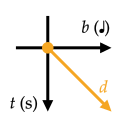
Backward scrolling in [BMS scrolling modes](#bmscroll--hbscroll--nmscroll). (Assume `#SCROLL 1`) | *d*: Negative BPM & negative beat duration | 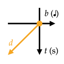
Forward warp in [BMS scrolling modes](#bmscroll--hbscroll--nmscroll). (Assume `#SCROLL 1`) | *d*<sub>0</sub>: Positive BPM & positive beat duration <br /> + *d*<sub>1</sub>: Negative BPM & positive beat duration <br /> + (*d*<sub>2</sub>): Beat duration ÷ BPM is positive (determines the note spacing) | 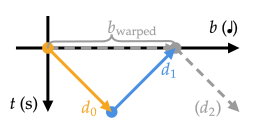
Backward warp in [BMS scrolling modes](#bmscroll--hbscroll--nmscroll). (Assume `#SCROLL 1`) | *d*<sub>0</sub>: Negative BPM & negative beat duration <br /> + *d*<sub>1</sub>: Positive BPM & negative beat duration <br /> + (*d*<sub>2</sub>): Beat duration ÷ BPM is positive (determines the note spacing) | 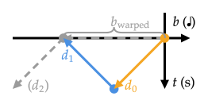
Overlapped notes in forward scrolling sections. <br /> A special case of a warp. <br /> (Can also be done with a negative `#DELAY`) | *d*<sub>0</sub>: Positive BPM & positive beat duration (with notes) <br /> + *d*<sub>1</sub>: Positive BPM & negative beat duration <br /> + *d*<sub>2</sub>: Positive BPM & positive beat duration (with notes) | 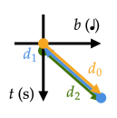
Overlapped notes in backward scrolling sections. <br /> A special case of a warp. <br /> (Can also be done with a negative `#DELAY`) | *d*<sub>0</sub>: Negative BPM & negative beat duration (with notes) <br /> + *d*<sub>1</sub>: Negative BPM & positive beat duration <br /> + *d*<sub>2</sub>: Negative BPM & negative beat duration (with notes) | 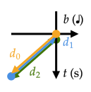

* Notechart sections with beat duration ÷ BPM being negative can be used for making a warp over a notechart section in [BMS scrolling modes](#bmscroll--hbscroll--nmscroll). The time position works similar to StepMania, but unlike StepMania uses the maximum beat position ever reached, the beat position of overlapped sections is instead determined by the last defined section. Also see the explanation for StepMania, <https://twitter.com/TaroNuke/status/1250177428783280128> by @TaroNuke
* If notes (and bar lines (?)) are defined in a section which overlaps with other sections in time, their beat position and per-note BPM are recalculated from their time position according to the latest defined section.

Each sign combination of [`#DELAY`](#delay) duration & BPM is as follow:

Sign of Delay Duration | Sign of BPM | Musical ("Actual") Beat-time Diagram | Visual Beat-time Diagram
--- | --- | --- | ---
Positive | Non-zero | 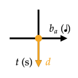 | 
Negative | Positive | 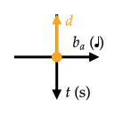 | 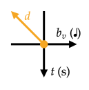
Negative | Negative |  | 

* The definition vector (*d*) on the beat-time (*b*-*t*) diagram has the following properties:
  * The direction and length in *t*-axis is determined by the delay duration.
  * Negative delays behavior as if an extra beat duration (can also be negative) were inserted, which causes the musical beat duration (*b<sub>a</sub>*) and visual beat duration (*b<sub>v</sub>*) to differ. In these conditions, the definition vector has the slope determined by the current BPM on the visual beat-time diagram.
* Zero delay duration has no effects and is a point (zero vector) on the beat-time diagram.
* In TaikoJiro 1 and 2, the destination beat and time of a delay with negative duration is not considered for calculating the played beat by time, so a positive delay cannot be canceled by negative delays, but can be canceled by measures with negative time duration. If a positive delay beat-time segment is the last-defined beat-time segment at a given time during gameplay, the first defined positive delay beat-time segment takes effect.

The visual beat duration behavior between positive and negative delay is not symmetrical, so the visual effects of positive delays and negative delays with total delay duration being zero do not cancel out. The behavior is as follows:

Examplar Combination | Musical Beat-time Diagram | Visual Beat-time Diagram
--- | --- | ---
*d*<sub>0</sub>: Positive delay <br /> + *d*<sub>1</sub>: Negative delay & positive BPM <br /> + *d*<sub>2</sub>: Positive BPM & positive beat duration (with notes) | 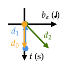 | 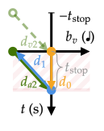

* In any [BMS scrolling mode](#bmscroll--hbscroll--nmscroll): The notes and bar lines initially scroll as if only the negative [`#DELAY`](#delay)(s) were used before the command-time effects of any positive [`#DELAY`](#delay)(s) are applied, which is the normal behavior of negative [`#DELAY`](#delay)s. The notes and bar lines are displayed to be scrolled ahead of their timing by the total remaining time duration of the command-time effects of positive [`#DELAY`](#delay)(s) defined before their definition, which is the normal behavior of positive [`#DELAY`](#delay)s.

#### Compatibility Issues

* In TaikoJiro 1, notes but not bar lines which are made earlier than [the `#START` command](#start--end) has their time position and beat position fixed to the `#START` command.
* In TaikoJiro 1, if the chart ends with the measure division interval having negative time duration, the chart teleports to the beat position of the `#START` command, and then beat progresses as if `#MEASURE -4/4` were active. The gameplay ends if [the `WAVE:` header](#wave) is not specified or the specified file is missing or unsupported.
* In TaikoJiro 2, if notes and bar lines are defined in a section which overlaps with other sections in time, the notes' and bar lines' time position is also affected by the latest defined section.
* In TaikoJiro 2, if the time position of the definition cursor is rewound by measure division intervals with negative time durations, the next measure division segments (consecutive measure division interval without timing changes in middle) until the next measure and the bar lines and notes on it are shifted, so that the beginning of the next measure division segment starts at the end of the internal measure division with the maximum time position ever reached during definition. The internal time position of the definition cursor is unaffected by the shift and the next measure onward are not affected.
  * To work around this issue, some gimmick charts targeting TaikoJiro 2 split the measure at each negative delay into two, and place the negative delay right before the measure delimiter `,` of the first half measure.
* In TJAPlayer2 for PC, beat duration ÷ BPM being negative causes incorrect lookup of the played beat position and might make notes not aligned to the judgement mark on their judgement timing in [HBScroll or BMScroll mode](#bmscroll--hbscroll--nmscroll).
* In TJAPlayer2 for PC, a positive delay does not stop the visual beat position from progressing.

### Note Symbols in Taiko Mode

[***OpenTaiko-OutFox standard version***](#proposal-komi-version): 1.0 (minimum, unless stated otherwise) \
***First seen in***: TaikoJiro v0.80 (initial release) \
***Supported by***: (assumedly universally supported, including TaikoJiro 1 & 2, TJAPlayer2 for.PC, OutFox v0.4.9.9) \
***Inspired by***: TJF format (`0` to `7`) \
&emsp; (likely) from DWI and earlier MSD format (`0` for blank and single digits (`1` to `9` except `5` for direction) for non-blanks)

Effective when [`GAME:Taiko`](#game) or [`#GAMETYPE Taiko`](#gametype) is in effect.

See <https://taiko.namco-ch.net/taiko/en/howto/onpu.php> for the appearance of notes in the official PC-generation arcade games.

See [Usual Patterns of Note Phoneticization in the Offical Games](#usual-patterns-of-note-phoneticization-in-the-offical-games) for the general patterns of how the alternative forms of *<ruby>口<rt>Kuchi</rt>唱<rt>Shou</rt>歌<rt>ga</rt></ruby>* <br> "Note phoneticizations" are used.

| | Note Type | Note Appearance | *<ruby>口<rt>Kuchi</rt>唱<rt>Shou</rt>歌<rt>ga</rt></ruby>* <br> "Note phoneticizations" in PC-generation arcade games | Explanations on Clear | Explanations on Fail | Notes
--- | --- | --- | --- | --- | --- | ---
`0` | (blank) | (none) | (none) | Nothing needs to be done. Consume no input. | (impossible to fail) |
`1` | Regular <ruby>ド<rt>Do</rt>ン<rt>n</rt></ruby> | Small orange-ish red circle | *<ruby>ド<rt>Do</rt></ruby>* Do / <ruby>コ<rt>Ko</rt></ruby> / *<ruby>ド<rt>Do</rt>ン<rt>n</rt></ruby>* Don | Hit the drum surface within the *<ruby>可<rt>Ka</rt></ruby>* GOOD/OK timing window, consumes a surface input. <br /> Awards *<ruby>良<rt>Ryou</rt></ruby>* GREAT/GOOD or *<ruby>可<rt>Ka</rt></ruby>* GOOD/OK judgment according to the timing and increases combo. <br /> Increases *<ruby>魂<rt>tamashii</rt>ゲー<rt>gee</rt>ジ<rt>ji</rt></ruby>* spirit gauge/soul gauge, & score according to awarded judgment. | Hit too off but within *<ruby>不<rt>Fu</rt>可<rt>ka</rt></ruby>* BAD judgment window (consumes a surface input) or not hit within the *<ruby>不<rt>Fu</rt>可<rt>ka</rt></ruby>* BAD judgment window (consumes no inputs). <br /> Gives a *<ruby>不<rt>Fu</rt>可<rt>ka</rt></ruby>* BAD judgment & combo break and decreases *<ruby>魂<rt>tamashii</rt>ゲー<rt>gee</rt>ジ<rt>ji</rt></ruby>* spirit gauge/soul gauge. |
`2` | Regular <ruby>カ<rt>Ka</rt>ツ<rt>tsu</rt></ruby> | Small sky-blue circle | <ruby>カ<rt>Ka</rt></ruby> / *<ruby>カッ<rt>Ka'</rt></ruby>* Ka | Hit the drum rim within the *<ruby>可<rt>Ka</rt></ruby>* GOOD/OK timing window, consumes a rim input. <br /> Awards the same as `1`. | Hit too off but within *<ruby>不<rt>Fu</rt>可<rt>ka</rt></ruby>* BAD judgment window (consumes a surface input) or not hit within the *<ruby>不<rt>Fu</rt>可<rt>ka</rt></ruby>* BAD judgment window (consumes no inputs). <br /> Gives the same penalty as `1`. |
`3` | Big <ruby>ド<rt>Do</rt>ン<rt>n</rt></ruby> | Big orange-ish red circle | *<ruby>ド<rt>Do</rt>ン<rt>n</rt></ruby>（<ruby>大<rt>Ookii</rt></ruby>）* DON | Hit the drum surface within the *<ruby>可<rt>Ka</rt></ruby>* GOOD/OK timing window, consumes a surface input. <br /> Awards the same as `1` but extra score bonus† if with certain or greater force (AC) <br> if the other left or right side is hit within a certain time duration (consumes two surface inputs in total) (CS) | (same as `1`) |
`4` | Big <ruby>カ<rt>Ka</rt>ツ<rt>tsu</rt></ruby> | Big sky-blue circle | *<ruby>カッ<rt>Ka'</rt></ruby>（<ruby>大<rt>Ookii</rt></ruby>）* KA | Hit the drum rim within the *<ruby>可<rt>Ka</rt></ruby>* GOOD/OK timing window, consumes a rim input. <br /> Awards the same as `2` but extra score bonus† if with certain or greater force (AC) <br> if the other left or right side is hit within a certain time duration (consumes two rim inputs in total) (CS) | (same as `2`) |
`5` | Head of regular (bar) *<ruby>連<rt>Ren</rt>打<rt>da</rt></ruby>* drumroll <br /> Examples: `5008`, `5558`, `5001` | Small yellow circle with bar attached behind <br> Turns red if hit rapidly while gradually fading out to its original color in AC games | *<ruby>連<rt>Ren</rt>打<rt>da</rt></ruby>ー* Roll&ndash; | Roll on the drum surface or rim during its duration, consumes each hit with unlimited speed, reacts to each hit up to 1 hit per 60fps frame (official games). <br /> Increases score per reacted hit. | (impossible to fail) |
`I` | (same as `5`) (OpenTaiko (0auBSQ)) <br /> Head of regular <ruby>カ<rt>Ka</rt>ツ<rt>tsu</rt></ruby> (bar) *<ruby>連<rt>Ren</rt>打<rt>da</rt></ruby>* drumroll (OutFox's OpenTaiko-OutFox standard draft (?)) <br /> Examples: `I008`, `III8`, `I001` | (see `5`) <br /> Small sky-blue circle with bar attached behind (OutFox, expected (?)) | (see `5`) | (same as `5`) (OpenTaiko (0auBSQ)) <br /> Similar to `5` but only consumes (?) and reacts to rim inputs. (OutFox's OpenTaiko-OutFox standard draft) <br /> Awards the same as `5`. | (impossible to fail) | [***OpenTaiko-OutFox standard version***](#proposal-komi-version): 1.2 <br /> ***First seen in***: OpenTaiko-OutFox standard 1.2 (first proposed from OutFox), OpenTaiko (0auBSQ) v0.5.4 <br /> By analogy with Konga mode
`6` | Head of big (bar) *<ruby>連<rt>Ren</rt>打<rt>da</rt></ruby>* drumroll <br /> Examples: `6008`, `6668`, `6001` | Big yellow circle with bar attached behind <br> Turns red if hit rapidly while gradually fading out to its original color in AC games | *<ruby>連<rt>Ren</rt>打<rt>da</rt></ruby>（<ruby>大<rt>Ookii</rt></ruby>）ー* ROLL&ndash; | Roll on the drum surface or rim during its duration, consumes each hit with unlimited speed, reacts to each hit up to 1 hit per 60fps frame (official games). <br /> Increases score per reacted hit. <br /> Extra score bonus† for each reacted hit if with certain or greater force (?) (earlier AC), and/or with at least 2 hits in a 60fps frame (?) (earlier AC & earlier CS), or always (?) (AC & CS) | (impossible to fail) |
`H` | (same as `6`) (OpenTaiko (0auBSQ)) <br /> Head of regular <ruby>ド<rt>Do</rt>ン<rt>n</rt></ruby> (bar) *<ruby>連<rt>Ren</rt>打<rt>da</rt></ruby>* drumroll (OutFox's OpenTaiko-OutFox standard draft (?)) <br /> Examples: `H008`, `HHH8`, `H001` | (see `6`) <br /> Small orange-ish red circle with bar attached behind (OutFox) | (see `6`) | (same as `5`) (OpenTaiko (0auBSQ)) <br /> Similar to `5` but only consumes (?) and reacts to surface inputs. (OutFox's OpenTaiko-OutFox standard draft) <br /> Awards the same as `5`. | (impossible to fail) | [***OpenTaiko-OutFox standard version***](#proposal-komi-version): 1.2 <br /> ***First seen in***: (first proposed from OutFox), OpenTaiko (0auBSQ) v0.5.4 <br /> By analogy with Konga mode
`7` | Head of regular *<ruby>激<rt>Geki</rt>連<rt>ren</rt>打<rt>da</rt></ruby>/<ruby>ゲ<rt>Ge</rt>キ<rt>ki</rt>連<rt>ren</rt>打<rt>da</rt></ruby>* "fierce drumroll" burst note / *<ruby>風<rt>Fuu</rt>船<rt>sen</rt></ruby>/<ruby>ふ <rt>Fu</rt>う<rt>u</rt>せ<rt>se</rt>ん<rt>n</rt></ruby>* balloon <br /> Examples: `7008`, `7778`, `7001` | Small orange circle (slightly brighter than `1`) with orange-ish red balloon attached behind | *<ruby>ふ <rt>Fu</rt>う<rt>u</rt>せ<rt>se</rt>ん<rt>n</rt></ruby>* Balloon | Roll on the drum surface with exactly certain amount of reacted hits during its duration, consumes each surface or rim (?) hit with unlimited speed, reacts to each surface hit up to 1 hit per 60fps frame (official games). <br /> Each reacted hit increases score (except for CS4&ndash;5, TDM, & PSP1&ndash;2). <br /> Awards extra score bonus† when cleared. | Fail to input enough amount of reacted hits. <br /> Does not give penalties except that notes (except bombs/mines (?)) placed within the duration of the balloon are impossible to hit while the balloon is not cleared. |
`8` | Explicit end of a drumroll-type note (if any), otherwise (blank) | (round end of a bar) (end of bar drumrolls) <br /> (none) (otherwise) | (っ!!) (end of bar drumrolls) <br /> (none) (otherwise) | Nothing needs to be done. Consumes no input. | (impossible to fail) | Stopping rolling the drum non-after the point (end of drumrolls) <br /> Introduced to replaced the TJF syntax for specifying drumroll duration (`5555` / `7777`) (explained below).
`9` | Head of special burst note/balloon <br> (Differ from game to game) <br /> Examples: `9008`, `9998`, `9001` | (Vary) <br> Big yellow circle with potato attached (PS2-generation) <br> Big yellow circle in the shape of a confetti ball 🎊 (PS3- and PC-generation) <br> Has particle decorative visual effects in AC. | *<ruby>く<rt>Ku</rt>す<rt>su</rt>玉<rt>dama</rt></ruby>* Party Popper <br> (Strictly speaking, *<ruby>薬<rt>Kusu</rt>玉<rt>dama</rt></ruby>/<ruby>く<rt>Ku</rt>す<rt>su</rt>玉<rt>dama</rt></ruby>* "Confetti Ball" 🎊 & party popper 🎉 only resemble each other and are not the same thing) | (Vary) <br> In AC, roll on the drum surface with exactly certain amount (summed and shared among players) of reacted hits during its duration, consumes each surface or rim (?) hit with unlimited speed, reacts to each surface hit up to 1 hit per 60fps frame (official games). <br /> Each reacted hit increases score. <br /> Awards vary extra score bonus† to all players when cleared, according to the timing of an additional final hit (consumed) hinted by the player character's face (AC7) or whether the note is cleared quickly enough (later AC) <br> | (same as `7`) | ***First seen in***: TaikoJiro v2.75 <br /> In the official games, becomes `7` when not all players encounter `9` with the note head, the full bonus time point, & the note end respectively at the same time position for each player.
`A` | Hand-holding big <ruby>ド<rt>Do</rt>ン<rt>n</rt></ruby> | Big orange-ish red circle with hands holding with other note(s) for other player(s) <br /> Its face resembles `1` rather than `3` until being hit. | *<ruby>ド<rt>Do</rt>ン<rt>n</rt></ruby>（<ruby>手<rt>Te</rt></ruby>）* "DON (Hand)" | Similar to `1` or `3` (strong or double-hit not required in some official games (?)) but awards extra score bonus† if all players hit within a certain time duration. | (same as `1`) | [***OpenTaiko-OutFox standard version***](#proposal-komi-version): 1.0 <br /> ***First seen in***: TJAPlayer2 for.PC ver.2018040100 <br /> ***Supported by***: OutFox v0.4.9.9 <br /> In the official games, becomes `3` when no hand-holding notes exist at the same time position for any of the other players.
`B` | Hand-holding big <ruby>カ<rt>Ka</rt>ツ<rt>tsu</rt></ruby> | Big sky-blue circle with hands holding with other note(s) for other player(s) <br /> Its face resembles `2` rather than `4` until being hit. | *<ruby>カッ<rt>Ka'</rt></ruby>（<ruby>手<rt>Te</rt></ruby>）* "KA (Hand)" | Similar to `2` or `4` (strong or double-hit not required in some official games (?)) but awards extra score bonus† if all players hit within a certain time duration. | (same as `2`) | [***OpenTaiko-OutFox standard version***](#proposal-komi-version): 1.0 <br /> ***First seen in***: TJAPlayer2 for.PC ver.2018040100 <br /> ***Supported by***: OutFox v0.4.9.9 <br /> In the official games, becomes `4` when no hand-holding notes exist at the same time position for any of the other players.
`C` | Bomb/mine | Small dark-blue cherry bomb with ignited fuze 💣 | (none) | All hits are too off or not hit (both consumes no inputs). <br /> Awards a "bomb/mine-pass" judgment. | Hit the drum surface or rim within the *<ruby>可<rt>Ka</rt></ruby>* GOOD/OK (?) timing window, consumes an input. <br /> Gives a BOOM ("bomb/mine-miss") judgment & a combo-break and decreases *<ruby>魂<rt>tamashii</rt>ゲー<rt>gee</rt>ジ<rt>ji</rt></ruby>* spirit gauge/soul gauge. | [***OpenTaiko-OutFox standard version***](#proposal-komi-version): 1.2 <br /> ***First seen in***: OpenTaiko-OutFox standard 1.2 (proposed from OutFox) <br /> ***Supported by***: OpenTaiko (0auBSQ) v0.5.4
`D` | Fuze/fuse drumroll <br /> Examples: `D008`, `DDD8`, `D001` | ? <br /> (Big circular clock with blue-ish purple edge and with bar attached behind in OpenTaiko (0auBSQ)) | (<ruby>時<rt>Ji</rt>爆<rt>baku</rt>弾<rt>dan</rt></ruby> "Time bomb"/Fuseroll) | Similar to `7` but awards a "bomb/mine-pass" judgment. | Similar to `7` but gives a BOOM ("bomb/mine-miss") judgment & a combo-break and decreases *<ruby>魂<rt>tamashii</rt>ゲー<rt>gee</rt>ジ<rt>ji</rt></ruby>* spirit gauge/soul gauge. | [***OpenTaiko-OutFox standard version***](#proposal-komi-version): 1.2 <br /> ***First seen in***: (first proposed from OutFox), OpenTaiko (0auBSQ) v0.6.0 <br /> Not in the official games.
`F` | *Ad libitum* note (AD-LIB) | (invisible by default) | (none) | Hit the drum surface or rim within the *<ruby>可<rt>Ka</rt></ruby>* GOOD/OK timing window, consumes an input. <br /> Awards an AD-LIB judgment but keep combo unchanged. | Not hit within the *<ruby>可<rt>Ka</rt></ruby>* GOOD/OK timing window (consumes no inputs). <br /> Gives no penalties. | [***OpenTaiko-OutFox standard version***](#proposal-komi-version): 1.1 <br /> ***First seen in***: TJAPlayer2 for.PC ver.2016081500 <br /> Not in the official games. <br> Inspired by another rhythm game *GROOVE COASTER*, developed by TAITO
`G` | Swap note | (Vary) <br /> Big green circle in taiko-web (plugin "Green Notes") <br /> Big purple circle in OpenTaiko (0auBSQ) | (*<ruby>グ<rt>Gu</rt>リー<rt>rii</rt>ン<rt>n</rt></ruby>* Green) <br /> (*<ruby>カ<rt>Ka</rt>ド<rt>do</rt>ン<rt>n</rt></ruby>* KADON) | Hit the drum surface (or rim) on left or right side within the *<ruby>可<rt>Ka</rt></ruby>* GOOD/OK timing window **&** the drum rim (or surface) on the other left or right side within a certain time duration (consumes a surface input & a rim input in total) <br /> Awards the same as `1` according to the timing of the first input. | Hit too off but within *<ruby>不<rt>Fu</rt>可<rt>ka</rt></ruby>* BAD judgment window (consumes the first input), or not hit within the *<ruby>不<rt>Fu</rt>可<rt>ka</rt></ruby>* BAD judgment window (consumes no inputs), or the second input is not given in a certain time duration after the first input (consumes only the first input). <br /> Gives the same penalty as `1`. | [***OpenTaiko-OutFox standard version***](#proposal-komi-version): 1.2 <br /> ***First seen in***: taiko-web (plugin "Green Notes") <br /> ***Supported by***: OpenTaiko (0auBSQ) v0.5.4 <br /> Not in the official games.

†: No score bonuses if the PC-generation scoring rule is followed.

* In TJAPlayer2 for.PC & OpenTaiko (0auBSQ) until v0.6.0, `9` is treated the same as `7`.
* In OutFox, as for v0.5.0 pre043, `A` is treated the same as `3` and `B` is treated the same as `4` (subjects to changes according to demands).
* In OutFox, `0` to `9`, `A` to `D`, & `F` to `J` are all parsed, where `C` and `H` have work-in-progress gamepad/keyboard input and `D` to `G` & `I` have work-in-progress gamepad/keyboard input and noteskin support as for v0.5.0 pre043 a17.

#### Note type category

* Hit-type notes: Notes with no duration and involving a single or double hit, *e.g.*, `1`, `2`, `3`, `4`, `A`, `B`.
  * Missable hit-type notes: Notes which give a *<ruby>不<rt>Fu</rt>可<rt>ka</rt></ruby>* BAD judgment if missed.
    * This category does not include `C` & `F`.
* Drumroll-type notes: Notes with duration and involving multiple hits, *e.g.*, `5`, `6`, `7`, `9`.
  * Bar balloon-type notes: Notes with visual bar body, *e.g.*, `5`, `6`, `D`.
  * Balloon-type notes: Notes which require specified amount of hits to clear, *e.g.*, `7`, `9`, `D`.

#### Duration of drumroll-type notes

The head and end of drumroll-type notes have no timing window. In the official arcade game, drumroll inputs are allowed non-before/non-after the containing frame of the judgment timing of the head/end of the drumroll-type note.

During the defined duration interval within a drumroll-type note, either `0` or the symbol of the note head may appear. *E.g.*: `5008` / `5558` / `5058` are all equivalent. *Unspecified*: Whether other drumroll-type notes can be used in place of the repeated symbol of the note head.

* In TaikoJiro, all drumroll-type note head symbols can be used in place of the repeated symbol.

*Proposal* (IID): Each symbol of the note head inside a bar drumroll note denotes a middle point of the bar which can scroll independently to the head, end, and other middle points of the note.

For special balloons (`9`), the last occurrence of repeated note head symbol (if any) defines the full bonus time point. If the note is cleared, full bonus is awarded only by clearing the note non-after that point and partial bonus is awarded otherwise. The full bonus time point is *unspecified* when no repeated note head symbols ever occur.

* In TaikoJiro, the full bonus time point defaults to the position 0.6 times of the note duration after the note head.

By default, drumroll-type notes are ended non-after one of:

* The definition position of an `8`.
  * *Proposal* (IID): The ending position can be earlier than the `8` by an *unspecified* duration.
* An *unspecified* duration before a hit-type note symbol.
  * In TaikoJiro, the duration is one of:
    * In notecharts without any "branch"/path sections: 50ms.
    * Otherwise, in the *<ruby>普<rt>Fu</rt>通<rt>tsuu</rt></ruby>* Normal "branch"/path state: 8/53 s (≈ 150.94ms) (tentatically determined).
    * Otherwise, in other "branch"/path states: 0ms.
  * *Unspecified*: The behavior of the hit-type note which ends a balloon-type note.
    * In TaikoJiro v2.36+, the hit-type note become impossible to hit if the balloon-type note is not cleared.
      * This behavior is in reference to the *<ruby>む<rt>Mu</rt>ず<rt>zu</rt>か<rt>ka</rt>し<rt>shi</rt>い<rt>i</rt></ruby>* Hard  and *<ruby>お<rt>O</rt>に<rt>ni</rt></ruby>* Oni/Extreme difficulties of "<ruby>風<rt>Fu</rt>雲<rt>un</rt></ruby>！<ruby>バ<rt>Ba</rt>チ<rt>chi</rt>お<rt>o</rt>先<rt>Sen</rt>生<rt>sei</rt></ruby>" in AC3&ndash;6, where the duration interval of balloon-type notes overlaps with the following hit-type note. The overlap has been canceled since AC7.
        * See <https://wikiwiki.jp/taiko-fumen/収録曲/おに/風雲！バチお先生>
      * This behavior later appeared in *<ruby>太<rt>Tai</rt>鼓<rt>ko</rt>タ<rt>Ta</rt>ワー<rt>waa</rt>3<rt>San</rt></ruby>（<ruby>辛<rt>kara</rt>口<rt>kuchi</rt></ruby>）* ("Taiko Tower 3 (hard)") and a few RPG-mode charts in other games.
        * See <https://wikiwiki.jp/taiko-fumen/収録曲/その他/太鼓タワー3%28辛口%29>
      * However, this can be achieved alternatively by using `#DELAY`s with negative duration to place the hit-type note.
      * *Proposal* (IID): The hit-type note which ends a balloon-type note cannot be hit until the balloon-type note is broken or missed. If the balloon-type note has been broken or missed, the hit-type note ending the balloon-type note becomes possible to hit.
  * *Proposal* (IID): If a roll-type notes would end by hit-type note symbol, but an isolated `8` occurs after the hit-type note and before any roll-type note head symbol, the roll-type note ends instead at a position earlier than the `8` by an *unspecified* duration as if the hit-type notes were irrelevant for determining the roll length.
* In TaikoJiro, the definition position of the last note symbol of the notechart, except when the note head is in the definition of a "branch"/path other than the *<ruby>普<rt>Fu</rt>通<rt>tsuu</rt></ruby>* Normal "branch"/path.

In the official games, drumroll-type notes are usually intentionally made to end earlier than the designed ending beat position by the amount of beats of a 1/48th note.

* Reference: *連打秒数表* ("List of seconds of drumrolls"). 太鼓の達人 譜面とか Wiki\* ("Taiko no Tatsujin - Wiki\* about Notecharts and so on"). <https://wikiwiki.jp/taiko-fumen/収録曲/連打秒数表>

*Unspecified*: Whether other drumroll-type note symbols can appear during a drumroll-type note.

* In TJF format, `8` did not exist and the duration interval is specified by repeat the note head symbol consecutively, where the last repeated symbol corresponds to TJA `8`, *e.g.*, TJF `5555` = TJA `5558`.
* The explicit roll end note symbol `8` is (likely) inspired by the roll/hold end note symbol `3` in SM format.

*Unspecified*: The behavior when a drumroll-type note with non-positive time duration is formed, possibly from a drumroll-type note ended by a hit-type note (*e.g.*, `51` / `56` / `65`, where the time duration of the drumroll may be shortened as mentioned above) or by using timing settings.

* In Taikosan, bar drumroll notes with zero time duration can be created by using an isolated drumroll-type note symbol. However, such notes are not accepted and an error message is displayed, although balloon notes with zero time duration are allowed. \
  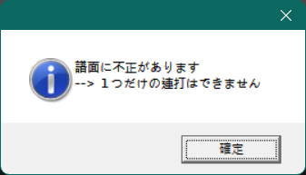
* In TaikoJiro, drumroll-type notes with zero time duration are allowed and may receive inputs in occasion, while drumroll-type notes with negative time duration never receive inputs. Bar-less balloon-type notes with negative time duration teleport to the judgment mark when the time position of the note end is reached.

#### Compatibility Issues

* In TJAPlayer2 for.PC, drumroll-type notes must be ended with `8`.
* In TJAPlayer2 for.PC, The head of balloon-type notes has a timing window of the time duration of 1 frame under 60fps.

### Note Symbols in Konga Mode

[***OpenTaiko-OutFox standard version***](#proposal-komi-version): 1.2 (unless stated otherwise) \
***First seen in***: OpenTaiko (0auBSQ) v0.5.4 \
***Supported by***: taiko-web (plugin "Donkey Konga Mode"), OutFox

Effective when [`GAME:Konga`](#game) or [`#GAMETYPE Konga`](#gametype) is in effect.

See the exemplar actual gameplays:

* <https://www.youtube.com/watch?v=G70HoWO1umc> <br /> <iframe width="560" height="315" src="https://www.youtube-nocookie.com/embed/G70HoWO1umc" title="YouTube video player, playing &quot;Donkey Konga &lbrack;29&rbrack; GameCube Longplay&quot;, uploaded by Mutch Games" frameborder="0" allow="accelerometer; autoplay; clipboard-write; encrypted-media; gyroscope; picture-in-picture; web-share" referrerpolicy="strict-origin-when-cross-origin" allowfullscreen></iframe>
* <https://www.youtube.com/watch?v=myci706YXss> <br /> <iframe width="560" height="315" src="https://www.youtube.com/embed/myci706YXss?si=AKOnV2vJgvUB63gU" title="YouTube video player, playing &quot;Longplay of Donkey Konga 3&quot;, uploaded by LongplayArchive" frameborder="0" allow="accelerometer; autoplay; clipboard-write; encrypted-media; gyroscope; picture-in-picture; web-share" referrerpolicy="strict-origin-when-cross-origin" allowfullscreen></iframe>

See [Usual Patterns of Note Phoneticization in the Offical Games](#usual-patterns-of-note-phoneticization-in-the-offical-games) for the general patterns of how the alternative forms of *<ruby>口<rt>Kuchi</rt>唱<rt>Shou</rt>歌<rt>ga</rt></ruby>* <br> "Note phoneticizations" are used.

| | Note Type | Note Appearance | *<ruby>口<rt>Kuchi</rt>唱<rt>Shou</rt>歌<rt>ga</rt></ruby>* <br> "Note phoneticizations" in *Donkey Konga 3* | Explanations on Clear | Explanations on Fail | Notes
--- | --- | --- | --- | --- | --- | ---
`0` | (blank) | (none) | (none) | Nothing needs to be done. Consume no input. | (impossible to fail) |
`1` | Right drum beat | Red circle with its right half filled | <ruby>パ<rt>Pa</rt></ruby> / <ruby>パッ<rt>Pa'</rt></ruby> / <ruby>パン<rt>Pan</rt></ruby> | Hit the right bongo drum within the OK timing window, consumes a right input. <br /> Awards GREAT or OK judgment according to the timing and increases combo. <br /> Increases healthy gauge, & score according to awarded judgment. | Hit too off but within BAD judgment window (consumes a right input) or not hit within the BAD judgment window (consumes no inputs). <br /> Gives a BAD (if hit) or MISS‡ (if not hit) judgment & combo break and decreases healthy gauge. |
`2` | Left drum beat | Yellow circle with its left half filled | <ruby>ポ<rt>Po</rt></ruby> / <ruby>ポッ<rt>Po'</rt></ruby> / <ruby>ポン<rt>Pon</rt></ruby> | Hit the left bongo drum within the OK timing window, consumes a left input. <br /> Awards the same as `1`. | Hit too off but within BAD judgment window (consumes a left input) or not hit within the BAD judgment window (consumes no inputs). <br /> Gives the same penalty as `1`. |
`3` | Both drum beats | Pink circle | D | Hit the left or right bongo drum within the OK timing window **&** the other left or right bongo drum within a certain time duration (consumes a left input & a right input in total) <br /> Awards the same as `1` according to the timing of the first input. | Hit too off but within BAD judgment window (consumes the first input), or not hit within the BAD judgment window (consumes no inputs), or the second input is not given in a certain time duration after the first input (consumes only the first input). <br /> Gives the same penalty as `1`. |
`G` | (same as `3`) | (see `3`) | (see `3`) | (see `3`) | (see `3`) | ***First seen in***: OpenTaiko-OutFox standard 1.2, OpenTaiko (0auBSQ) v0.5.4, OutFox v0.4.18 <br /> By analogy with Taiko mode.
`4` | Clap | Sky-blue circle with star-ish edge | <ruby>チャ<rt>Cha</rt></ruby> / <ruby>チャッ<rt>Cha'</rt></ruby> / <ruby>チャン<rt>Chan</rt></ruby> | Clap hands above the bongo drums within the OK timing window, consumes a clap input. <br /> Awards the same as `1`. | Hit too off but within BAD judgment window (consumes a clap input) or not hit within the BAD judgment window (consumes no inputs). <br /> Gives the same penalty as `1`. |
`J` | (same as `4`) | (see `4`) | (see `4`) | (see `4`) | (see `4`) | [***OpenTaiko-OutFox standard version***](#proposal-komi-version): (non-standard) <br /> ***First seen in***: OutFox v0.4.18 (?)
`5` | Head of right bar drumroll <br /> Examples: `5008`, `5558`, `5001` | Red circle with its right half filled and with bar attached behind | *<ruby>連<rt>Ren</rt>打<rt>da</rt></ruby>～* "Roll~" | Similar to `6` but only consumes (?) and reacts to right inputs. <br /> Awards the same as `6`. | (impossible to fail) |
`I` | Head of left bar drumroll <br /> Examples: `I008`, `III8`, `I001` | Yellow circle with its left half filled and with bar attached behind | *<ruby>連<rt>Ren</rt>打<rt>da</rt></ruby>～* "Roll~" | Similar to `6` but only consumes (?) and reacts to left inputs. <br /> Awards the same as `6`.| (impossible to fail) |
`6` | Head of both bar drumroll <br /> Examples: `6008`, `6668`, `6001` | Pink circle with bar attached behind | *<ruby>連<rt>Ren</rt>打<rt>da</rt></ruby>～* "Roll~" | Roll on either bongo drum during its duration, consumes each left, right, or clap (?) hit with unlimited speed, reacts to each left or right hit up to 1 hit per 60fps frame (official games). <br /> Increases score per reacted hit. | (impossible to fail) |
`H` | Head of clap bar applause <br /> Examples: `H008`, `HHH8`, `H001` | Sky-blue circle with star-ish edge and with bar attached behind | *<ruby>拍<rt>Haku</rt>手<rt>shu</rt></ruby>～* "Applaud~" | Applaud above the bongo drums during its duration, consumes each left (?), right (?), or clap hit with unlimited speed, reacts to each clap hit up to 1 hit per 60fps frame (official games). <br /> Increases score per reacted hit. | (impossible to fail) |
`7` | Head of regular *<ruby>激<rt>Geki</rt>連<rt>ren</rt>打<rt>da</rt></ruby>/<ruby>ゲ<rt>Ge</rt>キ<rt>ki</rt>連<rt>ren</rt>打<rt>da</rt></ruby>* "fierce drumroll" burst note / *<ruby>風<rt>Fuu</rt>船<rt>sen</rt></ruby>/<ruby>ふ <rt>Fu</rt>う<rt>u</rt>せ<rt>se</rt>ん<rt>n</rt></ruby>* balloon <br /> Examples: `7008`, `7778`, `7001` | Small orange circle (slightly brighter than `1`) with orange-ish red balloon attached behind | (*<ruby>ふ <rt>Fu</rt>う<rt>u</rt>せ<rt>se</rt>ん<rt>n</rt></ruby>* Balloon) | Roll on either bongo drum with exactly certain amount of reacted hits during its duration, consumes each left, right, and clap (?) hit with unlimited speed, reacts to each left or right hit up to 1 hit per 60fps frame (official games). <br /> Each reacted hit increases score. <br /> Awards extra score bonus† when cleared. | Fail to input enough amount of reacted hits. <br /> Does not give penalties except that notes (except bombs/mines (?)) placed within the duration of the balloon are impossible to hit while the balloon is not cleared. | ***First seen in***: OpenTaiko-OutFox standard 1.2 <br /> By analogy with Taiko mode.
`8` | Explicit end of a drumroll-type or applause note (if any), otherwise (blank) | (round end of a bar) (end of a bar drumroll or applause) <br /> (none) (otherwise) | (none) | Nothing needs to be done. Consumes no input. | (impossible to fail) | Stop rolling both the bongo drums or clapping non-after the point (end of drumrolls)
`9` | Head of special burst note/balloon <br /> Examples: `9008`, `9998`, `9001` | (Vary) | (*<ruby>く<rt>Ku</rt>す<rt>su</rt>玉<rt>dama</rt></ruby>* Party Popper) | (Vary) <br> Roll on either bongo drum with exactly certain amount (summed and shared among players) of reacted hits during its duration, consumes each left, right, or clap (?) hit with unlimited speed, reacts to each left or right hit up to 1 hit per 60fps frame (official games). <br /> Each reacted hit increases score. <br /> Awards vary extra score bonus† to all players when cleared, according to whether the note is cleared quickly enough. | (same as `7`) | ***First seen in***: OpenTaiko-OutFox standard 1.2 <br /> Might become `7` when not all players encounter `9` with the note head, the full bonus time point, & the note end respectively at the same time position for each player. <br /> Not in the official games. <br /> By analogy with Taiko mode.
`A` | Hand-holding both drum beats | (Pink circle with hands holding with other note(s) for other player(s)) | ? | Similar to `3` but awards extra score bonus† if all players hit within a certain time duration <br> | (same as `3`) | ***First seen in***: OpenTaiko-OutFox standard 1.2, OpenTaiko (0auBSQ), OutFox <br /> Might becomes `3` when no hand-holding notes exist at the same time position for any of the other players. <br> Not in the official games. <br> By analogy with `GAME:Taiko`.
`B` | Hand-holding clap beat | (Sky-blue circle with star-ish edge and with hands holding with other note(s) for other player(s)) | ? | Similar to `4` but awards extra score bonus† if all players hit within a certain time duration. | (same as `4`) | ***First seen in***: OpenTaiko-OutFox standard 1.2, OpenTaiko (0auBSQ), OutFox <br /> Might becomes `4` when no hand-holding notes exist at the same time position for any of the other players. <br> Not in the official games. <br> By analogy with Taiko mode.
`C` | Bomb/mine | (Small dark-blue cherry bomb with ignited fuze 💣) | (none) | All hits are too off or not hit (both consumes no inputs). <br /> Awards a "bomb/mine-pass" judgment. | Hit either bongo drum or clap within the OK (?) timing window, consumes an input. <br /> Gives a BOOM ("bomb/mine-miss") judgment & a combo-break and decreases healty gauge. | ***First seen in***: OpenTaiko-OutFox standard 1.2, OpenTaiko (0auBSQ) <br /> Not in the official games. <br /> By analogy with Taiko mode.
`D` | Fuze/fuse drumroll <br /> Examples: `D008`, `DDD8`, `D001` | (Big circular clock with blue-ish purple edge and with bar attached behind in OpenTaiko (0auBSQ)) | (<ruby>時<rt>Ji</rt>爆<rt>baku</rt>弾<rt>dan</rt></ruby> "Time bomb"/Fuseroll) | Similar to `7` but awards a "bomb/mine-pass" judgment. | Similar to `7` but gives a BOOM ("bomb/mine-miss") judgment & a combo-break and decreases healthy gauge. | ***First seen in***: OpenTaiko-OutFox standard 1.2 (first proposed from OutFox), OpenTaiko (0auBSQ) v0.6.0 <br /> Not in the official games. <br /> By analogy with Taiko mode.
`F` | *Ad libitum* note (AD-LIB) | (invisible by default) | (none) | Hit either bongo drum or clap within the OK timing window, consumes an input. <br /> Awards an AD-LIB judgment but keep combo unchanged. | Not hit within the OK timing window (consumes no inputs). <br /> Gives no penalties. | ***First seen in***: OpenTaiko-OutFox standard 1.2, OpenTaiko (0auBSQ) <br /> Not in the official games. <br> By analogy with Taiko mode.

†: No score bonuses if the PC-generation scoring rule is followed. \
‡: A BAD judgment in Konga games corresponds to a hit *<ruby>不<rt>Fu</rt>可<rt>ka</rt></ruby>* BAD judgment in Taiko games, while a MISS judgment in Konga games corresponds to a unhit *<ruby>不<rt>Fu</rt>可<rt>ka</rt></ruby>* BAD judgment in Taiko games.

* In OutFox, as for v0.5.0 pre043, `A` is treated the same as `3` and `B` is treated the same as `4` (subjects to changes according to demands).
* In OutFox, `0` to `9`, `A` to `D`, & `F` to `J` are all parsed, where `C` have work-in-progress gamepad/keyboard input and `D` have work-in-progress gamepad/keyboard input and noteskin support as for v0.5.0 pre043 a17.

#### Note type category

* Beat-type notes & the clap note correspond to hit-type notes in Taiko mode.
* Drumroll-type notes & the applause note correspond to drumroll-type notes in Taiko mode.

The note handling details of the Taiko mode apply. See the explanation in [Note Symbols in Taiko Mode](#note-symbols-in-taiko-mode).

### *Proposal* (Komi): Note Symbols in Beatz Mode

[***OpenTaiko-OutFox standard version***](#proposal-komi-version): 2.0

The Beatz mode is based on Squid Beatz 2, a mini game in Splatoon 2, developed by Nintendo.

Squid Beatz 2 is the sequel of Squid Beatz (a mini game in Splatoon, developed by Nintendo). However, Squid Beatz only has 2 note type: left and right notes (similar to Konga mode), while Squid Beatz 2 has more note types but based on instead bottom and top notes (similar to Taiko mode).

Input type | Buttons
--- | ---
Top-left | Any left shoulder button
Top-right | Any right shoulder button
Bottom-left | Any D-pad button
Bottom-right | Any face (X/Y/B/A) button

| | Note Type | Note Appearance | Explanations on Clear | Explanations on Fail | Notes
--- | --- | --- | --- | --- | ---
`0` | (blank) | (none) | Nothing needs to be done. Consume no input. | (impossible to fail) |
`1` | Bottom single note | Red circle on the bottom lane | Press a bottom button within the GOOD‡ timing window, consumes a bottom input. <br /> Awards FRESH or GOOD‡ judgment according to the timing. | Press a top button within the GOOD‡ judgment window (consumes a top input), press too off but within the MISS judgment window (?) (consumes an input), or not press within the MISS judgment window (consumes no inputs). <br /> Gives a MISS judgment & combo break. |
`2` | Top single note | Green or blue circle on the top lane | Press a top button within the GOOD‡ timing window, consumes a top input. <br /> Awards the same as `1`. | Press a bottom button within the GOOD‡ judgment window (consumes a bottom input), press too off but within the MISS judgment window (consumes an input), or not press within the MISS judgment window (consumes no inputs). <br /> Gives the same penalty as `1`. |
`3` | Bottom double note | Red square on the bottom lane | Press bottom-left or bottom-right within the GOOD‡ timing window **&** the other bottom-left or bottom-right within a certain time duration (consumes a bottom-left and a bottom-right input in total) <br /> Awards the same as `1` according to the timing of the first input. | Press top within the GOOD‡ judgment window (consumes a top input), press too off but within the MISS judgment window (consumes the first input), not press within the MISS judgment window (consumes no inputs), the second input is not given in a certain time duration after the first input (consumes only the first input), or the second input is top or repeated-side bottom (consumes 2 inputs in total). <br /> Gives the same penalty as `1`. |
`A` | (same as `3`) | (see `3`) | (see `3`) | (see `3`) | By analogy with `GAME:Taiko`.
`4` | Top double note | Green or blue square on the top lane | Press top-left or top-right within the GOOD‡ timing window **&** the other top-left or top-right within a certain time duration (consumes a top-left and a top-right input in total). <br /> Awards the same as `1` according to the timing of the first input. | Press bottom within the GOOD‡ judgment window (consumes a botton input), press too off but within MISS judgment window (consumes the first input), not press within the MISS judgment window (consumes no inputs), the second input is not given in a certain time duration after the first input (consumes only the first input), or the second input is bottom or repeated-side top (consumes 2 inputs in total). <br /> Gives the same penalty as `1`. |
`B` | (same as `4`) | (see `4`) | (see `4`) | (see `4`) | By analogy with `GAME:Taiko`.
`E` | Top-single bottom-single note | Green or blue circle on the top lane and red circle on the bottom lane, joined by grey background | Press bottom or top within the GOOD‡ timing window **&** the other bottom or top within a certain time duration (consumes a bottom and a top input in total). <br /> Awards the same as `1` according to the timing of the first input. | Press too off but within MISS judgment window (consumes the first input), not press within the MISS judgment window (consumes no inputs), the second input is not given in a certain time duration after the first input (consumes only the first input), or the second input is repeated bottom or top (consumes 2 bottom or 2 top inputs in total). <br /> Gives the same penalty as `1`. |
? | Top-single bottom-double note | Green or blue circle on the top lane and red square on the bottom lane, joined by grey background | Press bottom-left/right or top within the GOOD‡ timing window **&** all the other bottom-left/right or top, all within a certain time duration (consumes a bottom-left, a bottom-right, and a top input in total). <br /> Awards the same as `1` according to the timing of the first input. | Press too off but within MISS judgment window (consumes the first input), not press within the MISS judgment window (consumes no inputs), the *n*th input is not given in a certain time duration after the first input (consumes up to the *n*−1-st input), or the *n*th input is repeated-side bottom or repeated top (consumes up to the *n*th input). <br /> Gives the same penalty as `1`. | No note symbols have been assigned.
? | Top-double bottom-single note | Green or blue square on the top lane and red circle on the bottom lane, joined by grey background | Press bottom or top-left/right within the GOOD‡ timing window **&** all the other bottom or top-left/right, all within a certain time duration (consumes a bottom, a top-left, and a top-right input in total). <br /> Awards the same as `1` according to the timing of the first input. | Press too off but within MISS judgment window (consumes the first input), not press within the MISS judgment window (consumes no inputs), the *n*th input is not given in a certain time duration after the first input (consumes up to the *n*−1-st input), or the *n*th input is repeated bottom or repeated-side top (consumes up to the *n*th input). <br /> Gives the same penalty as `1`. | No note symbols have been assigned.
`G` | Top-double bottom-double note | Green or blue square on the top lane and red square on the bottom lane, joined by grey background | Press bottom-left/right or top-left/right within the GOOD‡ timing window **&** all other bottom-left/right or top-left/right, all within a certain time duration (consumes a bottom-left, a bottom-right, a top-left, and a top-right input in total). <br /> Awards the same as `1` according to the timing of the first input. | Press too off but within MISS judgment window (consumes the first input), not press within the MISS judgment window (consumes no inputs), the *n*th input is not given in a certain time duration after the first input (consumes up to the *n*−1-st input), or the *n*th input is repeated-side buttom or repeated-side top (consumes up to the *n*th input). <br /> Gives the same penalty as `1`. |
`C` | Bomb/mine | (Small dark-blue cherry bomb with ignited fuze 💣) | All presses are too off or not press (both consumes no inputs). <br /> Awards a "bomb/mine-pass" judgment. | Press any button within the GOOD‡ (?) timing window, consumes an input. <br /> Gives a BOOM ("bomb/mine-miss") judgment & a combo-break and decreases healty gauge. | Not in the official games. <br /> By analogy with Taiko mode.
`F` | *Ad libitum* note (AD-LIB) | (invisible by default) | Press any button within the GOOD‡ timing window, consumes an input. <br /> Awards an AD-LIB judgment. | Not press within the GOOD‡ timing window (consumes no inputs). <br /> Gives no penalties. | Not in the official games. <br> By analogy with Taiko mode.
`5` | Head of bottom bar drumroll <br /> Examples: `5008`, `5558`, `5001` | Red circle with bar attached behind on the bottom lane | Similar to `6` but only consumes (?) and reacts to bottom inputs. <br /> Awards the same as `6`. | (impossible to fail) | By analogy with `GAME:Konga`.
`I` | Head of top bar drumroll <br /> Examples: `I008`, `III8`, `I001` | Green or blue circle with bar attached behind on the top lane | Similar to `6` but only consumes (?) and reacts to top inputs. <br /> Awards the same as `6`. | (impossible to fail) | By analogy with `GAME:Konga`.
`6` | Head of both bar drumroll <br /> Examples: `6008`, `6668`, `6001` | Red circle on the bottom lane and green circle on the top lane, each with bar attached behind on the respective lane, joined by grey background | Rapidly press any buttons during its duration, consumes each press with unlimited speed, reacts to each press up to 1 press per 60fps frame. | (impossible to fail) | By analogy with `GAME:Konga`.
`H` | (same as `6`) <br /> Examples: `H008`, `HHH8`, `H001` | (see `6`) | (see `6`) | (see `6`) | By analogy with `GAME:Konga`. |
`7` | Head of regular *<ruby>激<rt>Geki</rt>連<rt>ren</rt>打<rt>da</rt></ruby>/<ruby>ゲ<rt>Ge</rt>キ<rt>ki</rt>連<rt>ren</rt>打<rt>da</rt></ruby>* "fierce drumroll" burst note / *<ruby>風<rt>Fuu</rt>船<rt>sen</rt></ruby>/<ruby>ふ <rt>Fu</rt>う<rt>u</rt>せ<rt>se</rt>ん<rt>n</rt></ruby>* balloon <br /> Examples: `7008`, `7778`, `7001` | Small orange circle (slightly brighter than `1`) with orange-ish red balloon attached behind | Rapidly press bottom buttons with exactly certain amount of reacted presses during its duration, consumes each bottom or top press with unlimited speed, reacts to each bottom press up to 1 press per 60fps frame. | Fail to input enough amount of reacted presses. <br /> Does not give penalties except that notes (except bombs/mines (?)) placed within the duration of the balloon are impossible to press while the balloon is not cleared. | By analogy with Taiko mode.
`9` | Head of special burst note/balloon <br /> Examples: `9008`, `9998`, `9001` | (Vary) | (Vary) <br> Rapldly press bottom buttons with exactly certain amount (summed and shared among players) of reacted presses during its duration, consumes each bottom or top press with unlimited speed, reacts to each bottom press up to 1 press per 60fps frame. | (same as `7`) | Might become `7` when not all players encounter `9` with the note head, the full bonus time point, & the note end respectively at the same time position for each player. <br /> Not in the official games. <br /> By analogy with Taiko mode.
`D` | Fuze/fuse drumroll <br /> Examples: `D008`, `DDD8`, `D001` | (Big circular clock with blue-ish purple edge and with bar attached behind in OpenTaiko (0auBSQ)) | Similar to `7` but awards a "bomb/mine-pass" judgment. | Similar to `7` but gives a BOOM ("bomb/mine-miss") judgment & a combo-break and decreases healthy gauge. | Not in the official games. <br /> By analogy with Taiko mode.
`8` | Explicit end of a drumroll-type note (if any), otherwise (blank) | (round end of a bar) (end of a bar drumroll) <br /> (none) (otherwise) | Nothing needs to be done. Consumes no input. | (impossible to fail) | Stop repeately pressing buttons non-after the point (end of drumrolls)

‡: The GOOD judgment in Beatz games corresponds to the *<ruby>可<rt>ka</rt></ruby>* OK judgment in Taiko games.

The note handling details of the Taiko mode apply. See the explanation in [Note Symbols in Taiko Mode](#note-symbols-in-taiko-mode).

### Note Symbols in Jube Mode

[***OpenTaiko-OutFox standard version***](#proposal-komi-version): (non-standard) \
***First seen in***: TaikoJiro v2.13

Effective when [`GAME:Jube`](#game) is in effect.

Unlike the above game modes, every 4 hexadecimal digits are grouped together to represent a note combination and occupy the same beat duration interval.

In TJA files, within non-command lines, all whitespaces are ignored by TaikoJiro. In this game mode, every 4 digits are conventionally separated with a space for readability.

#### Example

(This example is adapted from the [`readme.txt`](taiko-sim-readmes/taikojiro/utf-8/readme-v2.92.txt) distributed along with TaikoJiro)

```txt
Note Layout → 0/1 Notation → Note Symbol (Hexadecimal Digit)
■■□■ → 1101 → D
□■■□ → 0110 → 6
□□□■ → 0001 → 1
□□□□ → 0000 → 0
```

* `■` &mdash; Tap note
* `□` &mdash; Blank
* Hold notes were not supported.

The above note combination is written `D610`.

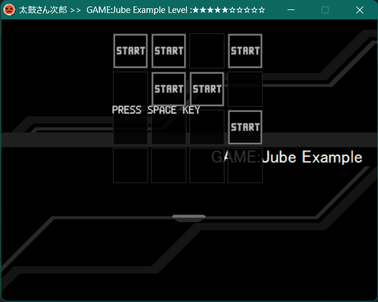

### Note Symbols in Bm Mode

[***OpenTaiko-OutFox standard version***](#proposal-komi-version): (non-standard) \
***First seen in***: TaikoJiro 1 (unknown version)

Effective when [`GAME:Bm`](#game) is in effect.

The game mode was never documented nor mentioned by toach, author of TaikoJiro. No bundled graphics are provided for this mode.

Similar to `GAME:Jube`, every 4 hexadecimal digits are grouped together to represent a note combination and occupy the same beat duration interval.

```txt
Note Layout → 0/1 Notation → Note Symbol (Hexadecimal Digit)
■ ■□■□■■□ □□□□□□□ □ → 1_101 0110 0000 000_0 → D600
(P1 scratch) (P1 keys) (P2 keys?) (P2 scratch?)
```

* `■` &mdash; Tap/scratch note
* `□` &mdash; Blank
* Hold notes were not supported.
* Key sounds were not supported.

#### Example

(This example is adopted from the first measures of *DIAVOLO* Single-player ANOTHER, by <ruby>度<rt>Do</rt>胸<rt>kyou</rt>兄<rt>Kyou</rt>弟<rt>dai</rt></ruby> (arrangement of *Grandes études de Paganini No.6 (Theme and Variations)* by Franz Liszt, arrangement of *Caprice No. 24* by Niccolo Paganini), from game *beatmania IIDX*, developed by Konami)

See [GAME_Bm_Example.tja](tja-assets/GAME_Bm_Example.tja)

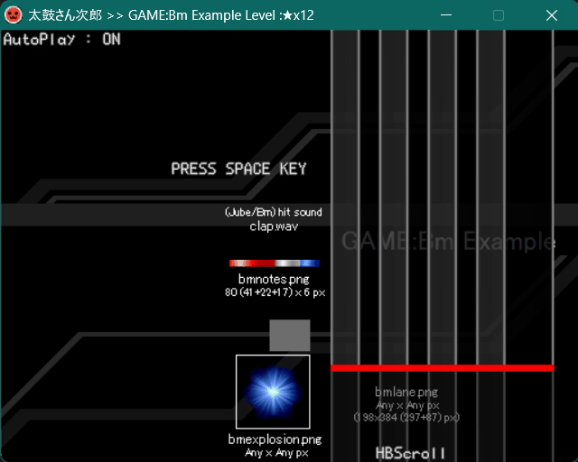

Behaviors in TaikoJiro 1:

* The P1 scratch is displayed at the right of P1 keys. P2 keys are displayed left-aligned to the left of P1 scratch lane. The P2 scratch (?) is displayed off-screen, so it is unclear whether it is a regular key lane or an actuall scratch lane.
* In [HBScroll or BMScroll mode](#bmscroll--hbscroll--nmscroll), [`#BPMCHANGE`](#bpmchange) causes the notes to be scrolled abnormally.
* The autoplay always misses the first note of the chart (but not counted as a miss in the result screen). Also, the first note of the chart is the only note expectedly aligned to the bar line on with note's bottom.
* The autoplay is unable to play branched sections of the chart.

## Terminologies

### Word Usage of this Article

#### General Word

`&` is used only for conjoining independent nouns with similar grammar structure and `and` is used otherwise.

The ***ITALIC BOLD ALL-UPPER-CASE*** keywords ***MUST***, ***MUST NOT***, ***SHOULD***, ***SHOULD NOT***, & ***MAY*** are to be interpreted as described in RFC 2119: <https://www.rfc-editor.org/rfc/rfc2119>

The time relation is denoted as follow:

Word | Before | Non-after | At | Non-before | After
--- | --- | --- | --- | --- | ---
Time relation | \< | ≤ | = | ≥ | >

The fraction (for beat duration, *etc*.) is denoted as follow:

Word | whole | half | 1/3rd | quarter <br /> 1/4th | 1/8th | 1/16th | ...
--- | --- | --- | --- | --- | --- | --- | ---
Fraction | 1/1 | 1/2 | 1/3 | 1/4 | 1/8 | 1/16 | ...
Other <br /> spellings | whole | half | third | quarter <br /> fourth | eighth | sixteenth | ...

#### *Unspecified*

If a usage causes *unspecified* behavior or the behavior itself is *unspecified*, the actual or intended behavior may vary from simulator to simulator and/or dependent on user settings. When portability is concerned, such a usage and the behavior ***SHOULD*** be avoid and the actual behavior ***SHOULD NOT*** be depended upon.

Because this article is still *in construction* and the TJA format is still evolving, this is possible that some usages or behaviors are stated as *unspecified* but the actual or intended behaviors are/have become consistent among most simulators.

### Scope-Fineness

Includes [header scope-fineness](#header-scope-fineness) and [command scope-fineness](#command-scope-fineness).

The scope-fineness is how often the header or command value changes can be handled by the simulator. The coarsest possible fineness is per&ndash;file. The finest possible fineness is sequential.

* *Unspecified*: For scope-finenesses other than non-before and sequential, the behavior when the same header or command occur multiple times within its scope-fineness in its scope.
  * In TaikoJiro 1 and 2: Only the last occuring valid header or command in the scope-fineness takes effect.

The scope-fineness listed in this article is the coarsest of usually supported fineness.

For simulator developers: A simulator ***MAY*** implement a finer scope-fineness but ***SHOULD NOT*** implement a coarser scope-fineness.

For chart creators: If compatibility is concerned, the chart ***SHOULD NOT*** relies on a finer scope-fineness than the scope-fineness listed in this article.

### Level of Impact

> note ★★★★★ \
> timing ★★★★・ \
> scoring ★★★・・ \
> gimmicky ★★・・・ \
> metadata ★・・・・ \
> decorative ・・・・・

The maximum level of impact of the headers and commands are listed in the description of their scope.

The use of [notechart symbols](#notechart-symbols) has the impact level of "note".

Only those whose impact level ≥ note may affect the required types of the gameplay input.

Only those whose impact level ≥ timing may affect the required timing of the gameplay input.

Only those whose impact level ≥ scoring may affect the clear or fail conditions and scoring.

A gimmicky header or command may affect the difficulty for reading the notechart during gameplay, while a metadata or decorative header or command usually does not.

A metadata header or command may affect the sorting order and searching results of songs, while a decorative header or command usually does not.

### Whitespace character

* (Halfwidth) Space (U+0020; "<code> </code>")
* Character Tabulation / Tab (U+0009; `\t`)
* Carriage Return / CR (U+000D; `\r`)
* Line Feed / LF / Newline (U+000A; `\n`)
* ***NOT***: Ideographic Space / Fullwidth Space (U+3000; "<code>　</code>")
* It is *unspecified* (but unlikely) whether other space-like characters are accepted.

### Translations

Japanese terminologies of the game: <https://wikiwiki.jp/taiko-fumen/用語集>

Japanese terminologies are provided with their pronunciation annotated using a <ruby>訓<rt>Kun</rt>令<rt>rei</rt>式<rt>Shiki</rt>ロー<rt>Roo</rt>マ<rt>ma</rt>字<rt>ji</rt></ruby>-like romanization system. If a Japanese terminology can be written in *<ruby>漢<rt>kan</rt>字<rt>ji</rt></ruby>* "Chinese Character" form, both are listed.

Some of the *<ruby>漢<rt>kan</rt>字<rt>ji</rt></ruby>* "Chinese Character" form of the Japanese terminologies are literally taken as the Chinese translation.

For some terminologies of the game, there exist multiple English translations. Their are expressed as `"LIT"/TDM/TKT/PC (ALTs)` when necessary in this article:

* `"LIT"` &mdash; A rather literal translation
* `TDM` &mdash; The earlier English translation from the official PS2 console game *Taiko: Drum Master*
* `TKT` &mdash; <https://taikotime.blogspot.com/2010/12/glossary.html>
* `PC` &mdash; The official English translation from the official PC-generation games and the official English website: <https://taiko.namco-ch.net/taiko/en>
* `ALTs` &mdash; Alternative translation(s) usually used in the code & the notechart format

Fields with unknown (not existing or simply not investigated by the maintainer of this article) translation are denoted with `?`.

Translations which are simply romanization transliterations are omitted.

Some corresponding terminologies from other rhythm games are taken as one of the translations instead: See individual entries of <https://github.com/stepmania/stepmania/wiki>

### Mentioned PC-Compatible Simulators with TJA Format Support

Reference: *太鼓シミュレーター一覧* ("List of Taiko Simulators"). (2022, July 26). 太鼓の達人 Wiki ("Taiko no Tatsujin Wiki"). <https://wikiwiki.jp/taiko/太鼓シミュレーター一覧>

Unless stated otherwise, a simulator mentioned in this article also refers to its derivations.

The honorific title is omitted.

* <ruby>太<rt>Tai</rt>鼓<rt>ko</rt>さ<rt>sa</rt>ん<rt>n</rt>次<rt>Ji</rt>郎<rt>rou</rt></ruby> (*TaikoJiro*): By touch.
  * The TJF format was modified and extended into the TJA format for this simulator.
  * Inspired by <ruby>太<rt>Tai</rt>鼓<rt>ko</rt>さ<rt>sa</rt>ん<rt>n</rt>太<rt>Ta</rt>郎<rt>rou</rt></ruby> (*Taikosan*): By VIL.
    * The TJF format was developed and used for this simulator.
* Malody: By Mugzone (multiple developers) <https://m.mugzone.net/index>
* TJAPlayer2 for.PC (aka. <ruby>太<rt>Tai</rt>鼓<rt>ko</rt>さ<rt>sa</rt>ん<rt>n</rt>ア<rt>A</rt>ル<rt>ru</rt>ファ<rt>fa</rt></ruby> (*TaikosanAlpha*)): By J.MIR (kairera0467) <https://github.com/kairera0467/TJAP2fPC>
  * Inspired by TJAPlayer2 (for PSP): (Unknown author)
  * ← Derived from DTXManiaXG (Ver.K): By J.MIR (kairera0467) <https://osdn.net/projects/dtxmaniaxg-verk/>, <https://github.com/kairera0467/DTXManiaXG_VerK_Old> \
    In comparison, TJAPlayer2 for.PC introduces the originally lacking TJA format parsing and Taiko gameplay, while the original BMS-derived format (specifically DTX, GDA, G2D, BMS, & BME) parsing and GITADORA-style gameplay are either removed or not fully functional.
    * ← Derived from DTXMania: By ＦＲＯＭ (DTXMania), <ruby>や<rt>Ya</rt>ぎ<rt>gi</rt>。</ruby> (yyagi), *et al.* <https://osdn.net/projects/dtxmania/>
      * Reference: <ruby>や<rt>Ya</rt>ぎ<rt>gi</rt>。</ruby> (2020, September 14). *Derivatives of DTXMania*. DTXMania Wiki - DTXMania. OSDN. <https://web.archive.org/web/20240206041603/https://osdn.net/projects/dtxmania/wiki/derivatives>
  * Derivatives \
    ver.2017072200, non-after 2017, December 15 → TJAPlayer3 (AioiLight): By AioiLight *et al.* <https://github.com/AioiLight/TJAPlayer3>
    * ver-1.6.x, non-after 2019, October 27 → TJAPlayer3 (twopointzero): By Jeremy Gray (twopointzero) <https://github.com/twopointzero/TJAPlayer3>
      * v5.2.4, non-after 2020, May 19, &ndash; v5.2.9 → TJAPlayer3 (KabanFriends): By KabanFriends <https://github.com/KabanFriends/TJAPlayer3>
        * Non-after 2021, May 26 → TJAPlayer3-Extended: By KabanFriends <https://github.com/KabanFriends/TJAPlayer3-Extended>
    * master (v1.5.7), non-after 2020, March 25 → TJAPlayer3-f: By Mr-Ojii <https://github.com/Mr-Ojii/TJAPlayer3-f>
    * master (v1.5.7), non-after 2020, August 28 → TJAPlayer3-Develop: By touhou-renren *et al.*, later mainly maintained by brian218 *et al.* <https://github.com/TJAPlayer3-Develop/TJAPlayer3-Develop>
    * master (v1.5.7), non-after 2020, Nov 8 → TJAPlayer3-Develop-ReWrite: By touhourenren *et al.* <https://github.com/touhourenren/TJAPlayer3-Develop-ReWrite>
      * Non-after 2021, Sep 21 → OpenTaiko (aka. TJAPlayer3-Develop-BSQ) (0auBSQ): By 0auBSQ *et al.* <https://github.com/0auBSQ/OpenTaiko>
        * Actively developed; last referenced version for behavior verification: v0.6.0 b3+, at commit [e6aa17cdc6](https://github.com/0auBSQ/OpenTaiko/commit/e6aa17cdc677c0c6ec1c13ff431c7a96a533e074)
* taiko-web: By Clemaister, later mainly maintained by bui <https://github.com/bui/taiko-web> (no longer unavailable, see <https://github.com/github/dmca/blob/master/2023/02/2023-02-21-bandai.md>)
* Project OutFox: Mainly maintained by Team Rizu <https://projectoutfox.com/>
  * Actively developed; last referenced version for behavior verification: v0.5.0 pre043 a17c
  * ← Derived from StepMania 5.1: Mainly maintained by The Spinal Shark Collective <https://github.com/stepmania/stepmania> \
    In comparison, Project OutFox introduces the originally lacking TJA format parsing and Taiko gameplay (as "taitai" mode), among with many new game modes, theming and gameplay gimmick support, and other improvements.
    * ← Derived from StepMania 3.9: By Chris Danford *et al.*
* TaikoManyGimmicks (aka. taikosimu(NN)): By barrier15300 <https://twitter.com/barrier15300/with_replies>

### Proposers

The honorific title is omitted.

Listed in alphabetic dictionary order.

Screen name used for *proposal* | Other screen names | Notes
--- | --- | ---
barrier | barrier15300 | Main maintainer of TaikoManyGimmicks
IID | Iweidieng Iep | Main maintainer of this article
Komi | 0auBSQ, <ruby>申<rt>mou</rt>し<rt>shi</rt>コ<rt>ko</rt>ミ<rt>mi</rt></ruby> | Main maintainer of OpenTaiko (0auBSQ)

## References

* *太鼓の達人 譜面とか Wiki\** ("Taiko no Tatsujin - Wiki\* about Notecharts and so on"). <https://wikiwiki.jp/taiko-fumen/>
* tjfフォーマット ("tjf Format"). (2009, January 16). *太鼓さん太郎 nicover* ("Taikosan Nico(nico) ver.") plusedit. [`Readme.txt`](taiko-sim-readmes/utf-8/Readme-taikosan-plusedit.txt)
  * This file is distributed along with Taikosan.
* touch (2013, September 12). tjaフォーマット ("tja Format"). *太鼓さん次郎    Ver. 2.92くらい* ("TaikoJiro    Ver. 2.92 or so").
  * This section of the documentation can be retrieved from both the files [`readme.txt`](taiko-sim-readmes/taikojiro/utf-8/readme-v2.92.txt) & [`readme.html`](taiko-sim-readmes/taikojiro/utf-8/readme-v2.92.html) distributed along with TaikoJiro.
  * Some of its paragraphs are cited in other web pages:
    * dispconf (2014, January 1). *４－２．譜面追加　自分で作る* ("4-2 - Add Notecharts: Make You Own"). 太鼓さん次郎解説!! ("TaikoJiro Explanation!!"). <https://taikosanjiro.hatenablog.com/entry/譜面-2>
    * 仕様 ("Specifications"). (2021, August 28). *太鼓さん次郎* ("TaikoJiro"). 太鼓さん次郎交流 Wiki ("TaikoJiro Communication Wiki"). <https://wikiwiki.jp/jiro/太鼓さん次郎#specifications>
* *How to upload tja_tjaのアップロード方法*. (n.d., before 2025, April 23). Malody. <https://m.mugzone.net/wiki/1964>
* kairera0467 (2021, April 30). *TJAPlayer2 for.PC(仮) by.kairera0467*. kairera0467/TJAP2fPC. GitHub. <https://github.com/kairera0467/TJAP2fPC/blob/work-s/実行時フォルダ/readme.txt>
* *TJAPlayer3/CDTX.cs at ver-1.6.x*. (2019, Mar 2). AioiLight/TJAPlayer3. GitHub. <https://github.com/AioiLight/TJAPlayer3/blob/ver-1.6.x/TJAPlayer3/Songs/CDTX.cs>
* AioiLight (2019, April 17). *.tja フォーマット* (".tja Format"). AioiLight.space. <https://web.archive.org/web/20190914085205/https://aioilight.space/taiko/tjap3/doc/tja/>
  * Browsable archive on GitHub Pages by Iweidieng Iep: [TJAPlayer3-AioiLight-docs/doc/tja](<https://iepiweidieng.github.io/TJAPlayer3/TJAPlayer3-AioiLight-docs/doc/tja.html>)
* KabanFriends (2021, May 29). *New TJA Commands in TJAPlayer3-Extended*. KabanFriends/TJAPlayer3-Extended. GitHub. <https://github.com/KabanFriends/TJAPlayer3-Extended/blob/master/Test/COMMANDS.txt>
* *TJA format*. (2021, September 28). bui/taiko-web Wiki. GitHub. <https://web.archive.org/web/20230103093826/https://github.com/bui/taiko-web/wiki/TJA-format>
  * Archive on GitHub Gist by Katie Frogs: <https://gist.github.com/KatieFrogs/e000f406bbc70a12f3c34a07303eec8b>
* Katie Frogs (2023, Feburary 12). *taiko-web-plugins/README.md at main*. KatieFrogs/taiko-web-plugins. GitHub. <https://github.com/KatieFrogs/taiko-web-plugins/blob/main/README.md>
* Mr-Ojii (2023, Mar 28). *TJAPlayer3-f/AdditionalFeatures.md at v2*. Mr-Ojii/TJAPlayer3-f. GitHub. <https://github.com/Mr-Ojii/TJAPlayer3-f/blob/v2/TJAPlayer3-f/Docs/AdditionalFeatures.md>
* 0auBSQ (2023, September 18). *New Commands*. 0auBSQ/OpenTaiko. GitHub. <https://github.com/0auBSQ/OpenTaiko/blob/main/OpenTaiko/Documentation/Tja/NewCommands.md>
* *OpenTaiko/CDTX.cs at main*. (2024, May 3). 0auBSQ/OpenTaiko. GitHub. <https://github.com/0auBSQ/OpenTaiko/blob/main/OpenTaiko/src/Songs/CDTX.cs>
* *OpenTaiko/NotesManager.cs at main*. (2024, April 15). 0auBSQ/OpenTaiko. GitHub. <https://github.com/0auBSQ/OpenTaiko/blob/main/OpenTaiko/src/Stages/07.Game/Taiko/NotesManager.cs>
* Squirrel (2023, November 4). *TJA Compatibility*. Project OutFox Wiki. <https://outfox.wiki/dev/mode-support/tja-support/>
* barrier (2023, June 19). [*readme.txt*](taiko-sim-readmes/TaikoManyGimmicks/utf-8/readme-v0.6.6α-revised.txt). *TaikoManyGimmicks ver0.6.6α*.
  * This version is not bundled with TaikoManyGimmicks but is published in the *TaikoManyGimmicks配布鯖* "TaikoManyGimmicks Release Server" Discord Server.
* nyoro (2023, November 11). *TJA Format Support*. Visual Studio Marketplace. <https://marketplace.visualstudio.com/items?itemName=nyoro.tja-format-support>
  * This vscode extension provides short explanations for TJA headers/commands, including headers/commands introduced by TaikoManyGimmicks.

## TODO

* Reorder headers & commands by their categories & popularity and possibility of being supported: Pending.
* List & explain known gimmicks, especially the gimmicks which have appeared in multiple charts by different chart creators and received terminologies: Planned.
* Add (unimplemented) *proposal*s from simulator developers.
* Add separated recommendation for respectively simulator behavior and chart creators and editors. Currently, the relevant paragraphs have ambiguous phrasing.
* Add standardization information, especially the OpenTaiko-OutFox standardization and the direction toward behavior unification. Currently, the relevant paragraphs lack clarifications and are misleading.
* Fix missing and/or unverified information about Project OutFox.
* Add a dedicated section for explaining gameplay mechanics.
* GitHub page file managements
  * Add test TJA files and references for mentioned behaviors for easy re-verification.
  * Host image resources on GitHub page locally.
  * Update the GitHub page site to add the table-of-content navigation static/popup window
